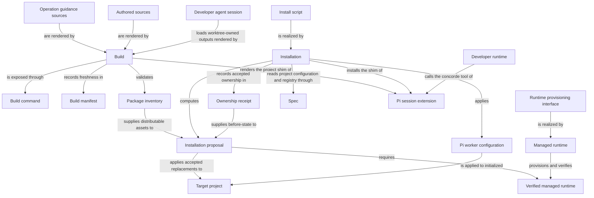

# Distribution

## Purpose

Distribution prepares the Framework assets that developers install and run: worker instructions, Pi Operation guidance and managed runtime dependencies. It builds from authored sources and installs only the outputs it owns. It does not decide or silently rewrite a consumer project’s business specification.

## Terminology

| Term                                                | Meaning / definition                         |
| --------------------------------------------------- | -------------------------------------------- |
| [Pi integration](../module.md#terminology)          | Defined in Concorde Framework.               |
| [Worker](../module.md#terminology)                  | Defined in Concorde Framework.               |
| [Operation](../module.md#terminology)               | Defined in Concorde Framework.               |
| [Worktree](../module.md#terminology)                | Defined in Concorde Framework.               |
| [Installation](installation.md#terminology)         | Defined in Installing and updating Concorde. |
| [Update](installation.md#terminology)               | Defined in Installing and updating Concorde. |
| [Installation receipt](installation.md#terminology) | Defined in Installing and updating Concorde. |
| [Initialization](../spec/initialize.md#terminology) | Defined in Project initialization.           |
| [Protocol binding](../spec/values.md#terminology)   | Defined in Identities and versions.          |
| [Registry](../module.md#terminology)                | Defined in Concorde Framework.               |
| [Spec](../module.md#terminology)                    | Defined in Concorde Framework.               |

## Usage

Use Distribution to build this checkout, install or update Concorde in a consumer project, change
an initialized project's worker configuration, or provision the pinned runtime. Run
`python3 scripts/concorde.py build` after authored instruction or contract changes; use
`build --check` to check freshness without writing. Builds stay with their source worktree. A
public Operation's guidance is authored under `prompts/operation-guidance/` and embedded in the
Pi shim. No standalone Skill publishing command or client selector is supported.
Installation previews owned changes by default and applies them only with explicit
acceptance; local modifications to receipt-owned output conflict rather than being silently
adopted. Pi is the only supported installation client; retired `--integration` flags are rejected.

The Pi coding agent loads a session extension whose single `concorde` tool describes or runs the
public entries. Context-solve, tasks and implement prepare direct native Agent calls; plan, reviews
and Issue solving prepare authored native workflows. Finite Host commands perform preparation and
independent acceptance; workflow results are polled separately. Non-model actions finish as Host
services. These are not public Studio or alternate client backends. Aborting a turn cancels the running Operation. In an installed project the launcher
uses `.concorde/.venv`, the managed runtime verified by the installer. Missing runtime dependencies
produce a `missing_runtime` result; rerun installation to provision them. The installer distributes
no standalone Skills and does not invoke a Skills CLI.

Installation deploys Framework assets and the Protocol copy, not project business Specs or a
registry. Initialize those separately. An update does not accept a new Protocol binding for you:
review and explicitly rebind it after any required project migration. Use `concorde-configure` for
worker model, thinking, timeout and overrides. Runtime provisioning needs a reviewed current plan;
launching a worker does not implicitly provision it. See [installation](installation.md),
[build](build.md) and [runtime](runtime.md). The existing runtime-rebuild preservation gap below
means a failed rebuild must not be assumed to have recovered the prior environment.

## Design

The Build command resolves Authored sources, including Operation guidance sources, into
terminal worker instructions, a private Pi catalog, runtime schemas and Protocol assets. Build
manifest binds exact inputs and outputs, while Package inventory determines distributable assets.
The external Developer runtime loads the explicitly selected Pi entry; descriptions, guidance and
schemas remain useful through its `concorde` tool, not as standalone Skills. The catalog is not
worker context or an execution grant. [Build realization](build.md#design) explains source
accounting and freshness checks. Installation owns consumer deployment separately.
Templates travel with their owners: the Protocol holds the canonical Module and Scenario starters,
while the planner and task-author Agent packages hold their plan and task starters. There is
no separate root template product or forwarding copy; this layout changes no worker context or
runtime injection. See the [template ownership scenario](scenarios.md#scenario.distribution.template-ownership).

The Pi session extension is the projection for a developer whose client is the Pi coding agent.
Source build renders a private shim under `generated/session/pi/`; consumer installation places it in `.pi/extensions/` that imports the tracked extension and
carries the catalog of public Operations: each one's description, ordinary guidance and exact request schema. The extension registers one `concorde` tool.
Its `describe` action returns that guidance and schema; its `run` action wraps the caller's input
in the invocation envelope. Host actions finish through the shared launcher; cognitive entries
prepare exact native calls and independently accept their results, with result polling for workflows.
Large ordinary Host output above 48 KiB is saved to a file. Aborting the turn sends the
launcher SIGTERM, which it treats like Ctrl-C, and kills the launcher's process group after a
grace period. A short section appended to the system prompt names the tool and the Operations, so
Pi needs no standalone Skills. The tool grants nothing: the launcher performs every check, and
the source checkout's shim tells the model to run an Operation only on the developer's explicit
request. Existing external CLI-owned Skills require explicit manual retirement; the installer
never erases those unowned assets.

Install script exposes Installation's preview/apply boundary and is deployed with the same
supported Python service. The host can explicitly bootstrap a complete independent consumer
worktree installation, then verify/reuse it without reinstalling. A provider is bound by exact
package bytes, never substituted as a cross-worktree runtime. Preservation mode leaves inherited
project guidance and accepted Protocol untouched and unowned; local receipt ownership still
applies. See the [service contract](contracts.md#local-installation-service). An Installation proposal selects
exact owned changes in the Target project; an Ownership receipt records those installed bytes and
their before-state for later updates. A fresh build is not installation acceptance, and a receipt
is not permission to overwrite unrelated user content. Failure restores owned installation state.
Project Specs and their accepted Protocol binding remain separately controlled. Upgrades retire
legacy receipt-owned files and root blocks only when their current bytes match recorded ownership.
External CLI-placed Skills and lock files were never owned by the installer and remain untouched;
the preview and result describe explicit manual retirement. A root file created only for an owned
entry can disappear when its removal leaves it empty; developer-owned files and surrounding text
are preserved. See [installation](installation.md) for the Pi-only upgrade route.

Managed runtime implements the Runtime provisioning interface and records a Verified managed
runtime only after its checks succeed. Provisioning does not decide which project files may be
replaced. Pi worker configuration is a separate explicit operation selecting model, thinking,
timeout and overrides; accepting new Protocol assets is an additional explicit decision. The
runtime-rebuild preservation gap below remains an unfulfilled obligation, not a claim that every
failed rebuild restored the prior environment.

`concorde-configure` is that explicit operation. It takes the typed worker configuration and, only
when the developer asks, `accept_protocol` to rebind the installed Protocol copy. It returns the
applied configuration with `status: applied`. An unsupported value, an uninitialized project, a
Protocol mismatch without `accept_protocol` or a failed write leaves the previous configuration in
place. It is a finite deterministic Host service with no model or configure/project-Graph Studio
adapter. It refuses a
describe-policy preview with `use_proposal`.

The Developer agent session is external main, not another registered role. [Agents](../agents/module.md)
owns source-maintenance/tester behavior and continuation. Distribution supplies checked project
role projections and passive observation separately from private capability catalogs; see
[registration](build.md#outer-task-roles-and-observation).
The source writer builds with that candidate's own code; primary never renders candidate outputs.
For consumer Operations, host-created candidate relays keep the requesting session stationary;
simple authorized consumer work may also stay directly in primary.

## Relationships

Build, Installation and Managed runtime are independent programs that only meet at explicit
records: Build never writes into a target project, Installation never renders Framework assets
itself, and Managed runtime never chooses which files Installation replaces. Ownership receipt and
Build manifest play matching but distinct roles — one binds installed bytes in a target project,
the other binds authored sources to rendered outputs in this checkout or a build client — and
neither substitutes for the other. The developer agent session is the same actor in this source
checkout and in an installed consumer project: it works in the worktree whose build supplied its
projections and lets the host run candidate work elsewhere.

Operation guidance sources are authored and owned here. Build embeds their descriptions and
resolved text with versioned request schemas in the Pi session extension's shim. Installation
places that receipt-owned shim in the target. The Developer runtime calls its `concorde` tool,
which uses the shared launcher. This creates no worker grant and transfers no executable
Operation behavior to Distribution.

## Provider collaboration

The [installation](installation.md), [build](build.md) and [runtime](runtime.md) topics explain the
three workflows; their exact acceptance cases are owned together in [Distribution scenarios](scenarios.md).

### Spec

The [Spec Module](../spec/module.md) defines the project configuration and registry that installation, configuration and initialization read or write, with exactly one pinned Protocol binding.

Define the project configuration and registry that installation, configuration and initialization read or write.

This collaboration applies when installing into or configuring an initialized project, or when a Protocol binding must be checked.

- [Preserve the accepted binding and reject incompatible configuration](../spec/contracts.md#values-framework-configuration-and-storage-versions)

## Unresolved information

Managed runtime's replacement design intends to preserve the previous valid runtime until a rebuild
is verified and to restore it after a failed rebuild, but the current provisioning implementation
still removes an owned environment before rebuilding; this preservation promise is not yet fulfilled
by code, and callers must not infer recovery from the absence of success metadata.

Project initialization and Protocol-binding decisions belong to `module.spec`'s `concorde-init`
operation, not to this Module; installation never creates the registry or a Module stub itself.

The Pi projection distinguishes finite Host-command output from native run status. Native cognitive
entries prepare exact calls and workflow results are polled; no public capability is synchronously
hidden behind a Graph/RPC worker. Finite Host services return their final envelopes; these envelopes
are not a native progress stream. The private source entry requires the candidate's `.venv` interpreter to verify selection before
registration and each tool call; a missing environment blocks without an ambient interpreter
fallback. A consumer entry selects the installed managed runtime interpreter. If it is missing,
the consumer launcher may be started with ambient Python, but that does not provision or attest
a runtime: missing dependencies still produce `missing_runtime`. Only an installed project's
launcher switches to its adjacent managed runtime by itself. These are separate source-private
and consumer paths, not permission to replace a selected candidate runtime with a global one.

## Ownership, context and implementation status

Runtime admission, initialization, installation inventory and package Spec/wire alignment support Protocol 10/Profile 15. Build success proves output freshness only. Project updates must preserve explicit owner/reference choices and never silently migrate consumers.

## Precise specifications

The Distribution Module owns the exact obligations and interface details in [requirements](requirements.md).
These companions are part of the same complete Module specification, not separate topic owners.

Native context-assessment instructions are built from a canonical native prelude and the existing
context-assessor role Spec. The invocation capsule contains only a deterministic execution projection;
it is not another authored Agent registry. The supported native package is selected explicitly in the
Pi process, separately from the candidate Python/runtime selection. Source-private testing may select
a disposable data root while retaining exact candidate code and entry provenance; a sibling source
worktree is never a permitted redirection. No global Pi setting is changed by this mechanism.

### Agents

[Agents](../agents/module.md) owns callable role definitions and interaction. This Module consumes
those definitions rather than maintaining a role catalog or behavioral copy. It preserves the
role's family, scope and frozen grant and refuses missing or stale bindings; domain artifact
acceptance and execution mechanisms remain with their existing owners.
