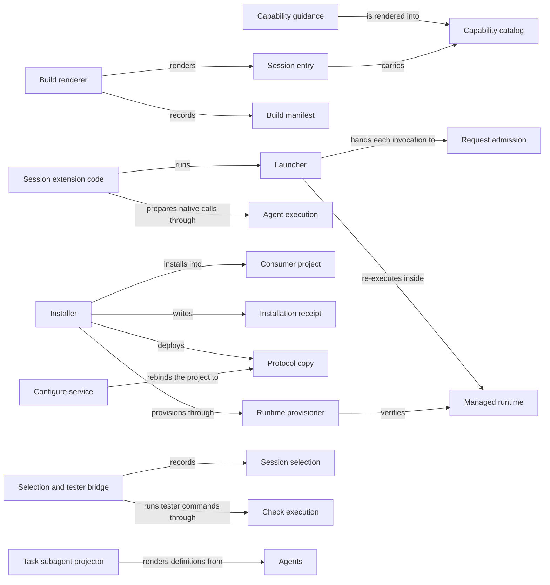

# Distribution

## Purpose

Distribution turns the Concorde checkout into something a developer can run. It builds the
generated files Concorde needs at run time, installs Concorde into other projects together with the
Python environment that runs it there, and connects the developer's Pi session to Concorde's
capabilities through one `concorde` tool. It also provides the `concorde` command line, the launcher
that runs one capability request, the `concorde-configure` capability, and the exact launch inputs
for a fresh test session of a candidate. Distribution does not decide what a capability does: that
belongs to the provider Modules under Operations and to the Harness. It does not write a project's
Specs or registry, which the Spec Module's `concorde-init` creates, and it never makes a project
accept a new Protocol version unless the developer asks for it through `concorde-configure`. It
creates no worktrees and gives no worker any permission.

## Terminology

| Term | Definition |
| --- | --- |
| Package | The set of Concorde files described by `concorde.json` that is built, validated and installed as one unit. |
| Capability guidance | The source text of one public capability under `prompts/operation-guidance/`, telling a user session when and how to call it. |
| Capability catalog | The list of public capabilities embedded in a session entry, with each one's kind, description, guidance and request schema. |
| Session entry | A generated TypeScript file that binds the Concorde session extension to one project and carries that project's capability catalog. |
| Build manifest | The generated record `generated/build-manifest.json` holding the digest of every build source and every build output. |
| Launcher | The script `scripts/run-operation.py`, which runs one public capability request read from its standard input and prints one result envelope. |
| Consumer project | A project other than this checkout into which Concorde is installed. |
| Installation receipt | The file `.concorde/install.json` recording which files the installer owns in a consumer project and the exact bytes it last wrote. |
| Protocol copy | The Spec Protocol bundle placed under `.concorde/protocol/`, whose manifest digest the project configuration binds. |
| Managed runtime | The installer-owned Python environment at `.concorde/.venv`, with locked LangGraph and Pi dependencies, that runs Concorde in a consumer project. |
| Local installation | A complete, verified installation of one exact package in one worktree: Framework files, session entry, managed runtime and receipt. |
| Session selection | A verified record naming the exact candidate-built session entry, catalog and launcher that a fresh Pi test session may load. |
| [Developer](../vocabulary.md#concept.concorde.developer) | |
| [User session](../vocabulary.md#concept.concorde.user-session) | |
| [Capability](../vocabulary.md#concept.concorde.capability) | |
| [Host](../vocabulary.md#concept.concorde.host) | |
| [Task subagent](../vocabulary.md#concept.concorde.task-subagent) | |
| [Worker](../vocabulary.md#concept.concorde.worker) | |
| [Agent](../agents/module.md#concept.agents.agent) | |
| [Workflow](../harness/execution/module.md#concept.execution.workflow) | |
| [Candidate](../harness/worktrees/module.md#concept.worktrees.candidate) | |

Learn the terms in two groups. The first five describe what the **build** produces in this
checkout: the package, its guidance, the catalog and session entry rendered from it, and the build
manifest that records what was rendered. The rest describe what exists **where Concorde runs**: the
launcher, and in a consumer project the receipt, Protocol copy and managed runtime that together
form a local installation. A session selection is the one term that joins the two: it names exact
build outputs of a candidate for a test session.

## Usage

### Building this checkout

Anyone who changes a source that the build reads — Agent definitions, prompts, capability guidance,
Protocol text, request contracts or the Pi extension code — rebuilds in the same worktree:

```sh
python3 scripts/concorde.py build           # render every output and write it
python3 scripts/concorde.py build --check   # render in memory and compare, writing nothing
```

The build writes Agent instructions, the private session entry, the Studio configuration and the
Protocol assets under `generated/`, and the Task subagent files that this checkout's own Pi sessions
discover under `.pi/agents/` and `.pi/extensions/`. All of them are generated outputs listed in the
build manifest and are never edited by hand; [Interfaces](interfaces.md#build-outputs-and-ownership)
lists them. A build only ever writes into the checkout that holds its sources.

After a Protocol change, `python3 scripts/concorde.py protocol-manifest --write --bind-project`
accepts the new asset digests into `protocol/manifest.json`, binds this checkout's configuration to
them and refreshes its own Protocol copy.

### Installing into a project

The installer previews by default and writes only when asked:

```sh
python3 /path/to/concorde/scripts/install-concorde.py --target /path/to/project           # preview
python3 /path/to/concorde/scripts/install-concorde.py --target /path/to/project --apply   # install
```

The preview lists one action per file, such as `create`, `update`, `unchanged` or `conflict`, and
exits with status 2 if any action is a conflict. Applying places the Framework under
`.concorde/framework/`, the Protocol copy under `.concorde/protocol/`, the session entry under
`.pi/extensions/`, the tester definition under `.pi/agents/`, a short block in `AGENTS.md` that
points readers to the Protocol, and the managed runtime at `.concorde/.venv`, then records all of it
in the installation receipt. The developer then opens the project in Pi and calls `concorde-init`
to create its first Spec. Updating is the same command run from a newer package: files the receipt
owns are replaced, and a file the developer changed is reported as a conflict instead of being
overwritten. [Installing and updating](installation.md) explains every action and option.

An update never changes which Protocol the project has accepted. When the new package brings a new
Protocol copy, capabilities refuse to run until the developer reviews the change and calls
`concorde-configure` with `accept_protocol: true`.

### Calling capabilities from Pi

In a consumer project Pi discovers `.pi/extensions/concorde-session.ts` by itself. The entry adds a
short Concorde section to the system prompt and registers the `concorde` tool with three actions:

- `describe` returns a capability's guidance and request schema without running anything;
- `run` sends the request data given as `input` to the capability and returns its typed result;
- `result` polls a capability that runs as an asynchronous workflow.

For example, the user session calls `concorde` with `{"operation": "concorde-validate", "action":
"describe"}`, reads the schema, then calls `run` with the request as `input`. Host capabilities such
as `concorde-validate` run the launcher and return its result envelope. Model-backed capabilities
are prepared rather than run inside the tool: `run` returns an exact native Agent call or workflow
for the user session to start, and the Harness later accepts or rejects what the Agent proposes.
Aborting the turn cancels a running launcher. See [Pi session integration](session.md).

In this checkout the session entry is private: Pi does not discover it, and a session loads it only
with an explicit session selection. Its catalog also tells the model to run a capability only when
the developer asks for it by name.

### Configuring workers

`concorde-configure` sets the model, thinking level and time limit that workers use, with optional
per-worker overrides, in `.concorde/config.json`. Its request is:

```json
{
  "configuration": {
    "type_id": "concorde-operation-configuration",
    "schema_version": 2,
    "data": {"model": "openai-codex/gpt-6-astra", "thinking": "medium"}
  },
  "accept_protocol": false
}
```

With `accept_protocol: true` it also rebinds the project to the installed Protocol copy. It answers
`status: applied`, or leaves the previous configuration in place when the value is invalid, the
project is not initialized, the Protocol copy does not match without acceptance, or the write fails.

### The command line

`scripts/concorde.py` (with `concorde.sh` and `concorde.ps1` wrappers) is the command line of both
this checkout and an installed Framework. Besides `build`, `protocol-manifest` and
`select-session`, it routes `validate` to Spec, `status` and `migrate-status` to Candidate
worktrees, `usage` to Agent execution and `docsite` to Views. Every subcommand prints one JSON
envelope and exits non-zero unless it succeeded; see [Interfaces](interfaces.md#command-line).

### When something goes wrong

- A model-backed capability run against a stale build stops with `stale_build`; rebuild.
- In a consumer project, a capability run whose local installation is incomplete, stale or not
  running inside its managed runtime is refused by admission with `local_installation_required`;
  run the installer again. The launcher's own runtime check reports `missing_runtime` when
  LangGraph cannot be imported.
- An installer conflict writes nothing; resolve the listed file by hand and preview again.
- A second installer on the same target fails at once; retry after the first finishes.
- A failed runtime rebuild leaves no runtime behind; run the installer again once the cause is fixed.

## Design

### One renderer for two layouts

<a id="concept.distribution.package"></a><a id="realization.distribution.build"></a>

The **package** is described by `concorde.json`: its version, the package roots that ship, the
runtime launcher and lock, and the installation layout. The **build renderer**
(`src/concorde/distribution/build.py`) is a pure function from the package's sources to a set of
outputs, each with the exact list of sources that produced it. The same function renders two
layouts. For this checkout it renders the private layout; for an installation it renders the
installed layout, in which every path is prefixed with `.concorde/framework` and the session entry
lives under `.pi/extensions/`. Because both come from one renderer, an installed catalog cannot
drift from the one tested in the checkout.

<a id="concept.distribution.build-manifest"></a>

The **build manifest** records the digest of every source the build read, including the Python
sources of Agents, capability modules and the Pi extension code that the outputs depend on, and the
digest of every output. Two checks use it. `verify_fresh` only recomputes source digests, so it is
cheap enough to run before every model-backed capability and before loading any Agent's
instructions; a mismatch fails with `stale_build`, because instructions rendered from old sources
would silently disagree with the current Agent definitions. `build --check` re-renders everything in
memory and compares bytes, so it also catches a hand-edited output.

Writing is guarded the same way. The build owns only its declared locations under `generated/`
(other tools may write there too) and its `.pi/` outputs. It removes an output it no longer
produces only when the file's bytes match the digest the previous manifest recorded, and it refuses
to overwrite a `.pi/` file whose bytes it did not write. Any unknown, modified or symbolic-link file
stops the whole write before anything changes. This lets old outputs disappear safely without ever
deleting a file the developer created.

<a id="concept.distribution.guidance"></a><a id="concept.distribution.catalog"></a><a id="concept.distribution.session-entry"></a><a id="realization.distribution.guidance"></a>

**Capability guidance** is ordinary Markdown with a small front matter (`name`, `description`,
`operation`). Guidance files share fragments under `prompts/workflow-host/` through whole-line
`@path.md` references, which the prompt resolver expands. The build embeds each capability's
resolved guidance, its request schema and the schema's version in the **capability catalog**, and
writes the catalog into the **session entry**, a small file that imports the tracked session
extension `pi/extensions/concorde-session.ts` and binds it to one project root. The catalog, not the
guidance files, is what a session reads, so a session never needs the source tree.

<a id="realization.distribution.task-subagent-projector"></a>

The **Task subagent projector** (`src/concorde/distribution/task_subagents.py`) renders the Pi
definition files of the Task subagents that Agents defines, and the small extension entries the
source user session loads. It keeps source-only assets out of the installed layout. See
[Task subagent files](session.md#task-subagent-files).

<a id="realization.distribution.build-checks"></a>

**Package validation** (`src/concorde/distribution/package_validation.py`) checks the whole package
behind `validate` and the installer: every prompt is reachable and well formed, every capability
module declares consistent constants, every Agent profile matches its definition, every exported
contract is unique and valid, the capability and Agent inventories kept in the Operations and Agents
Specs match the code, and the build is fresh.

### Running a capability

<a id="concept.distribution.launcher"></a><a id="realization.distribution.launcher"></a>

The **launcher** accepts exactly one of the eleven public capability names, finds its module through
the `operation` field of the capability's guidance, and hands the invocation read from standard
input to the Harness's admission boundary. It has two other entries: `--runtime-check`, a quick
offline probe that the runtime provisioner runs for every capability, and `--native-context`, which
the session extension and the native workflow steps use to prepare and accept native Agent work.
SIGTERM takes the same path as Ctrl-C, so a cancelled run still prints its result envelope.

In a consumer project the launcher checks whether it runs inside the managed runtime and, if not,
re-executes itself with that runtime's interpreter. A caller may therefore start it with any
`python3`, even one without LangGraph. In this checkout it keeps the interpreter that started it.

<a id="realization.distribution.session-extension"></a>

The **session extension code** under `pi/` is the Pi side of every capability call. It registers
the `concorde` tool, runs the launcher for Host capabilities, and for model-backed capabilities
drives the native preparation and workflow steps that Agent execution defines. The extension grants
nothing: the launcher and the Host perform every check.

<a id="realization.distribution.cli"></a><a id="realization.distribution.configure"></a>

The **command-line interface** (`src/concorde/distribution/cli.py`, started by `scripts/concorde.py`
or `python -m concorde`) is the one command surface of the package; most subcommands only route to
the owning Module's service.
The **configure service** (`operations/configure.py` and the configure step of
`src/concorde/spec/project.py`) implements `concorde-configure` as a deterministic Host capability:
it rewrites `.concorde/config.json` as one checked file change and verifies the repository before
keeping it.

### Installing and running elsewhere

<a id="concept.distribution.consumer-project"></a><a id="concept.distribution.receipt"></a><a id="concept.distribution.protocol-copy"></a><a id="realization.distribution.installer"></a>

The **installer** (`src/concorde/distribution/installation.py`, started by
`scripts/install-concorde.py`) installs one package into one **consumer project**. It decides every
file by comparing three things: the bytes it wants to write, the bytes on disk, and the bytes the
**installation receipt** says it wrote last time. Only a file whose current bytes are exactly what
it wrote is its to replace or remove; anything else is a conflict. The receipt is the reason an
update can be safe without a merge tool. Shared root files such as `AGENTS.md` are owned only
within one marked block, so the developer's own text around it is never rewritten. The installer
also places the **Protocol copy**, which is the Protocol text agents are given as project files and
whose manifest digest the configuration binds; placing it never changes that binding.

<a id="concept.distribution.managed-runtime"></a><a id="realization.distribution.runtime-provisioner"></a>

The **runtime provisioner** (`src/concorde/distribution/managed_runtime.py`) creates and verifies
the **managed runtime**: a virtual environment with the one LangGraph version pinned in
`scripts/requirements.lock` and the Pi dependencies pinned in `pi/package-lock.json`. It records the
runtime as verified only after every public capability's runtime check has passed inside that
environment and reported that environment as its own. Pinning one environment per project means a
capability never runs with whatever happens to be installed globally.

<a id="concept.distribution.local-installation"></a>

A **local installation** is what makes a worktree runnable. The local installation service in
`src/concorde/distribution/local_installation.py` lets the Host verify that a worktree carries a
complete installation of exactly the package it admitted, and, only with an explicit bootstrap
request, install one first. Admission verifies it before every top-level run in a consumer
project, and the candidate relay uses it before starting work in a consumer candidate.
Verification reads everything and writes nothing, and never falls back to another worktree's files
or a global environment. [Installing and updating](installation.md) describes the installer, local
installations and the managed runtime in detail.

<a id="concept.distribution.session-selection"></a><a id="realization.distribution.selection"></a>

A **session selection** solves one problem: a tester must test exactly what a candidate built, not
the primary checkout's build or an installed copy. `select-session`
(`src/concorde/distribution/session_selection.py`) checks that the candidate's build is current and
records the exact bytes of its private session entry, embedded catalog and launcher, together with
the Pi flags a fresh session needs. The private entry refuses to load without it and reverifies it
before every tool call. The tester's commands run through the **tester bridge**
(`src/concorde/distribution/tester_check.py`), which executes them in the operating system's
read-only sandbox provided by Check execution. A selection is launch provenance only; it is not
evidence that a model loaded the entry or ran a tool. See [Session selection](session.md#session-selection).

<a id="realization.distribution.development"></a>

The **development environment** is how this checkout itself is set up and tested: `pyproject.toml`
and `uv.lock` pin the development dependencies, the pytest plugin under `tests/concorde/support/`
records why and on what inputs each test run happened, and the scripts under `scripts/development/`
check out the vendored references and type-check the docsite in a disposable copy.

### Limits and open questions

A runtime rebuild removes the previous environment before creating the new one. If the rebuild
fails, the project has no managed runtime until the installer runs again successfully; nothing is
restored. Callers must not read the absence of a success record as a recovered runtime.

Open questions. The `select-session` mode `task` behaves like `test`, and no current caller of it
is known. The Spec tooling is adding a registry maintenance subcommand to the
command line; it is not described here until it exists.

## Relationships



The build is the only producer: everything a session, a tester or an installer uses was rendered by
it and recorded in its manifest. The installer consumes the build's installed layout and adds the
consumer-specific parts, the receipt and the runtime. The launcher and the session extension are
where the rendered files meet the Harness: the extension decides nothing, and the launcher only
hands requests to admission. The collaborations with other Modules are explained below.

<a id="uses-spec"></a>

**Spec** loads and checks the project's configuration, registry and Specs, defines the Protocol
text and its rendered assets, and provides typed values, front matter parsing and file changes.
Distribution relies on it whenever it reads `.concorde/config.json`, validates a package, renders
the Protocol assets or rebinds a configuration. The `validate` subcommand runs its checks, and
`concorde-configure` keeps a configuration write only if the Spec repository still loads
afterwards. When Spec rejects a project, Distribution reports that finding and changes nothing.

<a id="uses-admission"></a>

**Request admission** is the boundary every capability invocation enters. The launcher hands it
the invocation read from standard input and prints the result envelope it returns, including
failure envelopes for a request the launcher itself could not start. The session extension builds
the invocation envelope that admission defines. Distribution adds no check of its own on top.

<a id="uses-execution"></a>

**Agent execution** runs native Agents and workflows and owns the native preparation steps, the
Studio graph that `generated/langgraph.json` points to, and usage and timing records. Distribution
relies on it for the model-backed capability paths of the session tool, for the timing spans the
installer and provisioner emit, and for the `usage` subcommand. A preparation failure is returned
to the user session as a tool error.

<a id="uses-context"></a>

**Task context** owns the worker profiles and their effect ceilings. The build renders instructions
for exactly the Agents that have a profile, and loading one Agent's instructions returns its profile
binding and effects for the Host to narrow.

<a id="uses-checks"></a>

**Check execution** runs commands in the operating system's read-only sandbox and exports their
evidence. The tester bridge relies on it to execute every tester command; the bridge validates the
request and bounds the output it returns, and never runs a command outside that executor.

<a id="uses-worktrees"></a>

**Candidate worktrees** owns candidate registration and the durable status store. The `status` and
`migrate-status` subcommands only route to it, and saving a session selection uses its atomic
scratch writer. Distribution creates no worktree itself.

<a id="uses-agents"></a>

**Agents** defines every callable Agent and Task subagent. The build renders native instructions
from each Agent's definition and the Task subagent files from Agents' Task subagent profiles, and
fails when a canonical definition is missing.

<a id="uses-operations"></a>

**Operations** defines the public capability names and their modules. The launcher loads a
capability's module through that inventory, package validation compares the capability constants
with the inventory kept in the Operations Spec, and the catalog lists exactly those capabilities.

<a id="uses-views"></a>

**Views** publishes the Specs. The `docsite` subcommand routes to its scaffold, and the installer
ships the docsite template files that Views provides.
