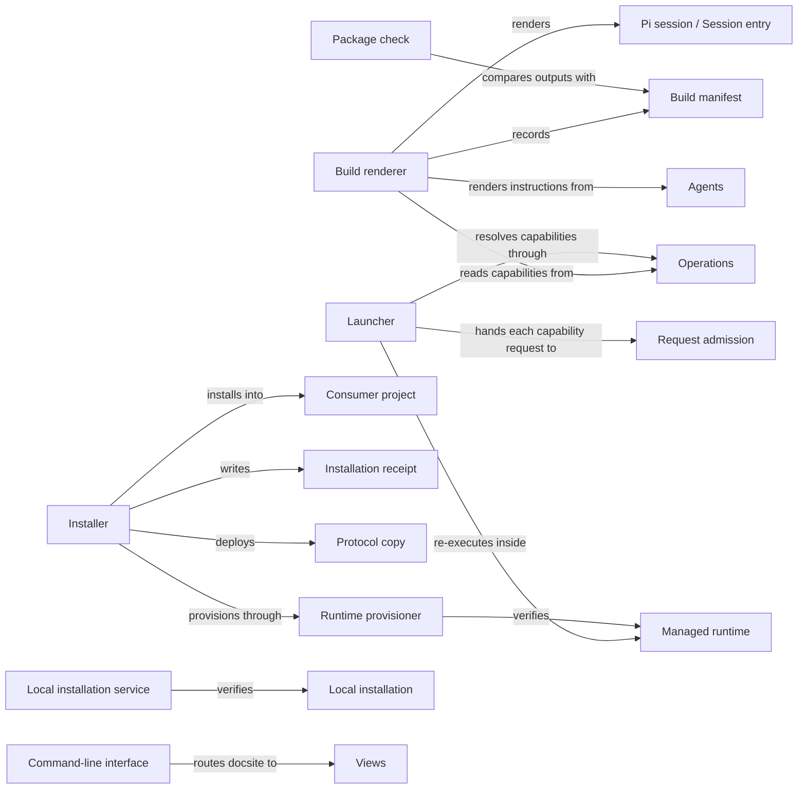

# Distribution

## Purpose

Distribution turns the Concorde checkout into something a developer can run: it builds the
generated files and records them in a build manifest, checks that the package is current, installs
Concorde and its Python environment into other projects, makes each worktree there runnable, and
provides the launcher and the `concorde` command line. It does not decide what a capability does
(the providers and the Harness do), how the Pi session uses Concorde (Pi session does), or a
project's Specs and configuration (`concorde-init` and `concorde-configure` do). It creates no
worktrees and grants no Agent anything.

## Terminology

| Term | Definition |
| --- | --- |
| Package | The set of Concorde files described by `concorde.json` that is built, checked and installed as one unit. |
| Build manifest | The generated record of the digest of every source the build read and of every output it wrote. |
| Launcher | The script that runs one public capability request read from its standard input and prints one result envelope. |
| Consumer project | A project other than a Concorde source checkout into which Concorde is installed. |
| Installation receipt | The file in a consumer project that records which files the installer owns there and the exact bytes it last wrote. |
| Protocol copy | The rendered Spec Protocol bundle placed in a project under `.concorde/protocol/`, whose manifest digest the project configuration binds. |
| Managed runtime | The installer-owned Python environment at `.concorde/.venv`, with locked LangGraph and Pi dependencies, that runs Concorde in a consumer project. |
| Local installation | A complete, verified installation of one exact package in one worktree: Framework files, session entry, managed runtime and receipt. |
| [Developer](../vocabulary.md#concept.concorde.developer) | |
| [Capability](../vocabulary.md#concept.concorde.capability) | |
| [Host](../vocabulary.md#concept.concorde.host) | |
| [Operation catalog](../operations/module.md#concept.operations.catalog) | |
| [Agent definition](../agents/module.md#concept.agents.definition) | |
| [Session entry](../session/module.md#concept.session.session-entry) | |
| [Capability catalog](../session/module.md#concept.session.catalog) | |
| [Capability request](../harness/admission/module.md#concept.admission.capability-request) | |

The package and build manifest describe what the build produces; the launcher, receipt, Protocol
copy, managed runtime and local installation describe where Concorde runs.

## Usage

Whoever changes a source the build reads rebuilds in the same worktree with
`python3 scripts/concorde.py build`; `build --check` renders in memory and writes nothing. The
build writes the native Agent instructions, the private session entry, the Protocol assets and the
exported schemas under `generated/`, and the Task subagent files under `.pi/`, all listed in the
build manifest ([outputs](interfaces.md#build-outputs)). After a Protocol text change,
`protocol-manifest --write --bind-project` accepts the new asset digests and rebinds this checkout.

The **package check**, `scripts/concorde.py check-package`, reports whether the package builds and
its outputs are current: prompts, guidance, exported schemas, the package manifest, freshness and
drift. It is a configured check of this checkout and runs before installing from a source
checkout; `validate` checks Specs only.

`install-concorde.py --target DIR` previews one action per path and writes nothing; `--apply`
installs the Framework under `.concorde/framework/`, the Protocol copy, the session and observer
entries and the tester definition under `.pi/`, a marked block in `AGENTS.md`, and the managed
runtime at `.concorde/.venv`, recording all of it in the installation receipt. A file the developer
changed is a conflict, never overwritten. An update never changes the accepted Protocol; the
developer accepts a new one through `concorde-configure`. [Installing and updating](installation.md)
covers every action, preservation and local installations.

Pi session's `concorde` tool starts the launcher, `scripts/run-operation.py <capability>`, with a
capability request on standard input. The launcher resolves the name in the Operation catalog,
refuses anything else, and hands the request to Request admission, which prints one result
envelope. Installed, it first re-enters the managed runtime. `scripts/concorde.py` also routes
`validate` and `registry` to Spec tooling, `status` to Candidate worktrees, `select-session` to Pi
session and `docsite` to Views, always printing one JSON envelope ([command line](interfaces.md#command-line)).

Errors: an edited, unrecorded or linked output stops `build` before anything is written; a stale
build or incomplete local installation is refused by admission; an installer conflict or a second
concurrent installer writes nothing; a failed apply restores files and receipt, but a failed
runtime rebuild leaves no managed runtime until an installation succeeds.

## Design

The **package** is described by `concorde.json`. The **build renderer** is one pure function from
sources to outputs that renders both the private layout of this checkout and the installed layout,
so an installed catalog cannot drift from the tested one. It renders each Agent's instructions once,
the session entries with their catalogs, Pi session's Task subagent files, and Protocol assets from
the Protocol text alone; it starts no process and uses no network.

The **build manifest** is the one agreement with everything that must not use stale outputs:
admission, Task context and Pi session each refuse work when a recorded source no longer matches
([contract](interfaces.md#contract.distribution.build-manifest)). The build removes only outputs
whose bytes the previous manifest recorded and stops on any unknown or edited file.

The **launcher** imports the Operation catalog and injects into admission what admission must not
import: the declarations, Operations' dispatcher, the local installation service and a verified
session selection. It also offers `--runtime-check` and `--native-context`, and handles SIGTERM like
Ctrl-C. The **command-line interface** only routes subcommands to their owners.

The **installer** installs into a **consumer project** and replaces only files whose bytes equal
what its **installation receipt** recorded, owning `AGENTS.md` only within its block. It places the
**Protocol copy** but never rebinds the project to it, and never ships Pi session's source-only files.

The **runtime provisioner** marks the **managed runtime** verified only after every capability's
runtime check passed inside it. The **local installation service** verifies that a worktree holds a
complete **local installation** of exactly the admitted package, installing one only on an explicit
bootstrap, and never falls back to another environment.

Not enforced: Distribution sandboxes nothing, and its installation lock excludes only other
installers. Why each choice was made is in [Design notes](design.md).

## Relationships

**Spec tooling** owns the Protocol text, the [Protocol binding](../spec/module.md#concept.spec.protocol-binding),
the [registry](../spec/module.md#concept.spec.registry), the [structural checks](../spec/module.md#concept.spec.structural-check)
and [typed values](../spec/module.md#concept.spec.typed-value). Distribution renders the Protocol
assets, exports the registered schemas, rebinds the Protocol for `protocol-manifest --bind-project`
and routes `validate` and `registry` to it. When Spec tooling rejects a project, Distribution reports
that and changes nothing.

**Request admission** receives every [capability request](../harness/admission/module.md#concept.admission.capability-request)
and returns the [result envelope](../harness/admission/module.md#concept.admission.result-envelope)
the launcher prints. The launcher passes the [capability declarations](../harness/admission/module.md#concept.admission.capability-declaration)
of the [declaration contract](../harness/admission/contracts.md#contract.admission.capability-declaration)
unread, apart from resolving the name and entry point for the runtime check, and adds no check.

**Agent execution** prepares and accepts native [Agent calls](../harness/execution/module.md#concept.execution.agent-call)
and [workflows](../harness/execution/module.md#concept.execution.workflow); the launcher's
`--native-context` entry only routes a step to it and returns the step's result.

**Candidate worktrees** keeps [change status](../harness/worktrees/module.md#concept.worktrees.change-status)
in the [primary worktree](../harness/worktrees/module.md#concept.worktrees.primary-worktree) and creates
each [candidate](../harness/worktrees/module.md#concept.worktrees.candidate). `status` routes to it,
`docsite` asks it whether the worktree is isolated, and relaying into a consumer candidate is when
admission uses the local installation service.

**Observation** records passive [diagnostic spans](../harness/observation/module.md#concept.observation.diagnostic-span)
for installer, provisioner and local installation steps; a span never changes a result.

**Agents** provides every [Agent definition](../agents/module.md#concept.agents.definition) and so
the list of [Agents](../agents/module.md#concept.agents.agent). The build renders one instruction
file per Agent and fails when a definition is missing or refused.

**Operations** keeps the [Operation catalog](../operations/module.md#concept.operations.catalog) of
every [Operation](../operations/module.md#concept.operations.operation). The launcher resolves
capabilities and hands admission its declarations and dispatcher; the build lists its public
capabilities, with each entry's session path, in every catalog; the provisioner checks each one.

**Pi session** defines the [session entry](../session/module.md#concept.session.session-entry), the
[capability catalog](../session/module.md#concept.session.catalog) and its
[contract](../session/interfaces.md#contract.session.catalog), the
[guidance](../session/module.md#concept.session.guidance) format and the
[session selection](../session/module.md#concept.session.selection). Distribution renders entries by
that contract, calls Pi session's projector, omits everything marked
[source-only](../session/requirements.md#req.session.source-only), and verifies an active selection
through it in the launcher.

**Views** publishes the Specs. `docsite` routes to its scaffold and prints its
[proposal](../views/module.md#concept.views.scaffold-proposal); the installer ships `docsite/` by
Views' [template inventory rule](../views/requirements.md#req.views.template-inventory), so installer
and scaffold agree on the template.
