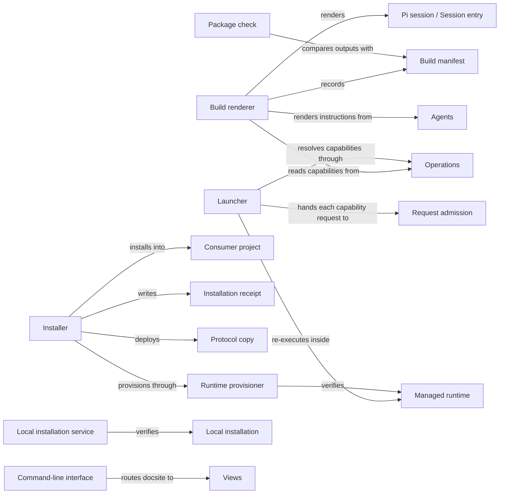

# Distribution

## Purpose

Distribution turns the Concorde checkout into something a developer can run. It builds the
generated files Concorde needs at run time and records them in a build manifest, checks that the
package is complete and current, installs Concorde into other projects together with the Python
environment that runs it there, makes each worktree of such a project runnable, and provides the
launcher that runs one capability request and the `concorde` command line. Distribution does not
decide what a capability does, which belongs to the providers under Operations and to the Harness,
and it does not decide how the developer's Pi session uses Concorde, which Pi session defines;
Distribution only renders and installs those files. It does not write a project's Specs, registry
or configuration: `concorde-init` of Spec tooling creates the first Spec, and `concorde-configure` of
Request admission changes the configuration, including the explicit acceptance of a new Protocol.
It creates no worktrees and gives no Agent any permission. The development environment of this
checkout belongs to the root Module.

## Terminology

| Term | Definition |
| --- | --- |
| Package | The set of Concorde files described by `concorde.json` that is built, checked and installed as one unit. |
| Build manifest | The generated record of the digest of every source the build read and of every output it wrote. |
| Launcher | The script that runs one public capability request read from its standard input and prints one result envelope. |
| Consumer project | A project other than a Concorde source checkout into which Concorde is installed. |
| Installation receipt | The file in a consumer project that records which files the installer owns there and the exact bytes it last wrote. |
| Protocol copy | The rendered Spec Protocol bundle placed in a project under `.concorde/protocol/`, whose manifest digest the project configuration binds. |
| Managed runtime | The installer-owned Python environment at `.concorde/.venv`, with locked LangGraph and Pi dependencies, that runs Concorde in a consumer project. |
| Local installation | A complete, verified installation of one exact package in one worktree: Framework files, session entry, managed runtime and receipt. |
| [Developer](../vocabulary.md#concept.concorde.developer) | |
| [Capability](../vocabulary.md#concept.concorde.capability) | |
| [Host](../vocabulary.md#concept.concorde.host) | |
| [Operation catalog](../operations/module.md#concept.operations.catalog) | |
| [Agent definition](../agents/module.md#concept.agents.definition) | |
| [Session entry](../session/module.md#concept.session.session-entry) | |
| [Capability catalog](../session/module.md#concept.session.catalog) | |
| [Capability request](../harness/admission/module.md#concept.admission.capability-request) | |

Learn the terms in two groups. The package and the build manifest describe what the **build**
produces from this checkout. The launcher, and in a consumer project the receipt, the Protocol copy
and the managed runtime that together form a local installation, describe what exists **where
Concorde runs**.

## Usage

### Building this checkout

Anyone who changes a source the build reads, such as an Agent definition, a prompt, capability
guidance, Protocol text, a registered request schema or the Pi extension code, rebuilds in the same
worktree:

```sh
python3 scripts/concorde.py build           # render every output and write it
python3 scripts/concorde.py build --check   # render in memory and compare, writing nothing
```

The build writes the native Agent instructions, the private session entry, the Protocol assets and
the exported request schemas under `generated/`, and the Task subagent files that this checkout's
own Pi sessions discover under `.pi/agents/` and `.pi/extensions/`. All of them are generated
outputs listed in the build manifest and never edited by hand. A build writes only into the
checkout that holds its sources. [Interfaces](interfaces.md#build-outputs) lists every output.

After a change to the Protocol text, `python3 scripts/concorde.py protocol-manifest --write
--bind-project` accepts the new asset digests into the Protocol's tracked manifest, binds this
checkout's configuration to them and refreshes its own Protocol copy.

### Checking the package

<a id="realization.distribution.package-check"></a>

The **package check** answers one question: can this package be built, and is what it built
current? It checks that every prompt reference resolves and every prompt is reached, that every
capability has well-formed guidance and an exported request schema, that exported schemas are
unique and valid, that the package manifest `concorde.json` is complete and contains no symbolic
link, and that the build is fresh and its outputs match a fresh render. It runs as a configured
check of this checkout, `scripts/concorde.py check-package`, which Check execution runs like any
other configured check, and the installer runs it before installing from a source checkout. It is
not part of `validate`, which checks Specs only.

### Installing into a project

The installer previews by default and writes only when asked:

```sh
python3 /path/to/concorde/scripts/install-concorde.py --target /path/to/project           # preview
python3 /path/to/concorde/scripts/install-concorde.py --target /path/to/project --apply   # install
```

The preview lists one action per path, such as `create`, `update`, `unchanged` or `conflict`, and
exits with a distinct status when any action is a conflict. Applying places the Framework under
`.concorde/framework/`, the Protocol copy under `.concorde/protocol/`, the session entry and the
passive observer entry under `.pi/extensions/`, the tester definition under `.pi/agents/`, a short
block in `AGENTS.md` that points readers to the Protocol, and the managed runtime at
`.concorde/.venv`, and records all of it in the installation receipt. The developer then opens the
project in Pi and calls `concorde-init` to create its first Spec. Updating is the same command run
from a newer package: files the receipt owns are replaced, and a file the developer changed is
reported as a conflict instead of being overwritten. [Installing and updating](installation.md)
explains every action and option.

An update never changes which Protocol the project has accepted. When the new package brings a new
Protocol copy, capabilities refuse to run until the developer reviews the change and accepts it
through `concorde-configure`.

### Running a capability

Pi session's `concorde` tool starts the launcher for every capability run; a test or a developer
may also start it directly:

```sh
python3 scripts/run-operation.py concorde-validate < request.json
```

The launcher looks the capability up in the [Operation catalog](../operations/module.md#concept.operations.catalog),
refuses a name that is not a public capability there, and hands the
[capability request](../harness/admission/module.md#concept.admission.capability-request) on its
standard input to Request admission, which prints the one result envelope. In a consumer project
the launcher first re-executes itself with the managed runtime's interpreter, so a caller may start
it with any `python3`. When a session selection is active, the launcher verifies it before anything
runs. SIGTERM takes the same path as Ctrl-C, so a cancelled run still prints its result envelope.

### Worktrees of a consumer project

Each worktree that runs Concorde needs its own complete **local installation**, because the
Framework, the runtime and the receipt are ignored by Git and never shared. Before a top-level run in
a consumer project, admission verifies the worktree's local installation, and before it relays a
request into a new candidate it installs one there explicitly. Both go through the local
installation service the launcher hands to admission; verification writes nothing and never falls
back to another worktree's files or a global environment.

### The command line

`scripts/concorde.py` (with `concorde.sh` and `concorde.ps1` wrappers, or `python -m concorde`) is
the one command surface of this checkout and of an installed Framework. Besides `build`,
`check-package` and `protocol-manifest`, it routes `validate` and `registry` to Spec tooling,
`status` to Candidate worktrees, `select-session` to Pi session and `docsite` to Views. Every
subcommand prints one JSON envelope and exits non-zero unless it succeeded; see
[Interfaces](interfaces.md#command-line).

### When something goes wrong

- A build that finds a modified, unrecorded or linked file among its outputs writes nothing; remove
  or restore the file and build again.
- A model-backed capability run against a stale build is refused by admission; rebuild.
- In a consumer project, a run whose local installation is incomplete or stale is refused; run the
  installer again. A runtime check that cannot import LangGraph reports that the runtime is missing.
- An installer conflict writes nothing; resolve the listed file by hand and preview again.
- A second installer on the same target fails at once; retry after the first finishes.
- A failed apply restores every file and the receipt it changed, but a failed runtime rebuild leaves
  the project without a managed runtime until an installation succeeds; see
  [The managed runtime](installation.md#the-managed-runtime).

## Design

### One renderer for two layouts

<a id="concept.distribution.package"></a><a id="realization.distribution.build"></a>

The **package** is described by `concorde.json`: its version, the package roots that ship, the
launcher and runtime lock, and the installation layout. The **build renderer** is a pure function
from the package's sources to a set of outputs, each with the exact list of sources that produced
it. The same function renders two layouts: the private layout of this checkout and the installed
layout, in which every generated path lies under `.concorde/framework/` and the session entry lies
under `.pi/extensions/`. Because both come from one renderer, an installed catalog cannot drift from
the one tested in the checkout.

The build renders each Agent's instructions once, under `generated/native/`, from the Agent's
[definition](../agents/module.md#concept.agents.definition) and the shared native rules. It renders
each [session entry](../session/module.md#concept.session.session-entry) with its
[capability catalog](../session/module.md#concept.session.catalog) from the Operation catalog, the
capability guidance and the registered request schemas, and it calls Pi session's projector for the
Task subagent files. It renders the Protocol assets from the Protocol text alone, so the Protocol
copy carries only the Protocol, and it exports the registered request and record schemas into a
separate file. The build evaluates schema sources in its own process without bytecode caches, so
the recorded source bytes are exactly what produced them, and it starts no process and uses no
network.

### The build manifest

<a id="concept.distribution.build-manifest"></a>

The **build manifest** records the digest of every source the build read, including the Python
sources of Agents, capability modules and the Pi extension code that the outputs depend on, and the
digest of every output. It is the one agreement between the build and the parts of Concorde that
must not use stale outputs: Request admission refuses model-backed work, Task context refuses to
load an Agent's instructions and Pi session refuses to select a candidate, each when a recorded
source no longer matches. That check only recomputes source digests, so it is cheap enough to run
before every model-backed request. `build --check` re-renders everything in memory and compares
bytes, so it also catches a hand-edited output. The manifest's shape and the meaning of freshness
are the [build manifest contract](interfaces.md#contract.distribution.build-manifest).

Writing is guarded the same way. The build owns only its declared locations under `generated/` and
the `.pi/` files it renders. It removes an output it no longer produces only when the file's bytes
match the digest the previous manifest recorded, and it refuses to overwrite a `.pi/` file whose
bytes it did not write. Any unknown, modified or linked file stops the whole write before anything
changes, so old outputs disappear safely and a file the developer created is never deleted.

### Why the package check is a configured check

`validate` is Spec tooling's structural check of Specs; it must not reach into the package it was
shipped in. Whether the package builds and is current is Distribution's own promise, so it is a
configured check owned here: Check execution runs it in its read-only boundary, it reports findings
attributed to this Module, and a project that is not a Concorde source checkout simply does not
configure it. Declaration checks of Operations and Agents are not repeated here: the build renders
from the Operation catalog and the Agent definitions, and a declaration their owners' loaders refuse
fails the build.

### Running a capability

<a id="concept.distribution.launcher"></a><a id="realization.distribution.launcher"></a>

The **launcher** imports the Operation catalog and gives admission everything admission must not
import itself: the catalog's capability declarations, Operations' dispatcher that runs an admitted
request's declared entry point, the local installation service and, when a session selection is
active, the selection record that Pi session's selection service verified, as the run's session
provenance. This keeps Request admission free of Operations, Pi session and Distribution code while
it still sees the facts it checks. The launcher has two other entries: `--runtime-check`, an
offline probe the runtime provisioner runs for every capability, and `--native-context`, which runs
one native preparation or acceptance step of Agent execution for Pi session's tool and the native
workflow steps.

The launcher's re-entry into the managed runtime is why an installed project never runs a capability
with whatever happens to be installed globally. In this checkout the launcher keeps the interpreter
that started it, the checkout's own `.venv`.

<a id="realization.distribution.cli"></a>

The **command-line interface** is the one command surface of the package. Most subcommands only
route to the owning Module's service and add nothing but the envelope, so a behaviour always has one
owner. `status` options that change coordination are refused outside the primary checkout, and
`docsite` requires an isolated worktree unless the caller explicitly allows the primary one.

### Installing and running elsewhere

<a id="concept.distribution.consumer-project"></a><a id="concept.distribution.receipt"></a><a id="concept.distribution.protocol-copy"></a><a id="realization.distribution.installer"></a>

The **installer** installs one package into one **consumer project**. It decides every file by
comparing three things: the bytes it wants to write, the bytes on disk, and the bytes the
**installation receipt** says it wrote last time. Only a file whose current bytes are exactly what it
wrote is its to replace or remove; anything else is a conflict. The receipt is what makes an update
safe without a merge tool. Shared root files such as `AGENTS.md` are owned only within one marked
block, so the developer's own text around it is never rewritten. The installer also places the
**Protocol copy**, the Protocol text agents are given as project files; placing it never changes the
project's binding to a Protocol version, because receiving new software and agreeing to a new
specification language are separate decisions. Files that Pi session classifies as source-only
never ship.

<a id="concept.distribution.managed-runtime"></a><a id="realization.distribution.runtime-provisioner"></a>

The **runtime provisioner** creates and verifies the **managed runtime**: a virtual environment with
the one LangGraph version the runtime lock pins and the Pi dependencies the Pi package lock pins. It
marks the runtime as verified only after every public capability's runtime check passed inside that
environment and reported that environment as its own.

<a id="concept.distribution.local-installation"></a><a id="realization.distribution.local-installation-service"></a>

The **local installation service** lets the Host verify that a worktree carries a complete
installation of exactly the package it admitted and, only with an explicit bootstrap request,
install one first. The package identity is the version plus a digest over every file the installer
would write and a digest of the installed build manifest, so a version label alone proves nothing.
The service creates no worktree, starts no capability, grants nothing and records no candidate
status.

### Limits and honest gaps

A runtime rebuild removes the previous environment before creating the new one. If the rebuild
fails, the project has no managed runtime until the installer runs again successfully; nothing is
restored, and the installation's rollback of files and receipt does not bring it back. Callers must
not read the absence of a success record as a recovered runtime.

The installation lock excludes other installers only, not editors or running capabilities, so the
caller keeps a worktree quiet while installing and verifying it. The build, the installer and the
package check run with the developer's own privileges; Distribution sandboxes nothing and enforces
no Agent boundary.

## Relationships



The build is the only producer: everything a session, a tester or an installer uses was rendered by
it and recorded in its manifest. The installer consumes the build's installed layout and adds the
consumer-specific parts, the receipt and the runtime. The launcher is where rendered files meet the
Harness: it resolves, injects and hands over, and decides nothing itself.

<a id="uses-spec"></a>

**Spec tooling** owns the Protocol text, the project configuration and its
[Protocol binding](../spec/module.md#concept.spec.protocol-binding), the
[registry](../spec/module.md#concept.spec.registry), the [structural checks](../spec/module.md#concept.spec.structural-check)
behind `validate`, and [typed values](../spec/module.md#concept.spec.typed-value) with their
registration. Distribution relies on it to render the Protocol assets from the Protocol sources, to
export the registered request and record schemas, to read and rebind the Protocol binding for
`protocol-manifest --bind-project`, and to answer the `validate` and `registry` subcommands. When
Spec tooling rejects a project, Distribution reports that finding and changes nothing.

<a id="uses-admission"></a>

**Request admission** is the boundary every [capability request](../harness/admission/module.md#concept.admission.capability-request)
enters, and it defines the [capability declaration](../harness/admission/module.md#concept.admission.capability-declaration)
that every capability states in its [declaration contract](../harness/admission/contracts.md#contract.admission.capability-declaration).
The launcher hands admission the request read from standard input and prints the
[result envelope](../harness/admission/module.md#concept.admission.result-envelope) it returns,
including failure envelopes for a request the launcher itself could not start. The launcher passes
the catalog's declarations to admission unread apart from resolving the capability name and its
entry point for the runtime check. Distribution adds no check on top.

<a id="uses-execution"></a>

**Agent execution** prepares and accepts native [Agent calls](../harness/execution/module.md#concept.execution.agent-call)
and [workflows](../harness/execution/module.md#concept.execution.workflow). The launcher's
`--native-context` entry only routes a step to it; a failed step is returned as that step's result.

<a id="uses-worktrees"></a>

**Candidate worktrees** keeps the [change status](../harness/worktrees/module.md#concept.worktrees.change-status)
records in the [primary worktree](../harness/worktrees/module.md#concept.worktrees.primary-worktree)
and creates each [candidate](../harness/worktrees/module.md#concept.worktrees.candidate). The
`status` subcommand only routes to it, `docsite` asks it whether the current worktree is isolated,
and a relay into a consumer candidate is the moment admission uses the local installation service.
Distribution creates no worktree itself.

<a id="uses-observation"></a>

**Observation** records passive [diagnostic spans](../harness/observation/module.md#concept.observation.diagnostic-span).
The installer, the provisioner and the local installation service time their steps with them;
recording a span never changes an installation's result.

<a id="uses-agents"></a>

**Agents** provides every [Agent definition](../agents/module.md#concept.agents.definition), and
with it the list of [Agents](../agents/module.md#concept.agents.agent). The build renders one
instruction file per Agent from it and fails when a definition is missing or refused.

<a id="uses-operations"></a>

**Operations** keeps the [Operation catalog](../operations/module.md#concept.operations.catalog),
the declarations of every [Operation](../operations/module.md#concept.operations.operation). The
launcher resolves a capability through it and hands admission its declarations and its dispatcher,
the build lists exactly its public capabilities in every catalog with the session path each entry
states (launcher, Agent call or workflow, and any actions prepared as workflows), and the runtime
provisioner runs the runtime check for each of them.

<a id="uses-session"></a>

**Pi session** defines the [session entry](../session/module.md#concept.session.session-entry), the
[capability catalog](../session/module.md#concept.session.catalog) with its
[contract](../session/interfaces.md#contract.session.catalog), the
[capability guidance](../session/module.md#concept.session.guidance) format and the
[session selection](../session/module.md#concept.session.selection). Distribution renders the
entries and catalog exactly as that contract says, calls Pi session's projector for the Task
subagent files, omits everything Pi session marks [source-only](../session/requirements.md#req.session.source-only)
from the installed layout, routes `select-session` to it, and has the launcher verify an active
selection through it.

<a id="uses-views"></a>

**Views** publishes the Specs. The `docsite` subcommand routes to its scaffold, whose
[proposal](../views/module.md#concept.views.scaffold-proposal) it prints, and the installer ships the
`docsite/` template files selected by Views' [template inventory rule](../views/requirements.md#req.views.template-inventory),
so the installer and the scaffold cannot disagree about the template.
