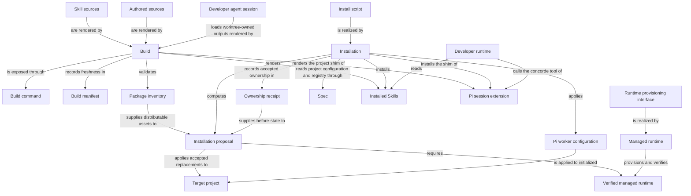

# Distribution

## Purpose

Distribution prepares the Framework assets that developers install and run: instructions, Skills and managed runtime dependencies. It builds from authored sources and installs only the outputs it owns. It does not decide or silently rewrite a consumer project’s business specification.

## Terminology

| Term | Meaning / definition |
| --- | --- |
| [Skill](../module.md#terminology) | Defined in Concorde Framework. |
| [Worker](../module.md#terminology) | Defined in Concorde Framework. |
| [Operation](../module.md#terminology) | Defined in Concorde Framework. |
| [Worktree](../module.md#terminology) | Defined in Concorde Framework. |
| [Installation](installation.md#terminology) | Defined in Installing and updating Concorde. |
| [Update](installation.md#terminology) | Defined in Installing and updating Concorde. |
| [Installation receipt](installation.md#terminology) | Defined in Installing and updating Concorde. |
| [Initialization](../spec/initialize.md#terminology) | Defined in Project initialization. |
| [Protocol binding](../spec/values.md#terminology) | Defined in Identities and versions. |
| [Registry](../module.md#terminology) | Defined in Concorde Framework. |
| [Spec](../module.md#terminology) | Defined in Concorde Framework. |

## Usage

Use Distribution to build this checkout, install or update Concorde in a consumer project, change
an initialized project's worker configuration, or provision the pinned runtime. Run
`python3 scripts/concorde.py build` after authored instruction or contract changes; use
`build --check` to check freshness without writing. Builds stay with their source worktree.
Installation previews owned changes by default and applies them only with explicit acceptance;
local modifications to receipt-owned output conflict rather than being silently adopted.

The build renders one projection per developer client. Claude Code and Codex read Skills. The Pi
coding agent instead loads a session extension whose single `concorde` tool describes or runs the
same public Operations, so a Pi session needs no Skills; the tool builds the invocation envelope
itself and runs the same launcher the Skills name. Aborting a Pi turn cancels the running
Operation, because the launcher treats termination like Ctrl-C. Both paths reach the same
launcher, and in an installed project that launcher runs itself inside the managed runtime
`.concorde/.venv` the installer verified: a Skill's `python3` only has to start it and needs no
Concorde dependencies of its own. A project whose runtime is missing gets a `missing_runtime`
result rather than an import failure; re-run the installer to provision it.

Installation deploys Framework assets and the Protocol copy, not project business Specs or a
registry. Initialize those separately. An update does not accept a new Protocol binding for you:
review and explicitly rebind it after any required project migration. Use `concorde-configure` for
worker model, thinking, timeout and overrides. Runtime provisioning needs a reviewed current plan;
launching a worker does not implicitly provision it. See [installation](installation.md),
[build](build.md) and [runtime](runtime.md). The existing runtime-rebuild preservation gap below
means a failed rebuild must not be assumed to have recovered the prior environment.

## Design

The Build command resolves Authored sources, including Skill sources, into deterministic worker
instructions, Installed Skills and runtime schemas. Build manifest binds their exact inputs and
outputs, while Package inventory determines which assets can be distributed. The external Developer
runtime reads an installed Skill to submit a typed operation request; Skills are not injected as
worker context or an independent execution grant. [Build realization](build.md#design) explains
source accounting and freshness checks.

The Pi session extension is the projection for a developer whose client is the Pi coding agent.
Build renders a shim into the project's `.pi/extensions/` that imports the tracked extension and
carries the catalog of public Operations: each one's description, its Skill guidance without the
stdin envelope mechanics, and its request schema. The extension registers one `concorde` tool.
Its `describe` action returns that guidance and schema; its `run` action wraps the caller's input
in the invocation envelope, runs the same launcher the Skills name in the project root and returns
the launcher's typed result, saving a result above 48 KiB to a file. Aborting the turn sends the
launcher SIGTERM, which it treats like Ctrl-C, and kills the launcher's process group after a
grace period. A short section appended to the system prompt names the tool and the Operations, so
Pi needs no Skills. Like a Skill, the tool grants nothing: the launcher performs every check, and
the source checkout's shim tells the model to run an Operation only on the developer's explicit
request. Pi still lists any `.agents/skills` a Codex installation left in the same project; the
tool's description asks the model to prefer the tool.

Install script exposes Installation's preview/apply boundary. An Installation proposal selects
exact owned changes in the Target project; an Ownership receipt records those installed bytes and
their before-state for later updates. A fresh build is not installation acceptance, and a receipt
is not permission to overwrite unrelated user content. Failure restores owned installation state.
Project Specs and their accepted Protocol binding remain separately controlled.

Managed runtime implements the Runtime provisioning interface and records a Verified managed
runtime only after its checks succeed. Provisioning does not decide which project files may be
replaced. Pi worker configuration is a separate explicit operation selecting model, thinking,
timeout and overrides; accepting new Protocol assets is an additional explicit decision. The
runtime-rebuild preservation gap below remains an unfulfilled obligation, not a claim that every
failed rebuild restored the prior environment.

The Developer agent session is the developer's own client session in the worktree whose build
supplied its projections. It never needs to move: a mutation it requests from the primary worktree
runs in a candidate worktree the host creates, and the session receives that candidate's result.
Builds use only their own worktree's source and outputs.

## Relationships

Build, Installation and Managed runtime are independent programs that only meet at explicit
records: Build never writes into a target project, Installation never renders Framework assets
itself, and Managed runtime never chooses which files Installation replaces. Ownership receipt and
Build manifest play matching but distinct roles — one binds installed bytes in a target project,
the other binds authored sources to rendered outputs in this checkout or a build client — and
neither substitutes for the other. The developer agent session is the same actor in this source
checkout and in an installed consumer project: it works in the worktree whose build supplied its
projections and lets the host run candidate work elsewhere.

Skill sources are authored and owned here, Build renders them, and Installation places the rendered
Skills in the target integration. The external Developer runtime consumes those instructions and
calls the declared operation boundary. For a Pi client, Build renders the shim of the Pi session
extension from the same Skill sources and Installation places it under `.pi/extensions/`; the
Developer runtime then calls the extension's `concorde` tool, which runs the same launcher. This
distribution path creates no worker Harness input and does not transfer ownership of executable
operation behavior to Distribution.

## Provider collaboration

The [installation](installation.md), [build](build.md) and [runtime](runtime.md) topics explain the
three workflows; their exact acceptance cases are owned together in [Distribution scenarios](scenarios.md).

### Spec

The [Spec Module](../spec/module.md) defines the project configuration and registry that installation, configuration and initialization read or write, with exactly one pinned Protocol binding.

Define the project configuration and registry that installation, configuration and initialization read or write.

This collaboration applies when installing into or configuring an initialized project, or when a Protocol binding must be checked.

- [Preserve the accepted binding and reject incompatible configuration](../spec/contracts.md#values-framework-configuration-and-storage-versions)

## Unresolved information

Managed runtime's replacement design intends to preserve the previous valid runtime until a rebuild
is verified and to restore it after a failed rebuild, but the current provisioning implementation
still removes an owned environment before rebuilding; this preservation promise is not yet fulfilled
by code, and callers must not infer recovery from the absence of success metadata.

Project initialization and Protocol-binding decisions belong to `module.spec`'s `concorde-init`
operation, not to this Module; installation never creates the registry or a Module stub itself.

The Pi projection has three known limits. Pi reads a project's `.agents/skills` as well, so a
project that also carries the Codex installation shows a Pi session both the `concorde` tool and
the Codex Skills; only the tool's description asks the model to prefer the tool, and nothing hides
the Skills from Pi. A `run` blocks the Pi turn for the whole Operation and shows no progress,
because the launcher prints only its final envelope; streaming the host's stage events through the
tool is pending, and aborting the turn is the only way to stop a run early. The tool runs the
launcher with the checkout's `.venv` interpreter or, failing that, the `python3` on the session's
PATH, and in a consumer project with the managed runtime's interpreter. Only an installed
project's launcher switches to a managed runtime by itself; a checkout whose environment lives
elsewhere must expose LangGraph on that `python3`, as the checkout's Skills assume too.

## Ownership, context and implementation status

Runtime admission, initialization, installation inventory and package Spec/wire alignment support Protocol 10/Profile 15. Build success proves output freshness only. Project updates must preserve explicit owner/reference choices and never silently migrate consumers.

## Precise specifications

The Distribution Module owns the exact obligations and interface details in [requirements](requirements.md).
These companions are part of the same complete Module specification, not separate topic owners.
