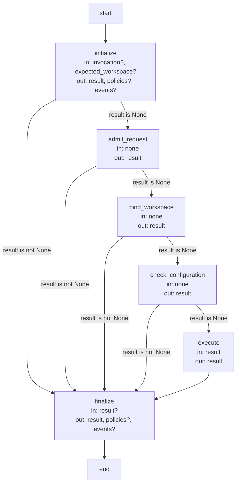

# Operation admission contracts

These precise contracts belong to the [Harness Module](module.md): the boundary every operation
request crosses, the typed values the host admits at that boundary and between stages, the result
and error vocabulary, workspace binding and the admission Graph. [Preparing and coordinating
work](host.md) explains their purpose; the [Operations Module](../operations/module.md) owns the
catalog of Operations and the dispatch this admission hands each request to.

## Terminology

| Term | Meaning / definition |
| --- | --- |
| [Operation](../module.md#terminology) | Defined in Concorde Framework. |
| [Public operation](../operations/module.md#terminology) | Defined in Operations. |
| [Internal operation](../operations/module.md#terminology) | Defined in Operations. |
| [Host](../module.md#terminology) | Defined in Concorde Framework. |
| [Graph](../module.md#terminology) | Defined in Concorde Framework. |
| [Skill](../module.md#terminology) | Defined in Concorde Framework. |
| [Worker](../module.md#terminology) | Defined in Concorde Framework. |
| [Worker profile](module.md#terminology) | Defined in Harness. |
| [Grant](../module.md#terminology) | Defined in Concorde Framework. |
| [Snapshot](../module.md#terminology) | Defined in Concorde Framework. |
| [Capsule](module.md#terminology) | Defined in Harness. |
| [Candidate](../module.md#terminology) | Defined in Concorde Framework. |
| [Worktree](../module.md#terminology) | Defined in Concorde Framework. |
| [Ready](../module.md#terminology) | Defined in Concorde Framework. |
| [Delivery](../module.md#terminology) | Defined in Concorde Framework. |
| [Evidence](../module.md#terminology) | Defined in Concorde Framework. |
| [Issue](../module.md#terminology) | Defined in Concorde Framework. |
| [Blocker](../module.md#terminology) | Defined in Concorde Framework. |
| [Disposition](../issues/lifecycle.md#terminology) | Defined in Solving a recorded problem. |
| [Spec context](context.md#terminology) | Defined in What information a worker receives. |
| [Implementation context](context.md#terminology) | Defined in What information a worker receives. |
| [Protocol binding](../spec/values.md#terminology) | Defined in Identities and versions. |

## Operation execution boundary

An Operation is a State-based LangGraph node under the Operation and Harness contract supplied by
the [Harness Module](module.md). Each
registered entry declares its State, USES and optional model execution profile. Existing host
adapters additionally retain versioned request/response transport contracts; model-only nodes do
not acquire new wire envelopes. Rendered public Skills expose exactly one public Operation.
Non-public Operations have no Skill or direct launcher entry. Every external request passes
through this admission boundary. The [operation catalog](../operations/execution-reference.md#operations-operation-registry)
names every Operation; exact wire schemas are code, exported by the build for runtime/API use,
and this document states their promises.

Executable entry: `python3 scripts/run-operation.py <skill-name>`, no task command-line arguments.
In an installed project the launcher first re-executes itself inside the managed runtime, as the
[Distribution Module](../distribution/scenarios.md#scenario.distribution.launcher-managed-runtime)
specifies; an interpreter without LangGraph and without that runtime is refused with `missing_runtime`.
A name that is not a Skill is refused with `unknown_operation`. stdin is exactly one JSON object
`concorde-operation-invocation@3` with fields type_id, schema_version=3, operation_id (the Skill's
name), mode=execute|describe-policy, configuration and input. Maximum input is 1 MiB. Schema 2
invocations are rejected with `unsupported_version`. configuration is a
`concorde-operation-configuration@1` TypedValue or null for the initialized host settings; input is
the operation's named request TypedValue. A TypedValue is {type_id,schema_version,data}, with a version fixed for each type; unknown
fields and versions fail admission. Configuration is the Pi worker model selection: an optional
default model, thinking level and timeout and optional per-worker and per-child overrides. It is
stored at initialization under `operation_configuration` and required to match host settings for
ordinary invocations. Caller input never substitutes for permission authority.

stdout is `concorde-operation-result@3` with operation_id, invocation_id, mode, status
succeeded|blocked|failed|described, workspace (null or host-supplied worktree metadata), output
(typed response or null) and errors [{code,field,message}]. Exit 0 means succeeded/described; 3 means
blocked/failed. Describe-policy does not launch agents or mutate project state; policy descriptions
go to stderr. Before executing or describing a top-level model-backed operation, the host
verifies the build manifest and refuses a stale build with `stale_build`. The deterministic
operations `concorde-init`, `concorde-configure`, `concorde-validate` and
`concorde-deliver` are exempt from this entry check because they launch no workers and consume no
generated worker instructions. Loading an Agent independently verifies build freshness before
trusting its generated binding. The deterministic-entry exception does not waive Protocol, input,
permission, validation or delivery-evidence checks; see the canonical
[build admission scenario](../distribution/scenarios.md#scenario.distribution.build-stale-blocks-execution).

The invocation's project root is the working directory of that entry process, exactly as resolved
and without searching parent directories. The registry, Spec collections and listed
implementation files it reads are those of the worktree at that directory; lifecycle evidence is primary-owned; the stale-build check
inspects the framework checkout that contains the launched script. A working directory at a Git
worktree root is admitted as a `primary` or `change` workspace and a directory outside any Git
repository as `unversioned`; a directory inside a Git worktree that is not its root is refused with
`workspace_mismatch`. The Skill's entry command is project-relative, so a rendered Skill carries no
worktree identity: the worktree in which the developer's agent session started, the worktree whose
Skill projection supplied the instructions and every other linked worktree contribute no registry,
document or file to the invocation, and changing the working directory selects a different project
rather than a wider one.

In a consumer project, a mutating Operation request in primary creates a candidate worktree on an isolated branch
from committed HEAD, records the change there and relays the same request to that candidate's own
launcher (`relay_operation`): a candidate that carries its own Concorde, the source checkout or a
consumer whose installed framework is tracked, runs that code after verifying its own current build; any other candidate runs the invoking framework with the candidate as its project root.
The relayed launcher's complete result envelope becomes this invocation's result, its stderr
diagnostics are forwarded, and its workspace names the candidate; the originating session never
moves. Uncommitted primary changes are not copied. A request that names a recorded change_id from
the primary worktree relays into that candidate, found through the worktree inventory; a launcher
that returns no envelope fails with relay_failed. Host-created worktrees live in temporary storage.
For source maintenance, the main instead assigns a fresh Skill-free writer to a candidate;
source-primary mutations are refused even when a change ID already names a candidate. The source
constructor injects no Operation guidance and never uses primary code to build candidate outputs:
the fresh writer runs that candidate's own build before a separate sibling tests its private Skills.
An Operation already in the assigned candidate reuses it instead of creating a nested candidate.
Host administrators may explicitly permit standalone consumer development for controlled embedding. Delivery separately requires a session in its
selected source or primary worktree; third-worktree sessions and nested Operation delivery calls are rejected; a one-layer task child in a participant may deliver. Default
delivery publishes a per-change branch and removes the source worktree unless explicitly retained.
Final primary merging is a separate merge_primary:true request requiring explicit user authorization
and the primary owning session. Only one agent owns primary writes; the host serializes shared
lifecycle writes and final merges with the repository lock.

The host resolves the complete selected owned and directly referenced Specs and Protocol/kind definition for every stage.
Spec-only agents, including Spec reviewers, start in a private capsule containing only frozen input.
Implementation workers receive the complete Module context plus the contents of its own listed implementation files. Planners and task authors already see those file names through the Module's entity declarations, but receive no file contents. Code reviewers
use a distinct read-only implementation role with only the current listed implementation files. Every
worker is a fresh Pi process whose tool calls are gated to its grant; no worker receives network or
credential effects, and writes are restricted by phase. Executor outcomes must match invocation,
binding and context identities. No ambient conversation or predecessor transcript is admitted.

Query and route semantics belong to [Query and Routing](../query-routing/module.md).
Topology actions of the same public main entry belong to [Topology](../topology/module.md).
These are semantic siblings using the existing shared main adapter; they add no launcher.

No Skill returns context manifests; context resolution is host-internal and
`describe-policy` mode already previews the exact grants an operation would receive without
launching a worker or mutating project state. Each previewed stage's description also names the
bound worker (`agent`, `agent_binding_digest`, `profile_digest`, `instructions_digest`, `workspace`,
`tools`, `children`) and its resolved `model`, `thinking` and `timeout_seconds`, so a caller can
audit which worker definition and model a launch would use without reading its rendered
instructions. Complete cognitive snapshots never cross
the Skill result boundary.

Provider contracts are [Spec Authoring](../spec-authoring/module.md#usage),
[Planning](../planning/plan.md), [Tasks](../planning/tasks.md),
[Implementation](../implementation/module.md#usage), [Review](../review/module.md#usage),
[Validation](../validation/module.md#usage) and [Delivery](../delivery/module.md#usage).
The [Specification Graph](../specify-loop/module.md#usage) and
[Development Graph](../dev-loop/module.md#usage) own ordering and lifecycle policy.
The host rechecks registry, context and initialized configuration after every stage.

Each reported Spec gap carries host-bound target_id and context_id provenance. A Module coordinator
retains that provenance when a component stage is blocked, so callers can author the correct local
Spec before retrying. Agent-supplied mismatched gap provenance is rejected.

## Wire contracts

Every TypedValue is `{type_id, schema_version, data}`; `schema_version` is pinned per type below and
`data` must satisfy that type's JSON Schema. The invocation envelope wraps every request and
response; the fourteen operation request/response pairs carry each operation's own task and
result; the remaining types are internal handoffs, review records, topology artifacts, the project
proposal and the stage-input artifacts that pass between stages inside one operation.

### Invocation envelope

| Type | Carried by | Promise |
| --- | --- | --- |
| `concorde-operation-invocation@3` | Every request, on stdin | `{type_id, schema_version: 3, operation_id, mode: execute\|describe-policy, configuration, input}`. `operation_id` must name a Skill; a non-public or unknown name is refused with `unknown_operation`. `configuration` is a `concorde-operation-configuration@1` TypedValue or null (falls back to the initialized project settings); `input` is the named operation's own request TypedValue. Any other `schema_version` is refused with `unsupported_version`. |
| `concorde-operation-result@3` | Every response, on stdout | `{type_id, schema_version: 3, operation_id, invocation_id, mode, status: succeeded\|blocked\|failed\|described, workspace, output, errors: [{code,field,message}]}`. `output` is the named operation's own response TypedValue or null; `workspace` is null or host-supplied worktree metadata. Exit code 0 means `succeeded`/`described`; 3 means `blocked`/`failed`. |
| `concorde-operation-configuration@1` | The invocation's `configuration` field, and `concorde-configure-request@2`/`-response@2` | `{model?, thinking?: off\|minimal\|low\|medium\|high\|xhigh\|max, timeout_seconds?, workers?: {<worker> or <worker>/<child>: {model?, thinking?, timeout_seconds?}}}`; `model` is Pi's `provider/id`. The top-level values are the project default; a worker entry overrides them for one worker and a child entry for one worker child, which inherits its worker's entry (see [the worker selection scenario](scenarios.md#scenario.harness.worker-selection)). An absent model or thinking level keeps Pi's default and an absent timeout the worker profile's. A key naming no worker or worker child, a timeout on a child, a nonpositive timeout or a model without a provider is rejected. Stored at initialization under `.concorde/config.json`'s `operation_configuration` key; an invocation or child stage whose configuration differs from that stored snapshot stops with `configuration_mismatch`. |

### Operation requests and responses

Common request task fields (named once, not repeated per row): `target_id` (required for every
bound Module request; an optional routing hint for `main`, `dev-loop`, `specify-loop` and `review`), `task`,
`focus_id` (a candidate scenario ID), `constraints`, `change_id`. Common response fields (present in every operation response
except `configure`, which replaces them): `target_id`, `focus_id`, `change_id`, `context_id`,
`outcome`, `answer`, `artifacts`, `blockers`, `checks`, `completed_operations`. A blocker contains
an immutable Issue receipt plus its task-local blocked_step, never a second copy of the problem.

| Type | Carried by | Promise |
| --- | --- | --- |
| `concorde-main-request@1` / `concorde-main-response@3` | main | Every request field is optional at the wire level. Request adds `action` (ask\|design-topology\|accept-topology\|apply-topology, default ask), `topology_proposal` (a `concorde-topology-proposal@1` TypedValue, required for accept-topology) and `application` (an ArtifactRef, required for apply-topology). Response adds `entry_target`, `discovered_targets`, `routes`, nullable `topology_proposal`/`application`, `files` and `workspace`. |
| `concorde-specify-loop-request@1` / `concorde-specify-loop-response@3` | specify-loop | Only `task` is required. Optional target/focus hints, constraints, change_id, `specify` and `run_reviews` (both default true). The common response reports Spec completion or blockers with artifact references; it never reports implementation readiness. |
| `concorde-dev-loop-request@1` / `concorde-dev-loop-response@3` | dev-loop | Only `task` is required. Request adds optional `repair_task_scope:{tasks_digest: sha256}` for exact incomplete-list phase recovery, `specify` (default true; false skips Spec authoring) and `run_reviews` (default true; false records an explicit per-mode skip). Response is the common shape only. |
| `concorde-issues-request@1` / `concorde-issues-response@2` | issues | Select list, show, report, reopen or solve. Show/reopen/solve require one issue_id; report requires a target and classified report. Optional expected_revision rejects stale selection. Response adds complete Issue records and nullable decision. [Canonical operation semantics](../issues/interfaces.md). |
| `concorde-init-request@2` / `concorde-init-response@1` | init | Requires only `action` (propose\|apply); adds optional `name`, `target_id`, `configuration` and `proposal` (a `concorde-project-proposal@1` TypedValue). Response replaces the common shape with `status` (proposed\|applied), a nullable `proposal` and `files`. |
| `concorde-configure-request@2` / `concorde-configure-response@2` | configure | Requires `configuration`. Response requires `configuration` and `status: "applied"`; the only operation whose response does not use the common stage shape. |
| `concorde-validate-request@1` / `concorde-validate-response@3` | validate | Requires `target_id` and `task`; adds optional `run_checks`. Response is the common shape only. |
| `concorde-deliver-request@1` / `concorde-deliver-response@3` | deliver | Requires only `change_id`; adds optional `target_id`, `task`, `focus_id`, `constraints`, `keep_worktree` and `merge_primary`. Response is the common shape only. |
| `concorde-specify-request@1` / `concorde-specify-response@3` | specify (stage) | Requires `target_id` and `task`. Response is the common shape only. |
| `concorde-spec-review-request@1` / `concorde-spec-review-response@3` | spec-review | Requires `task`; optional target/focus are routing hints for a new standalone task. A composing operation or current-change resumption supplies the bound target. Selects only Spec review; no review_mode request field. Response adds `reviews` (`concorde-review-result@2` TypedValues). |
| `concorde-code-review-request@1` / `concorde-code-review-response@3` | code-review | Requires `task` with the same optional routing hints. Selects only code review; no review_mode request field. Response adds `reviews` (`concorde-review-result@2` TypedValues). |
| `concorde-context-solve-request@1` / `concorde-context-solve-response@3` | context-solve (stage) | Requires `target_id` and `task`. Response is the common shape only. |
| `concorde-plan-request@1` / `concorde-plan-response@3` | plan (stage) | Requires `target_id` and `task`. Response is the common shape only. |
| `concorde-tasks-request@1` / `concorde-tasks-response@3` | tasks (stage) | Requires `target_id` and `task`. Response is the common shape only. |
| `concorde-implement-request@1` / `concorde-implement-response@3` | implement (stage) | Requires `target_id` and `task`. Response is the common shape only. |

### Stage handoffs

| Type | Carried by | Promise |
| --- | --- | --- |
| `concorde-context-snapshot@6` | Every bound worker invocation's frozen input | [Canonical snapshot](contracts.md#context-context-snapshot-resolution); preserve its resolution provenance and reject stale inputs. |
| `concorde-agent-stage-context@4` | Host to worker, wrapping the launch | `{snapshot: concorde-context-snapshot@6, change_id, expected_artifacts}`. |
| `concorde-agent-stage-result@2` | Worker to host, the completion | `{context_id, outcome, answer, blockers, documents, plan, tasks, issue_decision?}`; `documents`/`plan`/`tasks`/`issue_decision` are populated only by the phase that produces them. A mismatched `context_id` is rejected as `incompatible_handoff`. |

### Review types

| Type | Carried by | Promise |
| --- | --- | --- |
| `concorde-review-input@1` | Host-produced, inside the review stage context | `{review_mode, input_digest, revision, changes: [{path,patch}]}`; binds the exact Spec/code revision under review. |
| `concorde-review-stage-context@4` | Host to reviewer, the launch | `{snapshot: concorde-context-snapshot@6, review: concorde-review-input@1}`. |
| `concorde-review-stage-result@2` | Reviewer to host, the completion | `{context_id, input_digest, review_mode, status: no_findings\|findings\|incomplete, representative_tasks, issues, answer}`. |
| `concorde-review-result@2` | Published in the `reviews` field of `concorde-spec-review-response@3` or `concorde-code-review-response@3` | The stage result plus `target_id`, `focus_id`, `revision`, a nullable `context_id`, `status` extended with skipped\|not_run, and `semantic_completeness: "not_proven"`. |

### Topology types

| Type | Carried by | Promise |
| --- | --- | --- |
| `concorde-discovery-context@6` | Host to discovery worker | [Canonical discovery context](contracts.md#context-global-spec-context-assembly); only explicit selections may expand discovery. |
| `concorde-main-stage-context@5` | Wraps the discovery context for launch | `{snapshot: concorde-discovery-context@6}`. |
| `concorde-main-stage-result@2` | Discovery worker to host, the completion | `{context_id, outcome, answer, expand_targets, routes, blockers, topology_design (nullable)}`. |
| `concorde-topology-design@1` | design-topology's output, embedded in the main stage result | `{summary, registry, spec_tasks (nonempty), migration_constraints, acceptance (nonempty)}`. |
| `concorde-topology-proposal@1` | design-topology's response, and accept-topology's request | `{proposal_id, base_registry_digest, protocol_binding, context_id, discovered_targets (nonempty), task, constraints, target_hint, focus_hint, design: concorde-topology-design@1, workspace}`; a stale `base_registry_digest` or `protocol_binding` is rejected as `stale_proposal`. |
| `concorde-topology-author-context@4` | Host to target-local Spec author, during accept-topology | `{context_id, base_registry_digest, target, task, protocol_binding, protocol, candidate_references, spec_resolution, instructions, workspace}`. |
| `concorde-topology-author-result@2` | Author to host, the completion | `{context_id, target_id, outcome, answer, blockers, documents}`. |
| `concorde-topology-application@1` | Host-private, produced by accept-topology and consumed by apply-topology | `{application_id, topology_proposal: concorde-topology-proposal@1, base_registry_digest, protocol_binding, files (nonempty)}`; the public response exposes only its ArtifactRef, never these bytes. |

The canonical [discovery record](contracts.md#context-global-spec-context-assembly) defines
deduplicated source pools and per-Module provenance. The host retains it unchanged in each
handoff and checks currentness before using its result; it does not define a second record shape.
The topology-author context's `candidate_references` is the candidate Module's explicit references;
`spec_resolution` is its candidate one-level resolution. Providers are read-only unless the author
is their candidate owner. Ownership transfers, additions and removals bind both prior and candidate
descriptors and all affected consumers in the prepared application.

For ask, the answerer may expand explicitly selected contexts or complete directly from their
original contents with no routes. Other routed operations preserve one target task and its
constraints. Spec gaps identify an admitted Module and the current combined context identity.
Old reading-worker results and the synthesis phase are not accepted; clients must use the current
build-bound schemas and instructions. Existing Protocol bindings remain pinned until explicitly
updated; a mismatched package/context is rejected instead of reinterpreted.

### Project proposal

| Type | Carried by | Promise |
| --- | --- | --- |
| `concorde-project-proposal@1` | `concorde-init-request@2.proposal` and `-response@1.proposal` | `{action: "initialize", base_digest (nullable), files: [{path, before_digest (nullable), content}]}`. |

### Issue reporting values

| Type | Carried by | Promise |
| --- | --- | --- |
| `concorde-issue-report@1` | Worker reporting tool to the host | [Classified observation](../issues/execution-reference.md#issues-store-boundary), without caller-supplied provenance or a graph-control effect. |
| `concorde-issue-receipt@1` | Host to the reporting worker | Immutable `{issue_id, report_id, path}` identity for the exact accepted observation; the tool additionally returns the current record revision for a subsequent append. |

### Stage-input artifacts

| Type | Carried by | Promise |
| --- | --- | --- |
| `concorde-plan-artifact@1` | A `stage_inputs` entry: produced by plan, consumed by tasks | `{plan}`. |
| `concorde-task-identity-constraints@1` | Host to every fresh task author, including after replanning | `{reserved_task_ids: list[nonblank str]}`; required, sorted and unique, possibly empty. Includes every retained historical ID and the current list for scope or code-review repair. New tasks must not reuse these identities; collisions report the conflicting IDs without rewriting output or history. No software obligations or code contents. |
| `concorde-implementation-task@1` | A `stage_inputs` entry: produced by tasks, consumed by implement | `{plan, tasks: [{id,target_id,description,acceptance,complete}]}`; implement must return every task with the same identity, marked complete only when its acceptance is met. |
| `concorde-task-scope-feedback@1` | Host to fresh task author only | `{tasks_digest: sha256, reason: "implementation_boundary"}`; fixed semantic feedback preserves software acceptance while separating implementation from later Host validation, review and authorized outer-session commit. No code or raw logs. |
| `concorde-issue-selection@1` | Host to Issue solver only | Selected issue_id/revision, problem/type, bounded host feedback/verification and explicitly admitted duplicate candidates. No code, logs or predecessor conversation. |
| `concorde-issue-intent@1` | Host to ordinary development stages | `{intent}` carries only the selected intended behavior; it never widens a file grant. |
| `concorde-issue-context@1` | Host to admitted tasks/implementation repair | Selected immutable receipts and their contract-level description, impact and basis. It supplies meaning for the exact review references without exposing the whole Issue history. |
| `concorde-review-result@2` | A `stage_inputs` entry: produced by code review, consumed by the repair `tasks`/`implement` iteration | The same value published in `concorde-code-review-response@3.reviews` (see Review types above), re-verified from its stored artifact before reuse; only accompanies a dev-loop's bounded `review_code -> tasks` repair round. |

Unknown fields, an incompatible `type_id`, an unsupported `schema_version`, and an unsafe or
non-project-relative path are all rejected before any agent launches, with the `TypedDataError`
codes named below. Exported schemas implement the versions specified here, including the independently versioned
context forms; package/schema alignment checks verify those identities.

| Error code | Meaning |
| --- | --- |
| `migration_required` | Legacy local lifecycle data requires explicit migrate-status acceptance. |
| `migration_conflict` | Legacy or interrupted migration collides with differing data; preserve both and resolve explicitly. |
| `primary_unavailable` | Restore the authoritative primary worktree before retrying persistence. |
| `fresh_session_required` | Source maintenance requires an assigned candidate and fresh Skill-free writer. |
| `already_initialized` | The project is already configured; use `configure` to change settings instead of initializing again. |
| `closed_issue` | Another observation requires reopening the closed Issue first. |
| `invalid_issue` | An Issue report, record, receipt or disposition violates its closed shape or history invariants. |
| `issue_key_conflict` | An invocation reused a report key with different content; the original observation is preserved. |
| `stale_issue` | Selected Issue bytes or an immutable observation no longer match the requested operation. |
| `unknown_issue` | The selected Issue does not exist in this worktree. |
| `ambiguous_route` | Main routing found more than one owning target for an operation that requires exactly one; route cross-target work through a Module instead. |
| `cancelled` | `OperationExecutionError.outcome` when the host interrupted a running worker; the host maps this to the `execution_cancelled` result error code. |
| `child_blocked` | A composed child operation returned a blocked or otherwise non-successful outcome and stopped the composing operation. |
| `check_sandbox_unavailable` | Harness could not enforce the configured check's read-only filesystem boundary or launch it inside that boundary; diagnostics remain in the host log and readiness is blocked. |
| `configuration_mismatch` | The invocation's or a child stage's configuration differs from the initialized project settings or the host's own snapshot. |
| `context_limit` | Main discovery exceeded its bounded expansion-step limit. |
| `delivery_in_progress` | The candidate is already being delivered; resume delivery from either participating worktree instead of starting a new mutation. |
| `delivery_session_required` | The current session is not recognized as the change's selected source or destination worktree. |
| `invalid_assessment` | A returned context assessment is internally inconsistent: only a Spec-incomplete outcome may carry structured gaps. |
| `invalid_context` | A resolved context is structurally invalid, for example discovery without nonempty, unique, ordered targets. |
| `invalid_phase` | The requested context or discovery phase is not one this host supports. |
| `missing_source` | A required regular file named by the registry or by a resolved context is missing from the project. |
| `not_installed` | Initialization or Protocol acceptance found no Protocol copy under `.concorde/protocol/`; Concorde has not been installed into the project, so run the installer first. |
| `primary_session_required` | Final primary merging requires the primary owning outer session. |
| `delivery_required` | Final primary merging requires a completed staged delivery; finish staging or cleanup first. |
| `detached_primary` | The destination (primary) worktree has no attached branch to deliver onto. |
| `detached_worktree` | A change worktree has no attached branch. |
| `dirty_primary` | Final primary merging is blocked by local changes; default branch delivery preserves them and may proceed. |
| `execution_cancelled` | `run_operation` caught a `OperationExecutionError` with `outcome == "cancelled"`, or a host interrupt (Ctrl-C, or SIGTERM from the developer's client) outside a worker launch; the change status becomes `cancelled` and the candidate is preserved. |
| `execution_limit` | `run_operation` caught a `OperationExecutionError` with `outcome == "limit_exhausted"`; the change status becomes `limit_exhausted` and the candidate is preserved. |
| `failed_merge_checks` | The verified merge of the candidate into the destination branch failed its configured checks. |
| `incompatible_contracts` | Shared contracts between participating components disagree and must be reconciled before implementation. |
| `incompatible_handoff` | A returned identity (context, target, gap, route, or configuration) does not match what the host issued or expects. |
| `incomplete_change` | Delivery was requested before every authored task for the change was complete. |
| `incomplete_tasks` | Implementation did not report every exact task as complete. |
| `invalid_agent_binding` | A named worker's profile, contract or child definitions are inconsistent with each other or with the current build manifest. |
| `invalid_completion` | A worker returned no single valid result, or its result is internally inconsistent with its own declared context or outcome. |
| `invalid_delivery` | A delivery receipt has an invalid or mismatched identity. |
| `invalid_entry_target` | The registry's `entry_target` is not a Module, so main discovery cannot start there. |
| `invalid_field` | A TypedValue field fails its JSON Schema: wrong type or format, a missing or unknown field, non-unique items, or a mode/action-specific requirement. |
| `invalid_owner` | A document has duplicate or inconsistent ownership or identity. |
| `invalid_reference` | An explicit reference is duplicate, self-directed, unknown or has the wrong kind. |
| `invalid_target` | A context query does not name a registered Module or scenario. |
| `invalid_focus` | A focus hint was given without its required target hint. |
| `invalid_input` | A request's fields are structurally invalid for the requested action (for example, a missing name or configuration on initialization). |
| `invalid_json` | stdin is not parseable JSON. |
| `invalid_merge` | The verified merge of the candidate failed Spec validation. |
| `invalid_proposal` | A topology design or proposal would change the project's own identity, or is otherwise not acceptable. |
| `invalid_spec` | An authored document unit's metadata, ownership or reading structure is invalid. |
| `invalid_worktree_state` | the primary-owned `.concorde/status/<change_id>.json` has an invalid identity or schema. |
| `legacy_attempt` | The worktree still carries an unsupported legacy `.concorde/attempts/` state that must be removed before it can be adopted. |
| `limit_exhausted` | `OperationExecutionError.outcome` when a worker ran past its timeout; the host maps this to the `execution_limit` result error code. |
| `merge_conflict` | Integration conflicts with the primary branch. Resolve and revalidate in the candidate worktree, or a new candidate if delivery already removed the source. |
| `missing_change` | A requested existing change or task authoring has no managed change in the current worktree. |
| `missing_runtime` | The launcher's interpreter cannot import LangGraph and no verified managed runtime exists beside the installed framework to switch into; provision it with the installer, or give the source checkout its locked environment. |
| `missing_plan` | Task authoring was requested without an authored plan. |
| `missing_tasks` | Implementation was requested without authored tasks. |
| `permission_denied` | A request or worker tried to act outside its granted target, Module composition/dependencies, or write scope. |
| `protocol_mismatch` | The project's pinned Protocol binding does not match the installed Protocol assets, or a bound asset has changed. |
| `review_required` | A required Spec or code review is missing, incomplete, blocking, or stale for the current revision. |
| `spec_incomplete` | The current task still has open, unresolved Spec gaps. |
| `stale_build` | The rendered build is missing, or a recorded source has changed since the last `python -m concorde build`. |
| `stale_context` | The frozen context capsule no longer matches the repository: its registry, Protocol, or document bytes changed. |
| `stale_delivery` | A recorded delivery is no longer on its target branch, or has changed since it was recorded. |
| `stale_evidence` | Recorded validation, review, or completion evidence no longer matches the current candidate bytes. |
| `stale_proposal` | A topology proposal's registry or Protocol base has changed since it was produced. |
| `stale_reference` | An artifact reference's declared path or digest does not match the file actually on disk. |
| `state_persistence_failed` | The host could not persist change progress after recording an otherwise-final outcome. |
| `studio_run_failed` | A Studio-driven operation run did not complete successfully. |
| `studio_transport_failed` | The Studio client could not reach or exchange messages with the Studio server. |
| `undeclared_operation` | An operation tried to compose another operation that its own module does not declare in `USES`. |
| `unknown_agent` | The named worker has no matching `operations/<name>/` definition. |
| `unknown_operation` | The named operation is not registered, or a parent operation referenced an operation that does not exist. |
| `unknown_change` | Delivery named a `change_id` with no registered live worktree or delivery receipt. |
| `unknown_target` | The requested Spec target ID is not registered. |
| `unknown_type` | A TypedValue's `type_id` does not name a schema the wire module recognizes. |
| `unsafe_path` | A path escapes the project root, aliases a control path, or crosses a symlink. |
| `unsupported_profile` | The registry declares a profile older than the Module model this runtime implements; migrate it explicitly. |
| `unsupported_target` | The selected target has no registered implementation for the requested code-owning behavior. |
| `unsupported_version` | The invocation's `schema_version` is not the one this host implements. |
| `unsupported_issue_version` | A historical schema-1 Issue was selected for mutation; retain its evidence and explicitly create a current record for further work. |
| `unsupported_worktree_version` | Saved worktree progress uses schema 1; archive it explicitly and establish fresh evidence rather than silently reusing renamed fields. |
| `use_proposal` | `describe-policy` cannot preview `init`/`configure`; use their deterministic proposal graph instead. |
| `workspace_mismatch` | The current worktree, branch, or worktree topology does not match what the requested operation or transition requires, including an entry process whose working directory lies inside a Git worktree but not at its root. |
| `relay_failed` | The candidate worktree's launcher, running a mutation relayed from the primary worktree, returned no result envelope. |
| `execution_failed` | The host caught an exception outside the named Spec/typed-data/build error vocabulary. |

## Worktree awareness

Each stable change/task ID has one schema-2 `.concorde/status/<change_id>.json` in the primary
worktree only. The record keeps mode, task goal, candidate path/branch/base, child ownership,
phase, blockers, target progress, run references, delivery or ordinary-Git merge outcome, and
separate cleanup status. Candidates hold no duplicate authoritative record. Terminal records
survive worktree deletion; direct primary tasks need no secondary worktree. Project configuration
and registry semantics are unchanged and remain tracked; runtime status and runs are ignored.

Git common-directory identity identifies the primary, including nonstandard primary paths.
Unavailable primary identity blocks persistence with `primary_unavailable`; restore the primary
and retry, never fabricate a new candidate-local authority. Cooperative repository locks serialize
atomic coordinator writes without letting children edit primary source or index. Live unmanaged
worktrees remain discoverable but are not silently converted into tasks. Branch/path are locators;
change identity remains stable across a branch rename. Git worktree identity prevents a reused
path from resurrecting a removed task; terminal primary tasks do not own subsequent direct work.

Durable `.concorde/runs/<run_id>/` evidence is primary-only, including candidate runs. Each run
records actual source root, branch, change/run IDs, input commit/tree, runtime and build identity,
results and separate logs/artifacts. Accepted artifact bytes and build manifests are snapshotted
in runs before scratch or candidate removal; a stale reference is marked unavailable rather than
represented as a successful copy. Explicitly selected Skill bodies are retained as provenance,
not proof of model execution. Unknown Skill provenance stays null rather than implying a
Skill was loaded from catalog metadata. Candidate `.concorde/work/` may hold temporary context
scratch and auxiliary work, not duplicate durable run archives.

`migrate-status` previews legacy worktree state, inventory, receipts and candidate runs;
`migrate-status --apply` explicitly imports them. Preflight refuses conflicting stable IDs, differing
run bytes, unsafe paths and existing archive destinations without deleting data. A durable journal
precedes writes; retries replay identical targets and finish unfinished archival/removal steps, while
conflicting intervening bytes block. Original bytes are archived under primary `.concorde/runs/legacy-migration/` before
removing exact unchanged legacy sources; candidate-local durable archives do not remain. Legacy readiness requires fresh validation. Delivery recovery remains in the
status record; detailed historical delivery logs move into runs. No live-data migration is implicit.

Every discovery and worker snapshot admits `workspace` lifecycle metadata. Main can answer a pure
workspace-status question directly from this metadata; target-behavior answers still use a separate
answerer invocation. The current workspace identity and status are rechecked after a stage. Other live worktree
summaries are frozen observations and their progress does not invalidate unrelated main cognition.

## Admission Graph

The admission Graph runs every invocation, admitted or not, around the Operations
[dispatch Graph](../operations/execution-reference.md#graphs-operation-dispatch-graph-dispatch-graph).
It follows the [Graph Spec convention](execution-reference.md#graphs-and-loops-graph-specs): its
State, Nodes and Edges are stated in turn, and its diagram is bound to the compiled Graph by
`%% graph:` and kept equal to it by the configured Graph Spec check.

### Operation admission Graph (`operation_graph`) {#graphs-operation-admission-graph-operation-graph}

**State.** `invocation` (the admitted `concorde-operation-invocation@3`), `result` (the
`concorde-operation-result@3` envelope, filled by `finalize` or by a guard that caught an
error), `policies` and `events` (the host's policy descriptions and observed events, Studio only),
`expected_workspace` (the optional Studio root-identity assertion). All channels use replacement
updates. Local execution starts with empty State; the request, configuration, task, workspace,
relay target, lifecycle and in-progress response envelope live in the trusted Host closure.
Studio supplies `invocation` and optionally `expected_workspace`; initialization validates them
and builds that same Host session. Policies/events are copied out on finalization, not appended
by a Graph reducer.

The dispatch child has `route`, `output`, `relayed` and `result`, but only `result` intersects this
parent's schema. Its typed `output` or relay envelope is captured by the trusted dispatch adapter
into the Host-held response; `finalize` publishes that envelope as `result`. There is deliberately
no parent `output` channel. The table names channel reads/updates; `?` denotes a conditional or
Studio-only channel use, and `none` denotes Host-bound inputs rather than Graph-channel reads.

**Nodes.** Admission and dispatch steps run under the Host guard: an error records the typed
failure envelope in `result`; success clears it to None. Initialization/finalization are boundary
steps, with Studio's own initialization failure handling.

| Node | Executes | in | out |
| --- | --- | --- | --- |
| `initialize` | Deterministic: clears result; Studio also checks invocation/workspace and creates a fresh Host session, or clears policies/events on rejection. Local Host setup precedes Graph entry. | invocation?, expected_workspace? | result, policies?, events? |
| `admit_request` | Validates Host-bound operation, mode, configuration and request; rejects stale builds where required; retains admitted task/configuration outside State. | none | result |
| `bind_workspace` | Binds the Host's workspace; a mutating primary request prepares a candidate and Host relay target. | none | result |
| `check_configuration` | Compares Host configuration to initialized settings and binds its snapshot. | none | result |
| `execute` | Registered dispatch subgraph; only result crosses this parent State boundary, while the Host captures typed output/relay data. | result | result |
| `finalize` | Publishes the Host-held envelope and lifecycle outcome; Studio copies observed policies/events, or preserves initialization failure if no session exists. | result? | result, policies?, events? |

**Edges.** Each admission step is followed by a conditional edge that reads `result`: when the step
or its guard recorded a failure envelope, the Graph goes straight to `finalize`; otherwise it
continues to the next step. `execute` always continues to `finalize` with its Host-captured output
and shared `result`, and `finalize` always
ends the Graph, so every invocation, admitted or not, ends with one typed result envelope.
The admission predicate is exactly `state.get("result") is not None`, not the business outcome
inside an Operation response. A blocked business outcome can therefore pass through dispatch to
normal finalization without being mistaken for a guard exception.

## Design

### Required orchestration model

The [execution reference](execution-reference.md) defines the Agent model (A1–A5) and the Graph
and Loop model (G1–G4) that admission composes. The Harness resolves worker definitions, their
`spec.md` sources, profiles and child definitions into a reproducible `AgentBinding` that every
worker invocation carries, and its executor verifies that binding before any process starts. This
Module MUST coordinate declared Graph transitions and bounded loops with attributed AI feedback and
explicit human decisions, and every operation Graph is a LangGraph graph whose nodes are
deterministic steps or worker invocations. The policy `role` and `agent` fields are the bound
worker's external name.

### Required collaborator interfaces

Canonical interfaces are supplied by the Module references in Harness's registration. These links
state admission's local uses and obligations; providers own the definitions, schemas and error
semantics.

| Provider definition | Admission use and obligation |
| --- | --- |
| [Registry and resolution](../spec/registry.md), [values](../spec/values.md) | Select the unique task owner, freeze its complete resolved context, reconstruct after changes and stop on failed admission. |
| [Build](../distribution/build.md) and [installation](../distribution/installation.md) | Require fresh projections and the pinned Protocol assets before launch; a mismatch blocks the invocation. |
| [Validation](../spec/structure.md) | Require structural evidence and separately configured checks; never interpret it as semantic proof. |
| [Operation catalog](../operations/execution-reference.md#operations-operation-registry) | Admit only a registered public Operation at the boundary, and a child Operation only through its parent's declared composition. |
| [Issue interface](../issues/interfaces.md) | Preserve immutable report references and task-local blocker judgments; only explicit solving starts repair. |

Configuration loading is Harness-owned: `load_configuration(project_root: str|Path)` returns the
initialized configuration TypedValue. Ordinary invocations and child stages must equal that
snapshot; mismatch stops the transition without fallback or expanded authority.

### Implementation context and code writers

Each Module's entities carry its file bindings directly in its own Spec, as exact files or as
directory prefixes that bind every regular file below them; the registry's `files` field mirrors
their union entry for entry, and together they determine the Module's implementation context. A
declared entry that does not yet exist, a file or a whole directory, is marked `pending` on its
entity instead of receiving a separate stub document; delivery removes that marker once it exists.
Code writers may create or change the files their Module's own entries bind, including new files
below a listed directory, but cannot change entity identity, membership, the registry, or a Module
Spec document. Non-code authors never read those files' contents, only the declared entries and
bound names through the entity declarations they can already see.

## Primary coordination commands

`status` lists all task records, including terminal records. From primary, `status --register
<candidate> --task <goal> --mode maintenance|operation|direct` registers an existing workspace in
that repository with a stable optional `--change-id`; maintenance registration injects no Skills
or candidate guidance. `--child <id> --phase maintenance|test|task --change-id <id>` claims one child
owner; `--release` requires that same owner before a sibling takes over. These commands record
coordination, never spawn sessions or prove fresh context was actually used. `--manual-merge
<commit> --change-id <id> --cleanup pending|retained|removed` verifies observed Git ancestry and
clean candidate inputs without performing or authorizing a merge. A removed cleanup outcome also
requires the candidate path to be absent.
