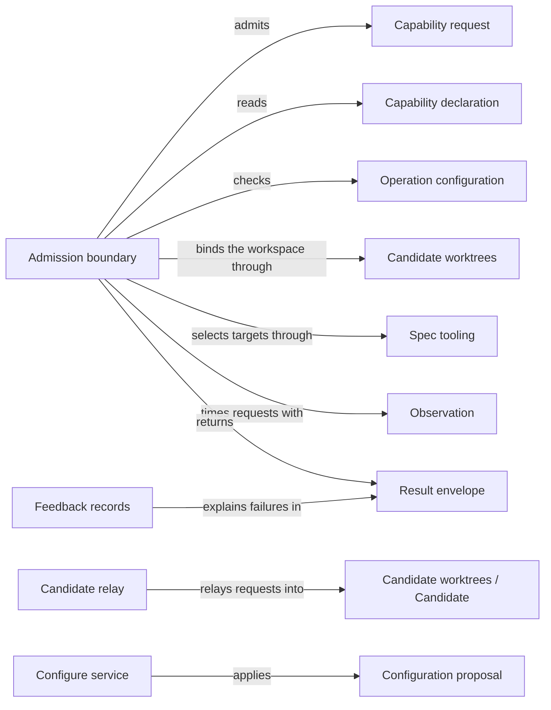

# Request admission

## Purpose

Request admission is the single entry of every Concorde capability request. It checks one request
against the declaration of the capability it names, the stored configuration and the worktree it
was started in, decides where it runs, hands it to the Operations dispatch, and returns one result
envelope that keeps a refusal, a business outcome and an execution failure apart. The user
session's `concorde` tool and any provider that starts another capability rely on it. It also
provides `concorde-configure`. It does not decide what a capability does, knows no provider (only
their declarations), freezes no Agent context and launches no model.

## Terminology

| Term | Definition |
| --- | --- |
| Capability request | One JSON invocation of one capability, naming the capability, a mode, the project configuration and the capability's own typed request. |
| Result envelope | The one JSON result every capability request returns, carrying a status, the workspace used, the capability's typed output and any errors. |
| Capability declaration | The facts a capability states about itself so that admission never has to know it: whether and when it mutates, where it runs, how its target is selected, its default task, how it takes its configuration, its entry point and its request and response types. |
| Operation configuration | The project's stored choice of Agent models, thinking levels and time limits, which every request of a capability that uses stored configuration must match. |
| Configuration proposal | The reviewed change to the stored configuration that `concorde-configure` proposes, bound to the digest of the configuration file it was computed from. |
| Relay | Running an admitted mutating request from the primary worktree through the launcher of a new or recorded candidate, and returning that launcher's result envelope. |
| Causal feedback | A diagnostic record attached to an error that keeps each lower-level cause, its layer and its attempt identity as a failure is reported upward. |
| [Agent](../../agents/module.md#concept.agents.agent) | |
| [Typed value](../../spec/module.md#concept.spec.typed-value) | |
| [Worktree](../worktrees/module.md#concept.worktrees.worktree) | |
| [Primary worktree](../worktrees/module.md#concept.worktrees.primary-worktree) | |
| [Candidate](../worktrees/module.md#concept.worktrees.candidate) | |
| [Change status](../worktrees/module.md#concept.worktrees.change-status) | |
| [Run record](../worktrees/module.md#concept.worktrees.run-record) | |

## Usage

<a id="concept.admission.capability-request"></a>

**Calling a capability.** The launcher takes the capability name as its only argument and one
capability request on standard input; its working directory is the project, which must be a Git
worktree root or a directory outside any Git repository:

```json
{"type_id": "concorde-operation-invocation", "schema_version": 3,
 "operation_id": "concorde-plan", "mode": "execute", "configuration": null,
 "input": {"type_id": "concorde-plan-request", "schema_version": 1,
           "data": {"target_id": "module.checkout", "task": "Add retry limits"}}}
```

`mode` is `execute` or `describe-policy` (describe without running an Agent or changing files); a
`configuration` of `null` means the stored one.

<a id="concept.admission.result-envelope"></a>

**Reading the result.** Standard output receives one result envelope. `status` is `succeeded`,
`blocked`, `failed` or `described` (exit code 0 for the first and last, 3 otherwise); `output` is
the capability's typed response, whose `outcome` gives the business result; `workspace` names the
worktree used; `errors` carry a stable `code`, a `field`, a sanitized `message` and optional causal
feedback. A `blocked` status with outcome `spec_incomplete` (the Spec lacks something) is different
from `failed` with `execution_cancelled`.

<a id="concept.admission.capability-declaration"></a>

**What admission decides from.** The launcher hands admission the Operation catalog; for example
`concorde-plan` declares that it is model-backed, always mutates, runs in a candidate and is bound to
the Module its request names. Admission decides every check from such facts alone; a name the
catalog does not offer is refused with `unknown_operation`.

<a id="concept.admission.relay"></a>

**Where a request runs.** A request that does not mutate runs where it was started, and so does a
mutation started in a candidate. A mutation started in the primary worktree of a consumer project is
relayed: into the live candidate of the `change_id` it names (none is `missing_change`), or into a
new candidate from the committed `HEAD` into which the launcher's installation service installs the
package. The candidate's own launcher runs the same request, and its complete envelope, including
its invocation identity, is the result. The user session never moves and uncommitted primary edits
never reach the change. Concorde's own source checkout refuses a mutation from its primary with
`fresh_session_required`; a mutation outside any Git worktree is refused with `workspace_mismatch`;
`concorde-deliver` runs where it was started. `concorde-configure` and an initialization `apply`
apply in the primary only with `run_in_primary: true`.

<a id="concept.admission.operation-configuration"></a><a id="concept.admission.configuration-proposal"></a>

**Configuring Agents.** The operation configuration (default and per-Agent model, thinking level
and time limit) lives in `.concorde/config.json` and changes only through `concorde-configure` in
two steps. `propose` returns a configuration proposal with its digest and changes nothing; `apply`
writes exactly the proposal whose digest it names, and only if the file still has the digest the
proposal was computed from, else `stale_proposal`. A proposal with `accept_protocol: true` also
rebinds the project to the installed Protocol copy. Every other request whose configuration differs
from the stored one is refused with `configuration_mismatch`; `concorde-init` takes its
configuration from its request.

**Other checks and errors.** A top-level model-backed request needs a fresh build, else
`stale_build`. Every executed request has one run record in the primary. An interrupt ends the request with `execution_cancelled` and keeps the candidate; a
candidate launcher that returns no envelope gives `relay_failed`; a mutation of a change being
delivered gives `delivery_in_progress`. Nothing is retried automatically, and a repeated request
cannot replace a change's recorded task or target. All codes are in
[contracts](contracts.md#error-codes); less common paths are in the [design topic](design.md).

## Design

<a id="realization.admission.boundary"></a>

**One boundary, declarations instead of knowledge.** The admission boundary runs a fixed, finite
sequence (read, admit, bind the workspace, check the configuration and open the run record,
dispatch, finalize); a failed step goes straight to finalization. It accepts no caller-supplied
steps and launches no model. Because admission sits below every provider, what differs between
capabilities comes from their declarations and, where needed, a provider's selection hook, so it
never imports a provider.

Refusals, business outcomes and execution failures stay apart because each needs a different
reaction, and the stored configuration is the only source so that no request can change an Agent's
model or limits.

<a id="realization.admission.configure"></a>

The **configure service** implements `concorde-configure` as a reviewed proposal, so the developer
sees exactly what is written and a file edited meanwhile is never overwritten.

<a id="realization.admission.relay"></a>

The **candidate relay** runs the candidate's own launcher and installation, so the user session
never moves and the change starts from committed history.

<a id="realization.admission.feedback"></a><a id="concept.admission.causal-feedback"></a>

The **feedback records** add each layer as context instead of replacing the lower cause, sanitize
messages and use one format on the Host and Pi sides; feedback never changes a status.

**Not enforced.** Admission cannot tell who started the launcher: an Agent with a shell can call it
like any other caller.

<a id="realization.admission.tests"></a>

The **admission tests** run admission end to end in fixture projects. The [design topic](design.md)
covers the rest, including open questions.

## Relationships



<a id="uses-worktrees"></a>

**Candidate worktrees** identifies the [worktree](../worktrees/module.md#concept.worktrees.worktree)
and [primary worktree](../worktrees/module.md#concept.worktrees.primary-worktree) and creates a
relay's [candidate](../worktrees/module.md#concept.worktrees.candidate); admission checks the owner in
the [change status](../worktrees/module.md#concept.worktrees.change-status) and opens and finishes
every [run record](../worktrees/module.md#concept.worktrees.run-record). An unavailable primary or a
stale write stops the request; a failed final write is reported as `state_persistence_failed`.

<a id="uses-spec"></a>

**Spec tooling** checks every request, configuration and output as a
[typed value](../../spec/module.md#concept.spec.typed-value) and every bound target against the
[registry](../../spec/module.md#concept.spec.registry); a failure stops before any provider runs.
The configure service writes through a
[file transaction](../../spec/module.md#concept.spec.file-transaction) kept only if the project
loads, and changes the [Protocol binding](../../spec/module.md#concept.spec.protocol-binding) only
for an accepted Protocol.

<a id="uses-agents"></a>

**Agents.** A per-Agent configuration override must name an
[Agent](../../agents/module.md#concept.agents.agent); any other key is refused.

<a id="uses-distribution"></a>

**Distribution.** Admission decides build freshness exactly as Distribution's
[build manifest contract](../../distribution/module.md) (`contract.distribution.build-manifest`)
defines it, and refuses a model-backed request with `stale_build` when the manifest is missing,
malformed or stale. The launcher and its installation service also belong to Distribution;
admission relies on no other promise of it.

<a id="uses-observation"></a>

**Observation.** Admission traces each request's steps as
[diagnostic spans](../observation/module.md#concept.observation.diagnostic-span) beside the run
record; a missing trace never changes the envelope.

<a id="participation-declarations"></a>

**Operations, through the capability declaration.** Operations provides the
[capability declaration](contracts.md#contract.admission.capability-declaration) of every capability
in its catalog and the dispatcher that runs a declared entry point; the launcher passes both.
Admission refuses an entry that violates the contract and keeps a provider's error code in the
envelope. It does not use Operations.

<a id="participation-envelopes"></a>

**The Pi session, through the envelopes.** Admission provides the
[capability request](contracts.md#contract.admission.invocation),
[result envelope](contracts.md#contract.admission.result) and
[causal feedback](contracts.md#contract.admission.feedback) contracts to the Pi session's `concorde`
tool, validates every incoming request and emits exactly one result per request.
