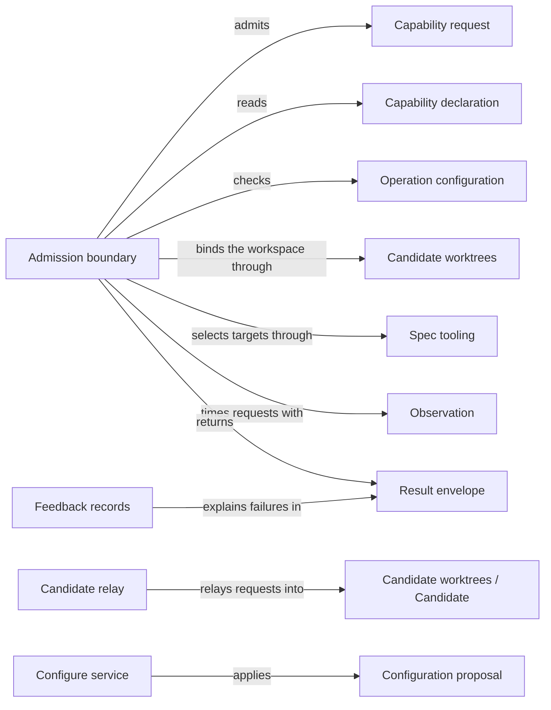

# Request admission

## Purpose

Request admission is the single entry of every Concorde capability request. It reads one request,
checks it against the declaration of the capability it names, the project's stored configuration
and the worktree it was started in, decides where it runs, hands it to the Operations dispatch, and
returns one result envelope that keeps a refusal, a business outcome and an execution failure
apart. The user session's `concorde` tool relies on it, and so does every provider that starts
another capability, so that no capability runs without these checks. It also provides `concorde-configure`, the capability
that changes the stored configuration. It does not decide what a capability does (its provider
does), does not know any provider (it reads only their declarations), does not freeze Agent
context, does not launch models, and does not verify installations other than through the service
the launcher gives it.

## Terminology

| Term | Definition |
| --- | --- |
| Capability request | One JSON invocation of one capability, naming the capability, a mode, the project configuration and the capability's own typed request. |
| Result envelope | The one JSON result every capability request returns, carrying a status, the workspace used, the capability's typed output and any errors. |
| Capability declaration | The facts a capability states about itself so that admission never has to know it: whether and when it mutates, where it runs, how its target is selected, its default task, how it takes its configuration, its entry point and its request and response types. |
| Operation configuration | The project's stored choice of Agent models, thinking levels and time limits, which every request of a capability that uses stored configuration must match. |
| Configuration proposal | The reviewed change to the stored configuration that `concorde-configure` proposes, bound to the digest of the configuration file it was computed from. |
| Relay | Running an admitted mutating request from the primary worktree through the launcher of a new or recorded candidate, and returning that launcher's result envelope. |
| Causal feedback | A diagnostic record attached to an error that keeps each lower-level cause, its layer and its attempt identity as a failure is reported upward. |
| [Developer](../../vocabulary.md#concept.concorde.developer) | |
| [Capability](../../vocabulary.md#concept.concorde.capability) | |
| [User session](../../vocabulary.md#concept.concorde.user-session) | |
| [Host](../../vocabulary.md#concept.concorde.host) | |
| [Agent](../../agents/module.md#concept.agents.agent) | |
| [Typed value](../../spec/module.md#concept.spec.typed-value) | |
| [Worktree](../worktrees/module.md#concept.worktrees.worktree) | |
| [Primary worktree](../worktrees/module.md#concept.worktrees.primary-worktree) | |
| [Candidate](../worktrees/module.md#concept.worktrees.candidate) | |
| [Change status](../worktrees/module.md#concept.worktrees.change-status) | |
| [Run record](../worktrees/module.md#concept.worktrees.run-record) | |

Read capability request, capability declaration and result envelope first: every request is the
first, admitted against the second, and answered by the third.

## Usage

<a id="concept.admission.capability-request"></a>

**Calling a capability.** A capability is run by starting the launcher with the capability name as
its only argument and one capability request on standard input:

```text
python3 scripts/run-operation.py concorde-plan < request.json
```

```json
{"type_id": "concorde-operation-invocation", "schema_version": 3,
 "operation_id": "concorde-plan", "mode": "execute", "configuration": null,
 "input": {"type_id": "concorde-plan-request", "schema_version": 1,
           "data": {"target_id": "module.checkout", "task": "Add retry limits"}}}
```

The Pi `concorde` tool builds exactly this request for the user session. The launcher's working
directory is the project, and it must be the root of a Git worktree or a directory outside any Git
repository. `mode` is `execute` or `describe-policy`; `describe-policy` shows what a capability
would do without running an Agent or changing project files. A `configuration` of `null` means
"use the stored project configuration"; any other value must equal it.

<a id="concept.admission.result-envelope"></a>

**Reading the result.** Standard output receives one result envelope. `status` is `succeeded`,
`blocked`, `failed` or `described`; the exit code is 0 for `succeeded` and `described` and 3
otherwise. `output` is the capability's own typed response, whose `outcome` tells the business
result: a `blocked` status with outcome `spec_incomplete` means the Spec lacks something the step
needs, which is different from a `failed` status with error `execution_cancelled`. `workspace` names
the worktree the request ran in, which is a candidate when the request was relayed. `errors` lists
refusals and failures with a stable `code`, the offending `field` and a sanitized `message`, each
possibly with causal feedback. A `describe-policy` request answers with status `described` and
the provider's description as its output.

<a id="concept.admission.capability-declaration"></a>

**What a capability declares.** Admission knows nothing about `concorde-plan` itself. The launcher
hands it the Operation catalog, and the catalog's entry for `concorde-plan` declares that it is
public and model-backed, takes `concorde-plan-request` and returns `concorde-plan-response`, always
mutates, runs in a candidate, is bound to the Module its request names, has no default task, uses
the stored configuration, and is carried out by the entry point the Operations dispatch resolves.
From those facts alone admission decides every check below. A request for a name the catalog does
not list, or lists as not public, is refused with `unknown_operation`.

**Where a request runs.** A request that does not mutate, such as `concorde-spec-review`, runs
where it was started. A mutating request started in a candidate runs there. A mutating request
started in the primary worktree of a consumer project is relayed:

<a id="concept.admission.relay"></a>

1. If the request names a `change_id`, admission finds the live candidate recorded for that change
   and relays into it; a change no live candidate records is refused with `missing_change`.
2. Otherwise admission asks Candidate worktrees for a new candidate from the committed `HEAD`,
   which registers the change, and asks the launcher's installation service to install the running
   Concorde package into it.
3. It runs the same request through the candidate's own launcher, with the candidate's change
   identity filled in when the request type carries one, and returns that launcher's complete
   envelope, including the candidate's own invocation identity, as this request's result. The
   candidate's standard error is forwarded.

The user session never moves, and uncommitted primary edits never reach the change. A later request
from the primary that names the returned `change_id` continues in the same candidate.

Three exceptions apply. In Concorde's own source checkout a mutating request from the primary is
refused with `fresh_session_required`, because source maintenance runs in a candidate that the user
session hands to a fresh Task subagent. A mutating request started outside any Git worktree is
refused with `workspace_mismatch`, because there is no committed state to start a candidate from
and no primary to keep records in. And `concorde-deliver` declares the delivery session as its
workspace: it runs where it was started, never in a new candidate, and Delivery itself checks that
this worktree takes part in the change.

**Configuring or initializing the primary directly.** `concorde-configure` and an initialization
`apply` declare that they may run in the primary on explicit request. Without that request they are
relayed like any other mutation, so their effect reaches the primary only when the change is
delivered. A developer who wants the effect now sets `run_in_primary: true`; admission then applies
the request in the primary worktree without creating a candidate or registering a change. A
request that sets it outside the primary worktree is refused with `workspace_mismatch`, and every
other capability refuses the field as unknown. The source checkout still refuses it with
`fresh_session_required`. Because the choice changes where the effect lands, the user session asks
the developer which one they want before calling either capability from the primary.

<a id="concept.admission.operation-configuration"></a><a id="concept.admission.configuration-proposal"></a>

**Configuring Agents.** The operation configuration lives under `operation_configuration` in
`.concorde/config.json`: an optional default model (`provider/id`), thinking level and time limit,
and optional per-Agent overrides. It is changed only through `concorde-configure`, in two steps:

```json
{"action": "propose",
 "configuration": {"type_id": "concorde-operation-configuration", "schema_version": 2,
                   "data": {"model": "openai-codex/gpt-6-astra", "thinking": "medium"}},
 "accept_protocol": false}
```

The proposal step changes nothing. It returns a configuration proposal holding the new value and
the digest of the current configuration file, and the proposal's own digest. The developer reviews
it, and the user session then sends `{"action": "apply", "proposal": ..., "proposal_digest": ...}`.
The apply step accepts only the exact proposal whose digest it names, and only if the configuration
file still has the digest the proposal was computed from; otherwise nothing is written and the
developer asks for a fresh proposal. A proposal made with `accept_protocol: true` also rebinds the
project to the Protocol copy the installer placed under `.concorde/protocol/`; it is the only way a
project adopts a new Protocol. Applying keeps every other key of the file and keeps the write only
if the project still loads. Because a relayed apply compares against the candidate's committed
file, a proposal computed from uncommitted configuration in the primary can only be applied with
`run_in_primary: true`.

Every other capability that uses the stored configuration is refused with
`configuration_mismatch` when the request's configuration differs from it or none is stored.
`concorde-init` declares that it takes its configuration from its own request instead, because an
uninitialized project has none stored yet.

**Fresh builds.** A top-level request of a model-backed capability is refused with `stale_build`
when the Concorde build is not fresh, because an Agent would otherwise run with instructions that
do not match their sources. Deterministic capabilities, such as `concorde-validate`,
`concorde-configure`, `concorde-init` and `concorde-deliver`, read no rendered instructions and
skip this check.

**Records of what ran.** Every executed request, relayed or not, has one run record in the primary
worktree, opened before the provider runs and finished with the result envelope. A relaying
request's record names the candidate's run, so the two can be followed from either side. A
`describe-policy` request and a request refused before admission leave no run record.

**Errors, interruption and repeats.** Every refusal ends in an envelope, never an unhandled
exception. An interrupt (Ctrl-C, or SIGTERM from the developer's client) ends the request with
`execution_cancelled` and keeps the candidate; a relayed launcher is given thirty seconds to cancel
its own work before it is killed, and a relayed launcher that returns no envelope fails the request
with `relay_failed`. A mutating request for a change that is being delivered is refused with
`delivery_in_progress`. Repeating a request is safe: a request with a `change_id` continues the
recorded change and cannot replace its recorded task or target, and nothing is retried
automatically. The complete list of codes is in [contracts](contracts.md#error-codes).

## Design

<a id="realization.admission.boundary"></a>

**One boundary, a fixed sequence.** Every capability, deterministic or model-backed, passes the
same finite steps in the same order: read the request; admit it (known public capability, known
mode, fresh build when model-backed, worktree root, typed configuration and request, default task,
selected target and restored change owner); bind the workspace; check the configuration and open a
run record; dispatch; finalize. A failed step skips the rest and goes straight to finalization. The
sequence is plain code, not a scheduler: it accepts no caller-supplied steps and launches no model.
Model work is only prepared behind it; the Host steps of a running Agent call are checked by Agent
execution against the call it prepared, not re-admitted.

**Declarations instead of knowledge.** Admission is below every provider: it must not import
Planning, Delivery or Issue solving to learn that one capability mutates only on `apply`, another
runs in a delivery session and a third selects an Issue before choosing its worktree. Each
capability therefore declares those facts in the contract Admission defines, the Operations catalog
provides the declarations, and a provider that needs its own target selection names a hook in its
declaration. Admission hands the admitted request to the dispatcher the launcher supplies, which
resolves the declared entry point. Adding a capability then changes the catalog and its provider,
never admission.

**Refusal, outcome and failure stay apart.** A caller must be able to tell "you asked for something
invalid" from "the Spec is incomplete" from "the Agent crashed", because each needs a different
reaction. Admission refusals keep their error code and give status `blocked`. A provider's output
decides the status by its outcome: `completed`, `ready` and `delivered` succeed, `failed` fails,
anything else blocks. Execution failures give status `failed` with `execution_failed`,
`execution_cancelled` or `execution_limit`, and are recorded as the change's lifecycle status. A
failed status or run record write is reported beside the output, never instead of it.

**Stored configuration as the only source.** Requiring every request to equal the stored
configuration means an Agent's model and limits cannot be changed by whoever writes a request, and
a nested capability request cannot run with different settings from the request that started it.

<a id="realization.admission.configure"></a>

**Configuration changes are proposals.** A configuration change decides which models run and how
long they may take, so the developer should see exactly what will be written. The proposal fixes
the value and the file it applies to; its digest lets the apply step refuse anything but the
reviewed proposal; the source digest lets it refuse a file that changed meanwhile, instead of
silently overwriting someone else's edit. The configure service lives in `operations/configure.py`
and `src/concorde/harness/configure.py`, which takes over the configure step that the project
service of Spec tooling still performs.

<a id="realization.admission.relay"></a>

**Relay keeps the primary clean.** Relaying rather than switching directories means the user
session never moves, uncommitted primary edits never leak into a change, and the candidate runs its
own code and installation. Only candidate creation installs; a later relay only verifies. The
relayed envelope is adopted whole, including the candidate's invocation identity, so the caller
can find the candidate's run record, and the relaying request's own run record links to it.
Installation belongs to Distribution: the launcher gives admission an installation service, and
admission treats its refusal as `local_installation_required`, keeping the new candidate with status
`blocked` so that the developer can install and retry the same change.

<a id="concept.admission.causal-feedback"></a><a id="realization.admission.feedback"></a>

**Failures keep their causes.** Each error entry may carry causal feedback: the lower-level code,
message, layer and attempt identity, with the causes below it. Upper layers add context as causes
instead of replacing the original, so a native schema rejection is still visible behind a Host
refusal behind a Workflow failure. Messages are sanitized: argument values and model output are
removed and credential-like values are redacted. When a record is too large for Pi's display, the
full sanitized record is exported to a private temporary file and the display names that file.
Feedback is diagnostic only; it never changes a status, accepts a result or permits a retry. The
same record format is produced on the Pi side, so a failure keeps one shape across processes.

**What admission does not enforce.** Admission cannot tell who started the launcher. An Agent that
has a shell, such as the programmer, can run `scripts/run-operation.py` itself, and admission
treats that request like any other; this is not enforced. The code still checks an environment
variable meant to mark Agent processes, which nothing sets; that check is removed. Admission also
does not enforce anything inside a running Agent: see the Harness entry.

**Current code that moves.** `admission.py` still imports Delivery, Issues and the Operations
dispatch, hardcodes which capabilities mutate and verifies the local installation itself, and
`entry.py` still loads the Pi session selection; each of these is replaced by the declarations,
the launcher-supplied dispatcher and installation service, and provenance passed in by the
launcher.

<a id="realization.admission.tests"></a>

The tests of this Module run admission end to end in fixture projects: deterministic capabilities
without a model, request refusals, candidate installation during relay, configuration and causal
feedback through the native and Host boundaries.

**Open questions.** What `describe-policy` shows for each model-backed capability is decided by its
provider; admission promises only that nothing runs and nothing changes. The error code vocabulary
is listed here because every code can reach a caller through the envelope, but each code is owned by
the Module where it arises.

## Relationships



The **admission boundary** is the entry and the admission sequence. The **candidate relay** finds
or creates the candidate and runs its launcher. The **configure service** implements
`concorde-configure`. The **feedback records** are the causal feedback format, in Python for the
Host and in JavaScript for the Pi side.

<a id="uses-worktrees"></a>

**Candidate worktrees.** Binding the workspace uses [Candidate worktrees](../worktrees/module.md):
the [worktree](../worktrees/module.md#concept.worktrees.worktree) identity of the entry directory,
the [primary worktree](../worktrees/module.md#concept.worktrees.primary-worktree), creation of a
[candidate](../worktrees/module.md#concept.worktrees.candidate) for a relay, and the
[change status](../worktrees/module.md#concept.worktrees.change-status) whose recorded owner a
repeated request must match and whose lifecycle position records execution failures. Every executed
request opens and finishes a [run record](../worktrees/module.md#concept.worktrees.run-record)
there. When the primary is unavailable or a status write is stale, the request stops with that
error rather than running without a record; a failed final write is reported as
`state_persistence_failed` beside the output.

<a id="uses-spec"></a>

**Spec tooling.** Every request, configuration, proposal and output is a
[typed value](../../spec/module.md#concept.spec.typed-value) checked against its registered type, so
a malformed value stops with a typed error naming the field and no default replaces it. A capability
bound to a Module has its target and focus checked against the
[registry](../../spec/module.md#concept.spec.registry); an unknown target stops before any provider
runs. The configure service writes `.concorde/config.json` through a
[file transaction](../../spec/module.md#concept.spec.file-transaction) that keeps the write only if
the project still loads, and rebinds the [Protocol binding](../../spec/module.md#concept.spec.protocol-binding)
only when a proposal accepted the installed Protocol.

<a id="uses-agents"></a>

**Agents.** A per-Agent override in the operation configuration must name an
[Agent](../../agents/module.md#concept.agents.agent); any other key is refused when the
configuration is admitted or proposed.

<a id="uses-distribution"></a>

**Distribution.** The freshness check of model-backed requests reads the build manifest and
decides freshness exactly as Distribution's [build manifest contract](../../distribution/module.md)
(`contract.distribution.build-manifest`) defines it. A missing, malformed or stale manifest refuses
the request with `stale_build` before any provider runs. The launcher and the installation service
it supplies also belong to Distribution; admission relies on no other promise of it.

<a id="uses-observation"></a>

**Observation.** Admission opens one trace per request and marks its steps as
[diagnostic spans](../observation/module.md#concept.observation.diagnostic-span); its sink writes
the trace next to the request's run record. A missing or failed trace never changes the envelope.

<a id="participation-declarations"></a>

**Operations, through the capability declaration.** Admission uses no provider and does not use
the Operations Module. Operations provides the
[capability declaration](contracts.md#contract.admission.capability-declaration) of every
capability in its catalog and the dispatcher that resolves a declared entry point; the launcher
passes both to admission. Admission requires the declarations to satisfy the contract and refuses a
catalog entry that does not; it relies on the dispatcher to run exactly the declared entry point
and return the declared response type. A provider error keeps its own code in the envelope.

<a id="participation-envelopes"></a>

**The Pi session, through the envelopes.** Admission provides the
[capability request](contracts.md#contract.admission.invocation) and
[result envelope](contracts.md#contract.admission.result) contracts to the Pi session's `concorde`
tool, which builds requests and reads envelopes, and the
[causal feedback](contracts.md#contract.admission.feedback) record it displays. Admission validates
every incoming request against the request contract before admission and emits exactly one result
per request.
