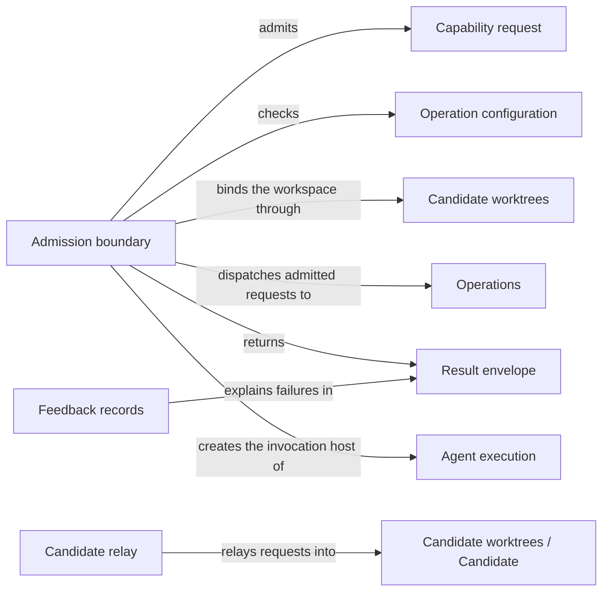

# Request admission

## Purpose

Request admission is the single entry of every public Concorde capability. It reads one request,
checks it against its declared type, the project's stored configuration and the worktree it was
started in, decides where it runs, hands it to the Operations dispatch, and returns one result
envelope that keeps a refusal, a business outcome and an execution failure apart. The user session,
through the Pi `concorde` tool, and every native preparation step rely on it so that no capability
runs without these checks. It does not decide what a capability does (that belongs to its
provider under Operations), does not freeze worker context and does not launch models.

## Terminology

| Term | Definition |
| --- | --- |
| Capability request | One JSON invocation of one public capability, naming the capability, a mode, the project configuration and the capability's own typed request. |
| Result envelope | The one JSON result every capability request returns, carrying a status, the workspace used, the capability's typed output and any errors. |
| Operation configuration | The project's stored choice of worker models, thinking levels and time limits, which every request must match. |
| Relay | Running an admitted mutating request from the primary worktree through the launcher of a new or recorded candidate, and adopting that launcher's result envelope. |
| Causal feedback | A diagnostic record attached to an error that keeps each lower-level cause, its layer and its attempt identity as a failure is reported upward. |
| [Capability](../../vocabulary.md#concept.concorde.capability) | |
| [User session](../../vocabulary.md#concept.concorde.user-session) | |
| [Host](../../vocabulary.md#concept.concorde.host) | |
| [Worker](../../vocabulary.md#concept.concorde.worker) | |
| [Task subagent](../../vocabulary.md#concept.concorde.task-subagent) | |
| [Operation](../../operations/module.md#concept.operations.operation) | |
| [Typed value](../../spec/module.md#concept.spec.typed-value) | |
| [Candidate](../worktrees/module.md#concept.worktrees.candidate) | |
| [Primary worktree](../worktrees/module.md#concept.worktrees.primary-worktree) | |
| [Change status](../worktrees/module.md#concept.worktrees.change-status) | |
| [Run record](../worktrees/module.md#concept.worktrees.run-record) | |

## Usage

<a id="concept.admission.capability-request"></a>

**Calling a capability.** A capability is run by starting the launcher with the capability name as
its only argument and one capability request on standard input:

```text
python3 scripts/run-operation.py concorde-plan < request.json
```

```json
{"type_id": "concorde-operation-invocation", "schema_version": 3,
 "operation_id": "concorde-plan", "mode": "execute", "configuration": null,
 "input": {"type_id": "concorde-plan-request", "schema_version": 1,
           "data": {"target_id": "module.checkout", "task": "Add retry limits"}}}
```

The Pi `concorde` tool builds exactly this request for the user session. The launcher's working
directory is the project: it must be the root of a Git worktree or a directory outside any Git
repository. `mode` is `execute` or `describe-policy`; `describe-policy` shows what a capability
would do without running a worker or changing project files. A `configuration` of `null` means
"use the stored project configuration"; any other value must equal it.

<a id="concept.admission.result-envelope"></a>

**Reading the result.** Standard output receives one result envelope. `status` is `succeeded`,
`blocked`, `failed` or `described`; the exit code is 0 for `succeeded` and `described` and 3
otherwise. `output` is the capability's own typed response, whose `outcome` tells the business
result: a `blocked` status with outcome `spec_incomplete` means the Spec lacks something the step
needs, which is different from a `failed` status with error `execution_cancelled`. `workspace` names
the worktree the request ran in, which is a new candidate when the request was relayed. `errors`
lists refusals and failures with a stable `code`, the offending `field` and a sanitized `message`.
Standard error receives the policy descriptions of `describe-policy` and a usage summary.

For example, a `concorde-plan` request from the primary worktree of a consumer project returns
`succeeded`, an output with outcome `completed`, and a `workspace` naming a new candidate and its
change ID. Repeating the request with that `change_id` continues in the same candidate.

<a id="concept.admission.relay"></a>

**Where a request runs.** Read-only capabilities (`concorde-context-solve`,
`concorde-spec-review`, `concorde-code-review`, Issue bookkeeping and an initialization proposal)
run where they are started. A mutating capability started in a candidate runs there and registers
the change if needed. A mutating capability started in the primary worktree of a consumer project
is relayed, unless the embedding host explicitly allows mutation of the primary: the host creates a
candidate from the committed `HEAD`, installs this worktree's Concorde package into it, runs the
same request through the candidate's own launcher and returns that launcher's envelope. The user
session stays in the primary. In Concorde's own source checkout a mutating request from the primary
is refused with `fresh_session_required`, because source maintenance runs in a candidate assigned
by the user session to a fresh Task subagent.
`concorde-deliver` runs only in the change's candidate or primary, as Delivery decides.

**Configuring the primary directly.** `concorde-configure` and an initialization `apply` are
relayed like any other mutation, so their effect reaches the primary only when the change is
delivered. That is what a developer wants when changing or testing these commands. A developer who
simply wants to configure or initialize the project now sets `run_in_primary: true` in the request;
the host then applies it in the primary worktree without creating a candidate or registering a
change. The field exists only in these two requests, so every other capability refuses it as an
unknown field, and a request that sets it outside the primary worktree is refused with
`workspace_mismatch`. The Concorde source checkout still refuses it with `fresh_session_required`.
Because the choice changes where the effect lands, the user session asks the developer which one
they want before calling either capability from the primary.

**Installed projects.** In a consumer project the launcher, its Python environment and LangGraph
must all belong to that worktree's own installation. A missing, stale or foreign installation stops
with `local_installation_required`; the developer runs the installer for that worktree and retries.
Nothing falls back to the primary's or a global installation.

<a id="concept.admission.operation-configuration"></a>

**Configuration.** The operation configuration lives under `operation_configuration` in
`.concorde/config.json`: an optional default model (`provider/id`), thinking level and timeout, and
optional per-worker overrides. It is changed only through `concorde-configure`, which proposes a
change bound to the current file digest and applies it only if the file has not changed since. A
request whose configuration differs from the stored one stops with `configuration_mismatch`.

**Errors and interruption.** Every refusal ends in an envelope, never an unhandled exception. An
interrupt (Ctrl-C, or SIGTERM from the developer's client) ends the request with
`execution_cancelled` and keeps the candidate. A relayed launcher is given thirty seconds to cancel
its own work before it is killed. A process running as a worker cannot call a capability at all:
it is refused with `permission_denied`.

## Design

<a id="realization.admission.boundary"></a>

**One boundary, a fixed sequence.** Every public capability, deterministic or model-backed, passes
the same finite steps in the same order: read the request; admit it (known capability, known mode,
local installation, fresh build for model-backed capabilities, worktree root, typed configuration
and request, restored change owner, selectable target); bind the workspace; check the configuration
and open a run record; dispatch; finalize. A failed step skips the rest and goes straight to
finalization. The sequence is plain code, not a scheduler: it accepts no caller-supplied steps and
launches no model. Model-backed capabilities are only prepared behind it; running the worker and
accepting its result belong to [Agent execution](../execution/module.md), which calls back into
this same boundary for every Host step.

**Refusal, outcome and failure stay apart.** A caller must be able to tell "you asked for something
invalid" from "the Spec is incomplete" from "the worker crashed", because each needs a different
reaction. Admission refusals keep the provider's error code and give status `blocked`. A provider's
output decides the status by its outcome: `completed`, `ready` and `delivered` succeed, `failed`
fails, anything else blocks. Execution failures give status `failed` with `execution_failed`,
`execution_cancelled` or `execution_limit`, and are recorded as the change's lifecycle status.
A failed status write is reported beside the output, never instead of it.

**Stored configuration as the only source.** Requiring every request to equal the stored
configuration means a worker's model and limits cannot be changed by whoever writes the request,
and a nested step cannot run with different settings from its parent.

<a id="realization.admission.relay"></a>

**Relay keeps the primary clean.** Relaying rather than switching directories means the user
session never moves, uncommitted primary edits never leak into a change, and the candidate runs
its own code and installation. Only candidate creation may install; a later relay only verifies.
The relayed launcher's complete envelope becomes this request's result, and its standard error is
forwarded. A launcher that returns no envelope fails with `relay_failed`.

<a id="concept.admission.causal-feedback"></a><a id="realization.admission.feedback"></a>

**Failures keep their causes.** Each error entry may carry causal feedback: the lower-level code,
message, layer and attempt identity, with the causes below it. Upper layers add context as causes
instead of replacing the original, so a native schema rejection is still visible behind a Host
refusal behind a workflow failure. Messages are sanitized: argument values and model output are
removed and credential-like values are redacted. When a record is too large for Pi's display, the
full sanitized record is exported to a private temporary file and the display names that file.
Feedback is diagnostic only; it never changes a status, accepts a result or permits a retry.

<a id="realization.admission.tests"></a>

The tests of this Module run the launcher and the Host services end to end in fixture projects:
envelope and request refusals, deterministic capabilities without LangGraph, local installation
admission, and causal feedback through the native and finite boundaries.

**Open questions.** What `describe-policy` shows for each model-backed capability is decided by its
provider and native preparation; this Module promises only that nothing runs and nothing changes.
The error code vocabulary is shared by all providers and is not owned by one document.

## Relationships



The **admission boundary** is the launcher entry and the admission sequence. The **candidate
relay** creates or finds the candidate and runs its launcher. The **feedback records** are the
causal feedback format, in Python for the Host and in JavaScript for the Pi side.

<a id="uses-operations"></a>

**Operations.** After admission the request goes to the [Operations](../../operations/module.md)
dispatch, which knows the public [Operation](../../operations/module.md#concept.operations.operation)
catalog, binds the target Module and runs the owning provider. Admission refuses an unknown
capability name with `unknown_operation` before dispatch, and adopts the provider's typed output,
or a relayed envelope, as the result. A provider error keeps its own code in the envelope.

<a id="uses-worktrees"></a>

**Candidate worktrees.** Binding the workspace uses [Candidate worktrees](../worktrees/module.md):
the [worktree](../worktrees/module.md#concept.worktrees.worktree) identity of the entry directory,
the [primary worktree](../worktrees/module.md#concept.worktrees.primary-worktree), creation of a
[candidate](../worktrees/module.md#concept.worktrees.candidate) for a relay, and the
[change status](../worktrees/module.md#concept.worktrees.change-status) whose recorded owner a
repeated request must match. Every executed request opens and finishes a
[run record](../worktrees/module.md#concept.worktrees.run-record) in the primary. When the primary
is unavailable or a status write is stale, the request stops with that error rather than running
without a record.

<a id="uses-spec"></a>

**Spec.** Admission uses the [Spec](../../spec/module.md) Module's typed value checks for the
configuration and every request, its safe-path rules, and its registry to select the request's
target Module. A malformed value stops with a typed error naming the field; an unknown target stops
before any provider runs.

<a id="uses-distribution"></a>

**Distribution.** Admission relies on [Distribution](../../distribution/module.md) to tell whether
the build is fresh, to verify an installed worktree's local installation, and to install the
invoking package into a new consumer candidate. Deterministic capabilities (`concorde-init`,
`concorde-configure`, `concorde-validate`, `concorde-deliver`) read no rendered worker
instructions and skip the build check; every other top-level request is refused with `stale_build`
when the build is stale.

<a id="uses-issues"></a>

**Issues.** For `concorde-issues`, admission lets [Issues](../../issues/module.md#concept.issues.issue)
select and bind the requested Issue before the workspace is chosen, so that solving an Issue can be
relayed into a candidate with its selection, while list, show, report and reopen stay bookkeeping
in the current worktree.

<a id="uses-delivery"></a>

**Delivery.** For `concorde-deliver`, admission asks [Delivery](../../delivery/module.md) whether the
current session is a participant of the change and uses the worktree it names; delivery never
creates a candidate.

<a id="uses-execution"></a>

**Agent execution.** Admission creates the invocation Host object that [Agent
execution](../execution/module.md) defines, which carries the project and package roots, the mode
and the trusted services of one request, and it maps Agent execution's failure outcomes
(cancelled, time limit, failed) to envelope errors and lifecycle status. Admission records timing
spans through Agent execution's diagnostics; they never change an outcome.
