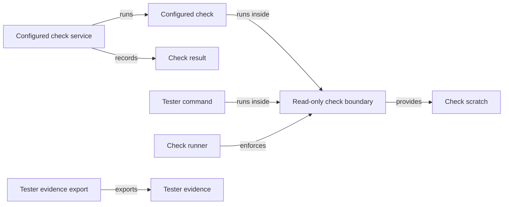
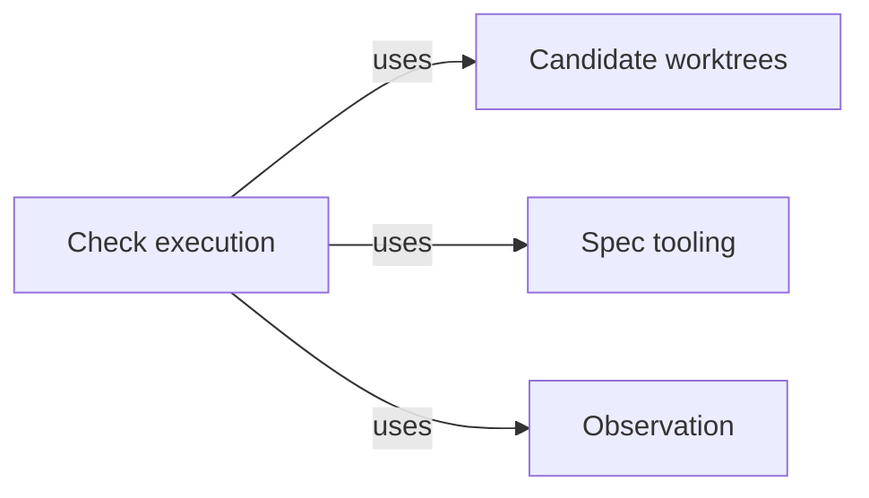

# Check execution

## Purpose

Check execution runs deterministic commands, such as a project's test suite or linter, so that
they can read the project but cannot change its files. It serves three callers: Validation, which
runs a Module's configured checks when it validates a candidate and when Delivery re-runs its
completion check; Agent execution, whose `run_checks` tool lets a programmer or code reviewer see
the same checks; and the tester Task subagent of the Pi session, whose `test_command` tool runs its
test commands here. Every run gets a fresh writable scratch directory outside the project, its whole
process tree is ended before the result returns, a configured check's outcome becomes a check result
record bound to what it measured, and a tester command's output and selected reports are exported
as evidence to the primary worktree. It is the only place in the Harness where the operating system
enforces a boundary on work that Concorde starts. That boundary restricts file writes only. It is
deliberately not a read, network, host-socket or credential policy, and Check execution never
decides whether a passing check means the code is correct.

## Terminology

| Term | Definition |
| --- | --- |
| Configured check | A command that the project configuration assigns to one Module, with its arguments, time limit and the input paths its result depends on. |
| Check result | The record of one configured check run: the check, its Module, the status, the exit code, the digest of what was measured and the digest of the saved log. |
| Read-only check boundary | The Linux sandbox in which a check or tester command runs: the whole host filesystem read-only, one fresh writable scratch directory, private process and IPC namespaces, and the host's network. |
| Check scratch | The fresh directory outside the project that one run may write, holding its temporary files, caches and reports, removed after the run. |
| Tester command | One shell command a tester Task subagent runs through the `test_command` tool inside the read-only check boundary. |
| Tester evidence | The manifest, bounded output and selected report files that the Host exports to the primary worktree after a tester command. |
| [Host](../../vocabulary.md#concept.concorde.host) | |
| [Evidence](../../vocabulary.md#concept.concorde.evidence) | |
| [Task subagent](../../vocabulary.md#concept.concorde.task-subagent) | |
| [Module](../../vocabulary.md#concept.concorde.module) | |
| [Primary worktree](../worktrees/module.md#concept.worktrees.primary-worktree) | |
| [Run record](../worktrees/module.md#concept.worktrees.run-record) | |

Configured checks and tester commands are the two kinds of work that run here; the read-only check
boundary and its scratch are what they run inside; check results and tester evidence are what each
leaves behind.

## Usage

### Configured checks and their results

<a id="concept.checks.configured-check"></a><a id="concept.checks.check-result"></a>

A **configured check** is declared in the project configuration, `.concorde/config.json`, under
`checks`. Concorde's own Graph Spec check, for example, is:

```json
{"id": "check.harness.graph-specs", "module": "module.harness.execution",
 "argv": ["{python}", "scripts/development/check-graph-specs.py",
          "--catalog", "concorde.operations.graph_catalog:catalog"],
 "timeout_seconds": 120,
 "inputs": ["scripts", "src/concorde", "agents", "operations", "specs/concorde"]}
```

`{python}` is replaced by the Host's own interpreter. When the Host is asked to run a Module's
checks, it first computes a digest of what they measure: the Module's implementation files, the
check definitions, every file under their `inputs` and the boundary's policy name. It then runs
every check of that Module in order inside the boundary, saves each check's combined output as a
log in the primary worktree's run directory, and returns one **check result** per check: `passed`,
`failed` or `timeout`, the exit code, the measured digest and the log's digest. Finally it computes
the measured digest again; if it changed, the whole run fails with `stale_evidence`, because a check
that altered its own input proves nothing about it. Validation stores these results as its
evidence and later compares the recorded measured digest with a fresh one, so a check result stays
valid only while its inputs are unchanged. An Agent calling `run_checks` receives each result with
the last 20,000 bytes of its log.

### Tester commands

<a id="concept.checks.tester-command"></a><a id="concept.checks.tester-evidence"></a>

A tester Task subagent has no `bash`, `edit` or `write`. The Pi session gives it the `test_command`
tool, whose bridge hands each **tester command** to this Module:

```json
{"command": "python -m pytest -q tests/unit", "timeout": 600, "reports": ["junit.xml"]}
```

The command runs with `bash -c` in the tester's worktree inside the read-only check boundary, with
a private `/tmp`. Report names select files the command wrote below `$CONCORDE_CHECK_REPORT_DIR`.
After every process of the run has ended and before the scratch is removed, the Host exports the
**tester evidence** under `.concorde/runs/tester-<id>/` in the primary worktree: a manifest with the
command's digest (not its text), the worktree's branch, commit and dirty state, the runtime and
selection digests, the exit status and each exported artifact with its digest and size. The tool
returns the last 20,000 bytes of each output stream, the manifest's path and digest, and whether the
export is complete. A nonzero exit is still a failed command even when its evidence is complete, and
an incomplete export fails the tool even when the command succeeded.

### Writing a check that works in the boundary

<a id="concept.checks.read-only-boundary"></a><a id="concept.checks.scratch"></a>

Inside the **read-only check boundary**, any attempt to create, change, rename or delete a file
fails at the system call, including a write that would later be undone. A check that needs to write
uses its **check scratch**: `TMPDIR`, `TMP`, `TEMP`, `XDG_CACHE_HOME` and `npm_config_cache` point
into it, `CONCORDE_CHECK_TMPDIR` names its root and `CONCORDE_CHECK_REPORT_DIR` its reports
directory. A tool that hard-codes a cache or report path in the project fails and must be pointed at
the scratch; a tool that rewrites sources, such as a formatter in fix mode, is implementation work
and does not belong in a check.

A tester command additionally gets a private `/tmp` backed by its scratch, and sees the host's
existing `/tmp` read-only at `$CONCORDE_TEST_HOST_TMP`. Paths of the project and its runtime that lie
under `/tmp` stay visible, read-only, at their own names.

### When the boundary is unavailable, and repeat runs

Only Linux is supported, with a root-owned system bubblewrap, user, mount, PID and IPC namespaces and
kernel process file descriptors. If any of these is missing, or the project lies at `/` or under
`/proc`, `/dev` or `/sys`, the run is refused and the command does not start. There is no fallback
to an ordinary subprocess. For configured checks the refusal is reported as
`check_sandbox_unavailable`, with the diagnostics in the check's log.

Running the same checks again starts from nothing: a new scratch, a new measurement and new logs
under the new invocation. A cancelled tester command still ends every process and exports what it
observed, marked cancelled.

## Design

### Why a read-only filesystem, and nothing more

Checks produce evidence that a candidate is ready. That evidence is only useful if the check could
not have changed what it measured, so the one guarantee that matters is that files cannot change.
The boundary delivers exactly that and states plainly what it leaves out:

| Concern | Enforced |
| --- | --- |
| Writing any host file outside the scratch, through any path name, hard link, inherited descriptor or nested namespace | Yes, by the kernel |
| Descendant processes outliving the run | Yes: the Host ends the whole process tree |
| Reading files the developer's user can read | Not enforced |
| Network access | Not enforced: the network namespace is shared with the host |
| Host sockets: abstract Unix sockets and filesystem sockets such as an SSH agent or a container daemon | Not enforced: a read-only mount does not stop connecting to a socket, so a command could ask a host service to act, including changing the project |
| Environment and credentials | Not enforced: the command receives the caller's environment, including any credentials in it |

These omissions are deliberate. Configured checks are commands the project itself chose. Tester
commands are written by a model, so a tester's only way to run anything is this boundary: it can
read and send out whatever the user can, but it cannot write the project it is testing.

<a id="realization.checks.runner"></a>

The **check runner** mounts the whole host filesystem read-only, recursively, so no other path,
hard link or dependency directory can serve as a writable alias. It gives fresh `/proc` and `/dev`,
drops capabilities, disconnects the terminal and makes only the scratch writable. The command starts
stopped until the Host holds a process file descriptor for the sandbox's first process, so the Host
can always end the whole process tree: on success, failure, timeout and cancellation it terminates
every descendant, including ones that detached or started new sessions, before it removes the
scratch. Output is drained from both pipes while the command runs, so a large or background writer
cannot block completion.

### Why configured checks measure twice

<a id="realization.checks.configured-checks"></a>

The **configured check service** measures before and after because the boundary cannot stop a
process outside it, or a host service a check talked to, from changing the project during the run.
Comparing the two digests turns that race into a stale result instead of false evidence. The check
result is owned here, next to the runner that produces it, so Validation and Delivery consume one
record and never run checks another way. Logs are kept only in the primary worktree's run
directory; a check's output never enters an Agent's context except as the bounded tail `run_checks`
returns.

### Why tester evidence is exported by the Host

<a id="realization.checks.tester-evidence"></a>

A tester's scratch disappears when its command ends, and the tester itself cannot write the primary
worktree. The **tester evidence export** therefore runs inside the Host after the sandboxed
processes have ended and before scratch removal. It opens only regular files with one link, through
non-symlink paths under the reports directory, bounds each report and the total, and records every
truncation and error in the manifest. Output and reports are the command's own data: the Host does
not filter secrets from them, so a command must not print any. The `test_command` tool, its bridge
and the selection check that precedes every command belong to the Pi session; this Module starts
where the bridge hands over a command.

<a id="realization.checks.tests"></a>

The **check tests** exercise the boundary with real sandboxed processes where the platform allows
and refuse otherwise; they show what the boundary blocks, not that a project's checks are adequate.

### Open questions

- Whether an Agent needs more than the last 20,000 bytes of each check's log is undecided.

## Relationships





Validation, Agent execution and the Pi session use this Module; it knows none of them. Validation
relies on the [check result](#concept.checks.check-result) and the stale-measurement rule, Agent
execution offers `run_checks` only to Agents whose definitions list it, and the Pi session's bridge
hands tester commands over after verifying its own selection.

<a id="uses-worktrees"></a>

**Candidate worktrees** locates the
[primary worktree](../worktrees/module.md#concept.worktrees.primary-worktree) and writes into its run
directory atomically under the repository lock. Check logs and tester evidence are written there as
part of the invocation's [run record](../worktrees/module.md#concept.worktrees.run-record). When no
primary worktree can be found, tester export fails rather than writing anywhere else, and a
configured check run fails when it cannot save its log there.

<a id="uses-spec"></a>

**Spec tooling** loads the [registry](../../spec/module.md#concept.spec.registry), from which this
Module resolves the selected Module's `ImplementationScope`, one of the
[boundary sets](../../spec/module.md#concept.spec.boundary-set), whose digest is part of what a
configured check measures. It also supplies the safe relative-path rules used for check inputs and
report names. An invalid or unreadable input path fails the run before any command.

<a id="uses-observation"></a>

**Observation** records a [diagnostic span](../observation/module.md#concept.observation.diagnostic-span)
around sandbox preparation and each command. Recording a span never changes a run's result.
