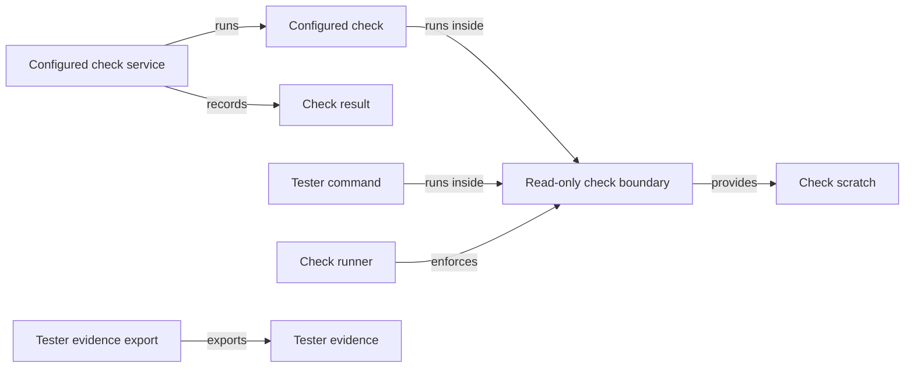
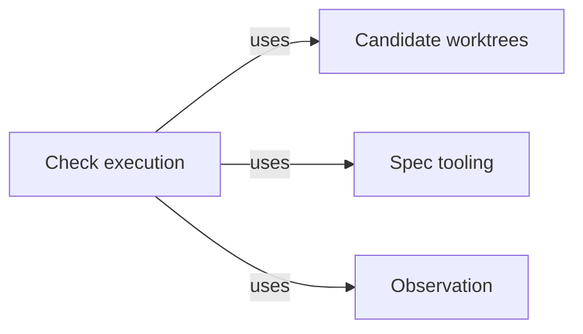

# Check execution

## Purpose

Check execution runs deterministic commands, such as a project's test suite or linter, so that
they can read the project but cannot change its files. It serves three callers: Validation, which
runs a Module's configured checks when it validates a candidate and when Delivery re-runs its
completion check; Agent execution, whose `run_checks` tool lets a programmer or code reviewer see
the same checks; and the tester Task subagent of the Pi session, whose `test_command` tool runs its
test commands here. Every run gets a fresh writable scratch directory outside the project, its whole
process tree is ended before the result returns, a configured check's outcome becomes a check result
record bound to what it measured, and a tester command's output and selected reports are exported
as evidence to the primary worktree. It is the only place in the Harness where the operating system
enforces a boundary on work that Concorde starts. That boundary restricts file writes only. It is
deliberately not a read, network, host-socket or credential policy, and Check execution never
decides whether a passing check means the code is correct.

## Terminology

| Term | Definition |
| --- | --- |
| Configured check | A command that the project configuration assigns to one Module, with its arguments, time limit and the input paths its result depends on. |
| Check result | The record of one configured check run: the check, its Module, the status, the exit code, the digest of what was measured and the digest of the saved log. |
| Read-only check boundary | The Linux sandbox in which a check or tester command runs: the whole host filesystem read-only, one fresh writable scratch directory, private process and IPC namespaces, and the host's network. |
| Check scratch | The fresh directory outside the project that one run may write, holding its temporary files, caches and reports, removed after the run. |
| Tester command | One shell command a tester Task subagent runs through the `test_command` tool inside the read-only check boundary. |
| Tester evidence | The manifest, bounded output and selected report files that the Host exports to the primary worktree after a tester command. |
| [Host](../../vocabulary.md#concept.concorde.host) | |
| [Evidence](../../vocabulary.md#concept.concorde.evidence) | |
| [Task subagent](../../vocabulary.md#concept.concorde.task-subagent) | |
| [Module](../../vocabulary.md#concept.concorde.module) | |
| [Primary worktree](../worktrees/module.md#concept.worktrees.primary-worktree) | |
| [Run record](../worktrees/module.md#concept.worktrees.run-record) | |

## Usage

### Configured checks and their results

<a id="concept.checks.configured-check"></a><a id="concept.checks.check-result"></a>

A **configured check** is declared in `.concorde/config.json` under `checks`, for example:

```json
{"id": "check.harness.graph-specs", "module": "module.harness.execution",
 "argv": ["{python}", "scripts/development/check-graph-specs.py",
          "--catalog", "concorde.operations.graph_catalog:catalog"],
 "timeout_seconds": 120,
 "inputs": ["scripts", "src/concorde", "agents", "operations", "specs/concorde"]}
```

To run a Module's checks the Host measures a digest of the Module's implementation files, the check
definitions, every file under their `inputs` and the boundary policy; runs each check in order
inside the boundary; saves each log in the primary worktree's run directory; and returns one
**check result** per check (`passed`, `failed` or `timeout`, exit code, measured digest, log
digest). If the measured digest changed afterwards the run fails with `stale_evidence`. A stored
check result stays valid only while a fresh measurement equals its digest. `run_checks` returns
each result with the last 20,000 bytes of its log. Exact fields are in [the records](records.md).

### Tester commands

<a id="concept.checks.tester-command"></a><a id="concept.checks.tester-evidence"></a>

A tester Task subagent has no `bash`, `edit` or `write`; the Pi session's `test_command` tool hands
each **tester command**, such as `{"command": "python -m pytest -q", "timeout": 600, "reports":
["junit.xml"]}`, to this Module. It runs with `bash -c` inside the boundary with a private `/tmp`.
After every process ended and before the scratch is removed, the Host exports the **tester
evidence** under `.concorde/runs/tester-<id>/` in the primary worktree: a manifest (command digest,
not text; branch, commit and dirty state; runtime provenance; exit status; each artifact's digest
and size), bounded output and the named reports. A nonzero exit is a failed command even with
complete evidence, and an incomplete export fails the tool even after a zero exit.

### The boundary and its scratch

<a id="concept.checks.read-only-boundary"></a><a id="concept.checks.scratch"></a>

Inside the **read-only check boundary** any attempt to create, change, rename or delete a file fails
at the system call. A command writes only to its **check scratch**, which `TMPDIR`,
`XDG_CACHE_HOME`, `CONCORDE_CHECK_TMPDIR` and `CONCORDE_CHECK_REPORT_DIR` point into; each run gets
a new one. When the boundary cannot be established (only Linux with a trusted bubblewrap and the
needed namespaces is supported) the command does not start, and a configured run fails with
`check_sandbox_unavailable`. A cancelled command still ends every process and, for a tester,
exports what it observed. The exact environment and mounts are in [the boundary](boundary.md).

## Design

The one enforced guarantee is that a run cannot write any file outside its scratch, and that no
process outlives it. Not enforced, deliberately: reads, the network, host sockets (a command could
ask a host service to change the project) and the environment with its credentials; see
[what the boundary leaves out](design.md#enforcement). [In depth](design.md) gives the reasons.

<a id="realization.checks.runner"></a>

The **check runner** mounts the host filesystem recursively read-only with only the scratch
writable, and holds a process file descriptor so it can end every descendant before removing the
scratch.

<a id="realization.checks.configured-checks"></a>

The **configured check service** measures before and after each run, turning a concurrent change
into `stale_evidence` rather than false evidence, and owns the check result record so no consumer
runs checks another way.

<a id="realization.checks.tester-evidence"></a>

The **tester evidence export** runs in the Host after the sandbox ended and before scratch removal,
reading only bounded regular report files; it does not filter secrets. The `test_command` tool and
its bridge belong to the Pi session.

<a id="realization.checks.tests"></a>

The **check tests** run real sandboxed processes where the platform allows; they show what the
boundary blocks, not that a project's checks are adequate.

## Relationships





Validation, Agent execution and the Pi session use this Module; it knows none of them. Validation
relies on the [check result](#concept.checks.check-result) and the stale-measurement rule, Agent
execution offers `run_checks` only to Agents whose definitions list it, and the Pi session's bridge
hands tester commands over after verifying its own selection.

<a id="uses-worktrees"></a>

**Candidate worktrees** locates the
[primary worktree](../worktrees/module.md#concept.worktrees.primary-worktree) and writes into its run
directory atomically under the repository lock. Check logs and tester evidence are written there as
part of the invocation's [run record](../worktrees/module.md#concept.worktrees.run-record). When no
primary worktree can be found, tester export fails rather than writing anywhere else, and a
configured check run fails when it cannot save its log there.

<a id="uses-spec"></a>

**Spec tooling** loads the [registry](../../spec/module.md#concept.spec.registry), from which this
Module resolves the selected Module's `ImplementationScope`, one of the
[boundary sets](../../spec/module.md#concept.spec.boundary-set), whose digest is part of what a
configured check measures. It also supplies the safe relative-path rules used for check inputs and
report names. An invalid or unreadable input path fails the run before any command.

<a id="uses-observation"></a>

**Observation** records a [diagnostic span](../observation/module.md#concept.observation.diagnostic-span)
around sandbox preparation and each command. Recording a span never changes a run's result.
