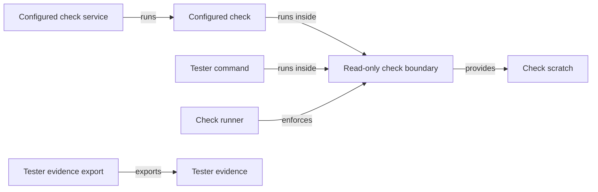
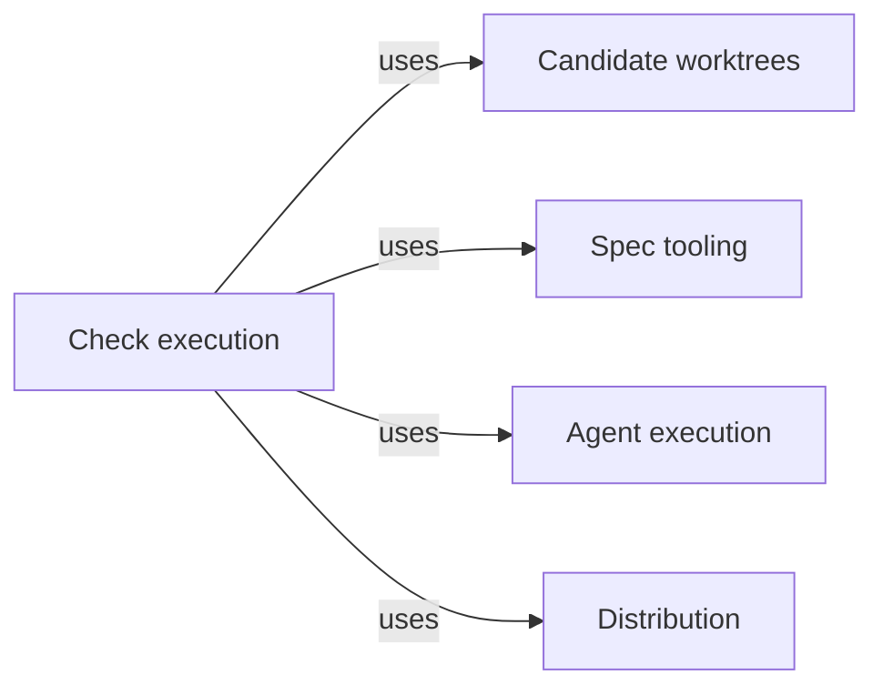

# Check execution

## Purpose

Check execution runs deterministic commands, such as a project's test suite or linter, so that
they can read the project but cannot change it. It serves two callers: the Host, which runs a
Module's configured checks when validating a candidate, delivering it or answering an Agent's
`run_checks`, and the tester Task subagent, which runs its test commands through the
`test_command` tool. Every run gets a fresh writable scratch directory outside the project, its
whole process tree is ended before the result returns, and a tester run's output and selected
reports are exported as evidence to the primary worktree. Validation and Delivery rely on it for
check results they can trust not to have altered what they measured. It is the only place in the
Harness where the operating system enforces a boundary on work that Concorde starts for a normal
capability. It restricts writes only: it is not a read, network or credential policy, and it never
decides whether a check passing means the code is correct.

## Terminology

| Term | Definition |
| --- | --- |
| Configured check | A command that the project configuration assigns to one Module, with its arguments, time limit and the input paths its result depends on. |
| Read-only check boundary | The Linux sandbox in which a check or tester command runs: the whole host filesystem read-only, one fresh writable scratch directory, private process and IPC namespaces, and a shared network. |
| Check scratch | The fresh directory outside the project that one run may write, holding its temporary files, caches and reports, removed after the run. |
| Tester command | One shell command a tester Task subagent runs through the `test_command` tool inside the read-only check boundary. |
| Tester evidence | The manifest, bounded output and selected report files that the Host exports to the primary worktree after a tester command. |
| [Host](../../vocabulary.md#concept.concorde.host) | |
| [Evidence](../../vocabulary.md#concept.concorde.evidence) | |
| [Task subagent](../../vocabulary.md#concept.concorde.task-subagent) | |
| [Module](../../vocabulary.md#concept.concorde.module) | |
| [Primary worktree](../worktrees/module.md#concept.worktrees.primary-worktree) | |
| [Run record](../worktrees/module.md#concept.worktrees.run-record) | |

## Usage

### Configured checks {#concept.checks.configured-check}

A **configured check** is declared in the project configuration, `.concorde/config.json`, under
`checks`. For example, Concorde's own Graph Spec check is:

```json
{"id": "check.harness.graph-specs", "module": "module.harness",
 "argv": ["{python}", "scripts/development/check-graph-specs.py"],
 "timeout_seconds": 120,
 "inputs": ["scripts", "src/concorde", "agents", "operations", "specs/concorde"]}
```

`{python}` is replaced by the Host's own interpreter. When Validation validates a candidate, when
Delivery re-verifies it, or when a programmer or code reviewer calls `run_checks`, the Host runs
every check of the selected Module in order. For each it records `passed`, `failed` or `timeout`,
the exit code, a digest of what was measured and a digest of the log, and writes the combined
output to `.concorde/runs/<invocation>/<check>.log` in the primary worktree. An Agent calling
`run_checks` receives each status with the last 20,000 bytes of its log.

The digest of what was measured covers the Module's implementation files, every file under the
check's `inputs` and the boundary's policy name. It is computed before and after the checks; if it
changed, the whole run fails with `stale_evidence`, because a check that altered its own input
proves nothing about it.

### Tester commands

<a id="concept.checks.tester-command"></a><a id="concept.checks.tester-evidence"></a>

A tester Task subagent has no `bash`, `edit` or `write`. It runs each **tester command** with
`test_command`:

```json
{"command": "python -m pytest -q tests/unit", "timeout": 600, "reports": ["junit.xml"]}
```

The command runs with `bash -c` in the tester's worktree inside the read-only check boundary;
when the tester was launched with a runtime selection, that selection is verified first. Report
names select files the command wrote below `$CONCORDE_CHECK_REPORT_DIR`. Before the scratch is removed, the Host exports the **tester
evidence** under `.concorde/runs/tester-<id>/` in the primary worktree: a manifest with the
command's digest (not its text), the worktree's branch, commit and dirty state, the runtime and
selection digests, the exit status, and each exported artifact with its digest and size. The tool
returns the last 20,000 bytes of each output stream, the manifest's path and digest, and whether
the export is complete. A nonzero exit is still a failed command even when its evidence is
complete, and an incomplete export fails the tool even when the command succeeded.

### Writing a check that works in the boundary

<a id="concept.checks.read-only-boundary"></a><a id="concept.checks.scratch"></a>

Inside the **read-only check boundary**, any attempt to create, change, rename or delete a project
file fails at the system call, including a write that would later be undone. A check that needs to
write uses its **check scratch**: `TMPDIR`, `TMP`, `TEMP`, `XDG_CACHE_HOME` and `npm_config_cache`
point into it, `CONCORDE_CHECK_TMPDIR` names its root and `CONCORDE_CHECK_REPORT_DIR` its reports
directory. A tool that hard-codes a cache or report path in the project fails and must be pointed
at the scratch; a tool that rewrites sources, such as a formatter in fix mode, is implementation
work and does not belong in a check.

Tester commands additionally get a private `/tmp` backed by their scratch, and see the host's
existing `/tmp` read-only at `$CONCORDE_TEST_HOST_TMP`. Paths of the project and its runtime that
lie under `/tmp` stay visible, read-only, at their own names.

### When the boundary is unavailable

Only Linux is supported, with a root-owned system bubblewrap, user, mount, PID and IPC namespaces
and kernel process file descriptors. If any of these is missing, or the project lies at `/` or
under `/proc`, `/dev` or `/sys`, the run is refused and the command does not start. There is no
fallback to an ordinary subprocess. For configured checks the refusal is reported as
`check_sandbox_unavailable`, with the diagnostics in the check's log.

## Design

### Why a read-only filesystem, and not more

Checks produce evidence that a candidate is ready. That evidence is only useful if the check could
not have changed what it measured, so the one guarantee that matters is that project files cannot
change. The boundary delivers exactly that and states plainly what it leaves out. A command reads
anything the developer's user can read, receives the calling process's full environment, including
any credentials in it, and shares the network. Configured checks are commands the project itself
chose. Tester commands are written by a model, so a tester's only way to run anything is this
boundary: the model can read and send out whatever the user can, but it cannot change the
project it is testing.

<a id="realization.checks.runner"></a>

The **check runner** mounts the whole host filesystem read-only, recursively, so no other path,
hard link or dependency directory can serve as a writable alias. It gives fresh `/proc` and `/dev`,
drops capabilities, disconnects the terminal and makes only the scratch writable. The command
starts stopped until the Host holds a process file descriptor for the sandbox's first process, so
the Host can always end the whole process tree: on success, failure, timeout and cancellation it
terminates every descendant, including ones that detached or started new sessions, before it
removes the scratch. Output is drained from both pipes while the command runs, so a large or
background writer cannot block completion.

### Why configured checks recheck their inputs

<a id="realization.checks.configured-checks"></a>

The **configured check service** measures before and after because the boundary cannot stop
another process outside it from changing the project during the run. Comparing the two digests
turns that race into a stale result instead of false evidence. Logs are kept only as Host run
records.

### Why tester evidence is exported by the Host

<a id="realization.checks.tester-evidence"></a>

A tester's scratch disappears when its command ends, and the tester itself cannot write the
primary worktree. The **tester evidence export** therefore runs inside the Host after the sandboxed
processes have ended and before scratch removal. It opens only regular, unlinked files through
non-symlink paths under the reports directory, bounds each report and the total, and records every
truncation and error in the manifest. Output and reports are the command's own data: the Host does
not filter secrets from them, so a command must not print any. The same realization holds the
`test_command` extension and the small reader of the runtime selection bound to the tester's
launch, which the extension consults before every command.

<a id="realization.checks.tests"></a>

The **check tests** exercise the boundary with real sandboxed processes where the platform allows
and refuse otherwise; they show what the boundary blocks, not that a project's checks are adequate.

### Open questions

- Whether an Agent needs more than the last 20,000 bytes of each check's log is undecided.

## Relationships





<a id="uses-worktrees"></a>

[Candidate worktrees](../worktrees/module.md) locates the
[primary worktree](../worktrees/module.md#concept.worktrees.primary-worktree) and writes its run
directory atomically under the repository lock. Check logs and tester evidence are written there,
next to the [run record](../worktrees/module.md#concept.worktrees.run-record), and it supplies the
branch, commit and dirty state recorded in a tester manifest. When no primary worktree is found,
tester export fails rather than writing anywhere else.

<a id="uses-spec"></a>

[Spec](../../spec/module.md) resolves the selected Module and its implementation files, whose
digest is part of what a configured check measured, and supplies the safe path and digest rules
used for check inputs and report names. An invalid input path fails the run before any command.

<a id="uses-execution"></a>

[Agent execution](../execution/module.md) supplies the
[diagnostic spans](../execution/module.md#concept.execution.diagnostic-span) with which check runs
are timed. Recording a span never changes a check's result.

<a id="uses-distribution"></a>

[Distribution](../../distribution/module.md) installs the tester extension and the tester's
runtime, and owns the bridge the `test_command` tool starts, which verifies the tester's bound
runtime selection before any command runs. A changed selection or a missing runtime refuses the
command.
