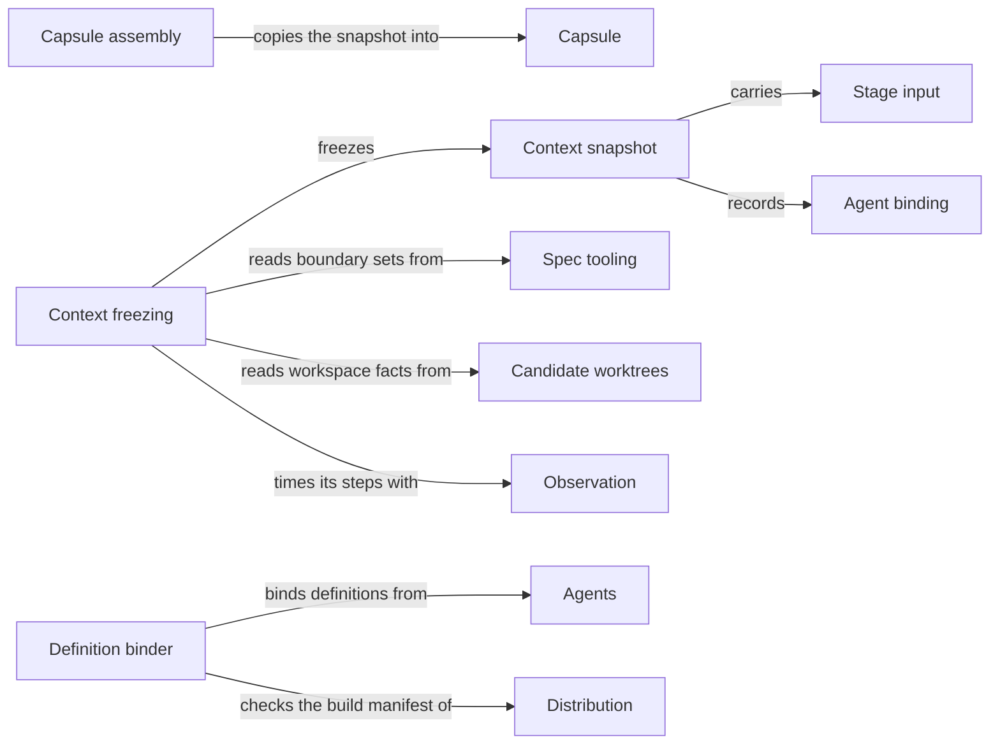

# Task context

## Purpose

Task context decides what one Agent call may know. For the Module a step is bound to, it composes
the call's context from the Framework's four kinds, freezes it into a context snapshot whose identity
changes whenever any input changes, assembles the capsule the Agent starts in, and binds the Agent's
definition to the call. Before a result is accepted it rechecks the snapshot. Agent execution relies
on it for every Agent call; providers rely on it for stage inputs and revision identities. It does
not compute boundary sets (Spec tooling), define Agents (Agents), launch anything (Agent execution),
or confine what a running Agent reads or writes.

## Terminology

| Term | Definition |
| --- | --- |
| Context snapshot | The frozen, content-addressed record of the context of one Agent call: its bound Modules' boundary sets, the Protocol files, the Agent binding, the task, the admitted stage inputs and the workspace facts. |
| Phase | The kind of step an Agent call performs, such as `plan`, `implementation` or `code-review`, named by the Agent's definition. |
| Stage input | A typed, accepted result of an earlier step, such as a plan or a task list, that a provider passes to a later Agent call as task context. |
| Capsule | The private directory an Agent call starts in, holding byte-identical copies of exactly the files its snapshot delivers to that Agent and the snapshot itself. |
| Agent binding | The reproducible record that binds one Agent definition, as built, to one call: its tools, effects, time limit and the digests of its instruction source, rendered instructions, definition and build manifest. |
| Revision identity | A digest of one Module's Spec context or of its implementation files that providers bind their evidence to, so that a changed input makes the evidence stale. |
| [Context](../../vocabulary.md#concept.concorde.context) | |
| [Spec context](../../vocabulary.md#concept.concorde.spec-context) | |
| [Implementation context](../../vocabulary.md#concept.concorde.implementation-context) | |
| [Capability context](../../vocabulary.md#concept.concorde.capability-context) | |
| [Task context](../../vocabulary.md#concept.concorde.task-context) | |
| [Agent](../../agents/module.md#concept.agents.agent) | |
| [Agent definition](../../agents/module.md#concept.agents.definition) | |
| [Boundary set](../../spec/module.md#concept.spec.boundary-set) | |
| [Typed value](../../spec/module.md#concept.spec.typed-value) | |
| [Worktree](../worktrees/module.md#concept.worktrees.worktree) | |
| [Workspace facts](../worktrees/module.md#concept.worktrees.workspace-facts) | |

"Task context" names both the root's kind of context (the task material of one call) and this
Module, which composes all four kinds.

## Usage

Agent execution's native driver prepares each Agent call for a provider, naming the Module, the
Agent, the task, an optional scenario focus, constraints and stage inputs; Task context resolves the
rest.

**Freezing.** The snapshot records the Spec context of every bound Module (each document with owner,
digest and selecting declarations), the Protocol files, the names of the selected Module's
implementation files, the paths and digests of its `ImplementationScope` only when the Agent's
definition reads implementation, one digest per external inclusion, the Agent binding, the task and
the workspace facts. Its identity is the SHA-256 digest of all of that. A planner therefore sees
file names but never code, while a code reviewer sees both. A scenario focus never trims the context.
When the Agent writes implementation and another Module binds one of its files, the call is also
bound to that Module and records its Spec context; it adds reading, never writing.

**Stage inputs.** Accepted results, such as a plan, a task list, a code review or an Issue selection,
travel forward as registered typed values owned by their producing provider. A snapshot admits
exactly the types the Agent definition lists, one per type, and requires its required ones. A stage
input adds no Spec document or file.

**The capsule.** Bodies are never embedded in an Agent's input. The capsule holds verified copies of
the Protocol files and every Spec context document, the external material when the definition reads
references, the implementation files when it reads but does not write them, and the snapshot as
`context.json`. A `capsule` Agent works only from it; a `project` Agent (programmer, code reviewer)
starts there but works on the worktree.

**Agent binding.** Before freezing, Task context checks the definition's consistency and that its
instruction source is recorded in the build manifest and rendered, and records the binding in the
snapshot, so a changed definition changes the snapshot's identity.

**Recheck.** Before acceptance, Agent execution asks for a recheck, which fails with `stale_context`
if any recorded input changed; the provider must freeze again. The one exemption: for an Agent that
writes implementation, its own file names and bytes are not rechecked. The capsule is also verified
against the digests it was written with.

**Errors.** `invalid_phase`, `invalid_input` (blank task), `incompatible_handoff` (stage inputs),
`permission_denied`, `invalid_reference` (missing reference checkout), `unknown_agent`,
`invalid_agent_binding` and `stale_build`; no partial snapshot or capsule is returned. The configured
check `scripts/development/check-reference-versions.py` fails when the pinned LangGraph reference
differs from the installed release. Details are in the [design topic](design.md).

## Design

**The Spec decides, Task context freezes.** **Context freezing** records Spec tooling's answer with
byte digests instead of interpreting Specs, so one identity names the context an Agent, a result and
a reviewer refer to, and a recheck can prove nothing moved. Shared files are handled by binding the
call to each binding Module, never by an extra selection of its own.

**Copies, not confinement.** **Capsule assembly** makes the intended context easy to use and
checkable, but confines nothing: an Agent's reads are not confined to its capsule, the programmer's
edits and shell are not confined to its `ImplementationScope`, and `SpecScope` is not enforced.
What holds is the tool list fixed by the binding and the recheck before acceptance.

**Definitions live with Agents, bindings live here.** The **definition binder** turns a definition
into a binding for one call and refuses one that is inconsistent or not built.

**Revision identities** give providers one meaning of "changed": a digest of a Module's Spec context
and one of its implementation files.

The **reference version check** is a configured check, because the installed library is not a Spec
input.

The **context tests** build small fixture projects. The [design topic](design.md) has the
composition table, the full recheck list, the enforcement table and the open questions.

## Relationships

**Spec tooling** computes the [boundary sets](../../spec/module.md#concept.spec.boundary-set) of
every bound Module, declaration-only and one level deep, and its
[impact indexes](../../spec/module.md#concept.spec.impact-index) name the Modules binding a shared
file. Stage inputs and snapshots are [typed values](../../spec/module.md#concept.spec.typed-value),
and the snapshot records the [Protocol binding](../../spec/module.md#concept.spec.protocol-binding).
A refused selection stops freezing; one that fails only at recheck gives `stale_context`.

**Candidate worktrees** supplies the [workspace facts](../worktrees/module.md#concept.worktrees.workspace-facts)
of the [worktree](../worktrees/module.md#concept.worktrees.worktree) the call runs in. They are
observations, never permission to read another worktree; a recheck compares only the current
worktree's own facts. A missing primary stops freezing.

**Agents** gives every [Agent](../../agents/module.md#concept.agents.agent) one
[definition](../../agents/module.md#concept.agents.definition): phase, workspace kind, typed context
and result, stage inputs, result fields, effects, tools, time limit and instruction source. Task
context binds exactly that definition and never adds a tool or role; an unknown or inconsistent one
is refused before any snapshot exists.

**Distribution.** Binding reads the build manifest as Distribution's
[build manifest contract](../../distribution/module.md) (`contract.distribution.build-manifest`)
defines it: the instruction source must be recorded and the build fresh, else `stale_build` before
any Agent exists; the manifest digest becomes part of the binding.

**Observation.** Freezing and rechecking are marked as
[diagnostic spans](../observation/module.md#concept.observation.diagnostic-span); nothing depends on
them.
