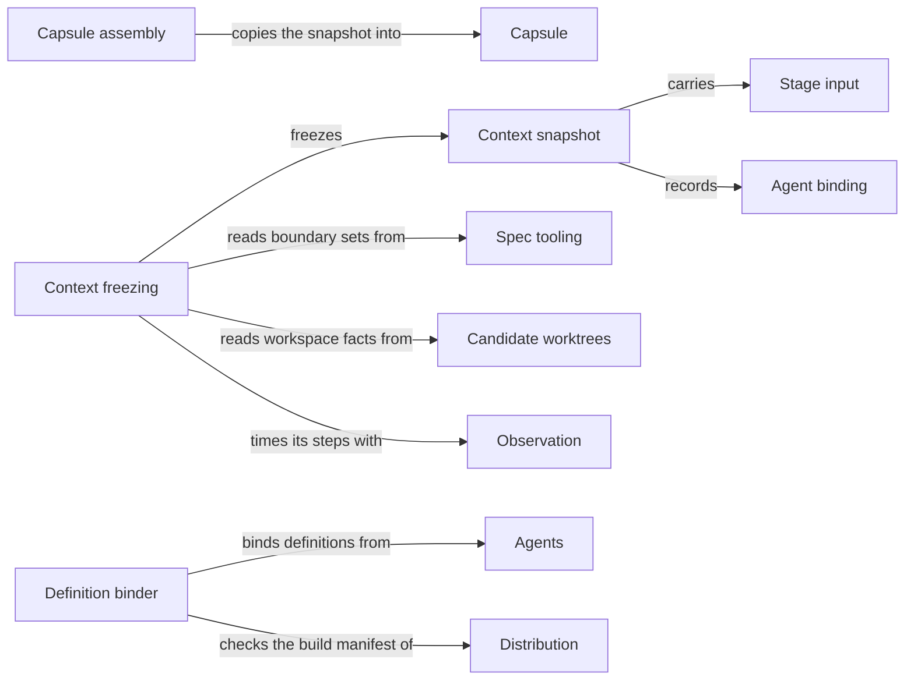

# Task context

## Purpose

Task context decides what one Agent call may know. For the Module a step is bound to, it composes
the call's context from the four kinds the Framework defines, freezes it into a context snapshot
whose identity changes whenever any input changes, assembles the capsule of copies the Agent
starts in, and binds the Agent's definition to the call. Before a result is accepted it rechecks the
snapshot, so that a result computed from inputs that have since moved is refused. Agent execution
relies on it to prepare and accept every Agent call, and the providers under Operations rely on it
for stage inputs and for the revision identities they bind their evidence to. It does not compute
the Protocol's boundary sets (Spec tooling does), does not define Agents (Agents does), does not
launch anything (Agent execution does), and does not confine what a running Agent reads or writes:
the Design section states exactly what is and is not enforced.

## Terminology

| Term | Definition |
| --- | --- |
| Context snapshot | The frozen, content-addressed record of the context of one Agent call: its bound Modules' boundary sets, the Protocol files, the Agent binding, the task, the admitted stage inputs and the workspace facts. |
| Phase | The kind of step an Agent call performs, such as `plan`, `implementation` or `code-review`, named by the Agent's definition. |
| Stage input | A typed, accepted result of an earlier step, such as a plan or a task list, that a provider passes to a later Agent call as task context. |
| Capsule | The private directory an Agent call starts in, holding byte-identical copies of exactly the files its snapshot delivers to that Agent and the snapshot itself. |
| Agent binding | The reproducible record that binds one Agent definition, as built, to one call: its tools, effects, time limit and the digests of its instruction source, rendered instructions, definition and build manifest. |
| Revision identity | A digest of one Module's Spec context or of its implementation files that providers bind their evidence to, so that a changed input makes the evidence stale. |
| [Context](../../vocabulary.md#concept.concorde.context) | |
| [Spec context](../../vocabulary.md#concept.concorde.spec-context) | |
| [Implementation context](../../vocabulary.md#concept.concorde.implementation-context) | |
| [Capability context](../../vocabulary.md#concept.concorde.capability-context) | |
| [Task context](../../vocabulary.md#concept.concorde.task-context) | |
| [Module](../../vocabulary.md#concept.concorde.module) | |
| [Boundary](../../vocabulary.md#concept.concorde.boundary) | |
| [Host](../../vocabulary.md#concept.concorde.host) | |
| [Worker](../../vocabulary.md#concept.concorde.worker) | |
| [Agent](../../agents/module.md#concept.agents.agent) | |
| [Agent definition](../../agents/module.md#concept.agents.definition) | |
| [Boundary set](../../spec/module.md#concept.spec.boundary-set) | |
| [Typed value](../../spec/module.md#concept.spec.typed-value) | |
| [Worktree](../worktrees/module.md#concept.worktrees.worktree) | |
| [Workspace facts](../worktrees/module.md#concept.worktrees.workspace-facts) | |

The Framework's four kinds of context are what an Agent call may know; a snapshot records them, a
capsule delivers the readable part of them, and an Agent binding fixes who is reading. "Task
context" names both the root's kind of context and this Module; the kind is the task material of
one call, the Module is what composes all four kinds.

## Usage

The callers are Agent execution's native driver, preparing one Agent call on behalf of a provider,
and the providers themselves, which supply the step's inputs. A caller names the Module, the Agent,
the task text, an optional scenario focus, constraints and any stage inputs. Task context resolves
the rest.

### How one call's context is composed

| Kind | What Task context puts into the call | How the Agent receives it |
| --- | --- | --- |
| [Spec context](../../vocabulary.md#concept.concorde.spec-context) | every document of the bound Modules' `SpecContext`, with owners, digests and the declarations that selected them; the Protocol files; one digest per `ExternalContext` inclusion | copies in the capsule; external material only when the Agent definition reads references |
| [Implementation context](../../vocabulary.md#concept.concorde.implementation-context) | the realization entries and bound file names of the selected Module, in every phase; the path and digest of every `ImplementationScope` file only when the Agent definition reads implementation | names in the snapshot; for a code reviewer copies in the capsule; for the programmer the worktree and its intended write paths |
| [Capability context](../../vocabulary.md#concept.concorde.capability-context) | the Agent binding, which fixes the Agent's tool list and effects | Agent execution launches the Agent with exactly those tools and the contracts of the Host services they reach |
| [Task context](../../vocabulary.md#concept.concorde.task-context) | the task, focus and constraints, the admitted stage inputs and the workspace facts | inline in the snapshot, which the capsule holds as `context.json` |

**An example.** When `concorde-code-review` reviews Module `module.checkout`, the code reviewer's
definition names the phase `code-review` and reads Spec context and implementation. The snapshot
lists every document in the Module's `SpecContext` with its owner, path, byte digest and the
relations that selected it; the Protocol files the project is bound to; the names of every file in
its `ImplementationContext`; the path and digest of every file in its `ImplementationScope`; one
digest per external inclusion; the code reviewer's Agent binding; the task, focus and constraints;
and the current workspace facts. The snapshot's identity is the SHA-256 digest of all of that. A
planner for the same Module gets the same Spec side but only the names of the implementation
files, never their contents, because its definition does not read implementation.

A scenario focus changes the question, not the context: a snapshot focused on one scenario selects
the whole context of the scenario's owning Module.

**Shared files.** When the Agent's definition writes implementation, as the programmer's does, and
another Module binds a file of the selected Module's `ImplementationScope`, the call is bound to
that Module too, as the Protocol's shared-file rule requires: a writer bound only to one binder
could break a promise it cannot see. The snapshot then also records the `SpecContext` of each such
Module and the files it shares, and the capsule receives those documents. The programmer's intended
write paths remain the selected Module's `ImplementationScope`; binding to another Module adds
reading, never writing. No other phase is bound this way.

**Stage inputs.** Accepted results travel forward as stage inputs: a plan to task authoring, the
plan and task list to implementation, a current code review to a repair step, an Issue selection to
the Issue solver. Each is a registered typed value owned by the provider that produces it. An Agent
definition lists the stage input types it admits and the ones it requires; a snapshot admits
exactly those, one value per type. A stage input brings its declared content and nothing else;
it never adds a Spec document or a file.

**The capsule.** Document bodies are never embedded in an Agent's input. For each call Task context
creates a capsule: it copies the Protocol files and every document of the snapshot's Spec context
into it, verifying each copy against its digest; adds the external material when the definition
reads references; adds copies of the `ImplementationScope` files when the definition reads but does
not write implementation; and writes the snapshot as `context.json`. The Agent starts in the
capsule and opens what its task needs, beginning at the Module's entry.

The Agent definition's **workspace kind** says where the Agent's material is. A `capsule` Agent (the
context assessor, planner, task author, spec reviewer and Issue solver) works only from its
capsule: the capsule is its working directory and holds every file it is given. A `project` Agent
(the programmer and the code reviewer) also starts in its capsule, but its step concerns the
project worktree: the code reviewer receives copies of the implementation files in the capsule and
runs configured checks against the worktree, and the programmer's `context.json` names the worktree
and the files it is intended to write there, which it edits in place.

**Agent binding.** Before freezing, Task context binds the Agent's definition to the current build:
it checks that the definition is consistent (every written role is also read, `edit` and `write`
only with a write role, reading implementation only with a `project` workspace, a positive time
limit and more), that the instruction source is recorded in the build manifest and that the
rendered instructions exist. The resulting binding is part of the snapshot, so a changed definition
or rebuilt instructions change the snapshot's identity.

**Before a result is accepted**, Agent execution asks Task context to recheck the snapshot. The
recheck recomputes, from the current checkout, the snapshot's own identity digest, the current
worktree's workspace facts other than the list of other worktrees, the Protocol binding, the Spec
context record of every bound Module (document bytes, owners and selecting declarations), the
selected Module's realization entries, its bound file names, the implementation file bytes when the
snapshot holds them, the external reference digests and the Agent binding. Any difference fails
with `stale_context` and the result is not accepted; the provider must freeze a new snapshot and
run the step again. The one exemption is the programmer's own work: for an Agent that writes
implementation, the bound file names and implementation bytes are not rechecked, because changing
them is the expected result of the call. Its Spec side, entries, external references, Protocol
binding, workspace facts and binding are rechecked like everyone else's. Agent execution also asks
Task context to verify that every file of the capsule still has the digest it was written with.

**Errors.** An unknown phase is `invalid_phase`, a blank task `invalid_input`, a stage input the
definition does not admit or a missing required one `incompatible_handoff`, a snapshot the bound
definition may not read `permission_denied`, a missing external reference checkout
`invalid_reference`, an unknown Agent `unknown_agent`, an inconsistent definition
`invalid_agent_binding` and a stale build `stale_build`. No partial snapshot or capsule is ever
returned.

**Checking reference versions.** External context is only useful if it describes the library that
actually runs. The configured check `scripts/development/check-reference-versions.py` compares the
pinned LangGraph reference checkout with the locked and the installed LangGraph version and fails
on any mismatch, telling the maintainer to move the reference to the installed release.

## Design

**The Spec decides, Task context freezes.** Spec tooling computes the boundary sets from
declarations alone. Task context does not interpret Specs; it records Spec tooling's answer with
byte digests, so that a later recheck can prove nothing moved. Freezing is what turns "the Module's
context" into one identity that an Agent, a result and a reviewer can all refer to.

**Names are not contents.** Every phase sees the names of the Module's implementation files,
because a planner must be able to say where code goes. Only an Agent whose definition reads
implementation receives the `ImplementationScope` paths and digests, and no snapshot embeds code.
The same rule is applied again when an Agent's typed input is admitted: a definition without
implementation reads is refused a snapshot that carries implementation files.

**Shared files bind the call, not a reason.** The Protocol resolves a shared file by binding the
writing task to every binding Module, and Task context does exactly that: each additional Module
contributes its own `SpecContext`, selected by its own declarations. It adds no special "shares"
selection of its own, so what the programmer reads is always explainable by the declarations of
the Modules it is bound to.

**Copies instead of grants.** An Agent runs as a native Pi process with the developer's file access.
Rather than pretend to restrict that, Task context makes the intended context easy to use and
checkable: the capsule holds exactly the delivered files, byte-identical to the snapshot, and the
digests of every copy are verified before acceptance. Capsule assembly currently lives in Agent
execution's `native_context.py` and moves into `src/concorde/harness/capsule.py`, so that one Module
owns both what a snapshot says and what the capsule holds.

**What is enforced today.** The Protocol defines the sets; this Module records them faithfully and
delivers them, but it confines nothing:

| Boundary set | In the snapshot | Reaches the Agent as | Enforced |
| --- | --- | --- | --- |
| `SpecContext` | every selected document, with digests and selecting relations, for every bound Module | copies in the capsule | Not enforced: the capsule is the working directory, but the Agent's file tools can name other paths. A recheck refuses the result if any selected byte changed. |
| `ExternalContext` | one tree digest per external inclusion | copies in the capsule, only for definitions that read references | Not enforced; changes are detected by the recheck. |
| `ImplementationContext` | the declared entries and bound file names | names in `context.json` | Names only in delivery; the Agent can still open the files, which is not enforced. |
| `ImplementationScope` | paths and digests, only for definitions that read implementation | copies for the code reviewer; the worktree and intended write paths for the programmer | Not enforced: the programmer's edits and shell are limited by its instructions, not by the operating system. |
| `SpecScope` | not recorded | never delivered as writable | Not enforced: no Agent definition declares a Spec write role and no result may carry Spec documents, but an Agent with `edit`, `write` or `bash` could change a Spec file on disk. |

What does hold is the Agent's tool list, fixed by its binding and checked by Agent execution's
preflight, and the independent acceptance of its result after the recheck.

**Definitions live with Agents, bindings live here.** The Agents Module says what each Agent is.
Task context turns a definition into a binding for one call and refuses one that is inconsistent or
not built, because a binding is what the snapshot, the capsule and the recheck have to agree on.
The effect roles an Agent may declare are `spec-context`, `implementation` and `references`.

**Revision identities.** Planning, Review, Validation, Implementation and Issue solving must be able
to tell whether their evidence still describes the current Spec and code. Task context supplies one
digest for a Module's Spec context (its registry record, Protocol binding and resolved
`SpecContext`) and one for its implementation (its realization entries and the bytes of every bound
file), so that all of them agree on what "changed" means.

**Reference versions are checked, not assumed.** A reference checkout older or newer than the
installed library would give Agents confident, wrong documentation. The reference check is a
configured check rather than part of freezing, because it compares the installed environment, which
is not a Spec input.

The tests of this Module build small fixture projects and check freezing, recheck, external
references, shared-file binding and Agent binding.

**Open questions.** A snapshot lists a fixed pair of Protocol files; which chapters of the installed
Protocol bundle an Agent should receive is not decided. `context.py` still holds the context
assessor's result check, which belongs to Planning's Agent hook, and a fixed list of admitted stage
input types, which Agent definitions declare instead.

## Relationships

**Context freezing** composes, freezes and rechecks snapshots and computes revision identities.
The **definition binder** validates Agent definitions and binds them to the build. **Capsule assembly**
writes and verifies capsules.

**Spec tooling.** [Spec tooling](../../spec/module.md) selects the Module, resolves a scenario focus
to its owner and computes the [boundary sets](../../spec/module.md#concept.spec.boundary-set) of
every bound Module with source digests and external reference digests; its
[impact indexes](../../spec/module.md#concept.spec.impact-index) name the other Modules that bind a
file, which is how the shared-file binding is found. Task context relies on that computation being
declaration-only and one level deep, so the same checkout always yields the same snapshot. Stage
inputs and snapshots are [typed values](../../spec/module.md#concept.spec.typed-value) checked by its
registry of types, and the snapshot records the project's
[Protocol binding](../../spec/module.md#concept.spec.protocol-binding). When Spec tooling refuses a
selection, freezing stops with its error; a selection that was valid when frozen and fails now makes
a recheck report `stale_context`.

**Candidate worktrees.** Every snapshot includes the
[workspace facts](../worktrees/module.md#concept.worktrees.workspace-facts) of the
[worktree](../worktrees/module.md#concept.worktrees.worktree) the call runs in: its kind, its bound
change and that change's lifecycle position, and a summary of the other live worktrees. These facts
are observations, never permission to read another worktree. A recheck compares only the current
worktree's own facts; other worktrees may move on while a call runs. When the primary worktree
cannot be found, freezing stops with that error.

**Agents.** Every [Agent](../../agents/module.md#concept.agents.agent) has one
[definition](../../agents/module.md#concept.agents.definition): its phase, workspace kind, typed
context and result, admitted and required stage inputs, result fields, effects, tools and time
limit, and its instruction source. Task context binds exactly that definition and never adds a tool
or a role. An unknown name is refused with `unknown_agent` and an inconsistent definition with
`invalid_agent_binding`, before any snapshot exists.

**Distribution.** Binding reads the build manifest defined by Distribution's
[build manifest contract](../../distribution/module.md) (`contract.distribution.build-manifest`):
the instruction source's digest must be recorded there and the build must be fresh, and the
manifest's digest becomes part of the binding. A stale or missing build stops binding with
`stale_build`, before any Agent exists.

**Observation.** Freezing and rechecking are marked as
[diagnostic spans](../observation/module.md#concept.observation.diagnostic-span); nothing depends on
whether a span was recorded.

**Consumers.** Agent execution freezes, assembles and rechecks through this Module for every Agent
call and refuses to accept a result whose recheck or capsule verification fails. Providers produce
stage inputs and bind their evidence to revision identities; a provider that receives
`stale_context` freezes again instead of reusing the old snapshot.
