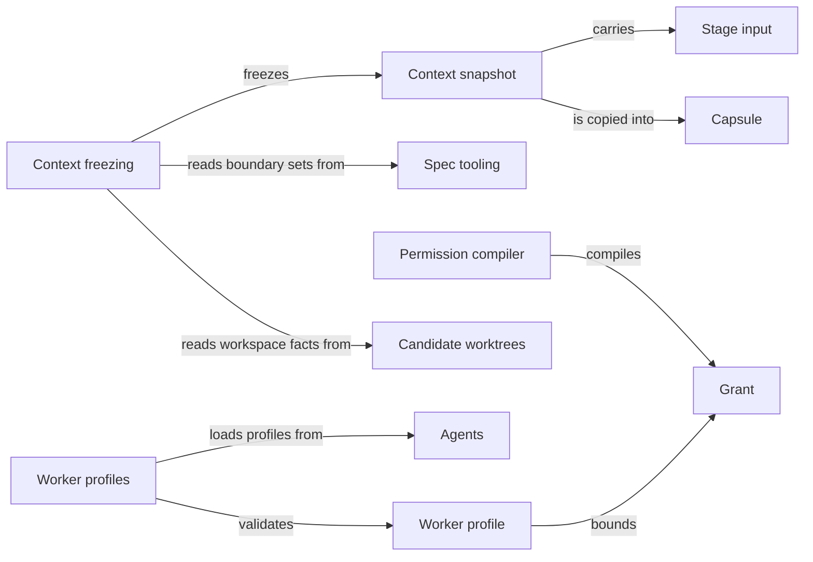

# Task context

## Purpose

Task context decides what one worker may know and touch for one step of a task. For a selected
Module and step it freezes a context snapshot: the boundary sets that the Spec Module computes from
the Specs, the task itself, the accepted results of earlier steps and the facts about the current
worktree. It then delivers those sets to the worker and derives the paths the worker is granted.
It also holds the worker profiles that say what each kind of worker is, and the permission
compiler that turns a profile and a snapshot into a grant. Agent execution, Planning,
Implementation, Review and Issues rely on it whenever they start a model step. It does not compute
the boundary sets itself, does not launch workers, and today does not confine a native worker's
file access at the operating-system level; the Design section says exactly what is enforced.

## Terminology

| Term | Definition |
| --- | --- |
| Context snapshot | The frozen, content-addressed record of everything one worker may know for one step: its task, its Module's boundary sets, the Protocol files and the workspace facts. |
| Phase | The kind of step a snapshot is frozen for, such as `plan`, `implementation` or `code-review`, which decides whether implementation contents are included. |
| Stage input | A typed, accepted result of an earlier step, such as a plan or a task list, that the host passes to a later step. |
| Capsule | A private scratch directory holding byte-identical copies of exactly the files a snapshot grants, used as a worker's working directory. |
| Grant | The set of paths a worker is allowed to read or write for one step, derived from its snapshot and its worker profile. |
| Worker profile | The fixed declaration of one kind of worker: its phase, the typed context and result it exchanges, the path roles it may read and write, its tools, workspace kind and time limit. |
| [Context](../../vocabulary.md#concept.concorde.context) | |
| [Boundary](../../vocabulary.md#concept.concorde.boundary) | |
| [Module](../../vocabulary.md#concept.concorde.module) | |
| [Spec](../../vocabulary.md#concept.concorde.spec) | |
| [Worker](../../vocabulary.md#concept.concorde.worker) | |
| [Host](../../vocabulary.md#concept.concorde.host) | |
| [Agent](../../agents/module.md#concept.agents.agent) | |
| [Typed value](../../spec/module.md#concept.spec.typed-value) | |
| [Worktree](../worktrees/module.md#concept.worktrees.worktree) | |

The Spec Protocol defines five boundary sets for a Module: three read sets (`SpecContext`,
`ImplementationContext`, `ExternalContext`) and two write sets (`SpecScope`,
`ImplementationScope`). A snapshot records the sets a step needs; a grant is how they reach the
worker.

## Usage

The callers are the Host services that prepare a model step: context assessment, planning, task
authoring, implementation, reviews and Issue solving. A caller names the Module, the phase, the
task text, an optional scenario focus, constraints and any stage inputs, and passes the worker
profile of the Agent it is about to run.

For example, when `concorde-code-review` reviews Module `module.checkout`, the host freezes a
snapshot for phase `code-review`. The snapshot lists every document in the Module's `SpecContext`
with its owner, path, byte digest and the declarations that selected it; the names of every file
in its `ImplementationContext`; one digest per entry of its `ExternalContext`; the path and digest
of every file in its `ImplementationScope`, because code review is a code phase; the Protocol files
the project is bound to; the task, focus and constraints; and the current workspace facts. The
snapshot's identity is the SHA-256 digest of all of that, so any change to any input gives a
different snapshot. A planner for the same Module gets the same Spec sets but only the names of
the implementation files, never their contents.

A scenario focus changes the question, not the context: a snapshot focused on one scenario selects
the whole context of the scenario's owning Module.

Stage inputs carry accepted results forward: a plan to task authoring, the plan and task list to
implementation, a current code review to a repair step, an Issue selection to the Issue solver.
Each phase admits only certain stage input types, and a worker profile can require some of them.
A stage input brings its declared content and nothing else; it never adds a path to a grant.

**Delivery.** Document bodies are never embedded in a worker's input. For a native Agent the host
creates a capsule: it copies the granted Spec documents and Protocol files into it, adds the
`ExternalContext` material when the worker's profile reads external references, adds the
`ImplementationScope` files for a code review, and writes the snapshot itself as `context.json`.
The Agent starts in the capsule and opens what its task needs, beginning at the Module's entry.
The programmer also starts in a capsule, but its `context.json` names the project worktree and the
files it is intended to write there.

**Before accepting a result**, the caller rechecks the snapshot against the repository. If any
selected document, selecting declaration, implementation file, external reference, Protocol
binding or the current worktree's own status changed, the recheck fails with `stale_context` and
the result is not accepted. The caller must freeze a new snapshot and run the step again.

Errors: an unknown phase is `invalid_phase`, a blank task `invalid_input`, a stage input that the
phase or profile does not admit `incompatible_handoff`, a phase beyond the profile's contract
`permission_denied`, and a missing external reference checkout `invalid_reference`. No partial
snapshot is ever returned. The exact records are in [contracts](contracts.md).

## Design

**The Spec decides, Task context freezes.** The boundary sets are computed by the
[Spec](../../spec/module.md) Module from declarations alone. Task context does not interpret
Specs; it records the Spec Module's answer together with byte digests, so that a later recheck can
prove nothing moved. Freezing is what turns "the Module's context" into a fixed input a worker and
a reviewer can both refer to by one identity.

**Names are not contents.** Every phase sees the names of the Module's implementation files,
because a planner must be able to say where code goes. Only the `implementation` and `code-review`
phases include the `ImplementationScope` files with their digests, and no snapshot embeds code.
The same rule is checked again when a worker's input is admitted: a profile without implementation
reads is refused a snapshot that carries implementation files.

**What is enforced today.** The Protocol defines the sets; this Module records them faithfully, but
the Harness is at an early stage and does not yet confine native Agents to them:

| Boundary set | In the snapshot | Reaches a native Agent as | Enforced today |
| --- | --- | --- | --- |
| `SpecContext` | every selected document, with digests and selecting declarations | copies in its capsule | Not confined: the capsule is the working directory, but the Agent's file tools can name other paths. A recheck rejects the result if any selected byte changed. |
| `ExternalContext` | one tree digest per external inclusion | copies in the capsule, only for profiles that read external references | Not confined; changes are detected by the recheck. |
| `ImplementationContext` | the declared entries and bound file names | names in `context.json` | Names only; contents are withheld from non-code phases by delivery. |
| `ImplementationScope` | paths and digests, code phases only | copies for a code review; the project worktree and intended write paths for the programmer | Not confined: the programmer's writes and shell are limited by its instructions, not by the operating system. |
| `SpecScope` | not recorded | never granted | No Agent profile declares a Spec write role, and no worker result may carry Spec documents; the user session edits Specs itself. |

What is enforced is the Agent's tool list, fixed by its profile and native definition, and the
independent acceptance of its result by the host. Operating-system isolation exists only for
configured checks and tester commands in [Check execution](../checks/module.md), and on the Pi RPC
diagnostic worker path of [Agent execution](../execution/module.md), which applies the compiled
grant with a tool gate and a sandbox.

**Worker profiles.** Each Agent in the [Agents](../../agents/module.md) Module declares one worker
profile. Task context loads and validates it: the profile names its instruction source
`agents/<name>/spec.md`, a workspace kind (`capsule` or `project`), a context type paired with its
result type, the stage inputs it admits and requires, the result fields it may fill, its read and
write path roles, its tools and a positive timeout. Writes must also be reads; network and
credential effects are never allowed; `edit` and `write` tools need a write role; implementation
reads need a project workspace. Binding a profile to the current build checks that the instruction
source is recorded in the build manifest and that the rendered instructions exist, and produces a
reproducible binding digest.

**Permission compiler.** A grant is compiled from a profile's declared effects, a host-issued
binding that may only narrow them, and the concrete paths of each role taken from the snapshot:
`spec-context` is `context.json` plus every listed document and Protocol file, `implementation` is
the Module's implementation files, and `references` is the external inclusion roots. The result is
a digest-bound policy that denies common credential paths by default. Anything wider than the
profile is refused, and a refused grant is never retried with a wider one.

External context is only useful if it describes the code that actually runs. A maintenance script
compares the version of the pinned LangGraph reference checkout with the locked and the installed
LangGraph version and reports a mismatch, so that the reference a worker reads is not silently
older or newer than the library.

The tests of this Module build small fixture projects and check freezing, recheck, external
references, profile validation and binding, and policy compilation.

**Open questions.** The Protocol files a snapshot lists are a fixed pair of paths under
`.concorde/protocol/` chosen in code; how they should follow the Protocol's own chapter layout is
not decided. The deterministic comparison behind
[context gaps](scenarios.md#scenario.harness.context-gap) is realized outside this Module, in the
invocation code of Agent execution.

## Relationships

**Spec.** The [Spec](../../spec/module.md) Module selects the Module, resolves a scenario focus to
its owner, and computes the Module's boundary sets, source digests and external reference digests.
Task context relies on that computation being declaration-only and one level deep, so that the
same checkout always yields the same snapshot. When the Spec Module refuses a selection, freezing
stops with its error; a formerly valid selection that now fails makes a recheck report
`stale_context`.

**Candidate worktrees.** Every snapshot includes the workspace facts computed by
[Candidate worktrees](../worktrees/module.md#concept.worktrees.worktree): which worktree the step
runs in, the [change status](../worktrees/module.md#concept.worktrees.change-status) bound to it
and a summary of other live worktrees, as described in its
[inventory scenario](../worktrees/scenarios.md#scenario.harness.workspace-inventory). These facts
are observations, never permission to read another worktree. A recheck compares only the current
worktree's own identity and status; other worktrees may move on while a step runs.

**Agents.** Worker profiles are declared by the [Agents](../../agents/module.md#concept.agents.agent)
Module, one per Agent. Task context validates them; an Agent that declares no profile, or a profile
whose name does not match its Agent, is refused with `invalid_agent_binding`, and an unknown name
with `unknown_agent`.

**Distribution.** Binding a profile relies on [Distribution](../../distribution/module.md) for the
build's freshness check, its manifest and the rendered Agent instructions. A stale or missing build
stops binding with `stale_build`, before any worker exists.
