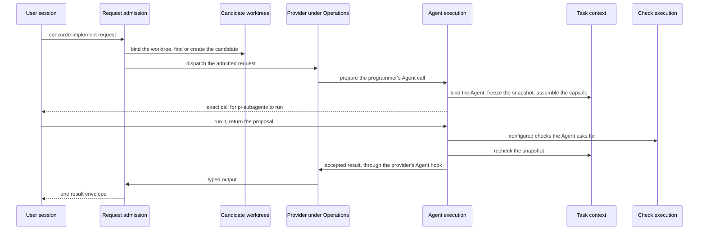

# The Harness in detail

This topic extends the [Harness](module.md) entry with a walk-through of one request and the
reasoning behind the decomposition. The entry states every promise; the children's own documents
hold the precise obligations.

## One request through the Harness

1. Request admission reads the `concorde-implement` request and the capability's declaration,
   checks the configuration and the worktree, and, because implementing mutates, runs it in the
   change's candidate, relaying it there from the primary if needed.
2. The Implementation provider asks Agent execution to prepare the programmer's Agent call. Agent
   execution asks Task context to bind the programmer's definition, freeze a snapshot of the Module
   (its Spec context, implementation file names and digests, the accepted task list and the
   workspace facts) and assemble the capsule.
3. The user session's Pi runs the call through pi-subagents. The submission is only a proposal.
   While it works the programmer may run configured checks through Check execution, with the
   project mounted read-only.
4. Agent execution's result gate accepts the proposal only after reading the run's own records and
   after Task context's recheck shows that no input moved, then hands it to the provider's Agent
   hook.
5. Candidate worktrees holds the change status and the run record in the primary; Observation has
   timed every step.

Other capabilities use a subset: `concorde-validate` needs no Agent, `concorde-plan` and the reviews
run a Workflow of several Agent calls, and read-only capabilities run where they are started.

## Where each part of a Harness lives

| Part | What it decides | Where |
| --- | --- | --- |
| Context | what one Agent call may know, frozen into a snapshot and delivered as a capsule | Task context |
| Control flow | the admission sequence of every request, and the Workflows and Graphs that sequence Agent calls and Host steps | Request admission and Agent execution |
| Agents and models | who runs a step and on which model: the definition from the Agents Module, the binding from Task context, the model selection from the operation configuration | Agent execution, with the Agents Module |
| Permission | the tool list, the candidate, the check sandbox and the result gate | all six parts |

Control flow has two sanctioned mechanisms, both run by Agent execution's runtime: pi workflows,
authored scripts that pi-subagents runs and that call back into the Host between Agent calls, used
for the simple fixed sequences of the public capabilities; and LangGraph Graphs, written only with
the Graph API so that nodes and edges exist before compilation and a Graph Spec can be checked
against them. No part of the Harness schedules model work in hand-written loops.

## Why six parts

Each part changes for a different reason: the request protocol and its envelopes, the mapping from
Specs to an Agent's inputs, the way Agents run on Pi and in Graphs, operating-system sandboxing of
checks, the Git lifecycle of changes, and passive timing. Keeping them apart lets one change
without touching the others and gives a task on one part a small boundary.

The Harness sits below the providers. Its parts use only Spec tooling, Issues, Agents, Observation,
each other and Distribution's build manifest contract; never Operations, a provider, the Pi session
or Views. What only a provider knows reaches the Harness through interfaces the Harness defines:
admission's capability declaration, and Agent execution's Agent hooks and Workflow hooks,
registered by entry-point name.
