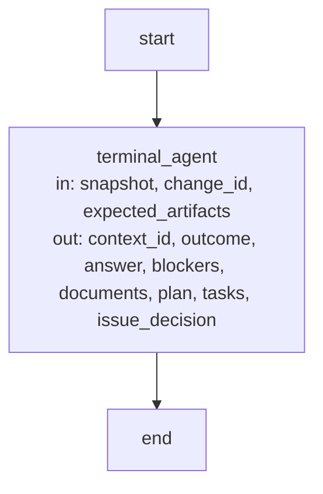

# Harness execution and record contracts

These are the precise implementation agreements and executable Graph specifications owned by the
[Harness Module](module.md). Explanatory topics introduce their purposes; exact identities, limits
and transitions are retained here as the single detailed contract.

## Terminology

| Term                                                      | Meaning / definition                             |
| --------------------------------------------------------- | ------------------------------------------------ |
| [Operation](../module.md#terminology)                     | Defined in Concorde Framework.                   |
| [Worker](../module.md#terminology)                        | Defined in Concorde Framework.                   |
| [Worker profile](module.md#terminology)                   | Defined in Harness.                              |
| [Harness](../module.md#terminology)                       | Defined in Concorde Framework.                   |
| [Host](../module.md#terminology)                          | Defined in Concorde Framework.                   |
| [Graph](../module.md#terminology)                         | Defined in Concorde Framework.                   |
| [Pi integration](../module.md#terminology)                | Defined in Concorde Framework.                   |
| [Context](../module.md#terminology)                       | Defined in Concorde Framework.                   |
| [Grant](../module.md#terminology)                         | Defined in Concorde Framework.                   |
| [Snapshot](../module.md#terminology)                      | Defined in Concorde Framework.                   |
| [Capsule](module.md#terminology)                          | Defined in Harness.                              |
| [Tool gate](module.md#terminology)                        | Defined in Harness.                              |
| [Spec context](context.md#terminology)                    | Defined in What information a worker receives.   |
| [Implementation context](context.md#terminology)          | Defined in What information a worker receives.   |
| [Task context](context.md#terminology)                    | Defined in What information a worker receives.   |
| [Issue](../module.md#terminology)                         | Defined in Concorde Framework.                   |
| [Evidence](../module.md#terminology)                      | Defined in Concorde Framework.                   |
| [Candidate](../module.md#terminology)                     | Defined in Concorde Framework.                   |
| [Worktree](../module.md#terminology)                      | Defined in Concorde Framework.                   |
| [Structural validation](../spec/structure.md#terminology) | Defined in What structural validation tells you. |
| [Semantic completeness](../spec/structure.md#terminology) | Defined in What structural validation tells you. |

## Operations and Harnesses {#agents-and-harnesses-operations-and-harnesses}

This document defines native Agent/Workflow admission, finite Host services and the explicitly
selected optional StateGraph Operation boundary. Historical low-level RPC/sandbox utilities are
labelled separately; they are test/diagnostic surfaces, not native capability backends. Stable
anchors remain addressable without implying that retired execution paths are current.

#### The execution model {#agents-and-harnesses-the-execution-model}

Canonical kinds are Agent (native Pi role), Workflow (authored pi-subagents composition), Operation
(explicit StateGraph flow) and Host service (finite non-model action). The compatibility inventory
retains external names and transport fields, with explicit `kind` metadata; it does not schedule
native capabilities through a Graph. Seven Agent definitions are canonical and have no parallel
model-backed Python Operation aliases. `WorkerProfile`/`WorkerBinding` are retained contract/binding
spellings, not another executable identity or a claim of filesystem isolation.

#### A1. Agent instructions and profile {#agents-and-harnesses-a1-operation-instructions-and-execution-profile}

Each Agent has its existing canonical role Spec and native prelude. Native and compatibility rendered
Agent paths contain the same instruction bytes. Profiles bind role, task/result schemas, intended
workspace/tools and limits. The Host verifies exact source/build/runtime identity before use. Context
references remain independent from tool policy and executable composition.

#### A2. Agent and Harness {#agents-and-harnesses-a2-profile-and-harness}

Native execution uses fresh file-Agent projections, explicit extensions, no inherited context/Skills
and terminal tool ceilings. File/network/credential exclusions are prompt-level model policy. Model
output is a proposal; gates stage only; Host acceptance independently checks native terminal evidence,
current contracts/intent and domain predicates. Configured-check/tester isolation remains enforced.

#### A3. Optional StateGraph composition {#agents-and-harnesses-a3-state-and-composition}

The explicitly selected Operation boundary declares typed input/output State and trusted Runtime.
It calls an authorized native Agent service supplied by the embedding, not a default model runner.
Parent StateGraphs can compose it with explicit mapping/reducers. Native workflow branches/loops stay
in authored pi-subagents code; deterministic Python services do not suspend business stacks across
model calls. USES metadata records collaborators without equating Module ownership or references.

#### A4. Invocation constraints and evidence {#agents-and-harnesses-a4-invocation-constraints-and-evidence}

Each invocation MUST bind its task, frozen context, Agent profile and instruction digests,
effective permissions, model settings and fresh identity. Reuse of an Operation never implies
reuse of its predecessor's conversation. Only explicitly admitted artifacts cross stages.

Completion MUST distinguish successful output, missing information, required human decisions,
cancellation, execution failure and exhausted limits. Failures MUST NOT retry with broader
permissions. A changed goal, context or authority requires new host admission. LangGraph State
schemas do not replace any of these checks.

#### A5. Terminal workers {#agents-and-harnesses-a5-one-level-helper-delegation}

Native Agents are terminal Pi leaves. They MUST NOT delegate tasks, create subagents or
recursively invoke capabilities, including via shell commands. Authored native workflows own their
model-call ordering; finite Host services never schedule a model. Explicit StateGraph Operations
compose only the services their trusted embedding supplied.
There is no child definition, child selection, delegation tool or extension. Retired child fields
and tools are rejected, not ignored or translated into new launches. Workers perform their own
admitted node work directly; the code reviewer receives read/check tools formerly used by its verifier.

Outer Pi/task-subagent delegation limits belong to the outer host. Concorde does not read, infer or
calculate cross-runtime current/maximum agent depth for terminal workers. Missing, incomplete,
malformed or exhausted legacy depth variables do not block a leaf launch and are not forwarded.
OperationHost.depth remains internal graph invocation nesting and evidence, not agent depth.
File/tool grants, independent result admission, cancellation and deadlines remain enforced.

#### Common worker rules and inventory {#agents-and-harnesses-common-worker-rules-and-inventory}

The build combines each canonical native prelude with its Agent role Spec. It renders identical
instruction bytes to `generated/native/<name>.md` and compatibility `generated/agents/<name>.md`.
Protocol sources are supplied through the frozen context index. The [typed inventory](../operations/execution-reference.md#operations-operation-registry)
records the seven canonical Agent profiles separately from public capability adapters and optional
StateGraph Operations; Agent entries have no State/run model aliases.

#### Task contracts {#agents-and-harnesses-task-contracts}

Each worker fulfils exactly one task contract. The table uses these typed pairs: **stage** =
`concorde-agent-stage-context` / `concorde-agent-stage-result`, **review** =
`concorde-review-stage-context` / `concorde-review-stage-result`.

| Worker           | Pair and phase/action | Admitted stage artifacts                                                                                                                                               | Result and authority                                                                                |
| ---------------- | --------------------- | ---------------------------------------------------------------------------------------------------------------------------------------------------------------------- | --------------------------------------------------------------------------------------------------- |
| spec-reviewer    | review; spec-review   | none                                                                                                                                                                   | Independent Spec findings; no author artifacts or writes                                            |
| context-assessor | stage; context-solve  | none                                                                                                                                                                   | Sufficient, incomplete, unsupported or conflicting assessment; no authored artifacts                |
| planner          | stage; plan           | optional concorde-plan-artifact                                                                                                                                        | Plan only; external references readable; no source contents or writes                               |
| task-author      | stage; tasks          | required concorde-plan-artifact and concorde-task-identity-constraints; optional concorde-implementation-task, concorde-review-result and concorde-task-scope-feedback | Implementation acceptance tasks with new IDs outside the reserved set; no source contents or writes |
| programmer       | stage; implementation | required concorde-implementation-task; optional concorde-review-result                                                                                                 | Fulfilled tasks only; may write the selected Module's listed implementation paths                   |
| code-reviewer    | review; code-review   | none                                                                                                                                                                   | Independent code findings; authorized code read-only                                                |
| issue-solver     | stage; issue-solve    | required concorde-issue-selection                                                                                                                                      | Bounded next action or disposition; Spec-only, no project writes                                    |

The host selects the worker before freezing its context and compiling its permissions, and the
executor checks that selection again before any process starts. A context of the wrong type or
phase, unadmitted or missing required artifacts, implementation contents
admitted to a worker without implementation reads, and a policy wider than the contract are
rejected. After the process, a result whose type, outcome or populated fields the contract does not
permit is rejected: disallowed authored fields as `permission_denied`, other contract violations as
`invalid_completion`. Reviews additionally bind the matching `review_mode`. Spec-only workers never
receive source contents or project writes; the programmer receives only the bound Module's
authorized code; read-only code review grants enumerate the frozen implementation
files, so a listed directory cannot widen them to hidden, excluded or later-created files.

The programmer executes useful tests its grant supports. A listed test does not grant transitive
imports or repository fixtures; an unavailable input is recorded as deferred host verification,
never as a passing result, and actual defects and unfulfilled obligations still prevent completion.
The Issue solver uses its own issue-solve phase and a selected problem, not an implementation grant.
Ordinary development stages may receive the host-bound concorde-issue-intent. Tasks/implementation
repair receives selected concorde-issue-context observations alongside the admitted review result.

Every phase, target, repair and review has a fresh invocation identity and frozen context. Sharing a
role never shares a conversation, private reasoning, stage inputs or write grant between workers.
Only explicitly admitted structured artifacts cross stages.

### Design {#agents-and-harnesses-design}

#### Responsibilities and implementation boundaries {#agents-and-harnesses-responsibilities-and-implementation-boundaries}

[Harness admission](admission.md) and finite dispatch admit requests and prepare exact native
Agent calls or authored workflows. Planning, Implementation, Review and Issues own their domain
predicates; native workflows own model order and stopping branches. This Module resolves complete
contexts, role/build bindings and terminal tool ceilings, stages proposals and independently admits
results. Native file/network/credential limits remain prompt policy. Historical RPC utilities and
actual tester/check OS isolation do not supply a universal native sandbox.

## Operation Graphs, loops and feedback {#graphs-and-loops-operation-graphs-loops-and-feedback}

Orchestration coordinates Operation invocations and control decisions toward a declared goal. A Graph describes the structure of that coordination; a Loop describes feedback
driven execution. They are related concepts, not interchangeable names.

**Graph** is Concorde's name for an executable LangGraph `StateGraph`. Every Graph is built with
LangGraph's Graph API, which declares nodes and edges before compilation; the Functional API
(`entrypoint` and `task` from `langgraph.func`) is not used anywhere in Concorde's source or
scripts, because a Graph whose control flow lives inside ordinary Python compiles to a single
opaque node with nothing for a Graph Spec, the Graph Spec check or Studio to inspect. Authored
descriptions and new Python factories use Graph and `build_*_graph`; LangGraph API names such as
`StateGraph`, `get_graph()` and the `graphs` configuration key keep their library spelling.
Retained stable Spec identities remain addressable. Deleted operation identities have no import
aliases; persisted historical `graph` records are history rather than executable prerequisites.

A Graph's state is a typed LangGraph state schema. Each retained Graph declares its own channels
and reducers; historical development/specification Graph records are not executable prerequisites.
An explicitly selected Graph can execute a supplied native Agent service through an
`OperationNode`: a State-based node/subgraph adapter whose input schema is generated from the worker contract's
admitted context type and whose output schema is generated from its result type, so the contract is
the graph state, and the Pi worker launch with its admission checks stays a host-private launcher
outside that state. The same `OperationNode` factory is exposed for inspection
inside the Graphs that run it.

A Graph's compiled nodes and edges are the authority for execution views. Inspection compiles the
same factories used by execution without invoking nodes, reading project contexts or launching
Agents. Within an optional StateGraph, its own branches and handoffs belong in Graph transitions.
Native capability branches and repeated decisions instead belong in authored pi-subagents workflows. Ordinary Python inside a node may validate data, prepare a context, perform one Agent
invocation or carry out a deterministic operation. An atomic delivery transaction may remain one
deterministic node so its repository lock and rollback boundary stay intact.

Runtime-dependent Module selection, resume entries and scope produce explicit conditional edges
or bounded Graph variants. A viewer must identify the variant or expose the possible branches; it
must not present hand-authored topology as executed code. Runtime-only host objects and callbacks
are not public inputs or durable checkpoint values. Stateless internal Graphs are inspectable but
do not promise internal checkpoint resume; replay re-enters admission through the public boundary.

#### Dispatch terminology {#graphs-and-loops-dispatch-terminology}

**Code-driven** dispatch uses explicit code rules to choose the next action, target Agent and
continue/stop condition. **Model-driven** dispatch uses a model's task and feedback assessment to
recommend the next action in its result. These name the source of a decision; the selected native workflow or explicit StateGraph composition owns ordering, never the terminal Agent. Human decisions remain
separate, explicit inputs. Code-driven control does not guarantee reproducible overall output:
models, tools and external state may still vary. Determinism is a property to document where it
applies, not the primary classification of Agents or dispatch.

#### G1. Operation Graph {#graphs-and-loops-g1-operation-graph}

A Graph MUST declare its participating Operations, State contracts and directed transitions. Transitions MUST identify their trigger and
the information they transfer. Conditional branches, parallel execution or joins, when used, MUST
define selection, completion and failure behavior. A sequence of deterministic installation steps
does not become model-backed merely because it has several steps.

The Graph MUST identify which model Operation makes each model-assisted decision, which transitions are
code-driven, and which require a human decision. It MUST preserve invocation-local context and
permissions across every handoff. A coordinator receives only admitted results; dispatching an
model Operation does not grant access to its complete private context.

A Graph MAY be exposed as an Operation with a complete external contract. Invoking that Operation
does not expose its internal model workers or grant authority to call arbitrary internal nodes.

#### G2. Feedback loop {#graphs-and-loops-g2-feedback-loop}

A loop MUST define how execution moves through decision, action, observation and feedback,
and how those observations affect the next action. It MUST define completion, revision, waiting,
cancellation, failure and execution-limit conditions. Limits may be time, iterations, resource
budgets or an explicit bounded host policy; an unbounded retry is not an implicit default.

A native Agent's Pi runtime supplies its local tool loop. Authored native workflows coordinate
capability-level loops, including Issue decisions and verification; optional StateGraphs coordinate
only their explicitly selected composition. Each local and enclosing loop MUST have distinguishable
state and completion conditions. One terminal Agent never starts another. Each worker does its own admitted work directly, as defined in A5.

A retry or revision MUST identify what changed or what recovery condition permits another attempt.
Unchanged blocking feedback MUST not cause endless retries. Stale task, context, policy or result
identity requires re-admission before execution continues. Completion of an inner loop does not
automatically complete the enclosing Graph or authorize delivery.

#### G3. AI and human feedback {#graphs-and-loops-g3-ai-and-human-feedback}

Feedback MUST identify its source, subject, relevant task or result revision, finding or decision,
and the transition it can affect. AI feedback and human decisions MUST remain distinguishable.
The representation may use existing typed review, task and acceptance artifacts; this requirement
does not introduce a separate comment store or mandatory feedback report.

| Feedback                        | Example                                                            | Permitted effect                                                  |
| ------------------------------- | ------------------------------------------------------------------ | ----------------------------------------------------------------- |
| AI assessment                   | A context assessor identifies a necessary missing contract         | Block the dependent step and name the required information        |
| AI review                       | A reviewer identifies a defect against the bound Spec              | Select an admitted repair path and recheck the revised result     |
| Human clarification             | A developer supplies missing intent or corrects a goal             | Produce an explicit task or context revision for fresh admission  |
| Human acceptance                | A developer accepts a specific initialization or delivery proposal | Enable only the transition and effects covered by that acceptance |
| Human rejection or cancellation | A developer rejects a proposal or ends the task                    | Revise, wait or terminate according to the Graph contract         |

AI feedback cannot substitute for a required human acceptance. Human text that merely mentions a
Tool or broader context is not an automatic permission grant. Every transition MUST preserve the
applicable task, context and authority checks. A graph receiving no answer to a required decision
remains waiting; elapsed time is not acceptance.

#### G4. State, recovery and evidence {#graphs-and-loops-g4-state-recovery-and-evidence}

Execution evidence MUST identify the Graph and loop policy, participating Agent invocations,
admitted feedback and selected transitions. It MUST distinguish completed, waiting, blocked,
cancelled, failed and limit-exhausted outcomes. A supported resume operation MUST revalidate the
saved state and feedback against the current task and authority before choosing the next transition.

Historical development-graph transition records and their `trigger` strings remain diagnostic
history, not a requirement to run a deleted graph or fabricate new transitions.

Review and check results are evidence about the bound revision. They do not remain valid after
relevant Agent Specs, Harness configurations, operation contracts, project inputs or policies
change. Raw logs and native transcripts remain diagnostics unless explicitly admitted as typed
downstream inputs.

#### Graph Specs {#graphs-and-loops-graph-specs}

Every executable Graph is specified with LangGraph's own three concepts, and nothing else stands
in for them: a **node** is one executing step, an **edge** is one routing decision, and **state**
is what a node reads and writes. A Graph Spec is one section of an implementation-role document of
the Module that owns the Graph, headed by the Graph's title and compiled name. It states three
parts in this order, each opening a paragraph with its bold label:

1. **State.** The typed channels the Graph carries between nodes, with their reducers where
   several writers merge, and the candidate or lifecycle records its nodes read and write.
2. **Nodes.** A table with the columns `Node`, `Executes`, `in` and `out`: one row per compiled
   node other than `__start__` and `__end__`, named exactly as the compiled Graph names it, what it
   executes (a deterministic, model-backed or composed Operation with its execution mode), and the
   state it reads (`in`) and writes (`out`) in the same words as its diagram label.
3. **Edges.** How the next node is chosen: which nodes decide, whether a conditional edge reads a
   State channel such as `route`, `result`, `output` or `stop` or the node returns a LangGraph
   `Command` naming its successor, and where stops and errors lead. A Mermaid flowchart follows,
   bound to the compiled Graph by the comment `%% graph: <name>`, where `<name>` is the Graph's
   compiled graph name in the Graph catalog. Its node identifiers are the compiled node names,
   `__start__` and `__end__` included; every node label states the node name, then `in:` and
   `out:`; every edge leaving a node with several successors is labeled with the condition that
   selects it, and an edge leaving a node with one successor carries no label.

**Reading the state labels.** `in` lists Graph channels actually read by the node, not every
channel present in its input dictionary. `out` lists its possible channel updates, not the whole
post-node State; an omitted channel retains its previous value. `none` means no channel read or
no update, not no business input or effect. `?` marks a conditional input/update or an optional
subgraph boundary channel. For a registered subgraph node, the labels name channels admitted at
that boundary, and the child's own Nodes table explains the actual reads/writes inside it. Unless a
Graph declares a reducer, updates replace the channel value (LangGraph's single-writer/last-value
semantics); this is not an implicit list append or concurrent merge. Tables describe normal node
updates plus the admitted invocation's guard updates; an error can stop before normal updates exist.

The `Executes` column and State prose separately identify inputs and effects held by trusted Host
objects, node closures or durable candidate records. They are not serialized State channels. A
`Command(goto=..., update=...)` separates control from data: `goto` is a destination, not a write
to `route`. Conditional edges instead read the updated State. A subgraph shares only the channels
admitted by its parent/child schemas; calling another Operation inside a node through admission
is not the same as registering that Operation as a compiled subgraph node. Internal Graphs disable
checkpointing; these diagrams do not promise that Host closures can be recovered from State alone.
A guarded admission/dispatch node resets `result` to None on success; on error it writes the
failure envelope and selects `__end__` through `route` or `Command.goto` where applicable.
Nested helpers without that guard propagate exceptions to the enclosing guarded invocation.

An Operation that runs a Graph is explained in the reading of the Module that owns the Operation,
and the owning Module's module-role reading links to the Graph Spec's explicit heading anchor. The
Graph Spec is the only place its nodes, state and routing are drawn: no separate page or generated
view repeats them.

The Graph Spec check (`scripts/development/check-graph-specs.py`, the configured
`check.harness.graph-specs`) compiles every catalog Graph with inert nodes and reports each
diagram whose nodes, edges, routing labels or state labels disagree with the compiled topology,
and every compiled Graph without a diagram. For each bound diagram it also reports a section that
is not in an implementation-role document, lacks or reorders its State, Nodes and Edges parts,
has a Nodes table that does not name exactly the compiled nodes with the `in` and `out` state of
their diagram labels, or has a heading without an explicit anchor or without a link to it from a
module-role document of the same owner. It also enforces the Graph API rule: a catalog Graph
that is not a compiled `StateGraph`, and any Python file under `src/`, `scripts/` or `operations/` that imports
`langgraph.func`, found by parsing the file rather than running it, are errors. A diagram that
passes proves the Spec and the executed topology agree; it proves nothing about whether the
routing conditions are right, which the scenarios and tests of the owning Module cover. The Relationships diagram of a Module's
reading entry remains the entity diagram the Protocol defines; Graph Specs live in other sections
or documents.

### Design {#graphs-and-loops-design}

#### Concorde Graph responsibilities {#graphs-and-loops-concorde-graph-responsibilities}

Finite admission and dispatch validate caller-selected entries. Native planning assesses before
planning; native review scopes preserve separate contexts; bounded native Issue solving verifies
or returns repair intent. The optional graph catalog contains only the explicitly selected terminal
Agent Operation. No admission/dispatch/batch/Issue Graph runs underneath public capabilities.

## Native result acceptance

`NativeResultGate` is a deterministic Host service, not an Agent or a scheduler. Its constructor
binds one invocation identity, one absolute Host-selected scratch proposal path, a current-input
recheck, a result validator and the provider's acceptance/persistence callback. These callbacks
are trusted code, never task input. `submit` checks the identity, closed result schema and business
constraints and exclusively writes at most 1 MiB of canonical UTF-8 proposal JSON. The Host retains
its exact bytes and digest independently of that file. Submission returns an explicitly unaccepted
receipt and does not advance task completion. Invalid submissions can be corrected; a successfully
submitted proposal cannot be replaced.

The native Agent uses `outputSchema` and its terminating `structured_output` tool. Concorde's
`observeNativeProposal` observes the successful tool result's `input.value` through Pi's supported
`tool_result` event and supplies that untrusted proposal to the bound Host service. Duplicate
structured submissions invalidate the slot rather than silently replacing its first proposal.
Native structured output remains model data; it is not a Host control result. No assistant prose
or second model-authored acceptance report is required. The native request selects
`agentContract: {version: 1}` and one plain gate without JSON-typed gate output.

The native child's plain post-run gate calls `stage`, never the persistence callback.
Pi-subagents may execute a gate after failed child execution and can observe cancellation after a
gate returns. Staging therefore checks the same invocation, rejects symlinked or changed proposal
bytes, rechecks current context/task/configuration and declared policy and validates the result
again, but returns a closed canonical-JSON control document with exactly `schema_version: 1`,
`ticket`, `invocation_id`, `proposal_digest`, `state: staged` and `accepted: false`. Its control DTO
is at most 8,000 UTF-8 bytes, below the native verification-stdout limit; larger values fail rather
than truncate. The workflow reads the actual plain gate's `acceptance.verifyRuns[0].stdout`, not
`child.structuredOutput`, and checks the whole document's version, keys, identity and digest binding.
Missing, mixed, duplicate-key, malformed, noncanonical, oversized or truncated stdout is rejected;
there is no JSON-substring or model-prose control parser. Canonical ASCII encoding permits bounded
validation inside the native workflow sandbox without unavailable Node or web globals.
Full results and evidence remain Host artifacts. Native run receipts and model prose cannot
replace these checks.

A separate `finalize` calls a trusted native-execution verifier, repeats proposal/current-input
checks, then calls the provider's trusted acceptance/persistence service. A repeated accepted
finalization checks current inputs and returns a copy of its control value without replaying
persistence. Failed or uncertain acceptance is terminal and requires fresh admission or the
provider's explicit recovery, including the existing Issue closure journal. Cancellation and
failed child execution revoke unsettled acceptance and retain partial edits. Cancellation after
a durable domain commit does not erase that commit or imply rollback; the enclosing execution
outcome remains a separate fact.

`verify_native_children` takes the exact native async directory, run/session identity and ticket
bound by the owning Pi extension from actual tool results, plus the Host-issued child inventory.
It reads the documented `status.json` and native per-child metadata referenced by authored
workflow emissions, not a caller's success booleans. It requires exact nonempty coverage, unique
keys, matching parent/child run and Agent identities, completed status, zero native exit, no
execution error, verified acceptance and the exact gate command/proposal digest in its staged
control value. It rejects missing, oversized, aliased, changed or incomplete evidence. The
read bound is 16 MiB per native record; it never truncates into successful evidence.

The required adapter ordering is native terminal child status and metadata publication before
finalization, with authored workflow emissions carrying native references before the final Host
step. Missing or stale best-effort native publication blocks finalization. The enclosing workflow
may still be running at the explicit domain commit boundary: this avoids depending on a workflow
receipt published only after that step. A native failure after a successful staging gate cannot
commit. Every admitted reviewer retains separate coverage, including scopes above the native
thirty-two-Host-command bound; there is no per-child Host command requirement.

The migrated native capabilities use these acceptance primitives and bind provisional within-workflow
handoffs explicitly and recheck admission before every dependent model launch; staged values
cannot masquerade as ordinary accepted plans, tasks or readiness evidence.

The artifact adapter admits `pi-subagents-0.69.0-versionless-v1` only through a trusted
`NativeRuntimeBinding`. `admit_native_runtime` checks the explicit package root, package identity
and the reviewed serialization/control-source digests in `pi/native-runtime-contract.json`.
Missing or changed sources, other package revisions and unsupported adapter contracts fail without
fallback. This is compatibility provenance for the named sources, not a signature or attestation
of every third-party byte. The admitted workflow status and child debug metadata have **no artifact
version field**; that absence is retained as null, never called lifecycle schema 3. A newly present
version field requires an explicit compatible adapter. Actual detached single-run lifecycle status
has its separate upstream version and is not substituted for the versionless workflow record.

The native extension binds a ticket to the actual async launch response's run ID and async directory,
with the originating tool-call/session identity. Resource registration uses the SDK session ID;
artifact ownership instead uses `getSessionFile() ?? getSessionId()`, retaining the exact path or ID
rather than guessing equivalence. An initial finite Host step may start before the launch response
is delivered: it waits for that exact binding under a deadline, launches no model while unbound,
and fails on missing or mismatched data. Returned native metadata paths are carried through authored
workflow emissions and checked against the independently published child status; an emitted success
boolean has no authority.

Awaiting `runs.run` must produce one terminal result with successful native execution and validated
staging output, no detached/interrupted/stopped/partial outcome and no metadata/output publication
error. Explicit child `async: true` can return an initial launch receipt instead; its `ok` alone is
not completion. For detached children needing `extensionBindings`, the Agent's native async default
is selected and the workflow omits the child async override so native awaiting remains active.
Foreground launches do not supply the same per-child process-environment binding transport.

The inspected native artifact writers retain complete workflow steps, traces and emissions, and
serialize complete per-child metadata without an observer child-count cap. The fifty-entry retained
foreground-run history limit does not remove those files; it is not the review inventory. Native
fanout budgets remain real host grants (default sixty-four logical children, explicitly configurable),
not authority for Concorde to add a thirty-two-review limit. Native output previews and verification
stdout are separately bounded; complete acceptance records, not model text or display previews, supply evidence.
Startup/session-start artifact housekeeping can remove old files under its configured age policy;
normal per-child completion does not age-scan them. Missing retained evidence still blocks, and
Concorde must archive required evidence through its existing primary authority rather than promise
indefinite native retention. Fresh-script/native publication dependency probes are deterministic
checks with model execution replaced; they prove neither actual model judgment nor file confinement.

This service supplies result admission only. It neither proves that a child stayed within its
selected read scope nor prevents arbitrary filesystem writes. Native Agent file restrictions are
prompt-level unless a separately named actual enforcement path applies. The caller must prepare
and recheck admission before a model launch; post-run acceptance cannot retroactively authorize it.

## Agent execution {#execution-agent-execution}

#### Configured deterministic checks {#execution-configured-deterministic-checks}

This host-only service runs configured commands without a model invocation. It is independent of
worker model selection and of the worker tool gate. Checks can read project files; their own
temporary files, caches and reports belong in fresh host-managed space outside the project.
Creating, modifying, moving or deleting a project file is denied at the attempted system call,
including a write followed by restoration. Project-local lifecycle and log paths are read-only too.

```python
execute_check(project_root: Path, argv: Sequence[str], *, timeout: float,
              environment: Mapping[str, str], private_tmp: bool = False) -> CheckResult
CheckResult(stdout: bytes, stderr: bytes, returncode: int, timed_out: bool = False)
CheckBackend.run(project: Path, argv: Sequence[str], scratch: Path,
                 environment: Mapping[str, str], timeout: float) -> CheckResult
```

The backend interface is trusted host code, never a registry field or a task-supplied executable.
Only Linux's BubblewrapBackend is currently supported. It requires a root-owned system bubblewrap,
user/mount/PID/IPC namespace support and kernel pidfds exposed by Python or libc. System file owners
unmapped by a parent check namespace are admitted only on its already read-only system mounts.
Missing binaries, unsupported
platforms, denied namespace setup, unsafe project locations and unavailable external temporary
storage raise `CheckSandboxError(RuntimeError)`. That exception retains byte `stdout`/`stderr`
diagnostics for the host. No failure retries through ordinary subprocess or weaker permissions.
An empty command, non-directory project or nonpositive/nonfinite timeout is also rejected.

Every call creates independent scratch storage even when ambient TMPDIR points into the project.
`TMPDIR`, `TMP`, `TEMP`, `XDG_CACHE_HOME` and `npm_config_cache` point into that storage;
`CONCORDE_CHECK_TMPDIR` names its root and `CONCORDE_CHECK_REPORT_DIR` its reports directory.
`PYTHONDONTWRITEBYTECODE=1` avoids routine Python cache attempts but is not the write boundary.
Hardcoded project cache/report paths must migrate; tools that modify sources belong in implementation.

The trusted tester bridge alone selects `private_tmp=True` (`tester-private-tmp-v1`). It is an
optional host API boolean, not a registry, environment or model-command parameter; other values
are rejected. The default and `project-read-only-v1` configured-check policy are unchanged.
This profile binds an empty `private-tmp` directory within the issued scratch onto `/tmp`, so
hardcoded worker policy/config/socket temporary directories work without a writable real host
`/tmp`. No runtime assets are copied or staged: fixture Frameworks, virtual environments and Pi
dependencies still use complete local installations and their existing read-only worker mounts.

Preexisting host `/tmp` is exposed read-only at `CONCORDE_TEST_HOST_TMP` (the issued scratch's
`host-tmp` mount). Commands must use that explicit view for other host-/tmp input artifacts; there
is no argv rewriting or unspecified path substitution. Absolute `/tmp` links or paths embedded in
other input scripts are not retargeted; callers explicitly use canonical inputs through the view
and account for path-sensitive tools rather than acquiring extra mounts. Governing project, executing Framework,
Python prefix/base prefix and interpreter locations under `/tmp` retain their original canonical
names by read-only binds of their top-level `/tmp` ancestors. No task can supply these mount
sources. A governing project/runtime at `/tmp` itself is refused rather than exposing it writable.
Other old `/tmp` names are hidden unless covered by those preserved ancestors. Issued scratch
remains writable at its exact absolute name; new `/tmp` entries belong only to the private backing.
All backing directories and temporary policy/config/socket data disappear with the same scratch
lifetime, after PID-namespace descendant cleanup on success, timeout, failure or cancellation.
Scratch and reports are ephemeral and disappear after the check. No report import into the project
is implicit. Standard output/error remain separate byte streams for outside-host persistence.

The result preserves command exit status using bubblewrap's shell encoding, including `128+signal`
for signal termination. A timeout, including sandbox setup time, returns `timed_out=True` and
`returncode=-1` with captured partial output. Host cancellation propagates after cleanup. A missing
trusted successful-exec status is an isolation/launch error, not an ordinary check failure. A
successful sandbox exit establishes execution under this boundary, not test adequacy or semantic
completeness. The calling host remains responsible for digest and candidate freshness checks;
`CHECK_POLICY="project-read-only-v1"` identifies this execution guarantee for evidence invalidation.

#### Required Agent and Harness boundary {#execution-required-agent-and-harness-boundary}

The native boundary binds the canonical Agent, frozen context, intended policy, actual terminal
tools, model selection and launch identity before launch. Public preflight, proposal capture and
independent terminal/currentness admission apply. Historical `WorkerExecutor` preflight below is
only the low-level RPC diagnostic/test contract, not an additional native execution layer.

#### Worker execution {#execution-worker-execution}

**Historical low-level RPC/sandbox fixture contract only.** This section describes retained test/diagnostic
utilities, not a selectable native capability backend. It does not promise native Agent confinement.
Current native execution and actual tester/check enforcement are specified separately below.


`WorkerExecutor` runs one host-built `WorkerInvocation` as one Pi worker and returns a
`WorkerOutcome`, or raises `OperationExecutionError`. The local companion contract **Agent runtime
value and collaborator contracts** defines these records, the invocation builder and the preflight;
the [Pi worker runtime](#execution-pi-worker-runtime) below defines the process.

##### Workspace kinds {#execution-workspace-kinds}

A worker profile declares `workspace: capsule` or `workspace: project`; the registered workers and
their kinds are listed in [Agents and Harnesses](execution-reference.md).

- A **capsule** is a host-created temporary directory outside the project root, created for one
  invocation immediately before launch and removed after the host has verified it. It contains
  `context.json`, holding the frozen snapshot bytes, beside byte-identical copies of every Spec
  document and Protocol file that index lists, at their project-relative paths, plus the copied
  external references a worker with the `references` effect receives. It is the Pi process's
  working directory, and the tool gate's read grant is that directory, so the project root, the
  candidate worktree, other worktrees and the developer's home directory are outside the grant.
  The Spec-review, assessment, planning, Issue-solving and task workers use this kind.
- A **project** workspace is the candidate worktree itself and the Pi process's working directory.
  The snapshot is written below `.concorde/work/<invocation>/<uuid>/context.json` inside that
  worktree; the grant covers it, the Spec documents and the installed Protocol copy under
  `.concorde/protocol/` it indexes, at their project paths, and the selected Module's
  implementation: its listed entries with write authority for the programmer, its enumerated files
  read-only for the code reviewer. The Issue solver uses a Spec-only capsule.

In both kinds the host rereads the snapshot file after the worker settles and rejects a result whose
file bytes, registry digest, document digests or initialized configuration changed during execution
with `stale_context` or `configuration_mismatch`.

##### Input and result {#execution-input-and-result}

A historical RPC diagnostic worker's system prompt is the exact supplied invocation instruction
bytes with its explicitly bound Protocol rules. Loading a current role projection yields the native
prelude plus role Spec, not a restored common-worker-rules rendering; this diagnostic transport is
not a native Agent backend or evidence of live prompt compatibility. Its only message is the canonical typed
context: task context inline, Spec context as the index of granted files. Its output contract is its
`submit_result` tool, whose parameters are the self-contained JSON Schema of the contract's result
type narrowed by the verified worker profile's permitted authored fields. Optional fields the
profile cannot author are omitted from the closed tool schema; required compatibility fields keep
their original schema and additionally admit only their empty value (an empty array or string, or
null for a nullable field). Fields the profile can author retain their wire schemas.
For example, a planner can submit a plan but cannot submit document replacements or an Issue solver's
`issue_decision`; only the Issue solver retains that optional field. The shared wire type and graph State channels
are unchanged. Tool validation rejects unauthorized populated fields before successful submission
ends the run, allowing a corrected submission within the same invocation and original deadline;
this is not a host retry or wider grant. The executor still wraps the single submitted value as its
wire type and independently checks the profile contract, rather than trusting tool validation or
silently stripping unauthorized output. The host then checks context identity and gap provenance
before accepting stage completion. Independently, each admitted worker may use `report_issue` to
persist an observation through a host-issued, scope-bound callback before submitting its final result. Report admission
is separate from completion; accepted reports survive an invalid or interrupted final result.
The [Issue reporting boundary](../issues/execution-reference.md#issues-worker-reporting-service) defines report
shape and authority. A worker in a project workspace also receives the host check service behind
`run_checks`.

##### Common limits {#execution-common-limits}

The Pi process runs as the developer's user inside the [worker sandbox](#execution-worker-sandbox)
with the developer's Pi credentials copied into its run directory, and talks to its model provider
over the shared network. The gate bounds what the model's tools can reach; the sandbox bounds the
process, so a shell command run by a worker granted `bash` can write only the grant and cannot read
the masked secret locations or other worktrees. The credential paths the compiler always denies
(`.env`, `.aws`, `.ssh` and the other listed entries) are project-relative entries; home-directory
secrets are masked by the sandbox's fixed list, and the credentials the process itself needs remain
readable inside it.

#### Pi worker runtime {#execution-pi-worker-runtime}

**Historical low-level RPC/sandbox fixture contract only.** This section describes retained test/diagnostic
utilities, not a selectable native capability backend. It does not promise native Agent confinement.
Current native execution and actual tester/check enforcement are specified separately below.


A Pi worker is one Pi coding agent process run in RPC mode for one bounded task. Pi calls the
worker's model through its own providers and executes its built-in tools; for legacy workers LangGraph stays the
orchestration around it. `PiWorkerRuntime` launches one `WorkerLaunch` and returns a
`WorkerResult` or raises `WorkerExecutionError`:

```python
WorkerLaunch(worker: str, workspace: str, system_prompt: str, message: str,
             result_schema: Mapping[str, Any], tools: tuple[str, ...],
             read_paths: tuple[str, ...] = (), write_paths: tuple[str, ...] = (),
             model: str | None = None, thinking: str | None = None, timeout_seconds: float = 1800,
             report_schema: Mapping[str, Any] | None = None)
PiWorkerRuntime(package_root: Path, pi_executable: str | None = None,
                environment: Mapping[str, str] | None = None, credentials_dir: Path | None = None,
                popen=subprocess.Popen)
PiWorkerRuntime.__call__(launch: WorkerLaunch, *, checks: Callable[[], Any] | None = None,
                         report_issue: Callable[[dict], Any] | None = None) -> WorkerResult
WorkerResult(value: dict[str, Any], run: PiRun, usage: dict[str, Any])
WorkerExecutionError(message: str, outcome: "failed"|"cancelled"|"limit_exhausted"|"invalid_completion",
                     run: PiRun | None = None)
run_prompt(argv, *, cwd: str, env: Mapping[str, str], message: str, timeout: float, popen=subprocess.Popen) -> PiRun
```

Paths in a launch are relative to its absolute workspace, which is the process's working
directory. `model` is Pi's `provider/id` and `thinking` one of Pi's levels (`off` through `max`).
The tools are Pi's built-ins (`read`, `grep`, `find`, `ls`, `edit`, `write`, `bash`) and the
Concorde tools: `submit_result`, which every worker has; `run_checks`, which requires the host
check service; and `report_issue`, which requires both its host callback and report schema.
Edit and write require a write grant. No delegation or recursive Operation tools are admitted. An inconsistent launch
is refused before any process starts. The executor accepts an optional host reporter with a
`schema` property and callable report handler, forwards it only to the admitted runtime, and does
not convert reporting authority into any file write grant. The invocation host supplies
this service for actual worker launches, including capsule workers, but not policy previews.

An RPC failure retains the finished `PiRun` on the exception through the runtime and executor,
including the process exit status and a bounded stderr tail. Public error messages contain only
host-authored summaries, never raw RPC rejection details or stderr. For a failed worker launch,
the host preserves the last 20,000 UTF-8 bytes of stderr with the launch identity, worker, outcome,
exit status and elapsed time in a mode-0600 `worker-*.json` diagnostic under
`.concorde/runs/<root invocation id>/`. The public error may name this host-only artifact but does
not embed its contents. Prompts, RPC events, tool results and credential files are not serialized
into that artifact or observer events. These diagnostics confer no worker read grant, do not count
as successful execution evidence, and a persistence failure preserves the original execution
failure without retrying. EOF, cancellation, timeout and protocol failure keep their existing
outcome distinctions.

The private Unix socket dispatches only explicitly granted `run_checks` and `report_issue` calls.
Requests must be complete newline-terminated JSON frames of at most 128 KiB, received within ten
seconds. Reporting parameters are validated by the bound host callback, which returns only a
receipt. A rejected callback returns an error that the extension throws as a failed tool result,
not a successful receipt. Reporting never returns `terminate`; the worker can continue reporting
or working. Accepted persistence is retained if cancellation disconnects the client before the
acknowledgement arrives.

#### Usage accounting {#execution-usage-accounting}

Pi reports what a run consumed in its session statistics, which the runtime reads after the worker
settles: input, cached input, output and total tokens, cost and assistant turns. The executor
records them as an `ExecutionUsage` record on the `WorkerOutcome`: the configured `model` and
`thinking` level, `input_tokens`, `cached_input_tokens`, `output_tokens`, `total_tokens`,
`cost_usd`, `turns`, host-measured `wall_seconds`, and the `prompt_bytes` and `context_bytes` the host
handed the process. A figure Pi did not report is `None`, never zero.

In the primary worktree only, the host records one line per launch through `record_usage` in `.concorde/runs/<root invocation
id>/usage.jsonl`, with `schema_version: 2` and labelled with `operation`, `stage`, `target_id`, `agent`, `change_id`, the
launching host's `invocation_id` and `depth`, the launch's own `launch_invocation_id`, `context_id`
and `model`, and the usage record. The root invocation id is the top-level operation invocation's
identity, inherited by every nested operation invocation (`OperationHost.root_invocation_id`), so
one Graph run keeps one file. The same record reaches the host observer as an `agent_usage` event.
`read_usage` and `summarize_usage` aggregate the lines per step (operation, stage and target),
stage, target, worker and run; the `concorde usage` Tool and the executable boundary's stderr summary
use them. Usage is diagnostic evidence about cost: it gates nothing, and a failure to persist it
never fails the launch. Summaries use schema 2 and report `complete`, `historical_records` and
`unsupported_records`, including in the executable boundary's stderr summary. Unversioned historical
lines with the old `capability` label are read-only diagnostics: aggregate their original step labels
and count them explicitly as historical, without rewriting files or treating them as current
execution evidence. Unknown formats, including unversioned lines claiming the new `operation` field,
are excluded from totals and make the summary explicitly incomplete; they are not grouped under a
silently invented null Operation. See [usage accounting](scenarios.md#scenario.harness.usage-accounting).

#### Diagnostic timing {#execution-diagnostic-timing}

A diagnostic span has schema_version 1, trace_id, span_id, nullable parent_id, layer A/B/C,
name, process_id, nullable session_id/task_id, started_at (UTC wall timestamp), process-local
monotonic start_ns, nullable duration_ns, status ok/error/cancelled/incomplete and bounded metadata.
A trace is diagnostic identity, not an invocation grant. Host-issued root/invocation/launch and
context identities correlate runtime work; standalone installation may use a diagnostic UUID.
Unknown fields and absent measurements do not become zero. Clocks from different processes are
not subtracted; analysis reports per-process interval unions and summed work separately.

Runtime spans cover admission, relay/worktree creation, local package admission/verification,
installation and managed-runtime acquisition, health and launcher probes, context/preflight,
worker/Pi execution, sandbox preparation, RPC acceptance/round/tool intervals, configured checks,
result validation and evidence/lock work. The host observer receives bounded timing at completion;
trusted host persistence uses primary run paths, locks and mode-0600 diagnostics. Sink errors mark
telemetry incomplete without changing the Operation result or retrying a mutation. A bounded
in-memory trace retains at most 20,000 spans and counts omissions.

Standalone deterministic fixtures can explicitly select an existing canonical external directory
with CONCORDE_DIAGNOSTIC_TIMING_DIR. Unique private files there contain diagnostics only, not
candidate status/runs. The test runner supplies temporary per-unit storage and embeds measured
runtime spans into its report; it never guesses install time from a whole unittest duration.
This optional diagnostic location is not primary execution authority or a worker grant.

Outer observation uses existing Pi session/provider/turn/tool/compaction events and native custom
entries, including direct non-Operation sessions. It observes current context estimates/capacity,
reported input/output/cache counts and reserve when actually supplied by compaction preparation.
Unknown reserve/compaction information stays null. Role/session and hashed native lineage are
recorded separately from task authority. Main may annotate bounded handoff/test-trigger reasons
through the process-local concorde:outer-fact:v1 event; hooks never infer exhaustion, compact,
launch children or change provider/settings/tool/prompt state. Native pi-subagents events remain
owned by that package; explicit child observation extensions do not load ambient catalogs.

#### Outcomes {#execution-outcomes}

A worker's deadline is its selected `timeout_seconds`, else its profile's timeout as bound in its
`WorkerBinding`. `OperationExecutionError.outcome` distinguishes four cases so a caller need not
parse message text: `failed` for a refused preflight, a process that exits or breaks the RPC
protocol before settling, or any other launch failure; `cancelled` for a host interrupt, with the
process already killed; `limit_exhausted` for a run past its deadline, likewise killed; and
`invalid_completion` for a run with no, several or an invalid submitted result. A contract
rejection keeps its class in `code` (`permission_denied` for disallowed authored fields). None of
these outcomes triggers an automatic retry, with the same or any wider permissions. Authorized
implementation edits made before a failure can remain in the candidate; the executor does not
promise rollback.

#### Representative use {#execution-representative-use}

The wire collaborator provides `json_schema(type_id: str) -> dict` for a self-contained typed result
schema and `validate_typed(value: Any, expected: str | None = None, field: str = "") -> dict` for
strict type, version, property and uniqueness validation. Unknown types or versions, unsafe paths,
invalid fields and mismatched expected types raise `TypedDataError(ValueError)` with `code` and
`field`; the executor treats them as invalid completion, not successful output. These calls perform
no project mutation or remote schema resolution.

```python
executor = WorkerExecutor()
# invocation is already built by the trusted host with build_worker_invocation.
try:
    outcome = executor(invocation, checks=checks)
except OperationExecutionError as failure:
    reason = failure.outcome          # stop the transition; failure.usage may carry what was spent
else:
    assert outcome.invocation_digest == invocation.digest
    result = outcome.value["data"]    # the validated typed result
```

Consumers bind the outcome to the invocation and binding digests and consume the typed result
rather than raw process output. A runtime double can test these boundary mechanics but cannot
establish that a model detected a semantic gap or behavior defect.

### Design {#execution-design}

#### Check isolation mechanism {#execution-check-isolation-mechanism}

Linux recursively maps the host filesystem read-only so another pathname, hard link or external
dependency directory cannot supply a writable alias. It replaces `/proc` with the sandbox's PID
view and `/dev` with minimal private devices, drops operations, disconnects the terminal and
gives only the new scratch directory a writable host mount. Shared memory uses scratch as well.
Project roots at `/` or below `/proc`, `/dev` or `/sys` are unsupported. Additional user namespaces
remain available for nested checks; inherited read-only mounts cannot be remounted writable there.
The bootstrap binary uses a fixed system search and minimal loader environment; the supplied
check environment travels through an anonymous options descriptor rather than the public process
command line and is installed for sandbox execution. This service defines no finer read,
network or credential policy and does not mediate effects requested from external services.

The host closes inherited descriptors, supplies null stdin and captures output through pipes,
never by passing an open project log to the process. Bubblewrap's host-only metadata descriptors
are closed before command execution. A launch gate keeps the command stopped until the host pins
namespace PID 1 with a pidfd. On timeout, cancellation, failure and normal completion, the host
terminates the namespace and waits for cleanup before removing scratch. This includes descendants
that double-fork, create sessions or reset parent-death signals. Both output pipes drain while the
initial command runs, and a background process holding them open cannot prevent cleanup.

##### What the historical RPC host enforces {#execution-what-the-host-itself-enforces}

The following list applies only to the low-level RPC diagnostic/test utilities, not native Agents
or the separate configured-check/tester boundary.

- **Fresh process, closed inputs.** Every launch is a new Pi process with sessions, context files,
  skills, prompt templates, themes and discovered extensions disabled. No predecessor transcript,
  conversation or session state is passed.
- **Environment allowlist.** The process environment is rebuilt from `SAFE_ENVIRONMENT` in
  `harness.py` (`HOME`, `PATH`, `LANG`, `LC_ALL`, `LC_CTYPE`, `LOGNAME`, `USER`, `TMPDIR`, `TMP`,
  `TEMP` and their Windows equivalents), the provider credential variables Pi documents and Pi's
  own control variables. Every other variable of the calling shell is absent.
- **Binding equality.** Preflight rejects an invocation whose binding, instructions, Protocol files,
  context or policy differ from what the current build and the worker's contract admit.
- **Tool gate.** The Concorde worker extension refuses every tool call outside the compiled grant in
  the terminal worker ([tool gate](#execution-tool-gate)).
- **Worker sandbox.** The Pi process runs inside the mount plan derived from its grant
  ([worker sandbox](#execution-worker-sandbox)); an unavailable boundary refuses the launch.
- **Result admission.** Only one submitted result that satisfies the result type and the contract
  completes the invocation; a settled process alone is not completion.

##### Launch {#execution-launch}

**Historical low-level RPC/sandbox fixture contract only.** This section describes retained test/diagnostic
utilities, not a selectable native capability backend. It does not promise native Agent confinement.
Current native execution and actual tester/check enforcement are specified separately below.


Each launch gets a private run directory under system `/tmp`, outside any worktree even when
ambient TMPDIR points into a project; it is removed afterwards. Its `agent/` directory is
Pi's configuration directory for the process (`PI_CODING_AGENT_DIR`): Concorde's own settings
(project trust never, install telemetry off), the developer's
Pi credentials (`auth.json` and custom-provider `models.json`, copied from the developer's Pi
directory). No child catalog or delegation configuration is written. Beside it lie `policy.json`, which the Concorde worker
extension enforces, `system-prompt.md`, which it installs as the worker's complete system prompt,
`tmp/`, the process's temporary directory, and, for a worker with `run_checks` or `report_issue`,
the host tool service's socket. The developer's own Pi settings, sessions, agents, extensions and skills are
never read. When Pi refreshes an OAuth credential during the run, the host writes the refreshed
`auth.json` back to the developer's Pi directory, but only while that file still holds the bytes the
run was issued, so a concurrent refresh is never overwritten.

The process runs `pi --mode rpc --no-session --no-context-files --no-skills --no-prompt-templates
--no-themes --no-extensions -e pi/extensions/concorde-worker.ts --no-approve
--offline --tools <tools> [--model <model>] [--thinking <level>]`. Its environment is the host allowlist, the provider credential
variables Pi documents, `PI_OFFLINE`, `PI_SKIP_VERSION_CHECK`, `PI_TELEMETRY=0`, the run
directory's `TMPDIR`, a `HOME` inside the run directory and the policy location. The command runs
inside the [worker sandbox](#execution-worker-sandbox). The host sends one `prompt` command carrying the
worker's message, reads records split on line feed only until `agent_settled`, answers every
extension dialog as cancelled, reads the session statistics and closes the process.

The result is the `details` of the worker's single successful `submit_result` call. That tool's
parameters are the launch's result schema, so the model sees its output contract as a tool, and it
ends the run. No submission or a second one is `invalid_completion`; a missed deadline kills the
process and is `limit_exhausted`; a host interrupt is `cancelled`; a process that exits or breaks
the protocol before settling is `failed`. None of them retries. The caller validates the value
against its own typed contract. Usage comes from Pi's session statistics: input, cached input and
output tokens, cost, assistant turns and the host-measured wall time.

##### Tool gate {#execution-tool-gate}

**Historical low-level RPC/sandbox fixture contract only.** This section describes retained test/diagnostic
utilities, not a selectable native capability backend. It does not promise native Agent confinement.
Current native execution and actual tester/check enforcement are specified separately below.


The Concorde worker extension gates every tool call before it executes: a tool outside the
granted list is refused; `read`, `grep`, `find` and `ls` must target a path whose canonical form,
symlinks resolved, lies under a read or write grant, and a search without a path targets the
workspace itself; `edit` and `write` must target a path under a write grant; each `bash` command
first unsets the provider credential variables. A refused call returns an error result naming the
policy, and the model continues. The gate runs inside the Pi process, so it is a policy boundary
over the model's tool calls; the [worker sandbox](#execution-worker-sandbox) around the process
bounds shell commands and everything else the process does.

##### Terminal policy compatibility {#execution-one-level-delegation}

The private worker policy uses schema 2 and rejects schema 1 and retired `children`, `child_tools`
and `extension_path` fields. The profile, launch and invocation Python constructors no longer
accept child definitions/selections. No compatibility alias recreates delegation. The extension
registers only granted service tools and activates exactly the host tool list; all other tools,
including `subagent` and the outer `concorde` tool, are refused.

Operation entry rejects the worker environment marker `CONCORDE_WORKER_POLICY`; the outer Pi
session extension also refuses loading there. This is a cooperative runtime guard, not a claim
that arbitrary shell programs cannot clear environment variables or execute other agents. The
existing mount sandbox, shared network and credential limitations are unchanged. Worker
instructions prohibit those workarounds; this change does not redesign process isolation.

The only installed worker JavaScript dependency is pinned TypeBox, installed by `npm ci --prefix pi`
in a source checkout or under `.concorde/.venv/share/concorde/pi` in a consumer runtime.
The worker extension imports TypeBox by its exact local file URL, not Pi's bundled bare-name alias.
Its layout fixes the dependency location; absent local assets fail rather than selecting another
worktree or temporary asset copies. The complete installation precedes relay and installed admission
as defined in [worktree admission](admission.md#operation-execution-boundary). Existing runtime
mount validation, other-worktree masks and task read/write grants remain unchanged.

##### Host check service {#execution-host-check-service}

For a worker granted `run_checks`, the host serves one Unix socket in the run directory. The tool
sends `{"tool": "run_checks"}` and returns the host's JSON reply, or an `error` field when the host
callback fails; the host runs the configured checks under its own read-only executor.

##### Worker sandbox {#execution-worker-sandbox}

**Historical low-level RPC/sandbox fixture contract only.** This section describes retained test/diagnostic
utilities, not a selectable native capability backend. It does not promise native Agent confinement.
Current native execution and actual tester/check enforcement are specified separately below.


`worker_sandbox` derives one `MountPlan` from the launch and runs the Pi command inside bubblewrap
(`plan_mounts`, `create_placeholders`, `bubblewrap_argv`, `remove_untouched_placeholders` and
`unavailable_reason`); `WORKER_SANDBOX_POLICY`, `worker-mounts-v1`, names these rules and the policy
preview records it as `sandbox`. The host filesystem is bound read-only with fresh `/proc` and
`/dev` and a private tmpfs over `/tmp` and `/dev/shm`. The existing entries of `MASKED_HOME_PATHS`
below the developer's home directory are masked, a directory by an empty tmpfs and a file by an
empty file from the run directory, and so is every other worktree of the workspace's repository,
whose shared Git directory is re-bound read-only so Git keeps working in a candidate. The workspace
is then bound read-only. Separately from the task's read/write grants, the trusted Pi runtime names
its exact worker extension file and installed dependency subtree: TypeBox for every terminal worker. The mount plan validates their
absolute canonical paths, existence and file/directory kinds, rejects escaped dependency symlinks
and overlap with masked paths, other worktrees, writable entries or the run directory, and rejects
an asset that contains the workspace. These runtime assets are re-bound read-only after the private
`/tmp` mount so a package installed under `/tmp` remains executable without exposing its project
source, control records, enclosing repository or unrelated temporary files. Task input cannot add
runtime mounts, and these paths are not Spec or implementation grants. The run directory and every
write entry are bound writable in place. A
pending entry that does not exist yet is created before the launch as an empty placeholder, a file
below any missing directories or an empty directory, so exactly that path is writable; a placeholder
the worker left empty is removed after the run. The process gets private user, PID, IPC and UTS
namespaces, drops all capabilities, dies with the host and starts in the workspace with `HOME`
inside the run directory. The network namespace is shared. A write entry that is a symlink or leaves
the workspace, a workspace that contains the run directory, a platform other than Linux or a missing
trusted bubblewrap refuses the launch as `worker sandbox unavailable` before any process starts.

### Precise specifications {#execution-precise-specifications}

The Harness Module owns the exact obligations and interface details in [scenarios](scenarios.md).
These companions are part of the same complete Module specification, not separate topic owners.

## Invocation host {#host-invocation-host}

The Harness binds native terminal Agents, authored native Workflows and finite Host services.
The optional StateGraph Operation boundary is distinct; native capability control flow does not
use LangGraph. Value records are defined in [runtime values](runtime-values.md).

#### Optional Studio execution view {#host-studio-execution-view}

Studio exposes only `terminal-agent-operation`, the same genuine typed StateGraph compiled by
`OperationNode`. A trusted embedding supplies its native launch/admission service through Runtime;
State cannot supply authority and missing service refuses. The default export is inspectable but
cannot invoke a hidden model runner. Sync and async execution validate the same input/output types.
There are no public-capability graph mirrors, callback-serialized continuations or automatic Studio
redirects. See scripts/development/STUDIO.md. Historical admission/worker Graph fixtures under tests
are not installed runtime entries.

### Design {#host-design}

#### Invocation binding {#host-invocation-binding}

Native preparation freezes the canonical Agent instructions, exact task/context, declared tool and
stage policy, invocation-owned file-Agent discovery and native preflight. Proposal gates only stage;
independent Host acceptance correlates terminal artifacts and rechecks current inputs. The public
entry launches no legacy worker executor. The details below describe the retained low-level RPC
sandbox diagnostic/test utilities, not native Agent confinement or public dispatch.

The host obtains an invocation's inputs in a fixed order: select the worker whose contract names the
stage; load its rendered instructions and resolve its `WorkerBinding` against the build (see
[Agents and Harnesses](execution-reference.md)); freeze its context (see [context](context.md)) with
those instructions; compile the exact role and path policy with `compile_policy`; resolve the
worker's model selection from project configuration; bind all of it with
`build_worker_invocation`; then call the worker executor (see [execution](execution-reference.md)). The
executor independently reverifies the binding, instructions, context and policy before any process
starts. A worker in a project workspace also receives the host's check service, which runs the
selected Module's configured checks read-only and returns each check's status and the tail of its
log.

One Harness launch service realizes this sequence for every model-backed stage, whichever
provider requests it: the Module-bound stage and the reviewer both pass through the same index materialization,
policy compilation, receipt, preview, single-result admission and rechecks of the registry,
frozen context, configuration and index. A provider supplies only the context it froze, the
value its worker receives, the judgement of the result and the preview answer; it cannot skip
or reorder a step of the sequence.

`describe-policy` mode previews the exact grant a stage would receive without launching anything or
exposing context bodies: the worker, its binding, profile and instructions digests, its workspace
kind and tools, the read and write paths and policy digest, and the resolved model,
thinking level and timeout.

#### Control-graph substrate {#host-control-graph-substrate}

Only explicitly selected StateGraph Operations use the Graph API and Studio surface. Native business
capabilities are not mirrored by admission/dispatch/batch/Issue graphs; those runtime wrappers are
retired. Finite Host services and native workflows remain their actual execution paths. Graph structure alone proves nothing about semantics: transitions,
limits and evidence still follow G1–G4.

#### Terminal Agent Operation {#host-operation-node-operation-node}

This explicit optional Operation is a genuine StateGraph boundary, not a mirror of native business
workflows. A trusted embedding selects an Agent and supplies its authorized native launch/admission
service through Runtime. No default model runner or old Pi-RPC fallback exists. Studio can inspect
this same graph; execution without a supplied service refuses. Native capability calls do not use it.

**State.** For the context-assessor Agent shown here, input channels are snapshot, change_id and
expected_artifacts; output channels are context_id, outcome, answer, blockers, documents, plan,
tasks and issue_decision. Channels use replacement updates. Runtime carries authority separately.

**Nodes.**

| Node | Executes | in | out |
| --- | --- | --- | --- |
| `terminal_agent` | Validates typed input, calls the trusted native Agent service, validates typed result. | snapshot, change_id, expected_artifacts | context_id, outcome, answer, blockers, documents, plan, tasks, issue_decision |

**Edges.** The one admitted State transition proceeds from start through the terminal Agent service
to end. The caller owns optional larger StateGraph composition and reducers, not a hidden scheduler.



#### Sequential work items Graph (`batch_graph`) {#host-sequential-work-items-graph-batch-graph}

This former runtime wrapper is retired. Native Agent/Workflow and finite Host services execute
the capability directly; no LangGraph mirror is claimed. The explicit optional StateGraph boundary
is [Terminal Agent Operation](../harness/execution-reference.md#host-operation-node-operation-node).


## Permissions {#permissions-permissions}

#### Required worker authority boundary {#permissions-required-worker-authority-boundary}

**Historical low-level RPC/sandbox fixture contract only.** This section describes retained test/diagnostic
utilities, not a selectable native capability backend. It does not promise native Agent confinement.
Current native execution and actual tester/check enforcement are specified separately below.


The local companion contract **Agents and Harnesses** defines A4 for this Module. Effective authority
MUST be a subset of the worker contract's effects and the host's invocation grant, including tool
use as well as file, process, network and credential effects. Resource availability in a Harness is
not permission. `compile_policy` compiles the contract's declared `EffectDeclaration` against a
host-supplied, narrowing `PolicyBinding` and the concrete role paths the host resolved, so it can only
produce a policy at or under that authority boundary, never beyond it.

The host supplies the role paths from the frozen context: the `spec-context`
role names the context index file and every document and Protocol file it lists; `implementation`
names the selected Module's bound implementation files, or its listed entries for a code writer; and
`references` names the Module's external reference roots. Context descriptions, installed resources
and caller task JSON cannot add paths or operations. The executor recompiles the grant against the
worker's contract before launch and rejects a policy that is wider, that grants writes to a worker
without a write effect, or that grants network or credential effects to any worker.

#### Enforcement {#permissions-enforcement}

**Historical low-level RPC/sandbox fixture contract only.** This section describes retained test/diagnostic
utilities, not a selectable native capability backend. It does not promise native Agent confinement.
Current native execution and actual tester/check enforcement are specified separately below.


The compiled policy becomes the Concorde worker extension's policy for the invocation. The extension
gates every tool call inside the terminal worker's Pi process: a tool outside
the granted list is refused; `read`, `grep`, `find` and `ls` must target a canonical path, symlinks
resolved, under a read or write grant; `edit` and `write` must target a path under a write grant; no
worker can delegate or call another Operation. A capsule worker's workspace contains only its granted
copies, so its read grant also covers the workspace root.

The gate is a policy boundary inside the Pi process over the model's tool calls. The process itself
runs inside the [worker sandbox](#execution-worker-sandbox): a worker granted `bash` can write only
the compiled write grant, cannot read the masked secret locations or other worktrees, and the host
removes the provider credential variables from each command. The Pi process reaches its model
provider over the shared network with the developer's Pi credentials, which its run directory holds.
Configured deterministic checks run under the same kind of boundary through the check executor.

#### Policy compilation {#permissions-policy-compilation}

`compile_policy(effects, binding, role_paths, deny_paths=())` intersects declared role paths with
explicit host authority, producing a digest-bound policy. `verify_effective_subset(declared,
effective)` rejects an effective policy that widens a declared one. `require_isolated_worktree(project_root,
allow_primary_worktree=False)` rejects unsafe mutation environments unless the trusted host grants the
explicit exception. Task JSON cannot override any permission.

### Precise specifications {#permissions-precise-specifications}

The Harness Module owns the exact obligations and interface details in [contracts](contracts.md).
These companions are part of the same complete Module specification, not separate topic owners.

## Typed values {#typed-values-typed-values}

#### Typed value and schema validation {#typed-values-typed-value-and-schema-validation}

`typed(type_id, data)` produces a validated TypedValue; `validate_typed(value, expected=None,
field="")` rejects unknown type/version, unknown properties, malformed values and unsafe paths.
There is no caller-supplied `schema_version` argument to `typed`. `decode(text)` rejects duplicate
JSON keys and non-finite numeric constants. `json_schema(type_id)` exports self-contained schemas
with local definitions. Contract IDs are stable independent of paths. Canonical interface definitions
admit only the supported offline subset: remote references and unknown keywords fail.
Structural validation is not a claim of semantic completeness.

#### Canonical serialization {#typed-values-canonical-serialization}

`canonical(value)` returns a JSON string using Python's standard JSON encoder with sorted
object keys, compact separators (`,` and `:`), ASCII escaping and `allow_nan=False`, with no
trailing newline. It accepts `None`, booleans, strings, integers, finite floats, lists, tuples
(encoded as arrays), and dictionaries containing recursively supported values. String-keyed
objects are the transport contract: keys sort lexicographically, array order is preserved, and
non-ASCII characters are escaped. It does not validate TypedValue schemas, normalize Unicode or
numeric representations, or implement a separate cross-language canonicalization standard.

The underlying encoder also accepts dictionary keys of type integer, finite float, boolean or
`None` when key sorting is possible, converting them to JSON property strings. Such coercion can
produce duplicate property strings; callers requiring round trips through `decode` must use
unique string keys. Mixed keys that cannot be compared raise `TypeError`. Unsupported objects
(including bytes, sets and arbitrary class instances) and unsupported key types raise `TypeError`.
Non-finite floats anywhere in values or keys, and circular containers, raise `ValueError`;
excessive nesting can raise `RecursionError`. These encoder exceptions propagate directly and
are not wrapped as `TypedDataError`. Successful serialization has no filesystem effects and
normalizes only the encoding choices stated above.

#### Typed values and recursive dispatch {#typed-values-typed-values-and-recursive-dispatch}

A TypedValue is exactly `{type_id: str, schema_version: int, data: object}`. This API constructs
and accepts each registered type's exact declared version (an integer, never a boolean); context
payloads/wrappers and stage values use the independent versions listed in admission contracts. The separate outer native/operation
completion envelopes may have other versions; they are not constructed by this helper.
`validate_typed` returns a deep copy after validating the registered payload schema and applicable
type-specific rules. `expected` requires an exact type ID match. Errors are
`TypedDataError(ValueError)` with `code`, JSON-pointer `field` and message; `to_dict()` returns
those three fields. Codes include `unknown_type`, `unsupported_version`, `incompatible_handoff`,
`invalid_field`, `invalid_json`, `stale_reference` and `workspace_mismatch`.

`contracts()` returns the installed operation-name mapping to `(request_type_id, response_type_id)`;
names use `concorde-` and their types use `-request` and `-response`. `schemas()` returns the installed
Profile 15 type-ID-to-payload-schema mapping. `exported_types()` enumerates its public operation
request/response types followed by internal stage types; callers can use each ID with `json_schema`
to obtain its exact envelope and recursively referenced payload schemas. These returned schemas
are the supported machine-readable discovery interface, not a grant to inspect implementation.
`dependencies(operation)` returns its declared host role/operation dependencies, or an empty tuple when none are declared. It does not
return Agent delegation edges, select context or grant invocation authority. Retained legacy
low-level data types cannot reactivate retired public workflows.

Retired recursive Agent adapter types (`concorde-agent-loop-context` and
`concorde-agent-loop-step`) are not admitted runtime schemas and convey no launch authority.

`obj` makes a closed object schema whose declared properties are required except those named in
`optional`; `array` supplies an item schema and optional uniqueness assertion. `typed_schema`
describes the exact registered-version envelope using a bare type-ID reference into the installed internal
schema map. `check_schema` consumes these internal schemas, not arbitrary external schema documents.
`json_schema` requires a known type ID and returns Draft 2020-12 syntax with all transitive
definitions under `$defs` and local references. An unknown ID raises `KeyError`; public value
admission instead reports `TypedDataError/unknown_type`. Export strips internal format annotations,
so callers must still use typed validation for project-path and contextual admission rules.

#### Offline schema and artifact contracts {#typed-values-offline-schema-and-artifact-contracts}

Harness relies on the [canonical offline schema and path boundary](../spec/contracts.md#registry-required-collaborator-promises),
included through its Module reference to Spec. It admits schemas before validating examples and
propagates the provider's errors without fetching remote resources or widening file authority.

`safe_path` returns its input only when it is a canonical, nonempty project-relative POSIX path.
It rejects absolute paths, backslashes, colons, control characters, empty components, `.` and `..`
with `TypedDataError/invalid_field`. `checked_path` joins that path beneath a caller-owned trusted
project root and rejects symlinks in every relative path component; it need not already exist.
`artifact` resolves `.concorde/runs/` and `.concorde/status/` through the Git-identified primary;
other paths remain in the supplied project. It requires a regular file there and returns `{id, path, digest}`, where `digest` is
`sha256:` followed by the 64 lowercase hexadecimal digits of the exact file bytes. A missing file
raises `stale_reference`; filesystem I/O errors may propagate. It does not create the file.
`verify_artifacts` recursively visits dictionaries and lists, recognizes references by the exact
key set `{id, path, digest}`, validates their shape and recomputes each artifact. Missing or changed
bytes fail with `stale_reference`; unsafe paths fail with `invalid_field`. It returns `None` on
success, ignores scalar leaves, and creates no read authority beyond the caller's trusted root.

### Precise specifications {#typed-values-precise-specifications}

The Harness Module owns the exact obligations and interface details in [contracts](contracts.md).
These companions are part of the same complete Module specification, not separate topic owners.

## Native context-assessor {#native-context-assessor}

Public `concorde-context-solve` uses finite Host commands and one real foreground native Agent,
not a StateGraph, Pi-RPC worker or single-step fake workflow. `concorde` action `run` prepares;
the caller passes the returned `call` object unchanged to native `subagent`. `describe-policy`
returns the intended prompt-level read policy without a capsule or child. Known local dependency
conflicts/gaps return `state: not-run` before native runtime admission or any model invocation.

Preparation reuses ordinary request/workspace/configuration/target admission, context resolution
and dependency predicates. It freezes exact snapshot, registry bytes, configuration, change/intent,
role/build binding, selected native producer and parent session identity. The bounded JSON descriptor
and owned temporary capsule outlive launch, staging and final reconciliation; no Python callback,
thread, Graph or provider stack is suspended across that interval. They are not authoritative
status/runs storage. Reporting uses the existing scoped report-only Issue service, preserving
observations even if assessment later fails; receipt validation and gap effects are shared.

The capsule's `.pi/agents/concorde-context-assessor.md` is deterministically projected from
`generated/native/context-assessor.md` and trusted launch settings. Task/model text is not executable
front matter. Agent/capture/settings bytes and launch schema/options are bound before model launch.
The capsule explicitly selects nearest project-root discovery; the native call selects project-only
Agent scope and the exact capsule cwd. Public preflight must discover that exact Agent file, with
fresh context, no inherited project/global context or Skills, no ambient extensions or delegation,
and only read/grep/find/ls, scoped Issue reporting and native structured output tools. File scope is
prompt-level policy, not filesystem isolation. Capsules and digest checks do not prove exclusive reads.
Public preflight cannot see runtime-event Agents in the admitted producer; no private registry
injection is used. Missing/changed capsule, Agent, capture or current inputs is a rejection, never
regeneration or fallback under the same issued identity.

The Host selects the installed native package with `CONCORDE_NATIVE_SUBAGENTS_ROOT`, checks the
reviewed producer/source contract and uses the public `pi-subagents/preflight` export. The supported
single launch is foreground (`async: false`), with one native `outputSchema` and a plain staging gate.
The prepared result is `state: prepared`, `accepted: false`; the model submits exactly an issued
`invocation_id` and typed `result`. Capture validates shape, role outcomes, identity, artifact
prohibitions and genuine admitted Issue receipts. Duplicate or foreign submissions invalidate the
slot. A 1 MiB proposal bound and per-slot finite-command lock apply; no model work is scheduled by
that lock. The native gate emits only the closed versioned staging control described above. Finite capture,
report, check and acceptance subprocesses have a thirty-second command deadline; an uncertain
acknowledgement requires inspection of retained evidence, not blind replay. Terminal correlation
transports native identity/status/path fields only, not model prose, transcripts or another proposal copy.

The Pi `tool_call` hook binds one exact prepared request and preflight launch digest to its actual
tool-call ID and live parent session. The matching `tool_result` hook, not model text, carries the
native single-run identity and metadata path to `verify_native_single`. Foreground debug metadata
is versionless and lacks parent session identity; session ownership comes from the correlated live
Pi events, not an invented metadata field. The verifier independently reads the native metadata,
requires the independently saved native structured proposal to match the captured proposal,
requires one successful non-detached/non-interrupted result with no publication errors, matches run,
Agent and preflight launch digest, and validates the exact plain gate command and staged digest.
It does not read workflow status or rely on trimmed display history.

Final acceptance re-admits the original request and rechecks exact inputs and delivered context
bytes, then performs the existing outcome/gap effects. An exclusive terminal reservation prevents
replaying effects after uncertain persistence; recovery requires fresh admission, not blind retry.
The Host archives the descriptor, proposal, correlated evidence and native metadata under the
ordinary accepted run's `native-context.json`; scratch is not a second lifecycle ledger. A model
proposal is not accepted completion. `details.concorde_context.accepted: true` marks admission,
while its typed result distinguishes sufficient success from accepted business blockers. Native
failure despite a passing gate, cancellation, stale input or missing evidence cannot accept an
unsettled result. Cancellation after committed effects does not undo historical receipts/evidence.
Bare public CLI/Studio execution without this transport reports `native_required`; it never falls
back to legacy execution. Explicit injected legacy executors remain regression-test adapters only.

The private candidate entry may use `CONCORDE_NATIVE_PROJECT_ROOT` for explicitly granted disposable
consumer data only when exact private test selection is present. Candidate entry/catalog/runtime
remain pinned; existing sibling-worktree and maintenance-session refusals still apply. Installed
consumer entries use their project root and their receipt-owned native instruction assets.

### Native planning and task-author services

The same finite descriptor/capture/admission machinery serves context-assessor, planner and task-author.
Each descriptor binds operation, phase, role, actual project/candidate, runtime and Python, complete
snapshot, delivered file hashes and exact launch schema/options. Planner/task-author receive only
scoped declared external references, never project implementation contents. Task preparation and
acceptance share the domain predicates for current plan, reserved IDs and explicit repair feedback.
A mutated/empty/duplicate/reserved or stale result cannot overwrite accepted state.

The [authored native planning workflow](../planning/execution-reference.md#plan-planning-graph-plan-graph)
uses three fixed Host steps; these commands cannot start a model. Supported public preflight is shared
between direct calls and finite workflow preparation. Child gates stage only. Workflow emissions
carry actual native result identities/paths, not authority or model prose; independent status/metadata
reconciliation requires exact expected child coverage. Each child may have a separate issued gate
ticket, distinct from its parent workflow ticket. The native saved proposal must match captured bytes.
The fixed Host command's code/runtime and descriptor are candidate-bound, and slot locks never span
model execution. Parent launch binding is written atomically before the first Host step can advance.

Common admission may bind/reuse a managed candidate and relay finite preparation to its verified
local runtime. Explicit private testing instead keeps the selected source runtime against granted
fixture data. Result binding names the actual runtime/project separately from native capsule cwd;
there is no silent primary/global runtime fallback. Run-list/revision bookkeeping alone is not a
semantic input change; intent, ownership, lifecycle and target state remain currentness inputs.

Native transport preparation/capture/staging does not claim a finished lifecycle outcome. Accepted
business blockers use ordinary failed-operation lifecycle handling. A failed/stopped planning workflow
records a blocked execution outcome only while its frozen semantic candidate state still matches;
a stale result poll never overwrites newer work.

Planning Host-step stdout carries only bounded readiness/acceptance control and the prepared next
call. Full business responses stay in the Host receipt and are retrieved through result polling;
large model answers cannot be truncated into a successful Host-step control document.

### Native programmer and public reviewers

The same issued descriptor/proposal/stage/independent terminal admission supports programmer and
review roles. Programmer discovery stays in an invocation capsule, but its index explicitly binds
the actual candidate and absolute intended code paths. Broad native file/shell tools are not sandboxed
by Concorde; file/network/credential exclusions are model policy. The fixed configured-check service
retains its actual enforced subprocess boundary, configured deadline and cancellation behavior.
Expected implementation changes are excluded from frozen code-content currentness checks, not from
Spec/registry/config/intent/task/feedback/component identity checks. Partial edits survive failure.

Native reviews deliver frozen code copies/scoped diffs only in code mode. Public reviews use an authored
sequential native workflow with two fixed Host commands, not a per-item Host commit or batch Graph.
Each proposal is admitted independently against native terminal artifacts, then full exact scope is
reconciled before shared aggregation. Root operation identity also binds result polling. An invalid
first child does not prevent reading the workflow's truthful failure result. Issue solving uses the same finite scope predicates and aggregation with native reviewers flattened
into its bounded workflow. The production legacy review/batch path is removed; no failure falls back.


### Source-test observation of unsuccessful native children

The source-only `nativeObservation` helper is diagnostic, not admission authority. A test driver
retains the exact issued slot bindings and resolves every attempted child through native workflow
status steps and native metadata/transcript artifacts, not only successful child-terminal emissions.
Absent data remains unknown; a setup failure is not counted as a model response. A prose-only
assistant completion with a recorded turn is an observed failed execution even with zero successful
emissions. No observation repairs, retries, parses prose as a proposal or changes an acceptance gate.

For a real SDK driver the helper's SDK facade delegates unchanged session options/results and
subscribes to the public session events. It records effective system prompt, active/configured tool
names and structured-output parameter schema at agent start and terminal observation, plus the
nonsecret provider/model identity. A pre-execution SDK registration inspection is labelled separately
from actual SDK execution starts. Output-schema comparison accounts for the native tool's required
`value` wrapper and its rebased local schema references; that wrapping is not a transport conflict.

Detailed issued/preflight records, native metadata/transcript and session diagnostics are mode-0600
files in explicit controlled scratch. The helper never serializes provider registries, authentication
stores or process environments; common credential-labelled values are redacted. Each raw artifact
has a 16-MiB bound and oversized/aliased input refuses rather than becoming successful evidence.
The nonsecret summary is strictly below 8000 UTF-8 bytes and explicitly counts omitted child details.
Before the tester command cleans scratch, its driver reads the details and returns the bounded
projection needed for diagnosis. Raw paths do not imply retention after external scratch cleanup.


### Selected structured-tool diagnosis

The source-owned live diagnostic driver uses actual SDK/public extension hooks and the approved
explicit provider bootstrap, not a cross-loader child-session setter. It performs one authorized
Issue workflow attempt and no automatic second case or model retry. Effective-start prompt/tool facts
remain unknown unless actually observed; absent schema observations are not schema mismatches.

The diagnostic parser selects only structured_output assistant tool-call arguments, native start/end
and toolResult records, correlated by child run and call ID to the issued ticket/schema. It preserves
each attempted value and actual available error/result text with separate success/rejection, missing
source and producer truncation markers. Generic Missing structured_output states no successful
submission and cannot establish zero attempts. Schema validation can reject before native capture;
a schema-valid but business-invalid proposal may invalidate the Host slot, so a later corrected call
on that same slot is not permission to replace it. Fresh admission remains required by the existing
acceptance contract. No diagnostic treats prose as a proposal or weakens required fields.

Before scratch cleanup the driver emits a sanitized selected-data gzip+base64 envelope with exact
SHA-256 and compressed/decoded sizes, below 8000 UTF-8 bytes overall and 256 KiB decoded. A reserved
7000-byte selected envelope leaves room for bounded domain facts. No auth/environment/provider values,
unrelated reads or arbitrary transcript bodies enter this payload. Full selected details are tried
first; if necessary only other calls are explicitly omitted, never the first actual failed call's
complete available arguments/error. Failure to fit that first call refuses diagnostic completeness.
Roundtrip, bounds and actual transcript record shapes are tested before model execution. Parent may
decode/persist the returned envelope as data; paths alone are not retained diagnostic evidence.


### Native result schema composition and SDK admission

Direct native calls and Issue decision/review slots use the same self-contained proposal schema:
`invocation_id` plus a closed typed `result` containing `type_id`, `schema_version` and `data`.
The current stage/review payload definitions are reference-free and embedded directly under data;
placing a separately rooted `json_schema` document under result without rebasing its local refs is
not supported. Each result type's required fields (including stage context_id/outcome/compatibility fields), their types and closed objects
remain intact. Issue call construction only fixes the exact invocation ticket; the native producer
then wraps this entire schema in its `value` tool argument. Every reference must resolve from the
actual final document root, including after that wrapping.

SDK tool-argument validation occurs before the native tool executes. A probe that calls only
`structured_output.execute` bypasses that boundary and cannot establish SDK schema compatibility.
Scripted native fixtures cross the selected SDK's public argument validator before the real native
tool, proposal hook and Host gate. Host business/currentness checks remain independent: an otherwise
schema-valid foreign context still rejects without completion. SDK validation errors are not proof
that a model never attempted a tool call, and correcting schema composition does not repair missing,
wrong-typed or extra fields in a model's value.

## Causal execution feedback {#execution-feedback}

Every execution boundary preserves the specific lower-level failure rather than substituting a
successful result or a generic parent failure. The additive diagnostic `feedback` on an operation
error, and `failure` on a native response, use a version-1 record: `schema_version`, `code`, `message`,
`layer`, nullable `attempt`, ordered `causes`, and `diagnostics`. Diagnostics carry `complete`,
`redacted`, nullable selected `text` and retrieval `references`. These are diagnostic records, not
TypedValues, execution authority or a change to acceptance/status enums. Existing code/field/message
and operation-result version 3 remain compatible; readers ignoring the additive diagnostic field
still see the original public error. Upper layers add context as causes, retaining underlying codes,
messages and known issued ticket/run/tool-call identity. Unknown causes and attempts remain unknown.

Categories distinguish `no-submission` (no captured result and no retained failed attempt),
`schema-rejection`, `host-refusal`, `capture-failure`, `native-exit`, `cancelled`, `timeout`,
`transport`, `observation`, `invalid-completion` and `unknown`. Missing successful submission alone does not establish zero
attempts. SDK rejection can precede proposal capture and bypass the tool-result hook; its supported
tool-execution-end notification is observed without invalidating an otherwise
correctable slot. A Host refusal invalidates its slot and retains its first cause across subsequent
gate/acceptance calls. Neither observing errors nor returning a reference retries an invalidated slot.
Failed invalidation or evidence retention is an additional observation failure, not replacement of
the original cause. Existing native result schema composition and all independent acceptance checks
remain unchanged.

Direct Agents, authored plan/review/Issue workflows, finite Host command/relay adapters and optional
sync/async StateGraph Operations propagate this feedback. Workflow failure emissions preserve child
facts independently of successful child-terminal emissions; fixed Host steps retain errors before
native stdout/stderr previews can clip them. Result polling returns those causes even when no domain
receipt exists. A failed execution stays failed despite a prior accepted domain effect, whose receipt
remains historical evidence. No task/result/body or transcript is copied merely to explain failure.

Messages and selected diagnostics redact common credential-labelled values and bearer tokens; raw
request, environment, credential-store and unrelated transcript objects are never serialized.
Redaction is not a guarantee that arbitrary unlabelled secrets in third-party error prose are
recognizable; producers must not put secrets in errors. Full sanitized causes are not silently
clipped. Bounded Pi display exports the full sanitized record to a mode-0600 local temporary file,
returning its exact reference, digest, size and temporary retention warning. Export refusal reports
incompleteness and the observation error without claiming a retrievable full record. Native preview
completeness remains false, with metadata/status references; references do not grant reads or promise
survival of native/scratch cleanup. The owning Host must archive needed evidence under existing primary
authority. Retained historical RPC stderr tails explicitly report completeness and observed byte count;
missing earlier bytes cannot be reconstructed or described as complete diagnostics.
