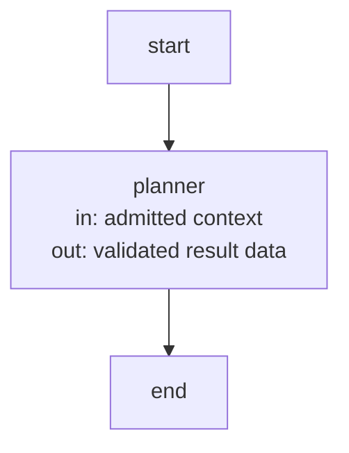
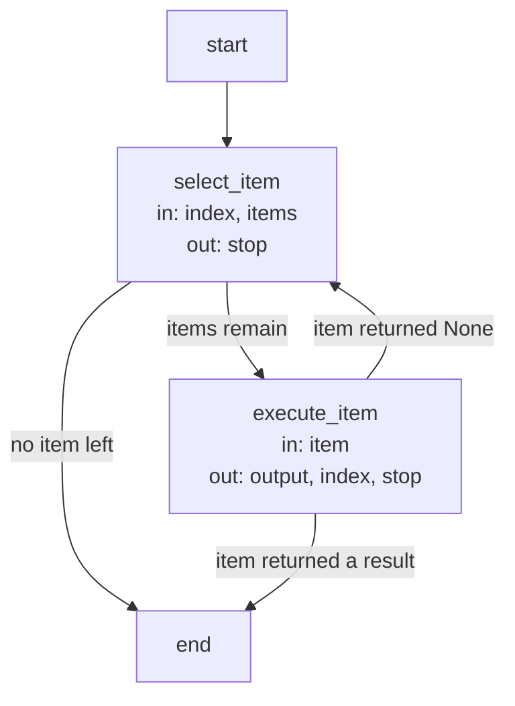

# Harness execution and record contracts

These are the precise implementation agreements and executable Flow specifications owned by the
[Harness Module](module.md). Explanatory topics introduce their purposes; exact identities, limits
and transitions are retained here as the single detailed contract.

## Terminology

| Term | Meaning / definition |
| --- | --- |
| [Worker](../concepts.md#terminology) | Defined in Concepts for reading Concorde. |
| [Harness](../concepts.md#terminology) | Defined in Concepts for reading Concorde. |
| [Context](../concepts.md#terminology) | Defined in Concepts for reading Concorde. |
| [Grant](../concepts.md#terminology) | Defined in Concepts for reading Concorde. |
| [Snapshot](../concepts.md#terminology) | Defined in Concepts for reading Concorde. |

## Capabilities and Harnesses {#agents-and-harnesses-capabilities-and-harnesses}

This document defines model execution configuration for the single Capability model. Capability
is the executable entity: deterministic code, a model invocation and a compiled LangGraph subgraph
all expose State-based node contracts. A worker profile is optional execution configuration on a
Capability, not a separately registered Agent or an additional composition relation. The historical
document identity and requirement/scenario anchors remain stable for existing links.

#### The execution model {#agents-and-harnesses-the-execution-model}

**Harness = context + control flow + models + permissions and environment.**
**Capability = input State + output State updates + execution implementation and constraints.**
**Invocation = Capability + Module/version + admitted artifacts + actual grant + runtime settings.**

| Term | Meaning |
| --- | --- |
| Capability | The one executable identity, usable as a LangGraph node or composed subgraph |
| State contract | Declared input channels and output updates; wire shapes are checked at runtime |
| Model execution profile | Instructions, task/effect contract, workspace, tools, children and timeout on a Capability |
| Worker | One fresh Pi RPC process executing a model-backed Capability invocation |
| Child helper | A bounded pi-subagents session internal to a worker; not an independently callable Framework node |
| Harness | Context resolution, worker runtime, model selection, permissions and environment |
| Skill | Instructions for an external developer runtime to invoke one public Capability |
| Tool | An interface admitted by the worker's actual tool grant, not by graph composition alone |

A deterministic Capability makes no model call on any supported path, including its transitive
composition. It may still read Git, files or subprocess results; determinism here does not mean
purity. Model-backed nodes use the same Capability inventory and USES relation as other nodes.
Sharing a graph State or knowing a Capability name grants neither context nor execution authority.

#### A1. Capability instructions and execution profile {#agents-and-harnesses-a1-capability-instructions-and-execution-profile}

Each model-backed Capability MUST own instructions in `capabilities/<name>/spec.md` and a Python
`PROFILE` declaration in that same package. Its instructions define responsibilities, goals,
accepted input and feedback, expected results, completion conditions, and behavior on missing
information, failure or required human decisions. These remain six sections after its
`# concorde-<name>` title. Common worker rules precede them in the build; Protocol rules follow
in the actual system prompt. Instructions are not project Spec context or permission grants.

`PROFILE` MUST have the same identity as its Capability and bind its task contract, workspace,
tools, children and timeout. There is no independent Agent inventory or `AGENTS` call relation.
A `WorkerBinding` records exact instruction, profile, child-definition and build digests for one
model Capability. Stale or inconsistent bindings MUST prevent execution. The serialized `agent`
field, `concorde-agent-stage-*` types and `generated/agents/` paths are retained compatibility
spellings, not a second executable model.

#### A2. Profile and Harness {#agents-and-harnesses-a2-profile-and-harness}

A model profile selects a `capsule` workspace for Spec-only work or a `project` workspace for
implementation access. It declares Pi tools and maximum effects. The host adds `submit_result`,
and adds `subagent` only when the profile declares helpers. `edit` and `write` require a write
effect; implementation reads require the project workspace. The host compiles each concrete grant
as a subset of both those effects and its invocation authority.

Project configuration selects model, thinking and timeout, with per-worker/helper overrides.
These settings are not authority. Pi starts with ambient sessions, context files, Skills, prompt
templates, themes and discovered extensions disabled. Only the host-issued configuration and
explicitly admitted tools are loaded. The shared [execution runtime](execution-reference.md) independently
validates the model profile, input, instruction bytes and permissions before launching a process.

#### A3. State and composition {#agents-and-harnesses-a3-state-and-composition}

Every Capability MUST expose a State contract and `run(state, runtime)`. LangGraph nodes read
only their admitted channels and return State updates. `CapabilityNode` supplies the common
compiled-node adapter; a compiled graph may be embedded as another node. Different parent/child
schemas require explicit channel mapping. Concurrent writers require explicit reducers on the
owning graph; no automatic merge or broad parent-State grant is inferred.

The host supplies launchers, configuration and authority through trusted `Runtime.context`, never
through caller-writable State. Model nodes validate their context and output against the task
contract as well as its wire schema. Existing public host adapters preserve the complete versioned
result envelope in a `result` output channel, including errors and blocked outcomes.

Capabilities MUST declare direct composition through `USES`, including model nodes. The host
rejects undeclared calls. A worker's granted tools are separate from the host's composition graph:
being present in `USES` does not install a Capability as a Pi tool. Dependencies must not widen
context, effects or write authority. Graph nodes, edges and stopping rules are the executable
control-flow definition; metadata does not repeat their order or branching.

#### A4. Invocation constraints and evidence {#agents-and-harnesses-a4-invocation-constraints-and-evidence}

Each invocation MUST bind its task, frozen context, Capability profile and instruction digests,
effective permissions, model settings and fresh identity. Reuse of a Capability never implies
reuse of its predecessor's conversation. Only explicitly admitted artifacts cross stages.

Completion MUST distinguish successful output, missing information, required human decisions,
cancellation, execution failure and exhausted limits. Failures MUST NOT retry with broader
permissions. A changed goal, context or authority requires new host admission. LangGraph State
schemas do not replace any of these checks.

#### A5. One-level helper delegation {#agents-and-harnesses-a5-one-level-helper-delegation}

A model Capability MAY delegate inside its worker only to the helpers its profile declares under
`capabilities/<name>/children/`. They use replaced, context-free prompts and read/check tools,
with no model selection embedded in their definitions. They execute in foreground fresh sessions
under the same grant and tool gate, cannot delegate again and cannot submit the worker's final
result. Only the verified worker result leaves the process. Helper answers are evidence, not a
second Framework node result. [Execution](execution-reference.md) defines the capability ceiling and gate.

#### Common worker rules and inventory {#agents-and-harnesses-common-worker-rules-and-inventory}

The build combines `prompts/workers/common.md` with the Capability's own instructions and binds
its child definitions as sources. Distribution still publishes `generated/agents/<name>.md` to
preserve the installed instruction layout. The host appends the granted Protocol rule bundle.

The single inventory is defined by [Capability registry](../development/execution-reference.md).
Its metadata includes each model Capability's optional workspace, tools and children alongside
its State and USES declarations. There is no separate `concorde.agents` metadata collection.

#### Task contracts {#agents-and-harnesses-task-contracts}

Each worker fulfils exactly one task contract. The table uses these typed pairs: **stage** =
`concorde-agent-stage-context` / `concorde-agent-stage-result`, **review** =
`concorde-review-stage-context` / `concorde-review-stage-result`, **discovery** =
`concorde-main-stage-context` / `concorde-main-stage-result`, and **topology** =
`concorde-topology-author-context` / `concorde-topology-author-result`.

| Worker | Pair and phase/action | Admitted stage artifacts | Result and authority |
| --- | --- | --- | --- |
| answerer | discovery; route/ask | none | Direct answer, expansion or gaps; no routes, topology design or writes |
| router | discovery; route/route | none | One owning Module route, expansion or gaps; no implementation or writes |
| topology-designer | discovery; route/design-topology | none | Candidate topology from selected complete Specs and the explicit inventory; no document bodies or writes |
| spec-author | stage; specify | none | Structured document replacements, applied by the host |
| topology-author | topology; topology-author | none | Only candidate-owned documents for host application |
| spec-reviewer | review; spec-review | none | Independent Spec findings; no author artifacts or writes |
| context-assessor | stage; context-solve | none | Sufficient, incomplete, unsupported or conflicting assessment; no authored artifacts |
| planner | stage; plan | optional concorde-plan-artifact | Plan only; external references readable; no source contents or writes |
| task-author | stage; tasks | required concorde-plan-artifact and concorde-task-identity-constraints; optional concorde-implementation-task, concorde-review-result and concorde-task-scope-feedback | Implementation acceptance tasks with new IDs outside the reserved set; no source contents or writes |
| programmer | stage; implementation | required concorde-implementation-task; optional concorde-review-result | Fulfilled tasks only; may write the selected Module's listed implementation paths |
| code-reviewer | review; code-review | none | Independent code findings; authorized code read-only |
| issue-solver | stage; issue-solve | required concorde-issue-selection | Bounded next action or disposition; Spec-only, no project writes |

The host selects the worker before freezing its context and compiling its permissions, and the
executor checks that selection again before any process starts. A context of the wrong type or
phase, a wrong discovery action, unadmitted or missing required artifacts, implementation contents
admitted to a worker without implementation reads, and a policy wider than the contract are
rejected. After the process, a result whose type, outcome or populated fields the contract does not
permit is rejected: disallowed authored fields as `permission_denied`, other contract violations as
`invalid_completion`. Reviews additionally bind the matching `review_mode`. Spec-only workers never
receive source contents or project writes; the programmer receives only the bound Module's
authorized code; read-only code review grants enumerate the frozen implementation
files, so a listed directory cannot widen them to hidden, excluded or later-created files.

The programmer executes useful tests its grant supports. A listed test does not grant transitive
imports or repository fixtures; an unavailable input is recorded as deferred host verification,
never as a passing result, and actual defects and unfulfilled obligations still prevent completion.
The Issue solver uses its own issue-solve phase and a selected problem, not an implementation grant.
Ordinary development stages may receive the host-bound concorde-issue-intent. Tasks/implementation
repair receives selected concorde-issue-context observations alongside the admitted review result.

Every phase, target, repair and review has a fresh invocation identity and frozen context. Sharing a
role never shares a conversation, private reasoning, stage inputs or write grant between workers.
Only explicitly admitted structured artifacts cross stages.

### Design {#agents-and-harnesses-design}

#### Responsibilities and implementation boundaries {#agents-and-harnesses-responsibilities-and-implementation-boundaries}

The common Development host dispatches the declared provider and Flow contracts and schedules
invocations. Planning owns plan/task semantics, Implementation owns task fulfillment, and each
composing Flow owns its ordering and stopping policy. This Module's worker executor verifies and
launches workers through the Pi worker runtime and admits their results; its permissions service
compiles effective boundaries; its context service supplies the admitted context kinds; its model-profile
service resolves definitions and bindings. The Distribution build renders and distributes instruction
views with source identity.

## Capability Flows, loops and feedback {#graphs-and-loops-capability-flows-loops-and-feedback}

Orchestration coordinates Capability invocations and control decisions toward a declared goal. A Flow describes the structure of that coordination; a Loop describes feedback
driven execution. They are related concepts, not interchangeable names.

**Flow** is Concorde's name for an executable LangGraph `StateGraph`. Every Flow is built with
LangGraph's Graph API, which declares nodes and edges before compilation; the Functional API
(`entrypoint` and `task` from `langgraph.func`) is not used anywhere in Concorde's source or
scripts, because a Flow whose control flow lives inside ordinary Python compiles to a single
opaque node with nothing for a Flow Spec, the Flow Spec check or Studio to inspect. Authored
descriptions and new Python factories use Flow and `build_*_flow`; LangGraph API names such as
`StateGraph`, `get_graph()` and the `graphs` configuration key keep their library spelling.
Existing stable Spec identities, import aliases and persisted `graph` records remain compatible.

A Flow's state is a typed LangGraph state schema: the development and specification Flows carry
the last stage's typed response in `output`, a terminal failure envelope in `result` and the
accumulated artifact references in `artifacts` under a reducer, and each stage node selects its own
transition by returning a `Command` whose `goto` names a declared destination. No node smuggles
routing or evidence through untyped fields. Every model-backed node executes its worker through an
`CapabilityNode`: a State-based node/subgraph adapter whose input schema is generated from the worker contract's
admitted context type and whose output schema is generated from its result type, so the contract is
the graph state, and the Pi worker launch with its admission checks stays a host-private launcher
outside that state. The same `CapabilityNode` factory is exposed for inspection
inside the Flows that run it.

A Flow's compiled nodes and edges are the authority for execution views. Inspection compiles the
same factories used by execution without invoking nodes, reading project contexts or launching
Agents. Branches, repeated Agent decisions, delegation, feedback and stage handoffs belong in Flow
transitions. Ordinary Python inside a node may validate data, prepare a context, perform one Agent
invocation or carry out a deterministic operation. An atomic delivery transaction may remain one
deterministic node so its repository lock and rollback boundary stay intact.

Runtime-dependent Module selection, resume entries and scope produce explicit conditional edges
or bounded Flow variants. A viewer must identify the variant or expose the possible branches; it
must not present hand-authored topology as executed code. Runtime-only host objects and callbacks
are not public inputs or durable checkpoint values. Stateless internal Flows are inspectable but
do not promise internal checkpoint resume; replay re-enters admission through the public boundary.

#### Dispatch terminology {#graphs-and-loops-dispatch-terminology}

**Code-driven** dispatch uses explicit code rules to choose the next action, target Agent and
continue/stop condition. **Model-driven** dispatch uses a model's task and feedback assessment to
choose the next action or delegation. These name the source of a decision. They may alternate
within one Agent loop and nest in either direction across child invocations. Human decisions remain
separate, explicit inputs. Code-driven control does not guarantee reproducible overall output:
models, tools and external state may still vary. Determinism is a property to document where it
applies, not the primary classification of Agents or dispatch.

#### G1. Capability Flow {#graphs-and-loops-g1-capability-flow}

A Flow MUST declare its participating Capabilities, State contracts and directed transitions. Transitions MUST identify their trigger and
the information they transfer. Conditional branches, parallel execution or joins, when used, MUST
define selection, completion and failure behavior. A sequence of deterministic installation steps
does not become model-backed merely because it has several steps.

The Flow MUST identify which model Capability makes each model-assisted decision, which transitions are
code-driven, and which require a human decision. It MUST preserve invocation-local context and
permissions across every handoff. A coordinator receives only admitted results; dispatching an
model Capability does not grant access to its complete private context.

A Flow MAY be exposed as a Capability with a complete external contract. Invoking that Capability
does not expose its internal model workers or grant authority to call arbitrary internal nodes.

#### G2. Feedback loop {#graphs-and-loops-g2-feedback-loop}

A loop MUST define how execution moves through decision, action, observation and feedback,
and how those observations affect the next action. It MUST define completion, revision, waiting,
cancellation, failure and execution-limit conditions. Limits may be time, iterations, resource
budgets or an explicit bounded host policy; an unbounded retry is not an implicit default.

A model Capability's Harness supplies its local tool loop. A composed Flow may additionally
coordinate loops across several Capabilities, such as author → reviewer → author. Each invocation's local loop and its enclosing loop MUST have distinguishable state and completion
conditions. Orchestration between workers is always a Flow transition: one worker never starts
another. Inside one worker, delegation is limited to one level of its own declared children, as
defined in A5; a child's work is evidence for its worker, not a Flow step.

A retry or revision MUST identify what changed or what recovery condition permits another attempt.
Unchanged blocking feedback MUST not cause endless retries. Stale task, context, policy or result
identity requires re-admission before execution continues. Completion of an inner loop does not
automatically complete the enclosing Flow or authorize delivery.

#### G3. AI and human feedback {#graphs-and-loops-g3-ai-and-human-feedback}

Feedback MUST identify its source, subject, relevant task or result revision, finding or decision,
and the transition it can affect. AI feedback and human decisions MUST remain distinguishable.
The representation may use existing typed review, task and acceptance artifacts; this requirement
does not introduce a separate comment store or mandatory feedback report.

| Feedback | Example | Permitted effect |
| --- | --- | --- |
| AI assessment | A context assessor identifies a necessary missing contract | Block the dependent step and name the required information |
| AI review | A reviewer identifies a defect against the bound Spec | Select an admitted repair path and recheck the revised result |
| Human clarification | A developer supplies missing intent or corrects a goal | Produce an explicit task or context revision for fresh admission |
| Human acceptance | A developer accepts a specific topology or delivery proposal | Enable only the transition and effects covered by that acceptance |
| Human rejection or cancellation | A developer rejects a proposal or ends the task | Revise, wait or terminate according to the Flow contract |

AI feedback cannot substitute for a required human acceptance. Human text that merely mentions a
Tool or broader context is not an automatic permission grant. Every transition MUST preserve the
applicable task, context and authority checks. A graph receiving no answer to a required decision
remains waiting; elapsed time is not acceptance.

#### G4. State, recovery and evidence {#graphs-and-loops-g4-state-recovery-and-evidence}

Execution evidence MUST identify the Flow and loop policy, participating Agent invocations,
admitted feedback and selected transitions. It MUST distinguish completed, waiting, blocked,
cancelled, failed and limit-exhausted outcomes. A supported resume operation MUST revalidate the
saved state and feedback against the current task and authority before choosing the next transition.

New development-graph transition records use `source: code-driven|model-driven` for this
classification. A review-selected repair is model-driven; host stops for unchanged feedback,
exhausted repair limits or failed checks/execution are code-driven. Existing `trigger` strings
remain descriptive compatibility labels for historical records, not a second dispatch taxonomy.

Review and check results are evidence about the bound revision. They do not remain valid after
relevant Agent Specs, Harness configurations, capability contracts, project inputs or policies
change. Raw logs and native transcripts remain diagnostics unless explicitly admitted as typed
downstream inputs.

#### Flow Specs {#graphs-and-loops-flow-specs}

Every executable Flow is specified with LangGraph's own three concepts, and nothing else stands
in for them: a **node** is one executing step, an **edge** is one routing decision, and **state**
is what a node reads and writes. A Flow Spec is one section of the owning Module's documents and
has three parts:

1. **State**: the typed channels the Flow carries between nodes and the candidate or lifecycle
   records its nodes read and write.
2. **Nodes**: a table naming each node exactly as the compiled Flow names it, what it executes
   (a deterministic, model-backed or composed Capability with its execution mode), and the state
   it reads (`in`) and writes (`out`).
3. **Edges**: a Mermaid flowchart bound to the compiled Flow by the comment `%% flow: <name>`,
   where `<name>` is the Flow's compiled graph name in the Flow catalog. Its node identifiers are
   the compiled node names, `__start__` and `__end__` included; every node label states the node
   name, then `in:` and `out:`; every edge leaving a node with several successors is labeled with
   the condition that selects it, and an edge leaving a node with one successor carries no label.

The Flow Spec check (`scripts/development/check-flow-specs.py`, the configured
`check.development.flow-specs`) compiles every catalog Flow with inert nodes and reports each
diagram whose nodes, edges, routing labels or state labels disagree with the compiled topology,
and every compiled Flow without a diagram. It also enforces the Graph API rule: a catalog Flow
that is not a compiled `StateGraph`, and any Python file under `src/`, `scripts/` or `capabilities/` that imports
`langgraph.func`, found by parsing the file rather than running it, are errors. A diagram that
passes proves the Spec and the executed topology agree; it proves nothing about whether the
routing conditions are right, which the scenarios and tests of the owning Module cover. The Relationships diagram of a Module's
reading entry remains the entity diagram the Protocol defines; Flow Specs live in other sections
or documents.

### Design {#graphs-and-loops-design}

#### Concorde Flow responsibilities {#graphs-and-loops-concorde-flow-responsibilities}

The query Flow coordinates explicit context selection, deterministic source indexing and grant, and direct answers. The topology Flow
coordinates design, human acceptance and separately bound Spec authors. Specification Flow independently coordinates authoring and Spec review. Development Flow
consumes it and the sibling Planning, Implementation, Validation and Review providers, with explicit
repair or human-clarification loops. Issue solving may select verification, Spec repair or development
Flow after a human disposition. Delivery remains a separately authorized deterministic capability.

Existing topic Specs retain their task and authority contracts. The capability adapter
and existing Skill names remain compatible identifiers. A stage sequence satisfies only the
transitions it implements and records; a graph library or a function name proves nothing by itself.

## Agent execution {#execution-agent-execution}

#### Configured deterministic checks {#execution-configured-deterministic-checks}

This host-only service runs configured commands without a model invocation. It is independent of
worker model selection and of the worker tool gate. Checks can read project files; their own
temporary files, caches and reports belong in fresh host-managed space outside the project.
Creating, modifying, moving or deleting a project file is denied at the attempted system call,
including a write followed by restoration. Project-local lifecycle and log paths are read-only too.

```python
execute_check(project_root: Path, argv: Sequence[str], *, timeout: float,
              environment: Mapping[str, str]) -> CheckResult
CheckResult(stdout: bytes, stderr: bytes, returncode: int, timed_out: bool = False)
CheckBackend.run(project: Path, argv: Sequence[str], scratch: Path,
                 environment: Mapping[str, str], timeout: float) -> CheckResult
```

The backend interface is trusted host code, never a registry field or a task-supplied executable.
Only Linux's BubblewrapBackend is currently supported. It requires a root-owned system bubblewrap,
user/mount/PID/IPC namespace support and kernel pidfds exposed by Python or libc. System file owners
unmapped by a parent check namespace are admitted only on its already read-only system mounts.
Missing binaries, unsupported
platforms, denied namespace setup, unsafe project locations and unavailable external temporary
storage raise `CheckSandboxError(RuntimeError)`. That exception retains byte `stdout`/`stderr`
diagnostics for the host. No failure retries through ordinary subprocess or weaker permissions.
An empty command, non-directory project or nonpositive/nonfinite timeout is also rejected.

Every call creates independent scratch storage even when ambient TMPDIR points into the project.
`TMPDIR`, `TMP`, `TEMP`, `XDG_CACHE_HOME` and `npm_config_cache` point into that storage;
`CONCORDE_CHECK_TMPDIR` names its root and `CONCORDE_CHECK_REPORT_DIR` its reports directory.
`PYTHONDONTWRITEBYTECODE=1` avoids routine Python cache attempts but is not the write boundary.
Hardcoded project cache/report paths must migrate; tools that modify sources belong in implementation.
Scratch and reports are ephemeral and disappear after the check. No report import into the project
is implicit. Standard output/error remain separate byte streams for outside-host persistence.

The result preserves command exit status using bubblewrap's shell encoding, including `128+signal`
for signal termination. A timeout, including sandbox setup time, returns `timed_out=True` and
`returncode=-1` with captured partial output. Host cancellation propagates after cleanup. A missing
trusted successful-exec status is an isolation/launch error, not an ordinary check failure. A
successful sandbox exit establishes execution under this boundary, not test adequacy or semantic
completeness. The calling host remains responsible for digest and candidate freshness checks;
`CHECK_POLICY="project-read-only-v1"` identifies this execution guarantee for evidence invalidation.

#### Required Agent and Harness boundary {#execution-required-agent-and-harness-boundary}

The local companion contract **Agents and Harnesses** defines A1–A5 for this Module. Execution MUST
receive a resolved worker binding, its frozen context, its compiled policy and its model selection,
and run exactly that worker. The worker executor's preflight reverifies the carried `WorkerBinding`,
the instructions, the admitted context and the policy against the current build and the worker's
contract before starting any process, so the launch below executes only a complete, checked worker
profile.

#### Worker execution {#execution-worker-execution}

`WorkerExecutor` runs one host-built `WorkerInvocation` as one Pi worker and returns a
`WorkerOutcome`, or raises `CapabilityExecutionError`. The local companion contract **Agent runtime
value and collaborator contracts** defines these records, the invocation builder and the preflight;
the [Pi worker runtime](#execution-pi-worker-runtime) below defines the process.

##### Workspace kinds {#execution-workspace-kinds}

A worker profile declares `workspace: capsule` or `workspace: project`; the registered workers and
their kinds are listed in [Agents and Harnesses](execution-reference.md).

- A **capsule** is a host-created temporary directory outside the project root, created for one
  invocation immediately before launch and removed after the host has verified it. It contains
  `context.json`, holding the frozen snapshot bytes, beside byte-identical copies of every Spec
  document and Protocol file that index lists, at their project-relative paths, plus the copied
  external references a worker with the `references` effect receives. It is the Pi process's
  working directory, and the tool gate's read grant is that directory, so the project root, the
  candidate worktree, other worktrees and the developer's home directory are outside the grant.
  The discovery, Spec, assessment, planning and task workers use this kind.
- A **project** workspace is the candidate worktree itself and the Pi process's working directory.
  The snapshot is written below `.concorde/runs/<invocation>/<uuid>/context.json` inside that
  worktree; the grant covers it, the Spec documents and the installed Protocol copy under
  `.concorde/protocol/` it indexes, at their project paths, and the selected Module's
  implementation: its listed entries with write authority for the programmer, its enumerated files
  read-only for the code reviewer. The Issue solver uses a Spec-only capsule.

In both kinds the host rereads the snapshot file after the worker settles and rejects a result whose
file bytes, registry digest, document digests or initialized configuration changed during execution
with `stale_context` or `configuration_mismatch`.

##### Input and result {#execution-input-and-result}

A worker's system prompt is the invocation's instructions: the common worker rules, the worker's
role Spec and the Protocol rule bundle, in that order. Its only message is the canonical typed
context: task context inline, Spec context as the index of granted files. Its output contract is its
`submit_result` tool, whose parameters are the self-contained JSON Schema of the contract's result
type. The executor wraps the single submitted value as that type, checks it against the contract and
returns it; the host then checks its context identity and gap provenance before accepting stage
completion. Independently, each admitted worker may use `report_issue` to persist an observation
through a host-issued, scope-bound callback before submitting its final result. Report admission
is separate from completion; accepted reports survive an invalid or interrupted final result.
The [Issue reporting boundary](../issues/execution-reference.md#issues-worker-reporting-service) defines report
shape and authority. A worker in a project workspace also receives the host check service behind
`run_checks`.

##### Common limits {#execution-common-limits}

The Pi process itself is outside the gate: it runs as the developer's user with the developer's Pi
credentials and talks to its model provider. The gate bounds what the model's tools can reach, not
the process, and a shell command run by a worker granted `bash` is not confined by it. The
credential paths the compiler always denies (`.env`, `.aws`, `.ssh` and the other listed entries)
are project-relative entries; home-directory secrets are outside the grant because the grant is
default-deny. Running the whole Pi process inside an operating-system sandbox that mounts only the
granted paths is the planned stronger boundary.

#### Pi worker runtime {#execution-pi-worker-runtime}

A Pi worker is one Pi coding agent process run in RPC mode for one bounded task. Pi calls the
worker's model through its own providers and executes its built-in tools; LangGraph stays the
orchestration around it. `PiWorkerRuntime` launches one `WorkerLaunch` and returns a
`WorkerResult` or raises `WorkerExecutionError`:

```python
WorkerLaunch(worker: str, workspace: str, system_prompt: str, message: str,
             result_schema: Mapping[str, Any], tools: tuple[str, ...],
             read_paths: tuple[str, ...] = (), write_paths: tuple[str, ...] = (),
             children: tuple[ChildAgent, ...] = (), child_tools: tuple[str, ...] = (),
             model: str | None = None, thinking: str | None = None, timeout_seconds: float = 1800,
             report_schema: Mapping[str, Any] | None = None)
ChildAgent(name: str, definition: str)
PiWorkerRuntime(package_root: Path, pi_executable: str | None = None,
                environment: Mapping[str, str] | None = None, credentials_dir: Path | None = None,
                popen=subprocess.Popen)
PiWorkerRuntime.__call__(launch: WorkerLaunch, *, checks: Callable[[], Any] | None = None,
                         report_issue: Callable[[dict], Any] | None = None) -> WorkerResult
WorkerResult(value: dict[str, Any], run: PiRun, usage: dict[str, Any])
WorkerExecutionError(message: str, outcome: "failed"|"cancelled"|"limit_exhausted"|"invalid_completion",
                     run: PiRun | None = None)
run_prompt(argv, *, cwd: str, env: Mapping[str, str], message: str, timeout: float, popen=subprocess.Popen) -> PiRun
```

Paths in a launch are relative to its absolute workspace, which is the process's working
directory. `model` is Pi's `provider/id` and `thinking` one of Pi's levels (`off` through `max`).
The tools are Pi's built-ins (`read`, `grep`, `find`, `ls`, `edit`, `write`, `bash`) and the
Concorde tools: `submit_result`, which every worker has; `run_checks`, which requires the host
check service; `report_issue`, which requires both its host callback and report schema; and
`subagent`, which a worker has exactly when it declares children. Edit and write require a write
grant, and child tools are built-ins or `run_checks`, never `report_issue`. An inconsistent launch
is refused before any process starts. The executor accepts an optional host reporter with a
`schema` property and callable report handler, forwards it only to the admitted runtime, and does
not convert reporting authority into any file write grant. The common Development host supplies
this service for actual worker launches, including capsule workers, but not policy previews.

The private Unix socket dispatches only explicitly granted `run_checks` and `report_issue` calls.
Requests must be complete newline-terminated JSON frames of at most 128 KiB, received within ten
seconds. Reporting parameters are validated by the bound host callback, which returns only a
receipt. A rejected callback returns an error that the extension throws as a failed tool result,
not a successful receipt. Reporting never returns `terminate`; the worker can continue reporting
or working. Accepted persistence is retained if cancellation disconnects the client before the
acknowledgement arrives.

#### Usage accounting {#execution-usage-accounting}

Pi reports what a run consumed in its session statistics, which the runtime reads after the worker
settles: input, cached input, output and total tokens, cost and assistant turns. The executor
records them as an `ExecutionUsage` record on the `WorkerOutcome`: the configured `model` and
`thinking` level, `input_tokens`, `cached_input_tokens`, `output_tokens`, `total_tokens`,
`cost_usd`, `turns`, host-measured `wall_seconds`, and the `prompt_bytes` and `context_bytes` the host
handed the process. A figure Pi did not report is `None`, never zero.

The host records one line per launch through `record_usage` in `.concorde/runs/<root invocation
id>/usage.jsonl`, labelled with `capability`, `stage`, `target_id`, `agent`, `change_id`, the
launching host's `invocation_id` and `depth`, the launch's own `launch_invocation_id`, `context_id`
and `model`, and the usage record. The root invocation id is the top-level capability invocation's
identity, inherited by every nested capability invocation (`CapabilityHost.root_invocation_id`), so
one Flow run keeps one file. The same record reaches the host observer as an `agent_usage` event.
`read_usage` and `summarize_usage` aggregate the lines per step (capability, stage and target),
stage, target, worker and run; the `concorde usage` Tool and the executable boundary's stderr summary
use them. Usage is diagnostic evidence about cost: it gates nothing, and a failure to persist it
never fails the launch. See [usage accounting](scenarios.md#scenario.harness.usage-accounting).

#### Outcomes {#execution-outcomes}

A worker's deadline is its selected `timeout_seconds`, else its profile's timeout as bound in its
`WorkerBinding`. `CapabilityExecutionError.outcome` distinguishes four cases so a caller need not
parse message text: `failed` for a refused preflight, a process that exits or breaks the RPC
protocol before settling, or any other launch failure; `cancelled` for a host interrupt, with the
process already killed; `limit_exhausted` for a run past its deadline, likewise killed; and
`invalid_completion` for a run with no, several or an invalid submitted result. A contract
rejection keeps its class in `code` (`permission_denied` for disallowed authored fields). None of
these outcomes triggers an automatic retry, with the same or any wider permissions. Authorized
implementation edits made before a failure can remain in the candidate; the executor does not
promise rollback.

#### Representative use {#execution-representative-use}

The wire collaborator provides `json_schema(type_id: str) -> dict` for a self-contained typed result
schema and `validate_typed(value: Any, expected: str | None = None, field: str = "") -> dict` for
strict type, version, property and uniqueness validation. Unknown types or versions, unsafe paths,
invalid fields and mismatched expected types raise `TypedDataError(ValueError)` with `code` and
`field`; the executor treats them as invalid completion, not successful output. These calls perform
no project mutation or remote schema resolution.

```python
executor = WorkerExecutor()
# invocation is already built by the trusted host with build_worker_invocation.
try:
    outcome = executor(invocation, checks=checks)
except CapabilityExecutionError as failure:
    reason = failure.outcome          # stop the transition; failure.usage may carry what was spent
else:
    assert outcome.invocation_digest == invocation.digest
    result = outcome.value["data"]    # the validated typed result
```

Consumers bind the outcome to the invocation and binding digests and consume the typed result
rather than raw process output. A runtime double can test these boundary mechanics but cannot
establish that a model detected a semantic gap or behavior defect.

### Design {#execution-design}

#### Check isolation mechanism {#execution-check-isolation-mechanism}

Linux recursively maps the host filesystem read-only so another pathname, hard link or external
dependency directory cannot supply a writable alias. It replaces `/proc` with the sandbox's PID
view and `/dev` with minimal private devices, drops capabilities, disconnects the terminal and
gives only the new scratch directory a writable host mount. Shared memory uses scratch as well.
Project roots at `/` or below `/proc`, `/dev` or `/sys` are unsupported. Additional user namespaces
remain available for nested checks; inherited read-only mounts cannot be remounted writable there.
The bootstrap binary uses a fixed system search and minimal loader environment; the supplied
check environment travels through an anonymous options descriptor rather than the public process
command line and is installed for sandbox execution. This service defines no finer read,
network or credential policy and does not mediate effects requested from external services.

The host closes inherited descriptors, supplies null stdin and captures output through pipes,
never by passing an open project log to the process. Bubblewrap's host-only metadata descriptors
are closed before command execution. A launch gate keeps the command stopped until the host pins
namespace PID 1 with a pidfd. On timeout, cancellation, failure and normal completion, the host
terminates the namespace and waits for cleanup before removing scratch. This includes descendants
that double-fork, create sessions or reset parent-death signals. Both output pipes drain while the
initial command runs, and a background process holding them open cannot prevent cleanup.

##### What the host itself enforces {#execution-what-the-host-itself-enforces}

- **Fresh process, closed inputs.** Every launch is a new Pi process with sessions, context files,
  skills, prompt templates, themes and discovered extensions disabled. No predecessor transcript,
  conversation or session state is passed.
- **Environment allowlist.** The process environment is rebuilt from `SAFE_ENVIRONMENT` in
  `harness.py` (`HOME`, `PATH`, `LANG`, `LC_ALL`, `LC_CTYPE`, `LOGNAME`, `USER`, `TMPDIR`, `TMP`,
  `TEMP` and their Windows equivalents), the provider credential variables Pi documents and Pi's
  own control variables. Every other variable of the calling shell is absent.
- **Binding equality.** Preflight rejects an invocation whose binding, instructions, Protocol files,
  context or policy differ from what the current build and the worker's contract admit.
- **Tool gate.** The Concorde worker extension refuses every tool call outside the compiled grant in
  the worker and in each child ([tool gate](#execution-tool-gate)).
- **Result admission.** Only one submitted result that satisfies the result type and the contract
  completes the invocation; a settled process alone is not completion.

##### Launch {#execution-launch}

Each launch gets a private run directory that is removed afterwards. Its `agent/` directory is
Pi's configuration directory for the process (`PI_CODING_AGENT_DIR`): Concorde's own settings
(project trust never, install telemetry off, pi-subagents builtin agents disabled), the developer's
Pi credentials (`auth.json` and custom-provider `models.json`, copied from the developer's Pi
directory), the declared child definitions under `capabilities/` and the pi-subagents configuration
under `extensions/subagent/config.json`. Beside it lie `policy.json`, which the Concorde worker
extension enforces, `system-prompt.md`, which it installs as the worker's complete system prompt,
`tmp/`, the process's temporary directory, and, for a worker with `run_checks` or `report_issue`,
the host tool service's socket. The developer's own Pi settings, sessions, agents, extensions and skills are
never read. When Pi refreshes an OAuth credential during the run, the host writes the refreshed
`auth.json` back to the developer's Pi directory, but only while that file still holds the bytes the
run was issued, so a concurrent refresh is never overwritten.

The process runs `pi --mode rpc --no-session --no-context-files --no-skills --no-prompt-templates
--no-themes --no-extensions -e pi/extensions/concorde-worker.ts [-e pi-subagents] --no-approve
--offline --tools <tools> [--model <model>] [--thinking <level>]`, with pi-subagents loaded only
for a worker with children. Its environment is the host allowlist, the provider credential
variables Pi documents, `PI_OFFLINE`, `PI_SKIP_VERSION_CHECK`, `PI_TELEMETRY=0`, the run
directory's `TMPDIR` and the policy location. The host sends one `prompt` command carrying the
worker's message, reads records split on line feed only until `agent_settled`, answers every
extension dialog as cancelled, reads the session statistics and closes the process.

The result is the `details` of the worker's single successful `submit_result` call. That tool's
parameters are the launch's result schema, so the model sees its output contract as a tool, and it
ends the run. No submission or a second one is `invalid_completion`; a missed deadline kills the
process and is `limit_exhausted`; a host interrupt is `cancelled`; a process that exits or breaks
the protocol before settling is `failed`. None of them retries. The caller validates the value
against its own typed contract. Usage comes from Pi's session statistics: input, cached input and
output tokens, cost, assistant turns and the host-measured wall time.

##### Tool gate {#execution-tool-gate}

The Concorde worker extension gates every tool call before it executes: a tool outside the
granted list is refused; `read`, `grep`, `find` and `ls` must target a path whose canonical form,
symlinks resolved, lies under a read or write grant, and a search without a path targets the
workspace itself; `edit` and `write` must target a path under a write grant; each `bash` command
first unsets the provider credential variables. A refused call returns an error result naming the
policy, and the model continues. The gate runs inside the Pi process, so it is a policy boundary,
not an operating-system sandbox: a shell command is not confined by it. Running the whole Pi
process inside an operating-system sandbox that mounts only the granted paths is the planned
stronger boundary.

##### One-level delegation {#execution-one-level-delegation}

A worker with children loads pi-subagents, pinned in `pi/package.json`: a source checkout installs it
with `npm ci --prefix pi`, and in an installed project the installer provisions the same lock into the
managed runtime under `.concorde/.venv/share/concorde/pi`, where the runtime finds it beside the
installed framework. Its configuration allows one level of delegation, runs children in the foreground in
fresh contexts, and disables pi-subagents' background runs, missions, schedules and inter-session
channels. On session start the Concorde extension registers two things with pi-subagents for the
worker's session: a capability ceiling naming exactly the declared children and the child tools,
and itself as a required child extension, so every child session loads the same gate. In a child
session the gate uses the child tool list, refuses `subagent` and `submit_result`, and does not
replace the child's system prompt. A child is a lightweight pi-subagents Markdown definition: what
it does inside the worker is not a Concorde contract, and only the worker's submitted result
leaves the process.

##### Host check service {#execution-host-check-service}

For a worker granted `run_checks`, the host serves one Unix socket in the run directory. The tool
sends `{"tool": "run_checks"}` and returns the host's JSON reply, or an `error` field when the host
callback fails; the host runs the configured checks under its own read-only executor.

### Precise specifications {#execution-precise-specifications}

The Harness Module owns the exact obligations and interface details in [scenarios](scenarios.md).
These companions are part of the same complete Module specification, not separate topic owners.

## Invocation host {#host-invocation-host}

This document defines how the Harness binds and runs one worker invocation, the LangGraph substrate
every control flow uses, and the optional Studio view. Value records are defined in
[runtime values](runtime-values.md).

#### Studio execution view {#host-studio-execution-view}

The Studio adapter starts or observes the same CapabilityHost used by CLI and Skill invocations, with
the same worker executor. Its generated LangGraph configuration exposes one Flow per Skill. Studio
expands the same admission, dispatch and composed Flow instances used by local calls, including
query/discovery, topology, planning, development and Issue-solving branches. Non-public Capabilities
remain callable through declared composition. Batch and coordination Flows are also inspectable from
their executable factories; their runtime instances depend on host admission. Studio receives an
invocation wrapper containing the existing schema-3 invocation and an optional expected_workspace
assertion. Project and package roots remain host-bound; the assertion does not select another
workspace.

The final state exposes the unchanged capability result envelope, admitted policy descriptions and
stage and worker events (`agent_started`, `agent_finished`, `agent_failed` naming the capability,
stage, worker and invocation). Pausing or replaying a run does not waive permissions, checks or the
worktree lifecycle, and replay may execute effects again. Ordinary local CLI and Skill calls do not
require a Studio server. The source-checkout setup and debugging guide is scripts/development/STUDIO.md.
This execution view participates in Developer view and feedback through the Development host.

### Design {#host-design}

#### Invocation binding {#host-invocation-binding}

The host obtains an invocation's inputs in a fixed order: select the worker whose contract names the
stage; load its rendered instructions and resolve its `WorkerBinding` against the build (see
[Agents and Harnesses](execution-reference.md)); freeze its context (see [context](context.md)) with
those instructions; compile the exact role and path policy with `compile_policy`; resolve the
worker's and each child's model selection from project configuration; bind all of it with
`build_worker_invocation`; then call the worker executor (see [execution](execution-reference.md)). The
executor independently reverifies the binding, instructions, context and policy before any process
starts. A worker in a project workspace also receives the host's check service, which runs the
selected Module's configured checks read-only and returns each check's status and the tail of its
log.

`describe-policy` mode previews the exact grant a stage would receive without launching anything or
exposing context bodies: the worker, its binding, profile and instructions digests, its workspace
kind, tools and children, the read and write paths and policy digest, and the resolved model,
thinking level and timeout.

#### Control-flow substrate {#host-control-flow-substrate}

Every capability Flow, including the global discovery loop, the development loop, topology
evolution, Issue solving and the deterministic capabilities, is a LangGraph `StateGraph` built
with the Graph API, never with the Functional API. Its nodes are deterministic steps, which make no
model call, or worker invocations, which do. These Flows are the Studio surface; no capability runs
its control flow outside them. Flow structure alone proves nothing about semantics: transitions,
limits and evidence still follow G1–G4.

#### Capability node (`capability_node`) {#host-capability-node-capability-node}

Every registered Capability exposes `run(state, runtime)` and a State contract. `CapabilityNode`
compiles that same implementation for embedding as a LangGraph subgraph, whether its implementation
uses a model or the host's deterministic/composed Flow. Input schemas admit only the Capability's
channels; output schemas expose only its declared update. Hosts, launchers and configuration live
in trusted `Runtime.context`, not State. Host-backed adapters preserve their full success or failure
envelope in the `result` output channel. Model nodes return their task-result fields. The catalog
compiles the planner as its representative; the node name is the Capability's identity.

State: the contract's context fields in (for a stage context: `snapshot`, `change_id`,
`expected_artifacts`) and the contract's result fields out (`context_id`, `outcome`, `answer`,
`blockers`, `documents`, `plan`, `tasks`, `issue_decision`).

| Node | Executes | in | out |
| --- | --- | --- | --- |
| `planner` | One Pi worker under the host launcher, which runs the worker executor and records usage outside the graph state. | admitted context | validated result data |



#### Sequential work items Flow (`batch_flow`) {#host-sequential-work-items-flow-batch-flow}

Independently admitted work items (consumer reviews, component Specs, component implementations,
participant finalization) run one at a time through this Flow; the item node is named per use
(`review_module`, `author_module`, `develop_module`, `finalize_module`; the catalog compiles it as
`execute_item`).

State: `index` (the next item), `output` (the first non-None item result, which stops the Flow),
`stop`.

| Node | Executes | in | out |
| --- | --- | --- | --- |
| `select_item` | Deterministic: stops when no item remains. | index, items | stop |
| `execute_item` | The item operation; a non-None result stops the Flow. | item | output, index, stop |



## Permissions {#permissions-permissions}

#### Required worker authority boundary {#permissions-required-worker-authority-boundary}

The local companion contract **Agents and Harnesses** defines A4 for this Module. Effective authority
MUST be a subset of the worker contract's effects and the host's invocation grant, including tool
use as well as file, process, network and credential effects. Resource availability in a Harness is
not permission. `compile_policy` compiles the contract's declared `EffectDeclaration` against a
host-supplied, narrowing `PolicyBinding` and the concrete role paths the host resolved, so it can only
produce a policy at or under that authority boundary, never beyond it.

The host supplies the role paths from the frozen context: the `spec-context` or `discovery-context`
role names the context index file and every document and Protocol file it lists; `implementation`
names the selected Module's bound implementation files, or its listed entries for a code writer; and
`references` names the Module's external reference roots. Context descriptions, installed resources
and caller task JSON cannot add paths or operations. The executor recompiles the grant against the
worker's contract before launch and rejects a policy that is wider, that grants writes to a worker
without a write effect, or that grants network or credential effects to any worker.

#### Enforcement {#permissions-enforcement}

The compiled policy becomes the Concorde worker extension's policy for the invocation. The extension
gates every tool call inside the worker's Pi process and inside every child session: a tool outside
the granted list is refused; `read`, `grep`, `find` and `ls` must target a canonical path, symlinks
resolved, under a read or write grant; `edit` and `write` must target a path under a write grant; a
child cannot delegate or submit a result. A capsule worker's workspace contains only its granted
copies, so its read grant also covers the workspace root.

This is a policy boundary inside the Pi process, not an operating-system sandbox. It does not confine
shell commands: a worker granted `bash` can reach whatever its operating-system user can, and the
host only removes the provider credential variables from each command. The Pi process itself reaches
its model provider over the network with the developer's Pi credentials. Running the whole worker
process inside an operating-system sandbox that mounts only the granted paths is the planned stronger
boundary. Configured deterministic checks already run under the host's OS-enforced read-only executor
([execution](execution-reference.md)).

#### Policy compilation {#permissions-policy-compilation}

`compile_policy(effects, binding, role_paths, deny_paths=())` intersects declared role paths with
explicit host authority, producing a digest-bound policy. `verify_effective_subset(declared,
effective)` rejects an effective policy that widens a declared one. `require_isolated_worktree(project_root,
allow_primary_worktree=False)` rejects unsafe mutation environments unless the trusted host grants the
explicit exception. Task JSON cannot override any permission.

### Precise specifications {#permissions-precise-specifications}

The Harness Module owns the exact obligations and interface details in [contracts](contracts.md).
These companions are part of the same complete Module specification, not separate topic owners.

## Typed values {#typed-values-typed-values}

#### Typed value and schema validation {#typed-values-typed-value-and-schema-validation}

`typed(type_id, data)` produces a validated TypedValue; `validate_typed(value, expected=None,
field="")` rejects unknown type/version, unknown properties, malformed values and unsafe paths.
There is no caller-supplied `schema_version` argument to `typed`. `decode(text)` rejects duplicate
JSON keys and non-finite numeric constants. `json_schema(type_id)` exports self-contained schemas
with local definitions. Contract IDs are stable independent of paths. Canonical interface definitions
admit only the supported offline subset: remote references and unknown keywords fail.
Structural validation is not a claim of semantic completeness.

#### Canonical serialization {#typed-values-canonical-serialization}

`canonical(value)` returns a JSON string using Python's standard JSON encoder with sorted
object keys, compact separators (`,` and `:`), ASCII escaping and `allow_nan=False`, with no
trailing newline. It accepts `None`, booleans, strings, integers, finite floats, lists, tuples
(encoded as arrays), and dictionaries containing recursively supported values. String-keyed
objects are the transport contract: keys sort lexicographically, array order is preserved, and
non-ASCII characters are escaped. It does not validate TypedValue schemas, normalize Unicode or
numeric representations, or implement a separate cross-language canonicalization standard.

The underlying encoder also accepts dictionary keys of type integer, finite float, boolean or
`None` when key sorting is possible, converting them to JSON property strings. Such coercion can
produce duplicate property strings; callers requiring round trips through `decode` must use
unique string keys. Mixed keys that cannot be compared raise `TypeError`. Unsupported objects
(including bytes, sets and arbitrary class instances) and unsupported key types raise `TypeError`.
Non-finite floats anywhere in values or keys, and circular containers, raise `ValueError`;
excessive nesting can raise `RecursionError`. These encoder exceptions propagate directly and
are not wrapped as `TypedDataError`. Successful serialization has no filesystem effects and
normalizes only the encoding choices stated above.

#### Typed values and recursive dispatch {#typed-values-typed-values-and-recursive-dispatch}

A TypedValue is exactly `{type_id: str, schema_version: int, data: object}`. This API constructs
and accepts each registered type's exact declared version (an integer, never a boolean); context
payloads/wrappers use version 2 and unchanged stage values retain version 1. The separate outer native/capability
completion envelopes may have other versions; they are not constructed by this helper.
`validate_typed` returns a deep copy after validating the registered payload schema and applicable
type-specific rules. `expected` requires an exact type ID match. Errors are
`TypedDataError(ValueError)` with `code`, JSON-pointer `field` and message; `to_dict()` returns
those three fields. Codes include `unknown_type`, `unsupported_version`, `incompatible_handoff`,
`invalid_field`, `invalid_json`, `stale_reference` and `workspace_mismatch`.

`contracts()` returns the installed capability-name mapping to `(request_type_id, response_type_id)`;
names use `concorde-` and their types use `-request` and `-response`. `schemas()` returns the installed
Profile 14 type-ID-to-payload-schema mapping. `exported_types()` enumerates its public capability
request/response types followed by internal stage types; callers can use each ID with `json_schema`
to obtain its exact envelope and recursively referenced payload schemas. These returned schemas
are the supported machine-readable discovery interface, not a grant to inspect implementation.
`dependencies(capability)` returns its declared host role/capability dependencies, including a main
coordinator for main-routed capabilities, or an empty tuple when none are declared. It does not
return Agent delegation edges, select context or grant invocation authority. Retained legacy
low-level data types cannot reactivate retired public workflows.

The recursive Agent adapter adds these version-1 payload contracts. All listed fields are required,
unknown properties are rejected, `S` means a nonblank string and `N` means `S | null`:

| Type ID | Payload |
| --- | --- |
| `concorde-agent-task` | `task: S`, `target_id: S` |
| `concorde-agent-answer` | `answer: S` |
| `concorde-agent-interruption` | `gaps: Gap[]`, `decision: N` |
| `concorde-agent-loop-context` | `invocation_id: S`, `parent_id: N`, `agent_id: S`, `input_json: S`, `context_json: S`, `feedback: Feedback[]`, `children: Child[]`, `result_schema_json: S` |
| `concorde-agent-loop-step` | `source: "code-driven" | "model-driven"`,`action: "delegate" | "complete"`,`agent_id: N`,`value_json: N`,`outcome: Outcome`,`details: TypedValue<concorde-agent-interruption> | null` |

`Gap` has `question`, `blocked_step`, `needed_contract`, `target_id` and `context_id`, all `S`;
`context_id` additionally must be `sha256:` followed by exactly 64 lowercase hexadecimal digits.
`Feedback` has `invocation_id: S`, `parent_id: N`, `agent_id: S`, `outcome: Outcome`,
`value_json: N`, `error: N` and nullable typed interruption `details`. `Child` has `agent_id`,
`input_type`, `result_type`, `input_schema_json` and `result_schema_json`, all `S`. These nested
records also reject unknown properties. `Outcome` is `completed`, `spec_incomplete`, `waiting`,
`cancelled`, `failed`, `limit_exhausted` or `rejected`. Arrays may be empty unless the runtime's
outcome rules require otherwise. The `_json` fields are serialized transport values; this Module
checks their string shape. The execution host separately parses them, validates them against the
admitted type/schema, checks grant and invocation bindings, and enforces the relationships between
action, outcome, result and interruption. Structural acceptance alone does not authorize a child.

`obj` makes a closed object schema whose declared properties are required except those named in
`optional`; `array` supplies an item schema and optional uniqueness assertion. `typed_schema`
describes the exact registered-version envelope using a bare type-ID reference into the installed internal
schema map. `check_schema` consumes these internal schemas, not arbitrary external schema documents.
`json_schema` requires a known type ID and returns Draft 2020-12 syntax with all transitive
definitions under `$defs` and local references. An unknown ID raises `KeyError`; public value
admission instead reports `TypedDataError/unknown_type`. Export strips internal format annotations,
so callers must still use typed validation for project-path and contextual admission rules.

#### Offline schema and artifact contracts {#typed-values-offline-schema-and-artifact-contracts}

Harness relies on the [canonical offline schema and path boundary](../spec/contracts.md#registry-required-collaborator-promises),
included through its Module reference to Spec. It admits schemas before validating examples and
propagates the provider's errors without fetching remote resources or widening file authority.

`safe_path` returns its input only when it is a canonical, nonempty project-relative POSIX path.
It rejects absolute paths, backslashes, colons, control characters, empty components, `.` and `..`
with `TypedDataError/invalid_field`. `checked_path` joins that path beneath a caller-owned trusted
project root and rejects symlinks in every relative path component; it need not already exist.
`artifact` requires a regular file there and returns `{id, path, digest}`, where `digest` is
`sha256:` followed by the 64 lowercase hexadecimal digits of the exact file bytes. A missing file
raises `stale_reference`; filesystem I/O errors may propagate. It does not create the file.
`verify_artifacts` recursively visits dictionaries and lists, recognizes references by the exact
key set `{id, path, digest}`, validates their shape and recomputes each artifact. Missing or changed
bytes fail with `stale_reference`; unsafe paths fail with `invalid_field`. It returns `None` on
success, ignores scalar leaves, and creates no read authority beyond the caller's trusted root.

### Precise specifications {#typed-values-precise-specifications}

The Harness Module owns the exact obligations and interface details in [contracts](contracts.md).
These companions are part of the same complete Module specification, not separate topic owners.
