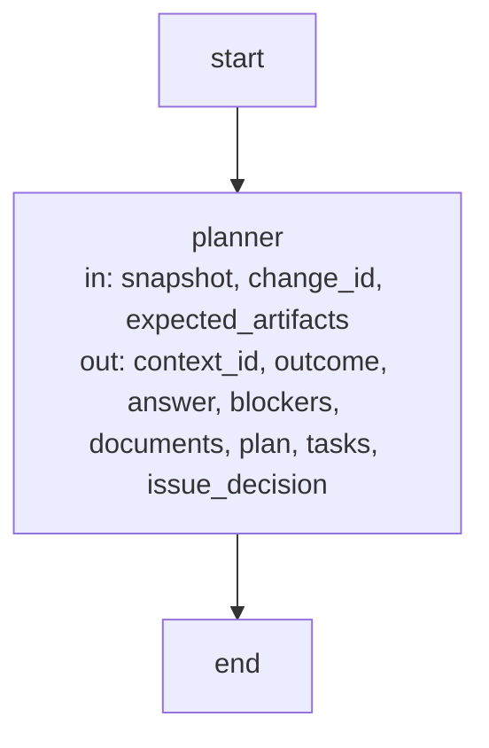
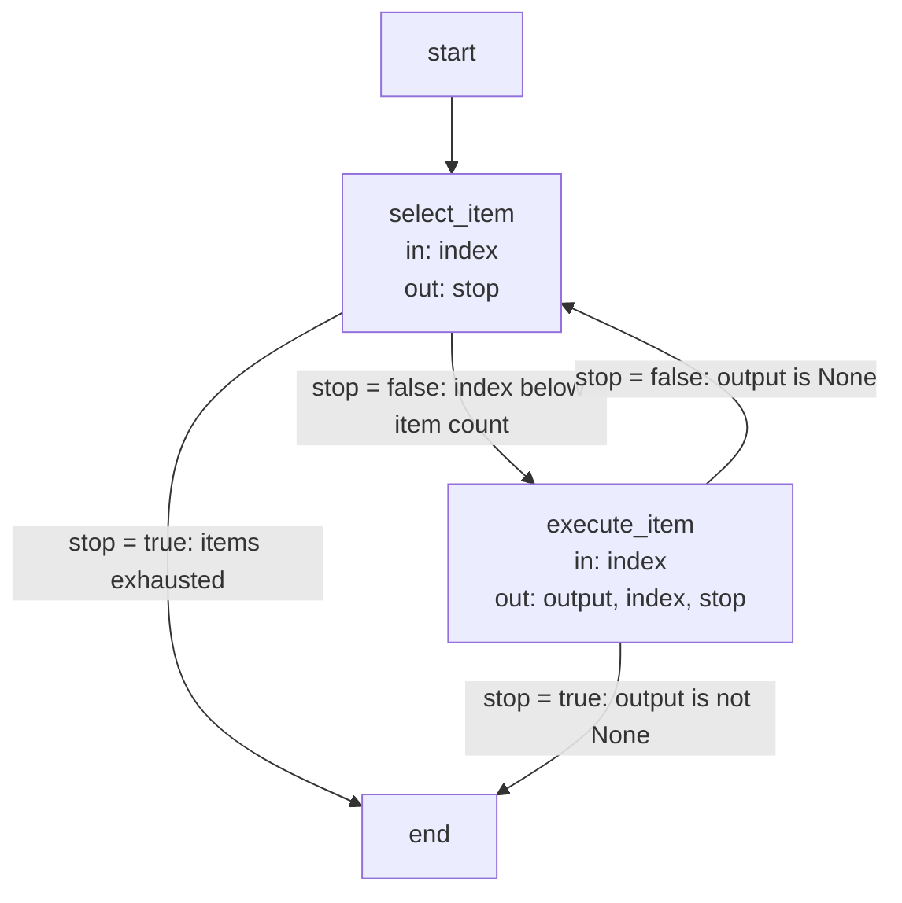

# Harness execution and record contracts

These are the precise implementation agreements and executable Graph specifications owned by the
[Harness Module](module.md). Explanatory topics introduce their purposes; exact identities, limits
and transitions are retained here as the single detailed contract.

## Terminology

| Term                                                      | Meaning / definition                             |
| --------------------------------------------------------- | ------------------------------------------------ |
| [Operation](../module.md#terminology)                     | Defined in Concorde Framework.                   |
| [Worker](../module.md#terminology)                        | Defined in Concorde Framework.                   |
| [Worker profile](module.md#terminology)                   | Defined in Harness.                              |
| [Harness](../module.md#terminology)                       | Defined in Concorde Framework.                   |
| [Host](../module.md#terminology)                          | Defined in Concorde Framework.                   |
| [Graph](../module.md#terminology)                         | Defined in Concorde Framework.                   |
| [Pi integration](../module.md#terminology)                | Defined in Concorde Framework.                   |
| [Context](../module.md#terminology)                       | Defined in Concorde Framework.                   |
| [Grant](../module.md#terminology)                         | Defined in Concorde Framework.                   |
| [Snapshot](../module.md#terminology)                      | Defined in Concorde Framework.                   |
| [Capsule](module.md#terminology)                          | Defined in Harness.                              |
| [Tool gate](module.md#terminology)                        | Defined in Harness.                              |
| [Spec context](context.md#terminology)                    | Defined in What information a worker receives.   |
| [Implementation context](context.md#terminology)          | Defined in What information a worker receives.   |
| [Task context](context.md#terminology)                    | Defined in What information a worker receives.   |
| [Issue](../module.md#terminology)                         | Defined in Concorde Framework.                   |
| [Evidence](../module.md#terminology)                      | Defined in Concorde Framework.                   |
| [Candidate](../module.md#terminology)                     | Defined in Concorde Framework.                   |
| [Worktree](../module.md#terminology)                      | Defined in Concorde Framework.                   |
| [Structural validation](../spec/structure.md#terminology) | Defined in What structural validation tells you. |
| [Semantic completeness](../spec/structure.md#terminology) | Defined in What structural validation tells you. |

## Operations and Harnesses {#agents-and-harnesses-operations-and-harnesses}

This document defines model execution configuration for the single Operation model. Operation
is the executable entity: deterministic code, a model invocation and a compiled LangGraph subgraph
all expose State-based node contracts. A worker profile is optional execution configuration on a
Operation, not a separately registered Agent or an additional composition relation. The historical
document identity and requirement/scenario anchors remain stable for existing links.

#### The execution model {#agents-and-harnesses-the-execution-model}

**Harness = context + control flow + models + permissions and environment.**
**Operation = input State + output State updates + execution implementation and constraints.**
**Invocation = Operation + Module/version + admitted artifacts + actual grant + runtime settings.**

| Term                    | Meaning                                                                                 |
| ----------------------- | --------------------------------------------------------------------------------------- |
| Operation               | The one executable identity, usable as a LangGraph node or composed subgraph            |
| State contract          | Declared input channels and output updates; wire shapes are checked at runtime          |
| Model execution profile | Instructions, task/effect contract, workspace, tools and timeout on an Operation        |
| Worker                  | One fresh Pi RPC process executing a model-backed Operation invocation                  |
| Harness                 | Context resolution, worker runtime, model selection, permissions and environment        |
| Pi integration          | The candidate or installed Pi entry/catalog and its Framework runtime                   |
| Tool                    | An interface admitted by the worker's actual tool grant, not by graph composition alone |

A deterministic Operation makes no model call on any supported path, including its transitive
composition. It may still read Git, files or subprocess results; determinism here does not mean
purity. Model-backed nodes use the same Operation inventory and USES relation as other nodes.
Sharing a graph State or knowing an Operation name grants neither context nor execution authority.

#### A1. Operation instructions and execution profile {#agents-and-harnesses-a1-operation-instructions-and-execution-profile}

Each model-backed Operation MUST own instructions in `operations/<name>/spec.md` and a Python
`PROFILE` declaration in that same package. Its instructions define responsibilities, goals,
accepted input and feedback, expected results, completion conditions, and behavior on missing
information, failure or required human decisions. These remain six sections after its
`# concorde-<name>` title. Common worker rules precede them in the build; Protocol rules follow
in the actual system prompt. Instructions are not project Spec context or permission grants.

`PROFILE` MUST have the same identity as its Operation and bind its task contract, workspace,
tools and timeout. There is no independent Agent inventory or `AGENTS` call relation.
A `WorkerBinding` records exact instruction, profile and build digests for one
model Operation. Stale or inconsistent bindings MUST prevent execution. The serialized `agent`
field, `concorde-agent-stage-*` types and `generated/agents/` paths are retained compatibility
spellings, not a second executable model.

#### A2. Profile and Harness {#agents-and-harnesses-a2-profile-and-harness}

A model profile selects a `capsule` workspace for Spec-only work or a `project` workspace for
implementation access. It declares Pi tools and maximum effects. The host adds `submit_result`. `edit` and `write` require a write
effect; implementation reads require the project workspace. The host compiles each concrete grant
as a subset of both those effects and its invocation authority.

Project configuration selects model, thinking and timeout, with per-worker overrides.
These settings are not authority. Pi starts with ambient sessions, context files, Skills, prompt
templates, themes and discovered extensions disabled. Only the host-issued configuration and
explicitly admitted tools are loaded. The shared [execution runtime](execution-reference.md) independently
validates the model profile, input, instruction bytes and permissions before launching a process.

#### A3. State and composition {#agents-and-harnesses-a3-state-and-composition}

Every Operation MUST expose a State contract and `run(state, runtime)`. LangGraph nodes read
only their admitted channels and return State updates. `OperationNode` supplies the common
compiled-node adapter; a compiled graph may be embedded as another node. Different parent/child
schemas require explicit channel mapping. Concurrent writers require explicit reducers on the
owning graph; no automatic merge or broad parent-State grant is inferred.

The host supplies launchers, configuration and authority through trusted `Runtime.context`, never
through caller-writable State. Model nodes validate their context and output against the task
contract as well as its wire schema. Existing public host adapters preserve the complete versioned
result envelope in a `result` output channel, including errors and blocked outcomes.

Operations MUST declare direct composition through `USES`, including model nodes. The host
rejects undeclared calls. A worker's granted tools are separate from the host's composition graph:
being present in `USES` does not install an Operation as a Pi tool. Dependencies must not widen
context, effects or write authority. Graph nodes, edges and stopping rules are the executable
control-graph definition; metadata does not repeat their order or branching.

#### A4. Invocation constraints and evidence {#agents-and-harnesses-a4-invocation-constraints-and-evidence}

Each invocation MUST bind its task, frozen context, Operation profile and instruction digests,
effective permissions, model settings and fresh identity. Reuse of an Operation never implies
reuse of its predecessor's conversation. Only explicitly admitted artifacts cross stages.

Completion MUST distinguish successful output, missing information, required human decisions,
cancellation, execution failure and exhausted limits. Failures MUST NOT retry with broader
permissions. A changed goal, context or authority requires new host admission. LangGraph State
schemas do not replace any of these checks.

#### A5. Terminal workers {#agents-and-harnesses-a5-one-level-helper-delegation}

Model-backed nodes run terminal Pi workers. Workers MUST NOT delegate tasks, create subagents or
recursively invoke Operations, including via shell commands. LangGraph/host owns all scheduling.
There is no child definition, child selection, delegation tool or extension. Retired child fields
and tools are rejected, not ignored or translated into new launches. Workers perform their own
admitted node work directly; the code reviewer receives read/check tools formerly used by its verifier.

Outer Pi/task-subagent delegation limits belong to the outer host. Concorde does not read, infer or
calculate cross-runtime current/maximum agent depth for terminal workers. Missing, incomplete,
malformed or exhausted legacy depth variables do not block a leaf launch and are not forwarded.
OperationHost.depth remains internal graph invocation nesting and evidence, not agent depth.
File/tool grants, independent result admission, cancellation and deadlines remain enforced.

#### Common worker rules and inventory {#agents-and-harnesses-common-worker-rules-and-inventory}

The build combines `prompts/workers/common.md` with the Operation's own instructions. [Distribution Module](../distribution/module.md) still publishes `generated/agents/<name>.md` to
preserve the installed instruction layout. The host appends the granted Protocol rule bundle.

The single inventory is defined by the [Operation registry](../operations/execution-reference.md#operations-operation-registry).
Its metadata includes each model Operation's optional workspace and tools alongside
its State and USES declarations. There is no separate `concorde.agents` metadata collection.

#### Task contracts {#agents-and-harnesses-task-contracts}

Each worker fulfils exactly one task contract. The table uses these typed pairs: **stage** =
`concorde-agent-stage-context` / `concorde-agent-stage-result`, **review** =
`concorde-review-stage-context` / `concorde-review-stage-result`.

| Worker           | Pair and phase/action | Admitted stage artifacts                                                                                                                                               | Result and authority                                                                                |
| ---------------- | --------------------- | ---------------------------------------------------------------------------------------------------------------------------------------------------------------------- | --------------------------------------------------------------------------------------------------- |
| spec-reviewer    | review; spec-review   | none                                                                                                                                                                   | Independent Spec findings; no author artifacts or writes                                            |
| context-assessor | stage; context-solve  | none                                                                                                                                                                   | Sufficient, incomplete, unsupported or conflicting assessment; no authored artifacts                |
| planner          | stage; plan           | optional concorde-plan-artifact                                                                                                                                        | Plan only; external references readable; no source contents or writes                               |
| task-author      | stage; tasks          | required concorde-plan-artifact and concorde-task-identity-constraints; optional concorde-implementation-task, concorde-review-result and concorde-task-scope-feedback | Implementation acceptance tasks with new IDs outside the reserved set; no source contents or writes |
| programmer       | stage; implementation | required concorde-implementation-task; optional concorde-review-result                                                                                                 | Fulfilled tasks only; may write the selected Module's listed implementation paths                   |
| code-reviewer    | review; code-review   | none                                                                                                                                                                   | Independent code findings; authorized code read-only                                                |
| issue-solver     | stage; issue-solve    | required concorde-issue-selection                                                                                                                                      | Bounded next action or disposition; Spec-only, no project writes                                    |

The host selects the worker before freezing its context and compiling its permissions, and the
executor checks that selection again before any process starts. A context of the wrong type or
phase, unadmitted or missing required artifacts, implementation contents
admitted to a worker without implementation reads, and a policy wider than the contract are
rejected. After the process, a result whose type, outcome or populated fields the contract does not
permit is rejected: disallowed authored fields as `permission_denied`, other contract violations as
`invalid_completion`. Reviews additionally bind the matching `review_mode`. Spec-only workers never
receive source contents or project writes; the programmer receives only the bound Module's
authorized code; read-only code review grants enumerate the frozen implementation
files, so a listed directory cannot widen them to hidden, excluded or later-created files.

The programmer executes useful tests its grant supports. A listed test does not grant transitive
imports or repository fixtures; an unavailable input is recorded as deferred host verification,
never as a passing result, and actual defects and unfulfilled obligations still prevent completion.
The Issue solver uses its own issue-solve phase and a selected problem, not an implementation grant.
Ordinary development stages may receive the host-bound concorde-issue-intent. Tasks/implementation
repair receives selected concorde-issue-context observations alongside the admitted review result.

Every phase, target, repair and review has a fresh invocation identity and frozen context. Sharing a
role never shares a conversation, private reasoning, stage inputs or write grant between workers.
Only explicitly admitted structured artifacts cross stages.

### Design {#agents-and-harnesses-design}

#### Responsibilities and implementation boundaries {#agents-and-harnesses-responsibilities-and-implementation-boundaries}

[Harness admission](admission.md) admits every request, the
[Operations dispatch](../operations/execution-reference.md#graphs-dispatch-graphs) routes it to
the declared provider and Graph contracts, and the invocation host schedules their invocations. [Planning Module](../planning/module.md) owns plan/task semantics, [Implementation Module](../implementation/module.md) owns task fulfillment, and each
composing Graph owns its ordering and stopping policy. This Module's worker executor verifies and
launches workers through the Pi worker runtime and admits their results; its permissions service
compiles effective boundaries; its context service supplies the admitted context kinds; its model-profile
service resolves definitions and bindings. The Distribution build renders and distributes instruction
views with source identity.

## Operation Graphs, loops and feedback {#graphs-and-loops-operation-graphs-loops-and-feedback}

Orchestration coordinates Operation invocations and control decisions toward a declared goal. A Graph describes the structure of that coordination; a Loop describes feedback
driven execution. They are related concepts, not interchangeable names.

**Graph** is Concorde's name for an executable LangGraph `StateGraph`. Every Graph is built with
LangGraph's Graph API, which declares nodes and edges before compilation; the Functional API
(`entrypoint` and `task` from `langgraph.func`) is not used anywhere in Concorde's source or
scripts, because a Graph whose control flow lives inside ordinary Python compiles to a single
opaque node with nothing for a Graph Spec, the Graph Spec check or Studio to inspect. Authored
descriptions and new Python factories use Graph and `build_*_graph`; LangGraph API names such as
`StateGraph`, `get_graph()` and the `graphs` configuration key keep their library spelling.
Retained stable Spec identities remain addressable. Deleted operation identities have no import
aliases; persisted historical `graph` records are history rather than executable prerequisites.

A Graph's state is a typed LangGraph state schema. Each retained Graph declares its own channels
and reducers; historical development/specification Graph records are not executable prerequisites.
Every model-backed node executes its worker through an
`OperationNode`: a State-based node/subgraph adapter whose input schema is generated from the worker contract's
admitted context type and whose output schema is generated from its result type, so the contract is
the graph state, and the Pi worker launch with its admission checks stays a host-private launcher
outside that state. The same `OperationNode` factory is exposed for inspection
inside the Graphs that run it.

A Graph's compiled nodes and edges are the authority for execution views. Inspection compiles the
same factories used by execution without invoking nodes, reading project contexts or launching
Agents. Branches, repeated Agent decisions, delegation, feedback and stage handoffs belong in Graph
transitions. Ordinary Python inside a node may validate data, prepare a context, perform one Agent
invocation or carry out a deterministic operation. An atomic delivery transaction may remain one
deterministic node so its repository lock and rollback boundary stay intact.

Runtime-dependent Module selection, resume entries and scope produce explicit conditional edges
or bounded Graph variants. A viewer must identify the variant or expose the possible branches; it
must not present hand-authored topology as executed code. Runtime-only host objects and callbacks
are not public inputs or durable checkpoint values. Stateless internal Graphs are inspectable but
do not promise internal checkpoint resume; replay re-enters admission through the public boundary.

#### Dispatch terminology {#graphs-and-loops-dispatch-terminology}

**Code-driven** dispatch uses explicit code rules to choose the next action, target Agent and
continue/stop condition. **Model-driven** dispatch uses a model's task and feedback assessment to
recommend the next action in its result. These name the source of a decision; only the Graph/host
schedules another invocation. Human decisions remain
separate, explicit inputs. Code-driven control does not guarantee reproducible overall output:
models, tools and external state may still vary. Determinism is a property to document where it
applies, not the primary classification of Agents or dispatch.

#### G1. Operation Graph {#graphs-and-loops-g1-operation-graph}

A Graph MUST declare its participating Operations, State contracts and directed transitions. Transitions MUST identify their trigger and
the information they transfer. Conditional branches, parallel execution or joins, when used, MUST
define selection, completion and failure behavior. A sequence of deterministic installation steps
does not become model-backed merely because it has several steps.

The Graph MUST identify which model Operation makes each model-assisted decision, which transitions are
code-driven, and which require a human decision. It MUST preserve invocation-local context and
permissions across every handoff. A coordinator receives only admitted results; dispatching an
model Operation does not grant access to its complete private context.

A Graph MAY be exposed as an Operation with a complete external contract. Invoking that Operation
does not expose its internal model workers or grant authority to call arbitrary internal nodes.

#### G2. Feedback loop {#graphs-and-loops-g2-feedback-loop}

A loop MUST define how execution moves through decision, action, observation and feedback,
and how those observations affect the next action. It MUST define completion, revision, waiting,
cancellation, failure and execution-limit conditions. Limits may be time, iterations, resource
budgets or an explicit bounded host policy; an unbounded retry is not an implicit default.

A model Operation's Harness supplies its local tool loop. A composed Graph may additionally
coordinate loops across several Operations, such as an Issue solver deciding whether current verification is sufficient. Each invocation's local loop and its enclosing loop MUST have distinguishable state and completion
conditions. Orchestration between workers is always a Graph transition: one worker never starts
another. Each worker does its own admitted work directly, as defined in A5.

A retry or revision MUST identify what changed or what recovery condition permits another attempt.
Unchanged blocking feedback MUST not cause endless retries. Stale task, context, policy or result
identity requires re-admission before execution continues. Completion of an inner loop does not
automatically complete the enclosing Graph or authorize delivery.

#### G3. AI and human feedback {#graphs-and-loops-g3-ai-and-human-feedback}

Feedback MUST identify its source, subject, relevant task or result revision, finding or decision,
and the transition it can affect. AI feedback and human decisions MUST remain distinguishable.
The representation may use existing typed review, task and acceptance artifacts; this requirement
does not introduce a separate comment store or mandatory feedback report.

| Feedback                        | Example                                                            | Permitted effect                                                  |
| ------------------------------- | ------------------------------------------------------------------ | ----------------------------------------------------------------- |
| AI assessment                   | A context assessor identifies a necessary missing contract         | Block the dependent step and name the required information        |
| AI review                       | A reviewer identifies a defect against the bound Spec              | Select an admitted repair path and recheck the revised result     |
| Human clarification             | A developer supplies missing intent or corrects a goal             | Produce an explicit task or context revision for fresh admission  |
| Human acceptance                | A developer accepts a specific initialization or delivery proposal | Enable only the transition and effects covered by that acceptance |
| Human rejection or cancellation | A developer rejects a proposal or ends the task                    | Revise, wait or terminate according to the Graph contract         |

AI feedback cannot substitute for a required human acceptance. Human text that merely mentions a
Tool or broader context is not an automatic permission grant. Every transition MUST preserve the
applicable task, context and authority checks. A graph receiving no answer to a required decision
remains waiting; elapsed time is not acceptance.

#### G4. State, recovery and evidence {#graphs-and-loops-g4-state-recovery-and-evidence}

Execution evidence MUST identify the Graph and loop policy, participating Agent invocations,
admitted feedback and selected transitions. It MUST distinguish completed, waiting, blocked,
cancelled, failed and limit-exhausted outcomes. A supported resume operation MUST revalidate the
saved state and feedback against the current task and authority before choosing the next transition.

Historical development-graph transition records and their `trigger` strings remain diagnostic
history, not a requirement to run a deleted graph or fabricate new transitions.

Review and check results are evidence about the bound revision. They do not remain valid after
relevant Agent Specs, Harness configurations, operation contracts, project inputs or policies
change. Raw logs and native transcripts remain diagnostics unless explicitly admitted as typed
downstream inputs.

#### Graph Specs {#graphs-and-loops-graph-specs}

Every executable Graph is specified with LangGraph's own three concepts, and nothing else stands
in for them: a **node** is one executing step, an **edge** is one routing decision, and **state**
is what a node reads and writes. A Graph Spec is one section of an implementation-role document of
the Module that owns the Graph, headed by the Graph's title and compiled name. It states three
parts in this order, each opening a paragraph with its bold label:

1. **State.** The typed channels the Graph carries between nodes, with their reducers where
   several writers merge, and the candidate or lifecycle records its nodes read and write.
2. **Nodes.** A table with the columns `Node`, `Executes`, `in` and `out`: one row per compiled
   node other than `__start__` and `__end__`, named exactly as the compiled Graph names it, what it
   executes (a deterministic, model-backed or composed Operation with its execution mode), and the
   state it reads (`in`) and writes (`out`) in the same words as its diagram label.
3. **Edges.** How the next node is chosen: which nodes decide, whether a conditional edge reads a
   State channel such as `route`, `result`, `output` or `stop` or the node returns a LangGraph
   `Command` naming its successor, and where stops and errors lead. A Mermaid flowchart follows,
   bound to the compiled Graph by the comment `%% graph: <name>`, where `<name>` is the Graph's
   compiled graph name in the Graph catalog. Its node identifiers are the compiled node names,
   `__start__` and `__end__` included; every node label states the node name, then `in:` and
   `out:`; every edge leaving a node with several successors is labeled with the condition that
   selects it, and an edge leaving a node with one successor carries no label.

**Reading the state labels.** `in` lists Graph channels actually read by the node, not every
channel present in its input dictionary. `out` lists its possible channel updates, not the whole
post-node State; an omitted channel retains its previous value. `none` means no channel read or
no update, not no business input or effect. `?` marks a conditional input/update or an optional
subgraph boundary channel. For a registered subgraph node, the labels name channels admitted at
that boundary, and the child's own Nodes table explains the actual reads/writes inside it. Unless a
Graph declares a reducer, updates replace the channel value (LangGraph's single-writer/last-value
semantics); this is not an implicit list append or concurrent merge. Tables describe normal node
updates plus the admitted invocation's guard updates; an error can stop before normal updates exist.

The `Executes` column and State prose separately identify inputs and effects held by trusted Host
objects, node closures or durable candidate records. They are not serialized State channels. A
`Command(goto=..., update=...)` separates control from data: `goto` is a destination, not a write
to `route`. Conditional edges instead read the updated State. A subgraph shares only the channels
admitted by its parent/child schemas; calling another Operation inside a node through admission
is not the same as registering that Operation as a compiled subgraph node. Internal Graphs disable
checkpointing; these diagrams do not promise that Host closures can be recovered from State alone.
A guarded admission/dispatch node resets `result` to None on success; on error it writes the
failure envelope and selects `__end__` through `route` or `Command.goto` where applicable.
Nested helpers without that guard propagate exceptions to the enclosing guarded invocation.

An Operation that runs a Graph is explained in the reading of the Module that owns the Operation,
and the owning Module's module-role reading links to the Graph Spec's explicit heading anchor. The
Graph Spec is the only place its nodes, state and routing are drawn: no separate page or generated
view repeats them.

The Graph Spec check (`scripts/development/check-graph-specs.py`, the configured
`check.harness.graph-specs`) compiles every catalog Graph with inert nodes and reports each
diagram whose nodes, edges, routing labels or state labels disagree with the compiled topology,
and every compiled Graph without a diagram. For each bound diagram it also reports a section that
is not in an implementation-role document, lacks or reorders its State, Nodes and Edges parts,
has a Nodes table that does not name exactly the compiled nodes with the `in` and `out` state of
their diagram labels, or has a heading without an explicit anchor or without a link to it from a
module-role document of the same owner. It also enforces the Graph API rule: a catalog Graph
that is not a compiled `StateGraph`, and any Python file under `src/`, `scripts/` or `operations/` that imports
`langgraph.func`, found by parsing the file rather than running it, are errors. A diagram that
passes proves the Spec and the executed topology agree; it proves nothing about whether the
routing conditions are right, which the scenarios and tests of the owning Module cover. The Relationships diagram of a Module's
reading entry remains the entity diagram the Protocol defines; Graph Specs live in other sections
or documents.

### Design {#graphs-and-loops-design}

#### Concorde Graph responsibilities {#graphs-and-loops-concorde-graph-responsibilities}

The retained admission and dispatch Graphs validate and execute caller-selected entries. Planning
assesses the selected contract before writing a plan; scoped reviews use independently bounded
contexts; Issue solving may verify current work or return repair intent to the caller. The outer
agent directly reads, answers and edits Specs and selects any subsequent work. There is no query,
topology, specification or development Graph. Delivery remains separately authorized and deterministic.

## Agent execution {#execution-agent-execution}

#### Configured deterministic checks {#execution-configured-deterministic-checks}

This host-only service runs configured commands without a model invocation. It is independent of
worker model selection and of the worker tool gate. Checks can read project files; their own
temporary files, caches and reports belong in fresh host-managed space outside the project.
Creating, modifying, moving or deleting a project file is denied at the attempted system call,
including a write followed by restoration. Project-local lifecycle and log paths are read-only too.

```python
execute_check(project_root: Path, argv: Sequence[str], *, timeout: float,
              environment: Mapping[str, str], private_tmp: bool = False) -> CheckResult
CheckResult(stdout: bytes, stderr: bytes, returncode: int, timed_out: bool = False)
CheckBackend.run(project: Path, argv: Sequence[str], scratch: Path,
                 environment: Mapping[str, str], timeout: float) -> CheckResult
```

The backend interface is trusted host code, never a registry field or a task-supplied executable.
Only Linux's BubblewrapBackend is currently supported. It requires a root-owned system bubblewrap,
user/mount/PID/IPC namespace support and kernel pidfds exposed by Python or libc. System file owners
unmapped by a parent check namespace are admitted only on its already read-only system mounts.
Missing binaries, unsupported
platforms, denied namespace setup, unsafe project locations and unavailable external temporary
storage raise `CheckSandboxError(RuntimeError)`. That exception retains byte `stdout`/`stderr`
diagnostics for the host. No failure retries through ordinary subprocess or weaker permissions.
An empty command, non-directory project or nonpositive/nonfinite timeout is also rejected.

Every call creates independent scratch storage even when ambient TMPDIR points into the project.
`TMPDIR`, `TMP`, `TEMP`, `XDG_CACHE_HOME` and `npm_config_cache` point into that storage;
`CONCORDE_CHECK_TMPDIR` names its root and `CONCORDE_CHECK_REPORT_DIR` its reports directory.
`PYTHONDONTWRITEBYTECODE=1` avoids routine Python cache attempts but is not the write boundary.
Hardcoded project cache/report paths must migrate; tools that modify sources belong in implementation.

The trusted tester bridge alone selects `private_tmp=True` (`tester-private-tmp-v1`). It is an
optional host API boolean, not a registry, environment or model-command parameter; other values
are rejected. The default and `project-read-only-v1` configured-check policy are unchanged.
This profile binds an empty `private-tmp` directory within the issued scratch onto `/tmp`, so
hardcoded worker policy/config/socket temporary directories work without a writable real host
`/tmp`. No runtime assets are copied or staged: fixture Frameworks, virtual environments and Pi
dependencies still use complete local installations and their existing read-only worker mounts.

Preexisting host `/tmp` is exposed read-only at `CONCORDE_TEST_HOST_TMP` (the issued scratch's
`host-tmp` mount). Commands must use that explicit view for other host-/tmp input artifacts; there
is no argv rewriting or unspecified path substitution. Absolute `/tmp` links or paths embedded in
other input scripts are not retargeted; callers explicitly use canonical inputs through the view
and account for path-sensitive tools rather than acquiring extra mounts. Governing project, executing Framework,
Python prefix/base prefix and interpreter locations under `/tmp` retain their original canonical
names by read-only binds of their top-level `/tmp` ancestors. No task can supply these mount
sources. A governing project/runtime at `/tmp` itself is refused rather than exposing it writable.
Other old `/tmp` names are hidden unless covered by those preserved ancestors. Issued scratch
remains writable at its exact absolute name; new `/tmp` entries belong only to the private backing.
All backing directories and temporary policy/config/socket data disappear with the same scratch
lifetime, after PID-namespace descendant cleanup on success, timeout, failure or cancellation.
Scratch and reports are ephemeral and disappear after the check. No report import into the project
is implicit. Standard output/error remain separate byte streams for outside-host persistence.

The result preserves command exit status using bubblewrap's shell encoding, including `128+signal`
for signal termination. A timeout, including sandbox setup time, returns `timed_out=True` and
`returncode=-1` with captured partial output. Host cancellation propagates after cleanup. A missing
trusted successful-exec status is an isolation/launch error, not an ordinary check failure. A
successful sandbox exit establishes execution under this boundary, not test adequacy or semantic
completeness. The calling host remains responsible for digest and candidate freshness checks;
`CHECK_POLICY="project-read-only-v1"` identifies this execution guarantee for evidence invalidation.

#### Required Agent and Harness boundary {#execution-required-agent-and-harness-boundary}

The local companion contract **Agents and Harnesses** defines A1–A5 for this Module. Execution MUST
receive a resolved worker binding, its frozen context, its compiled policy and its model selection,
and run exactly that worker. The worker executor's preflight reverifies the carried `WorkerBinding`,
the instructions, the admitted context and the policy against the current build and the worker's
contract before starting any process, so the launch below executes only a complete, checked worker
profile.

#### Worker execution {#execution-worker-execution}

`WorkerExecutor` runs one host-built `WorkerInvocation` as one Pi worker and returns a
`WorkerOutcome`, or raises `OperationExecutionError`. The local companion contract **Agent runtime
value and collaborator contracts** defines these records, the invocation builder and the preflight;
the [Pi worker runtime](#execution-pi-worker-runtime) below defines the process.

##### Workspace kinds {#execution-workspace-kinds}

A worker profile declares `workspace: capsule` or `workspace: project`; the registered workers and
their kinds are listed in [Agents and Harnesses](execution-reference.md).

- A **capsule** is a host-created temporary directory outside the project root, created for one
  invocation immediately before launch and removed after the host has verified it. It contains
  `context.json`, holding the frozen snapshot bytes, beside byte-identical copies of every Spec
  document and Protocol file that index lists, at their project-relative paths, plus the copied
  external references a worker with the `references` effect receives. It is the Pi process's
  working directory, and the tool gate's read grant is that directory, so the project root, the
  candidate worktree, other worktrees and the developer's home directory are outside the grant.
  The Spec-review, assessment, planning, Issue-solving and task workers use this kind.
- A **project** workspace is the candidate worktree itself and the Pi process's working directory.
  The snapshot is written below `.concorde/work/<invocation>/<uuid>/context.json` inside that
  worktree; the grant covers it, the Spec documents and the installed Protocol copy under
  `.concorde/protocol/` it indexes, at their project paths, and the selected Module's
  implementation: its listed entries with write authority for the programmer, its enumerated files
  read-only for the code reviewer. The Issue solver uses a Spec-only capsule.

In both kinds the host rereads the snapshot file after the worker settles and rejects a result whose
file bytes, registry digest, document digests or initialized configuration changed during execution
with `stale_context` or `configuration_mismatch`.

##### Input and result {#execution-input-and-result}

A worker's system prompt is the invocation's instructions: the common worker rules, the worker's
role Spec and the Protocol rule bundle, in that order. Its only message is the canonical typed
context: task context inline, Spec context as the index of granted files. Its output contract is its
`submit_result` tool, whose parameters are the self-contained JSON Schema of the contract's result
type narrowed by the verified worker profile's permitted authored fields. Optional fields the
profile cannot author are omitted from the closed tool schema; required compatibility fields keep
their original schema and additionally admit only their empty value (an empty array or string, or
null for a nullable field). Fields the profile can author retain their wire schemas.
For example, a planner can submit a plan but cannot submit document replacements or an Issue solver's
`issue_decision`; only the Issue solver retains that optional field. The shared wire type and graph State channels
are unchanged. Tool validation rejects unauthorized populated fields before successful submission
ends the run, allowing a corrected submission within the same invocation and original deadline;
this is not a host retry or wider grant. The executor still wraps the single submitted value as its
wire type and independently checks the profile contract, rather than trusting tool validation or
silently stripping unauthorized output. The host then checks context identity and gap provenance
before accepting stage completion. Independently, each admitted worker may use `report_issue` to
persist an observation through a host-issued, scope-bound callback before submitting its final result. Report admission
is separate from completion; accepted reports survive an invalid or interrupted final result.
The [Issue reporting boundary](../issues/execution-reference.md#issues-worker-reporting-service) defines report
shape and authority. A worker in a project workspace also receives the host check service behind
`run_checks`.

##### Common limits {#execution-common-limits}

The Pi process runs as the developer's user inside the [worker sandbox](#execution-worker-sandbox)
with the developer's Pi credentials copied into its run directory, and talks to its model provider
over the shared network. The gate bounds what the model's tools can reach; the sandbox bounds the
process, so a shell command run by a worker granted `bash` can write only the grant and cannot read
the masked secret locations or other worktrees. The credential paths the compiler always denies
(`.env`, `.aws`, `.ssh` and the other listed entries) are project-relative entries; home-directory
secrets are masked by the sandbox's fixed list, and the credentials the process itself needs remain
readable inside it.

#### Pi worker runtime {#execution-pi-worker-runtime}

A Pi worker is one Pi coding agent process run in RPC mode for one bounded task. Pi calls the
worker's model through its own providers and executes its built-in tools; LangGraph stays the
orchestration around it. `PiWorkerRuntime` launches one `WorkerLaunch` and returns a
`WorkerResult` or raises `WorkerExecutionError`:

```python
WorkerLaunch(worker: str, workspace: str, system_prompt: str, message: str,
             result_schema: Mapping[str, Any], tools: tuple[str, ...],
             read_paths: tuple[str, ...] = (), write_paths: tuple[str, ...] = (),
             model: str | None = None, thinking: str | None = None, timeout_seconds: float = 1800,
             report_schema: Mapping[str, Any] | None = None)
PiWorkerRuntime(package_root: Path, pi_executable: str | None = None,
                environment: Mapping[str, str] | None = None, credentials_dir: Path | None = None,
                popen=subprocess.Popen)
PiWorkerRuntime.__call__(launch: WorkerLaunch, *, checks: Callable[[], Any] | None = None,
                         report_issue: Callable[[dict], Any] | None = None) -> WorkerResult
WorkerResult(value: dict[str, Any], run: PiRun, usage: dict[str, Any])
WorkerExecutionError(message: str, outcome: "failed"|"cancelled"|"limit_exhausted"|"invalid_completion",
                     run: PiRun | None = None)
run_prompt(argv, *, cwd: str, env: Mapping[str, str], message: str, timeout: float, popen=subprocess.Popen) -> PiRun
```

Paths in a launch are relative to its absolute workspace, which is the process's working
directory. `model` is Pi's `provider/id` and `thinking` one of Pi's levels (`off` through `max`).
The tools are Pi's built-ins (`read`, `grep`, `find`, `ls`, `edit`, `write`, `bash`) and the
Concorde tools: `submit_result`, which every worker has; `run_checks`, which requires the host
check service; and `report_issue`, which requires both its host callback and report schema.
Edit and write require a write grant. No delegation or recursive Operation tools are admitted. An inconsistent launch
is refused before any process starts. The executor accepts an optional host reporter with a
`schema` property and callable report handler, forwards it only to the admitted runtime, and does
not convert reporting authority into any file write grant. The invocation host supplies
this service for actual worker launches, including capsule workers, but not policy previews.

An RPC failure retains the finished `PiRun` on the exception through the runtime and executor,
including the process exit status and a bounded stderr tail. Public error messages contain only
host-authored summaries, never raw RPC rejection details or stderr. For a failed worker launch,
the host preserves the last 20,000 UTF-8 bytes of stderr with the launch identity, worker, outcome,
exit status and elapsed time in a mode-0600 `worker-*.json` diagnostic under
`.concorde/runs/<root invocation id>/`. The public error may name this host-only artifact but does
not embed its contents. Prompts, RPC events, tool results and credential files are not serialized
into that artifact or observer events. These diagnostics confer no worker read grant, do not count
as successful execution evidence, and a persistence failure preserves the original execution
failure without retrying. EOF, cancellation, timeout and protocol failure keep their existing
outcome distinctions.

The private Unix socket dispatches only explicitly granted `run_checks` and `report_issue` calls.
Requests must be complete newline-terminated JSON frames of at most 128 KiB, received within ten
seconds. Reporting parameters are validated by the bound host callback, which returns only a
receipt. A rejected callback returns an error that the extension throws as a failed tool result,
not a successful receipt. Reporting never returns `terminate`; the worker can continue reporting
or working. Accepted persistence is retained if cancellation disconnects the client before the
acknowledgement arrives.

#### Usage accounting {#execution-usage-accounting}

Pi reports what a run consumed in its session statistics, which the runtime reads after the worker
settles: input, cached input, output and total tokens, cost and assistant turns. The executor
records them as an `ExecutionUsage` record on the `WorkerOutcome`: the configured `model` and
`thinking` level, `input_tokens`, `cached_input_tokens`, `output_tokens`, `total_tokens`,
`cost_usd`, `turns`, host-measured `wall_seconds`, and the `prompt_bytes` and `context_bytes` the host
handed the process. A figure Pi did not report is `None`, never zero.

In the primary worktree only, the host records one line per launch through `record_usage` in `.concorde/runs/<root invocation
id>/usage.jsonl`, with `schema_version: 2` and labelled with `operation`, `stage`, `target_id`, `agent`, `change_id`, the
launching host's `invocation_id` and `depth`, the launch's own `launch_invocation_id`, `context_id`
and `model`, and the usage record. The root invocation id is the top-level operation invocation's
identity, inherited by every nested operation invocation (`OperationHost.root_invocation_id`), so
one Graph run keeps one file. The same record reaches the host observer as an `agent_usage` event.
`read_usage` and `summarize_usage` aggregate the lines per step (operation, stage and target),
stage, target, worker and run; the `concorde usage` Tool and the executable boundary's stderr summary
use them. Usage is diagnostic evidence about cost: it gates nothing, and a failure to persist it
never fails the launch. Summaries use schema 2 and report `complete`, `historical_records` and
`unsupported_records`, including in the executable boundary's stderr summary. Unversioned historical
lines with the old `capability` label are read-only diagnostics: aggregate their original step labels
and count them explicitly as historical, without rewriting files or treating them as current
execution evidence. Unknown formats, including unversioned lines claiming the new `operation` field,
are excluded from totals and make the summary explicitly incomplete; they are not grouped under a
silently invented null Operation. See [usage accounting](scenarios.md#scenario.harness.usage-accounting).

#### Diagnostic timing {#execution-diagnostic-timing}

A diagnostic span has schema_version 1, trace_id, span_id, nullable parent_id, layer A/B/C,
name, process_id, nullable session_id/task_id, started_at (UTC wall timestamp), process-local
monotonic start_ns, nullable duration_ns, status ok/error/cancelled/incomplete and bounded metadata.
A trace is diagnostic identity, not an invocation grant. Host-issued root/invocation/launch and
context identities correlate runtime work; standalone installation may use a diagnostic UUID.
Unknown fields and absent measurements do not become zero. Clocks from different processes are
not subtracted; analysis reports per-process interval unions and summed work separately.

Runtime spans cover admission, relay/worktree creation, local package admission/verification,
installation and managed-runtime acquisition, health and launcher probes, context/preflight,
worker/Pi execution, sandbox preparation, RPC acceptance/round/tool intervals, configured checks,
result validation and evidence/lock work. The host observer receives bounded timing at completion;
trusted host persistence uses primary run paths, locks and mode-0600 diagnostics. Sink errors mark
telemetry incomplete without changing the Operation result or retrying a mutation. A bounded
in-memory trace retains at most 20,000 spans and counts omissions.

Standalone deterministic fixtures can explicitly select an existing canonical external directory
with CONCORDE_DIAGNOSTIC_TIMING_DIR. Unique private files there contain diagnostics only, not
candidate status/runs. The test runner supplies temporary per-unit storage and embeds measured
runtime spans into its report; it never guesses install time from a whole unittest duration.
This optional diagnostic location is not primary execution authority or a worker grant.

Outer observation uses existing Pi session/provider/turn/tool/compaction events and native custom
entries, including direct non-Operation sessions. It observes current context estimates/capacity,
reported input/output/cache counts and reserve when actually supplied by compaction preparation.
Unknown reserve/compaction information stays null. Role/session and hashed native lineage are
recorded separately from task authority. Main may annotate bounded handoff/test-trigger reasons
through the process-local concorde:outer-fact:v1 event; hooks never infer exhaustion, compact,
launch children or change provider/settings/tool/prompt state. Native pi-subagents events remain
owned by that package; explicit child observation extensions do not load ambient catalogs.

#### Outcomes {#execution-outcomes}

A worker's deadline is its selected `timeout_seconds`, else its profile's timeout as bound in its
`WorkerBinding`. `OperationExecutionError.outcome` distinguishes four cases so a caller need not
parse message text: `failed` for a refused preflight, a process that exits or breaks the RPC
protocol before settling, or any other launch failure; `cancelled` for a host interrupt, with the
process already killed; `limit_exhausted` for a run past its deadline, likewise killed; and
`invalid_completion` for a run with no, several or an invalid submitted result. A contract
rejection keeps its class in `code` (`permission_denied` for disallowed authored fields). None of
these outcomes triggers an automatic retry, with the same or any wider permissions. Authorized
implementation edits made before a failure can remain in the candidate; the executor does not
promise rollback.

#### Representative use {#execution-representative-use}

The wire collaborator provides `json_schema(type_id: str) -> dict` for a self-contained typed result
schema and `validate_typed(value: Any, expected: str | None = None, field: str = "") -> dict` for
strict type, version, property and uniqueness validation. Unknown types or versions, unsafe paths,
invalid fields and mismatched expected types raise `TypedDataError(ValueError)` with `code` and
`field`; the executor treats them as invalid completion, not successful output. These calls perform
no project mutation or remote schema resolution.

```python
executor = WorkerExecutor()
# invocation is already built by the trusted host with build_worker_invocation.
try:
    outcome = executor(invocation, checks=checks)
except OperationExecutionError as failure:
    reason = failure.outcome          # stop the transition; failure.usage may carry what was spent
else:
    assert outcome.invocation_digest == invocation.digest
    result = outcome.value["data"]    # the validated typed result
```

Consumers bind the outcome to the invocation and binding digests and consume the typed result
rather than raw process output. A runtime double can test these boundary mechanics but cannot
establish that a model detected a semantic gap or behavior defect.

### Design {#execution-design}

#### Check isolation mechanism {#execution-check-isolation-mechanism}

Linux recursively maps the host filesystem read-only so another pathname, hard link or external
dependency directory cannot supply a writable alias. It replaces `/proc` with the sandbox's PID
view and `/dev` with minimal private devices, drops operations, disconnects the terminal and
gives only the new scratch directory a writable host mount. Shared memory uses scratch as well.
Project roots at `/` or below `/proc`, `/dev` or `/sys` are unsupported. Additional user namespaces
remain available for nested checks; inherited read-only mounts cannot be remounted writable there.
The bootstrap binary uses a fixed system search and minimal loader environment; the supplied
check environment travels through an anonymous options descriptor rather than the public process
command line and is installed for sandbox execution. This service defines no finer read,
network or credential policy and does not mediate effects requested from external services.

The host closes inherited descriptors, supplies null stdin and captures output through pipes,
never by passing an open project log to the process. Bubblewrap's host-only metadata descriptors
are closed before command execution. A launch gate keeps the command stopped until the host pins
namespace PID 1 with a pidfd. On timeout, cancellation, failure and normal completion, the host
terminates the namespace and waits for cleanup before removing scratch. This includes descendants
that double-fork, create sessions or reset parent-death signals. Both output pipes drain while the
initial command runs, and a background process holding them open cannot prevent cleanup.

##### What the host itself enforces {#execution-what-the-host-itself-enforces}

- **Fresh process, closed inputs.** Every launch is a new Pi process with sessions, context files,
  skills, prompt templates, themes and discovered extensions disabled. No predecessor transcript,
  conversation or session state is passed.
- **Environment allowlist.** The process environment is rebuilt from `SAFE_ENVIRONMENT` in
  `harness.py` (`HOME`, `PATH`, `LANG`, `LC_ALL`, `LC_CTYPE`, `LOGNAME`, `USER`, `TMPDIR`, `TMP`,
  `TEMP` and their Windows equivalents), the provider credential variables Pi documents and Pi's
  own control variables. Every other variable of the calling shell is absent.
- **Binding equality.** Preflight rejects an invocation whose binding, instructions, Protocol files,
  context or policy differ from what the current build and the worker's contract admit.
- **Tool gate.** The Concorde worker extension refuses every tool call outside the compiled grant in
  the terminal worker ([tool gate](#execution-tool-gate)).
- **Worker sandbox.** The Pi process runs inside the mount plan derived from its grant
  ([worker sandbox](#execution-worker-sandbox)); an unavailable boundary refuses the launch.
- **Result admission.** Only one submitted result that satisfies the result type and the contract
  completes the invocation; a settled process alone is not completion.

##### Launch {#execution-launch}

Each launch gets a private run directory under system `/tmp`, outside any worktree even when
ambient TMPDIR points into a project; it is removed afterwards. Its `agent/` directory is
Pi's configuration directory for the process (`PI_CODING_AGENT_DIR`): Concorde's own settings
(project trust never, install telemetry off), the developer's
Pi credentials (`auth.json` and custom-provider `models.json`, copied from the developer's Pi
directory). No child catalog or delegation configuration is written. Beside it lie `policy.json`, which the Concorde worker
extension enforces, `system-prompt.md`, which it installs as the worker's complete system prompt,
`tmp/`, the process's temporary directory, and, for a worker with `run_checks` or `report_issue`,
the host tool service's socket. The developer's own Pi settings, sessions, agents, extensions and skills are
never read. When Pi refreshes an OAuth credential during the run, the host writes the refreshed
`auth.json` back to the developer's Pi directory, but only while that file still holds the bytes the
run was issued, so a concurrent refresh is never overwritten.

The process runs `pi --mode rpc --no-session --no-context-files --no-skills --no-prompt-templates
--no-themes --no-extensions -e pi/extensions/concorde-worker.ts --no-approve
--offline --tools <tools> [--model <model>] [--thinking <level>]`. Its environment is the host allowlist, the provider credential
variables Pi documents, `PI_OFFLINE`, `PI_SKIP_VERSION_CHECK`, `PI_TELEMETRY=0`, the run
directory's `TMPDIR`, a `HOME` inside the run directory and the policy location. The command runs
inside the [worker sandbox](#execution-worker-sandbox). The host sends one `prompt` command carrying the
worker's message, reads records split on line feed only until `agent_settled`, answers every
extension dialog as cancelled, reads the session statistics and closes the process.

The result is the `details` of the worker's single successful `submit_result` call. That tool's
parameters are the launch's result schema, so the model sees its output contract as a tool, and it
ends the run. No submission or a second one is `invalid_completion`; a missed deadline kills the
process and is `limit_exhausted`; a host interrupt is `cancelled`; a process that exits or breaks
the protocol before settling is `failed`. None of them retries. The caller validates the value
against its own typed contract. Usage comes from Pi's session statistics: input, cached input and
output tokens, cost, assistant turns and the host-measured wall time.

##### Tool gate {#execution-tool-gate}

The Concorde worker extension gates every tool call before it executes: a tool outside the
granted list is refused; `read`, `grep`, `find` and `ls` must target a path whose canonical form,
symlinks resolved, lies under a read or write grant, and a search without a path targets the
workspace itself; `edit` and `write` must target a path under a write grant; each `bash` command
first unsets the provider credential variables. A refused call returns an error result naming the
policy, and the model continues. The gate runs inside the Pi process, so it is a policy boundary
over the model's tool calls; the [worker sandbox](#execution-worker-sandbox) around the process
bounds shell commands and everything else the process does.

##### Terminal policy compatibility {#execution-one-level-delegation}

The private worker policy uses schema 2 and rejects schema 1 and retired `children`, `child_tools`
and `extension_path` fields. The profile, launch and invocation Python constructors no longer
accept child definitions/selections. No compatibility alias recreates delegation. The extension
registers only granted service tools and activates exactly the host tool list; all other tools,
including `subagent` and the outer `concorde` tool, are refused.

Operation entry rejects the worker environment marker `CONCORDE_WORKER_POLICY`; the outer Pi
session extension also refuses loading there. This is a cooperative runtime guard, not a claim
that arbitrary shell programs cannot clear environment variables or execute other agents. The
existing mount sandbox, shared network and credential limitations are unchanged. Worker
instructions prohibit those workarounds; this change does not redesign process isolation.

The only installed worker JavaScript dependency is pinned TypeBox, installed by `npm ci --prefix pi`
in a source checkout or under `.concorde/.venv/share/concorde/pi` in a consumer runtime.
The worker extension imports TypeBox by its exact local file URL, not Pi's bundled bare-name alias.
Its layout fixes the dependency location; absent local assets fail rather than selecting another
worktree or temporary asset copies. The complete installation precedes relay and installed admission
as defined in [worktree admission](admission.md#operation-execution-boundary). Existing runtime
mount validation, other-worktree masks and task read/write grants remain unchanged.

##### Host check service {#execution-host-check-service}

For a worker granted `run_checks`, the host serves one Unix socket in the run directory. The tool
sends `{"tool": "run_checks"}` and returns the host's JSON reply, or an `error` field when the host
callback fails; the host runs the configured checks under its own read-only executor.

##### Worker sandbox {#execution-worker-sandbox}

`worker_sandbox` derives one `MountPlan` from the launch and runs the Pi command inside bubblewrap
(`plan_mounts`, `create_placeholders`, `bubblewrap_argv`, `remove_untouched_placeholders` and
`unavailable_reason`); `WORKER_SANDBOX_POLICY`, `worker-mounts-v1`, names these rules and the policy
preview records it as `sandbox`. The host filesystem is bound read-only with fresh `/proc` and
`/dev` and a private tmpfs over `/tmp` and `/dev/shm`. The existing entries of `MASKED_HOME_PATHS`
below the developer's home directory are masked, a directory by an empty tmpfs and a file by an
empty file from the run directory, and so is every other worktree of the workspace's repository,
whose shared Git directory is re-bound read-only so Git keeps working in a candidate. The workspace
is then bound read-only. Separately from the task's read/write grants, the trusted Pi runtime names
its exact worker extension file and installed dependency subtree: TypeBox for every terminal worker. The mount plan validates their
absolute canonical paths, existence and file/directory kinds, rejects escaped dependency symlinks
and overlap with masked paths, other worktrees, writable entries or the run directory, and rejects
an asset that contains the workspace. These runtime assets are re-bound read-only after the private
`/tmp` mount so a package installed under `/tmp` remains executable without exposing its project
source, control records, enclosing repository or unrelated temporary files. Task input cannot add
runtime mounts, and these paths are not Spec or implementation grants. The run directory and every
write entry are bound writable in place. A
pending entry that does not exist yet is created before the launch as an empty placeholder, a file
below any missing directories or an empty directory, so exactly that path is writable; a placeholder
the worker left empty is removed after the run. The process gets private user, PID, IPC and UTS
namespaces, drops all capabilities, dies with the host and starts in the workspace with `HOME`
inside the run directory. The network namespace is shared. A write entry that is a symlink or leaves
the workspace, a workspace that contains the run directory, a platform other than Linux or a missing
trusted bubblewrap refuses the launch as `worker sandbox unavailable` before any process starts.

### Precise specifications {#execution-precise-specifications}

The Harness Module owns the exact obligations and interface details in [scenarios](scenarios.md).
These companions are part of the same complete Module specification, not separate topic owners.

## Invocation host {#host-invocation-host}

This document defines how the Harness binds and runs one worker invocation, the LangGraph substrate
every control flow uses, and the optional Studio view. Value records are defined in
[runtime values](runtime-values.md).

#### Studio execution view {#host-studio-execution-view}

The Studio adapter starts or observes the same OperationHost used by CLI and Pi tool invocations, with
the same worker executor. Its generated LangGraph configuration exposes one Graph per public Operation. Studio
expands the same admission, dispatch and composed Graph instances used by local calls, including
explicit target admission, planning, review and Issue-solving branches. Non-public Operations
remain callable through declared composition. Batch Graphs are also inspectable from
their executable factories; their runtime instances depend on host admission. Studio receives an
invocation wrapper containing the existing schema-3 invocation and an optional expected_workspace
assertion. Project and package roots remain host-bound; the assertion does not select another
workspace.

The final state exposes the unchanged operation result envelope, admitted policy descriptions and
stage and worker events (`agent_started`, `agent_finished`, `agent_failed` naming the operation,
stage, worker and invocation). Pausing or replaying a run does not waive permissions, checks or the
worktree lifecycle, and replay may execute effects again. Ordinary local CLI and Pi tool calls do not
require a Studio server. The source-checkout setup and debugging guide is scripts/development/STUDIO.md.
This execution view participates in Developer view and feedback through the same admission.

### Design {#host-design}

#### Invocation binding {#host-invocation-binding}

The host obtains an invocation's inputs in a fixed order: select the worker whose contract names the
stage; load its rendered instructions and resolve its `WorkerBinding` against the build (see
[Agents and Harnesses](execution-reference.md)); freeze its context (see [context](context.md)) with
those instructions; compile the exact role and path policy with `compile_policy`; resolve the
worker's model selection from project configuration; bind all of it with
`build_worker_invocation`; then call the worker executor (see [execution](execution-reference.md)). The
executor independently reverifies the binding, instructions, context and policy before any process
starts. A worker in a project workspace also receives the host's check service, which runs the
selected Module's configured checks read-only and returns each check's status and the tail of its
log.

One Harness launch service realizes this sequence for every model-backed stage, whichever
provider requests it: the Module-bound stage and the reviewer both pass through the same index materialization,
policy compilation, receipt, preview, single-result admission and rechecks of the registry,
frozen context, configuration and index. A provider supplies only the context it froze, the
value its worker receives, the judgement of the result and the preview answer; it cannot skip
or reorder a step of the sequence.

`describe-policy` mode previews the exact grant a stage would receive without launching anything or
exposing context bodies: the worker, its binding, profile and instructions digests, its workspace
kind and tools, the read and write paths and policy digest, and the resolved model,
thinking level and timeout.

#### Control-graph substrate {#host-control-graph-substrate}

Every retained operation Graph, including assessment, planning, review,
Issue solving and the deterministic operations, is a LangGraph `StateGraph` built
with the Graph API, never with the Functional API. Its nodes are deterministic steps, which make no
model call, or worker invocations, which do. These Graphs are the Studio surface; no operation runs
its control flow outside them. Graph structure alone proves nothing about semantics: transitions,
limits and evidence still follow G1–G4.

#### Operation node (`operation_node`) {#host-operation-node-operation-node}

Every registered Operation exposes `run(state, runtime)` and a State contract. `OperationNode`
compiles that same implementation for embedding as a LangGraph subgraph, whether its implementation
uses a model or the host's deterministic/composed Graph. Input schemas admit only the Operation's
channels; output schemas expose only its declared update. Hosts, launchers and configuration live
in trusted `Runtime.context`, not State. Host-backed adapters preserve their full success or failure
envelope in the `result` output channel. Model nodes return their task-result fields. The catalog
compiles the planner as its representative; the node name is the Operation's identity.

**State.** The contract's context fields in (for a stage context: `snapshot`, `change_id`,
`expected_artifacts`) and the contract's result fields out (`context_id`, `outcome`, `answer`,
`blockers`, `documents`, `plan`, `tasks`, `issue_decision`). These channels use replacement updates;
there is no implicit merge reducer. The diagram shows the planner contract, not the unrelated
request/output fields of every other Operation.

**Nodes.**

| Node      | Executes                                                                                                                | in                                      | out                                                                           |
| --------- | ----------------------------------------------------------------------------------------------------------------------- | --------------------------------------- | ----------------------------------------------------------------------------- |
| `planner` | One Pi worker under the host launcher, which validates the input/result contract and records usage outside Graph State. | snapshot, change_id, expected_artifacts | context_id, outcome, answer, blockers, documents, plan, tasks, issue_decision |

**Edges.** None branch: the Graph runs its one node from `__start__` to `__end__`. What runs next is
decided by the enclosing Graph that embeds the Operation as one of its nodes.



#### Sequential work items Graph (`batch_graph`) {#host-sequential-work-items-graph-batch-graph}

Independently admitted review items run one at a time through this Graph; the item node is named
per use (`review_module`; the catalog compiles it as `execute_item`). The factory itself does not
author Specs, develop components or choose participants.

**State.** `index` (the next item), `output` (the first non-None item result, which stops the
Graph), `stop`. `index` is an integer and `stop` a boolean; `output` admits the caller's item
result or None. All use replacement updates. Invocation starts with `index=0, output=None`.
The finite item tuple and the callable are held by the Host closure, not in State.

**Nodes.**

| Node           | Executes                                                                                                    | in    | out                 |
| -------------- | ----------------------------------------------------------------------------------------------------------- | ----- | ------------------- |
| `select_item`  | Deterministic: compares index to the length of the Host-bound item tuple.                                   | index | stop                |
| `execute_item` | Calls the Host-bound operation on items[index], increments index and sets stop when its result is not None. | index | output, index, stop |

**Edges.** Both nodes route on `stop` through conditional edges: `select_item` ends the Graph when no
item remains and runs `execute_item` otherwise, and `execute_item` ends it when the item returned a
result and returns to `select_item` when it returned None. Exhaustion is `index >= len(items)`;
an item stop is `output is not None` (even a falsey dictionary is a stop). Exceptions propagate
to the enclosing caller; they are not an unshown `result` channel or another batch transition.



## Permissions {#permissions-permissions}

#### Required worker authority boundary {#permissions-required-worker-authority-boundary}

The local companion contract **Agents and Harnesses** defines A4 for this Module. Effective authority
MUST be a subset of the worker contract's effects and the host's invocation grant, including tool
use as well as file, process, network and credential effects. Resource availability in a Harness is
not permission. `compile_policy` compiles the contract's declared `EffectDeclaration` against a
host-supplied, narrowing `PolicyBinding` and the concrete role paths the host resolved, so it can only
produce a policy at or under that authority boundary, never beyond it.

The host supplies the role paths from the frozen context: the `spec-context`
role names the context index file and every document and Protocol file it lists; `implementation`
names the selected Module's bound implementation files, or its listed entries for a code writer; and
`references` names the Module's external reference roots. Context descriptions, installed resources
and caller task JSON cannot add paths or operations. The executor recompiles the grant against the
worker's contract before launch and rejects a policy that is wider, that grants writes to a worker
without a write effect, or that grants network or credential effects to any worker.

#### Enforcement {#permissions-enforcement}

The compiled policy becomes the Concorde worker extension's policy for the invocation. The extension
gates every tool call inside the terminal worker's Pi process: a tool outside
the granted list is refused; `read`, `grep`, `find` and `ls` must target a canonical path, symlinks
resolved, under a read or write grant; `edit` and `write` must target a path under a write grant; no
worker can delegate or call another Operation. A capsule worker's workspace contains only its granted
copies, so its read grant also covers the workspace root.

The gate is a policy boundary inside the Pi process over the model's tool calls. The process itself
runs inside the [worker sandbox](#execution-worker-sandbox): a worker granted `bash` can write only
the compiled write grant, cannot read the masked secret locations or other worktrees, and the host
removes the provider credential variables from each command. The Pi process reaches its model
provider over the shared network with the developer's Pi credentials, which its run directory holds.
Configured deterministic checks run under the same kind of boundary through the check executor.

#### Policy compilation {#permissions-policy-compilation}

`compile_policy(effects, binding, role_paths, deny_paths=())` intersects declared role paths with
explicit host authority, producing a digest-bound policy. `verify_effective_subset(declared,
effective)` rejects an effective policy that widens a declared one. `require_isolated_worktree(project_root,
allow_primary_worktree=False)` rejects unsafe mutation environments unless the trusted host grants the
explicit exception. Task JSON cannot override any permission.

### Precise specifications {#permissions-precise-specifications}

The Harness Module owns the exact obligations and interface details in [contracts](contracts.md).
These companions are part of the same complete Module specification, not separate topic owners.

## Typed values {#typed-values-typed-values}

#### Typed value and schema validation {#typed-values-typed-value-and-schema-validation}

`typed(type_id, data)` produces a validated TypedValue; `validate_typed(value, expected=None,
field="")` rejects unknown type/version, unknown properties, malformed values and unsafe paths.
There is no caller-supplied `schema_version` argument to `typed`. `decode(text)` rejects duplicate
JSON keys and non-finite numeric constants. `json_schema(type_id)` exports self-contained schemas
with local definitions. Contract IDs are stable independent of paths. Canonical interface definitions
admit only the supported offline subset: remote references and unknown keywords fail.
Structural validation is not a claim of semantic completeness.

#### Canonical serialization {#typed-values-canonical-serialization}

`canonical(value)` returns a JSON string using Python's standard JSON encoder with sorted
object keys, compact separators (`,` and `:`), ASCII escaping and `allow_nan=False`, with no
trailing newline. It accepts `None`, booleans, strings, integers, finite floats, lists, tuples
(encoded as arrays), and dictionaries containing recursively supported values. String-keyed
objects are the transport contract: keys sort lexicographically, array order is preserved, and
non-ASCII characters are escaped. It does not validate TypedValue schemas, normalize Unicode or
numeric representations, or implement a separate cross-language canonicalization standard.

The underlying encoder also accepts dictionary keys of type integer, finite float, boolean or
`None` when key sorting is possible, converting them to JSON property strings. Such coercion can
produce duplicate property strings; callers requiring round trips through `decode` must use
unique string keys. Mixed keys that cannot be compared raise `TypeError`. Unsupported objects
(including bytes, sets and arbitrary class instances) and unsupported key types raise `TypeError`.
Non-finite floats anywhere in values or keys, and circular containers, raise `ValueError`;
excessive nesting can raise `RecursionError`. These encoder exceptions propagate directly and
are not wrapped as `TypedDataError`. Successful serialization has no filesystem effects and
normalizes only the encoding choices stated above.

#### Typed values and recursive dispatch {#typed-values-typed-values-and-recursive-dispatch}

A TypedValue is exactly `{type_id: str, schema_version: int, data: object}`. This API constructs
and accepts each registered type's exact declared version (an integer, never a boolean); context
payloads/wrappers and stage values use the independent versions listed in admission contracts. The separate outer native/operation
completion envelopes may have other versions; they are not constructed by this helper.
`validate_typed` returns a deep copy after validating the registered payload schema and applicable
type-specific rules. `expected` requires an exact type ID match. Errors are
`TypedDataError(ValueError)` with `code`, JSON-pointer `field` and message; `to_dict()` returns
those three fields. Codes include `unknown_type`, `unsupported_version`, `incompatible_handoff`,
`invalid_field`, `invalid_json`, `stale_reference` and `workspace_mismatch`.

`contracts()` returns the installed operation-name mapping to `(request_type_id, response_type_id)`;
names use `concorde-` and their types use `-request` and `-response`. `schemas()` returns the installed
Profile 15 type-ID-to-payload-schema mapping. `exported_types()` enumerates its public operation
request/response types followed by internal stage types; callers can use each ID with `json_schema`
to obtain its exact envelope and recursively referenced payload schemas. These returned schemas
are the supported machine-readable discovery interface, not a grant to inspect implementation.
`dependencies(operation)` returns its declared host role/operation dependencies, or an empty tuple when none are declared. It does not
return Agent delegation edges, select context or grant invocation authority. Retained legacy
low-level data types cannot reactivate retired public workflows.

Retired recursive Agent adapter types (`concorde-agent-loop-context` and
`concorde-agent-loop-step`) are not admitted runtime schemas and convey no launch authority.

`obj` makes a closed object schema whose declared properties are required except those named in
`optional`; `array` supplies an item schema and optional uniqueness assertion. `typed_schema`
describes the exact registered-version envelope using a bare type-ID reference into the installed internal
schema map. `check_schema` consumes these internal schemas, not arbitrary external schema documents.
`json_schema` requires a known type ID and returns Draft 2020-12 syntax with all transitive
definitions under `$defs` and local references. An unknown ID raises `KeyError`; public value
admission instead reports `TypedDataError/unknown_type`. Export strips internal format annotations,
so callers must still use typed validation for project-path and contextual admission rules.

#### Offline schema and artifact contracts {#typed-values-offline-schema-and-artifact-contracts}

Harness relies on the [canonical offline schema and path boundary](../spec/contracts.md#registry-required-collaborator-promises),
included through its Module reference to Spec. It admits schemas before validating examples and
propagates the provider's errors without fetching remote resources or widening file authority.

`safe_path` returns its input only when it is a canonical, nonempty project-relative POSIX path.
It rejects absolute paths, backslashes, colons, control characters, empty components, `.` and `..`
with `TypedDataError/invalid_field`. `checked_path` joins that path beneath a caller-owned trusted
project root and rejects symlinks in every relative path component; it need not already exist.
`artifact` resolves `.concorde/runs/` and `.concorde/status/` through the Git-identified primary;
other paths remain in the supplied project. It requires a regular file there and returns `{id, path, digest}`, where `digest` is
`sha256:` followed by the 64 lowercase hexadecimal digits of the exact file bytes. A missing file
raises `stale_reference`; filesystem I/O errors may propagate. It does not create the file.
`verify_artifacts` recursively visits dictionaries and lists, recognizes references by the exact
key set `{id, path, digest}`, validates their shape and recomputes each artifact. Missing or changed
bytes fail with `stale_reference`; unsafe paths fail with `invalid_field`. It returns `None` on
success, ignores scalar leaves, and creates no read authority beyond the caller's trusted root.

### Precise specifications {#typed-values-precise-specifications}

The Harness Module owns the exact obligations and interface details in [contracts](contracts.md).
These companions are part of the same complete Module specification, not separate topic owners.
