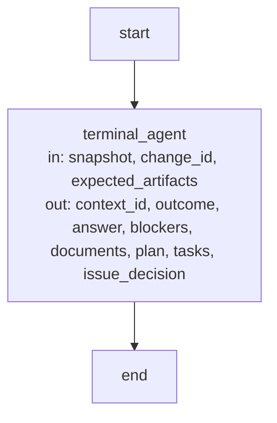

# Control flow

How Concorde's two control-flow mechanisms are specified and checked, and the one Graph this Module
compiles. The [entry](module.md#concept.execution.graph) explains when to choose a Workflow and
when a Graph.

## Specifying a Workflow

Every Workflow is explained by a **step table** in an implementation document of the Module that
owns its script, next to the Host-step helper's contract. The table has one row per step in the
order the script can reach them:

| Step | Kind | What runs | Answer or result | Stops when |
| --- | --- | --- | --- | --- |
| `bind` | Host step | Waits for the launch binding, checks and preflights the issued slots | `{"state": "ready"}` | The binding does not arrive, or a slot is stale or fails preflight |
| `review-<n>` | Agent call | One reviewer slot | A staged child and its child-terminal emission | The child is incomplete or its gate fails |
| `finalize` | Host step | Coverage, admission of every slot, the hook's aggregate acceptance | The accepted receipt | Coverage or a recheck fails |

The example rows show the form only; each provider writes its own. After the table the document
states the step answers' fields and size bound, how many times a loop can repeat, which keys the
Host issues, and every stop condition that is not a row of its own. The step names are exactly the
plan's `steps`, and the table is prose checked by review, not by a tool.

## Specifying a Graph

Every Graph that Concorde compiles is described by exactly one **Graph Spec**: a section of an
implementation document of the Module that owns the Graph, whose heading carries an explicit
`{#anchor}` that a module document of the same Module links to. The section states LangGraph's own
three parts in order, each opening a paragraph with its bold label:

- **State.** The channels, their reducers and the records the nodes read and write.
- **Nodes.** A table with the columns `Node | Executes | in | out`, one row per compiled node other
  than start and end, each name in backticks.
- **Edges.** How the next node is chosen, by a conditional edge reading a named State channel or by
  a `Command` the node returns, and where stops and errors lead.

A Mermaid flowchart follows, whose first comment line `%% graph: <compiled name>` binds it to one
Graph of the Graph catalog. Its node identifiers are the compiled node names including `__start__`
and `__end__`; every executing node's label is `name in: ... out: ...` with the same state
as its Nodes row; an edge carries its routing condition as its label exactly when its source node
has several successors. A Graph Spec flowchart is not a checked relationship view.

## Graph Spec check {#graph-spec-check}

`graph_spec_findings(repository, catalog)` compares every registered Spec document with the Graph
catalog it is given. `scripts/development/check-graph-specs.py --catalog <module:attribute>` runs it
as a configured check, resolving the catalog from the entry point on its command line; the check
imports no catalog owner. A diagram is bound when a fenced `mermaid` block contains a line
`%% graph: <name>`; its section runs from the nearest heading before it, and fenced code never ends
a section.

| Finding | Condition |
| --- | --- |
| `CONCORDE-GRAPH-001` | A bound name that is not a catalog Graph, a Graph with more than one bound diagram, or a catalog Graph with none |
| `CONCORDE-GRAPH-002` | A bound diagram that cannot be parsed as a flowchart |
| `CONCORDE-GRAPH-003` | A diagram whose nodes or edges differ from the compiled ones; an edge declared twice; an unlabelled edge from a node with several successors or a labelled edge from a node with one; a node label that does not start with the node name or lacks `in:` and `out:` |
| `CONCORDE-GRAPH-004` | A catalog entry that is not a compiled `StateGraph` |
| `CONCORDE-GRAPH-005` | A Python file under `src/`, `scripts/`, `operations/` or `agents/` that imports `langgraph.func` or one of its members, or cannot be parsed |
| `CONCORDE-GRAPH-006` | A section that is not in an implementation document; a missing, repeated or misordered **State.**, **Nodes.** or **Edges.** part; an empty State or Edges part; a missing Nodes table; a table that does not list exactly the compiled nodes other than start and end, once each, with the same `in` and `out` as the diagram label |
| `CONCORDE-GRAPH-007` | A section heading without an explicit `{#anchor}`, or an anchor that no module document of the same Module links to |

Source files are parsed, never run; directories named `node_modules`, `__pycache__`, `.venv`,
`build` and `dist` and dot-prefixed entries are skipped. A passing check shows that Spec and code
have the same shape, not that the routing is right.

## Terminal Agent Operation (`terminal_agent_operation`) {#terminal-agent-operation}

`OperationNode(name)` resolves `name` to an Agent definition. Its `graph(launcher=None)` compiles
this Graph with Runtime context type `OperationRuntimeContext(host=None, configuration=None,
launcher=None)` and no checkpointer; `invoke(context, launcher)` validates a typed input value and
runs it. The Graph catalog compiles it from `OperationNode("context_assessor").graph()`; the
channels below are those of the context assessor, whose input type is
`concorde-agent-stage-context` and whose result type is `concorde-agent-stage-result`. Another
Agent gives the same shape over its own types.

**State.** The input channels are the top-level fields of the Agent's input type: `snapshot`,
`change_id` and `expected_artifacts`. The output channels are the top-level fields of its result
type: `context_id`, `outcome`, `answer`, `blockers`, `documents`, `plan`, `tasks` and
`issue_decision`. Every channel is replaced by its latest update; no reducer merges writers. The
trusted Agent service is not a channel: it arrives in LangGraph's Runtime context as the `launcher`
of an `OperationRuntimeContext`, or as the `launcher` argument of `graph()`, and the node reads it
from there. The Graph writes no candidate or lifecycle record itself; any record is written by the
service it calls.

**Nodes.**

| Node | Executes | in | out |
| --- | --- | --- | --- |
| `terminal_agent` | Deterministic node around one model-backed call: validates the typed input against the Agent definition, calls the trusted Agent service once, then validates the returned typed result and its permitted fields. | snapshot, change_id, expected_artifacts | context_id, outcome, answer, blockers, documents, plan, tasks, issue_decision |

**Edges.** The Graph has one fixed path from start through `terminal_agent` to end; no node chooses
a successor and no conditional edge reads a channel. When no service was supplied, when input or
result validation fails, or when the service raises, the node raises with a causal feedback record
attached and the Graph stops without an output update. A synchronous invocation refuses a service
that returns an awaitable; `ainvoke` awaits it. A caller that composes this Graph into a larger
`StateGraph` owns that Graph's edges and reducers.

## Capability State adapter

`run_host(name, state, runtime)` wraps a capability's State as its typed request, runs it through
admission with the Host and configuration found in `OperationRuntimeContext`, and returns
`{"result": envelope}`. It refuses when no Host was supplied. `StateContract(input_type,
output_type)` names the typed State a capability exposes; without an output type the State is
`{"result": dict}`.

## Requirements

### req.execution.graph-api-only — Graphs use the Graph API

Every Graph that Concorde compiles SHALL be built with LangGraph's Graph API as a `StateGraph`.

No Python source under `src/`, `scripts/`, `agents/` or `operations/` imports LangGraph's Functional
API (`langgraph.func`), because a Graph written with it hides its control flow inside ordinary
Python where no Graph Spec or check can inspect it.

### req.execution.graph-spec-agreement — Every Graph has one matching Graph Spec

The Graph Spec check SHALL report every catalog Graph that does not have exactly one Graph Spec
whose diagram, parts and Nodes table agree with its compiled topology.

### req.execution.operation-service-explicit — The Operation runs only a supplied service

The Terminal Agent Operation SHALL refuse to execute unless its embedding supplies the Agent service
through Runtime context or the graph factory, never through State.

## Scenarios

### Graph Specs

#### scenario.execution.graph-spec-match — A Graph Spec equal to its Graph passes

- GIVEN a Graph catalog compiled with inert nodes and registered Spec documents
- WHEN the Graph Spec check reads every flowchart bound with `%% graph: <name>`
- THEN each bound diagram's nodes and edges equal the compiled ones, start and end included, with routing labels exactly on edges from nodes with several successors
- AND each section is in an implementation document with State, Nodes and Edges once each and in order, and a Nodes table naming exactly the compiled nodes with the same state as their labels
- AND each section heading carries an anchor that a module document of the same Module links to
- AND the check reports no finding

#### scenario.execution.graph-spec-mismatch — A diverging Graph Spec is reported

- GIVEN a Graph catalog and a Graph Spec whose diagram, parts, Nodes table or anchor disagree with the compiled Graph, or a catalog Graph with no Graph Spec
- WHEN the Graph Spec check runs
- THEN it reports the matching `CONCORDE-GRAPH` finding naming the Graph and the document

#### scenario.execution.functional-api-refused — The Functional API is refused

- GIVEN Python sources under `src/`, `scripts/`, `agents/` and `operations/`
- WHEN the Graph Spec check parses them without running them
- THEN an import of `langgraph.func` or of its members is an error naming the file and line
- AND a catalog Graph that is not a compiled `StateGraph` is an error naming the Graph
- AND a file that cannot be parsed is an error rather than a pass

### The Terminal Agent Operation

#### scenario.execution.agent-node — The Operation is typed by the Agent's contract

- GIVEN an Agent definition that names a typed input and a typed result
- WHEN the Terminal Agent Operation is built for it
- THEN the Graph's input channels are exactly the input type's top-level fields and its output channels exactly the result type's
- AND the node validates the input before calling the service and the result after it, including the fields this Agent may populate

#### scenario.execution.graph-inspection — Inspect the Graph without gaining authority

- GIVEN the Terminal Agent Operation built without a service
- WHEN a viewer requests its nodes, edges and schemas
- THEN it sees the real `terminal_agent` node without running an Agent or reading a project context
- AND State holds only declared data while trusted services stay in Runtime context

#### scenario.execution.operation-service — Run with a supplied service

- GIVEN a Terminal Agent Operation and a trusted Agent service supplied in Runtime context
- WHEN the embedding invokes the Graph synchronously or asynchronously
- THEN the Graph calls that service once and returns the validated typed result

#### scenario.execution.operation-without-service — Refuse to run without a service

- GIVEN a Terminal Agent Operation built without a service
- WHEN it is invoked, even with a State field that names a service
- THEN it refuses to execute and stops without an output update

#### scenario.execution.operation-service-failure — A failed service stops the Graph

- GIVEN a Terminal Agent Operation with a trusted service
- WHEN the service raises, returns a result the Agent's contract rejects, or returns an awaitable to a synchronous invocation
- THEN the Graph stops without an output update and the error carries a causal feedback record

### Capability State

#### scenario.execution.operation-state — Only declared channels cross a State boundary

- GIVEN a capability's State adapter or a Terminal Agent Operation embedded in a larger parent State
- WHEN the parent Graph runs it
- THEN only the declared input channels reach it and only its declared output channels leave it
- AND trusted Hosts and services stay in Runtime context rather than State

#### scenario.execution.operation-result-state — Host failures stay explicit in State

- GIVEN a capability invoked through its State adapter
- WHEN admission or execution returns a blocked or failed result envelope
- THEN the `result` channel carries that envelope and its errors unchanged
- BUT no successful output is invented
