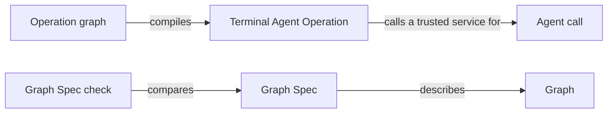

# Agent execution in depth

This topic walks through an Agent call and a Workflow step by step and explains the reasons behind
Agent execution's design. The [entry](module.md) defines the terms and states the promises; the
exact records are in [Agent calls](agent-calls.md), [the Host-step protocol](interfaces.md) and
[Control flow](control-flow.md).

## One Agent call, step by step

Take `concorde-context-solve` for Module `module.checkout` with the task "add retries to the
client".

1. The user session calls the Pi `concorde` tool with action `run`. The Pi session wraps the input
   in the invocation envelope and runs the launcher's native `prepare` step with it.
2. The native driver re-enters Request admission with a Host that carries the driver's native
   service. Admission checks the request and binds the worktree, Operations dispatches it to the
   Planning provider, and the provider asks the Host's native service to run the context assessor.
   The driver loads that Agent's definition, resolves the Agent hook its entry point names, and
   asks the hook to prepare the call. The hook returns a stage plan: here no stage inputs, unless a
   deterministic check already decides the outcome, in which case the plan carries that response
   and no Agent runs.
3. Task context freezes the context snapshot and assembles the capsule from the Agent binding. The
   driver writes the Agent definition file pi-subagents will discover, a small child extension
   connecting the Agent to the Host, and a descriptor that binds the digest of every input. The
   tool returns a `call`:

   ```json
   {"agent": "concorde-context-assessor", "cwd": "/tmp/concorde-native-context-x/context",
    "agentScope": "project", "context": "fresh", "async": false,
    "outputSchema": {"...": "invocation_id fixed to the issued ticket"},
    "gate": {"command": "... --native-context stage <descriptor> <digest>"}}
   ```

4. The user session passes that `call` unchanged to Pi's `subagent` tool. The native call
   extension intercepts it, refuses any call other than the prepared one, runs the Host step
   `check`, and runs pi-subagents' own launch preflight. The launch is blocked unless preflight
   resolved exactly the prepared Agent file, a fresh context, no inherited context or Skills, no
   nested subagents and no tool outside the Agent definition's list.
5. The Agent reads its capsule and submits its result once with pi-subagents' `structured_output`
   tool. The child extension forwards it to the Host step `submit`. The result gate checks its
   shape and identity, asks the hook to validate it, and stores it as the proposal. Nothing is
   accepted yet.
6. When the run ends, pi-subagents runs the call's gate command, the Host step `stage`. It rechecks
   the stored proposal and the current inputs and prints one small control document whose `state`
   is `staged` and whose `accepted` is `false`.
7. When the `subagent` tool returns, the native call extension runs the Host step `accept`. The
   driver reads pi-subagents' own records of the run, independently of anything the model said,
   and requires a successful exit, a passed gate bound to this proposal and unchanged inputs. Only
   then does it reserve the call's terminal record and ask the hook to accept the proposal, which
   records the assessment. The driver archives the run's evidence in the primary worktree's run
   directory, and the tool result reports `accepted: true` with the typed outcome.

While it works, the Agent can file an Issue report through `report_issue`; an Agent whose
definition lists `run_checks` can ask the Host to run the Module's configured checks. A report is
kept even if the call later fails; neither a report nor a check result counts as the call's result.
In `describe-policy` mode, preparation stops after step 2 and returns the read list, intended write
roots and tools the call would receive, without a capsule or a launch.

## One Workflow, step by step

Take `concorde-spec-review` of a scope of three Modules.

1. Preparation runs as above until the driver finds that the capability's declaration names a
   workflow hook. The Review provider's hook issues one reviewer call slot per Module, each prepared
   exactly like a single Agent call, and returns its workflow plan: the workflow script, its
   Host-step commands and the JSON the script is built from.
2. The workflow registrar registers the script under a name bound to the issued ticket, reading
   everything from the descriptor, and the tool returns a workflow `call`. The user session passes
   it to the `subagent` tool, which starts the Workflow asynchronously.
3. The script's first Host step runs `check` and launch preflight for every issued slot, because
   pi-subagents launches a Workflow's children itself. The script then runs the three reviewers.
   Each child is staged by its own gate, and the script records a child-terminal emission for it.
4. The final Host step asks the driver to reconcile pi-subagents' status record of the whole
   Workflow with the slots it issued: exactly one completed, successful, staged child per slot.
   Only then does the driver admit each proposal and the hook aggregate and record the review.
5. The user session calls the `concorde` tool with action `result`, which reports the Workflow's
   acceptance separately from its launch.

## What is enforced and what is not

| Boundary | Mechanism | Enforced |
| --- | --- | --- |
| Launch shape: prepared Agent file, fresh context, no inherited context or Skills, no nested subagents, no tool outside the definition | pi-subagents preflight, checked by the native call extension or the Workflow's first Host step | Yes, before the model starts |
| What counts as a result | Result gate, independent reading of pi-subagents' records, rechecks of every frozen input, exclusive terminal reservation | Yes, in Host code the model cannot reach |
| Reads confined to the capsule | The capsule is the Agent's working directory | Not enforced: file tools accept any path the user can read |
| Programmer writes and shell confined to the Module's `ImplementationScope` | The Agent's instructions | Not enforced: `bash`, `edit` and `write` reach any path the user can |
| Network and credentials | The Agent's instructions | Not enforced: Agents run as the developer's user with the shared network |
| Agents not calling Concorde | No delegation tool; the Agent's instructions | Not enforced for an Agent with `bash`, which could run the launcher itself |

The input digests detect changes; they do not show what an Agent read. The only operating-system
boundary in the Harness is Check execution's read-only check boundary, which applies to checks,
not to Agents.

## Why a generic driver with hooks

Every Agent call follows the same safety path, but each provider decides what goes into a stage and
what an accepted result records. If both lived in one file, that file would import every provider and
a change to any provider would touch the Harness. The native driver keeps only the shared path:
admission re-entry, capsule assembly through Task context, the result gate's actions, native
evidence, coverage, terminal reservation and archiving. Providers are reached only through hook
entry points, so a new provider needs no change here. The driver reads the pinned native records
itself, which is why acceptance cannot be delegated to a hook.

Staging and acceptance are separate because pi-subagents runs the gate command even after a failed
run, and because a gate's output passes through the Workflow script. Staging therefore never
accepts; only the acceptance step, which reads the run's outcome itself, may call the hook's
acceptance. The terminal record is created exclusively before that call, so a repeated or
concurrent `accept` cannot record a result twice. One finite command runs at a time per call, under
a lock in the call directory that is never held across a model run.

## Why finite Host steps

A model run can take many minutes and may be cancelled from Pi at any moment. If a Python provider
waited for it, the provider's state would live in a process the user session cannot see or resume.
Instead each Host step starts, checks its inputs against the call's descriptor, does one thing and
exits; between steps everything that crosses the model's run is JSON in the call's own directory.
The Pi plumbing carries no provider knowledge: preflight derives its allowed tools from the
prepared Agent definition file, and the registrar takes the workflow script and Host-step commands
from the descriptor.

## Why the pi-subagents version is pinned

Acceptance depends on the layout of pi-subagents' status and metadata files, which carry no version
field. The Host admits only the reviewed release, `pi-subagents` 0.69.0, whose selected source
files must match the digests recorded in the native runtime contract. Any other release is refused
rather than read under a guessed layout. This is compatibility provenance, not a signature: a
process running as the same user could still rewrite the records.

## Why two control-flow mechanisms, and the Graph API only

Most capability flows are a fixed sequence with Host checks between Agent calls. A pi workflow
states that sequence as a short script that pi-subagents already knows how to run, cancel and
report, so no Concorde process has to schedule models. LangGraph remains for flows that are best
read as state and routing, and only its Graph API is permitted: nodes and edges declared before
compilation are what a Graph Spec and its check can compare, while the Functional API hides control
flow inside ordinary Python where neither can. The Terminal Agent Operation lets a program compose
Agent calls as graph state; its trusted service travels in LangGraph's Runtime context, never in
State, so input data cannot supply authority.

```python
operation = OperationNode("context_assessor").graph()
result = await operation.ainvoke(context["data"],
                                 context=OperationRuntimeContext(launcher=native_service))
```

The Graph mechanism's parts relate as follows:



## Files in transition

The context-assessment service file currently holds the driver together with provider-specific
preparation; it is split into the native driver, Task context's capsule assembly and the
providers' hooks. The planning workflow registrar file becomes the generic registrar. The
invocation file also holds gap bookkeeping that belongs to Planning, and the host file holds
nested-dispatch resolution that belongs to Operations; both move to their owners.

## Open questions

- Workflow-level time limits are set by each workflow script; this Module sets only the default
  thirty-second limit of the Host steps an Agent call runs.
- Chaining Workflows across capabilities is not supported; each capability's Workflow is prepared
  and accepted on its own.
