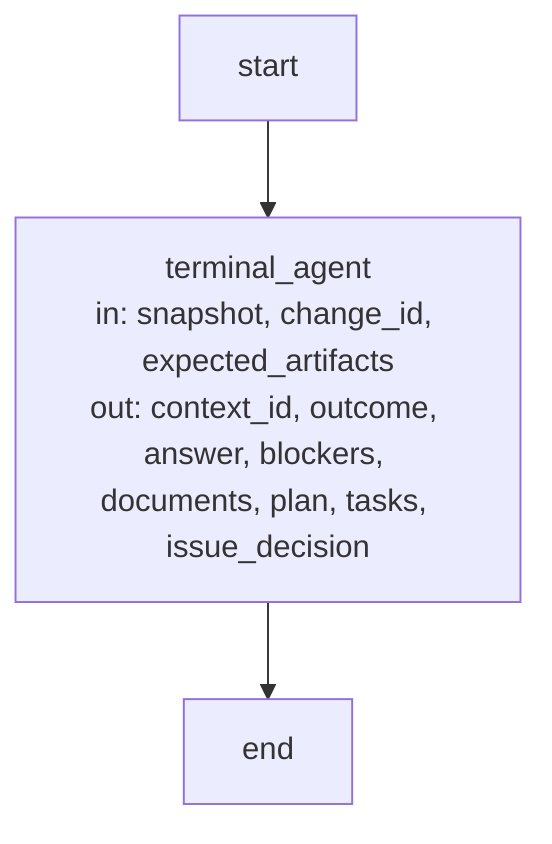

# Agent execution Graphs

This document holds the Graph Spec of the one Graph that Agent execution compiles. The
[entry](module.md#the-optional-stategraph-operation-and-studio) explains when to use it; the
requirements it satisfies are
[req.execution.operation-service-explicit](requirements.md#req.execution.operation-service-explicit)
and [req.execution.graph-api-only](requirements.md#req.execution.graph-api-only).

## Terminal Agent Operation (`terminal_agent_operation`) {#terminal-agent-operation}

The Graph catalog compiles this Graph from `OperationNode("context_assessor").graph()`. An
embedding may build the same Graph for any Agent whose worker profile names a typed input and a
typed result; the channels below are those of the context assessor, whose input type is
`concorde-agent-stage-context` and whose result type is `concorde-agent-stage-result`.

**State.** The input channels are the top-level fields of the Agent's input type: `snapshot`,
`change_id` and `expected_artifacts`. The output channels are the top-level fields of its result
type: `context_id`, `outcome`, `answer`, `blockers`, `documents`, `plan`, `tasks` and
`issue_decision`. Every channel is replaced by its latest update; no reducer merges writers. The
trusted Agent service is not a channel: it arrives in LangGraph's Runtime context as the
`launcher` of an `OperationRuntimeContext`, or as the `launcher` argument of `graph()`, and the
node reads it from there. The Graph writes no candidate or lifecycle record itself; any record is
written by the service it calls.

**Nodes.**

| Node | Executes | in | out |
| --- | --- | --- | --- |
| `terminal_agent` | Deterministic node around one model-backed call: validates the typed input against the Agent's worker profile, calls the trusted Agent service once, then validates the returned typed result and its permitted fields. | snapshot, change_id, expected_artifacts | context_id, outcome, answer, blockers, documents, plan, tasks, issue_decision |

**Edges.** The Graph has one fixed path from start through `terminal_agent` to end; no node
chooses a successor and no conditional edge reads a channel. When no service was supplied, when
input or result validation fails, or when the service raises, the node raises with a causal
feedback record attached and the Graph stops without an output update. A synchronous invocation
refuses a service that returns an awaitable; `ainvoke` awaits it. A caller that composes this Graph
into a larger StateGraph owns that Graph's edges and reducers.

