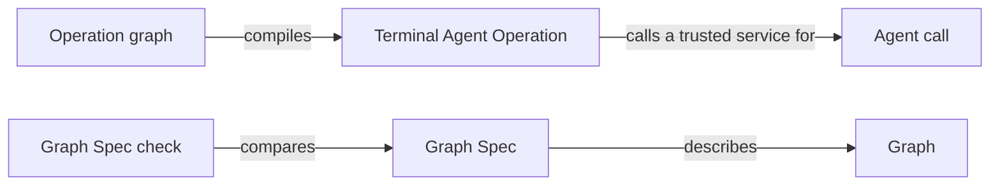
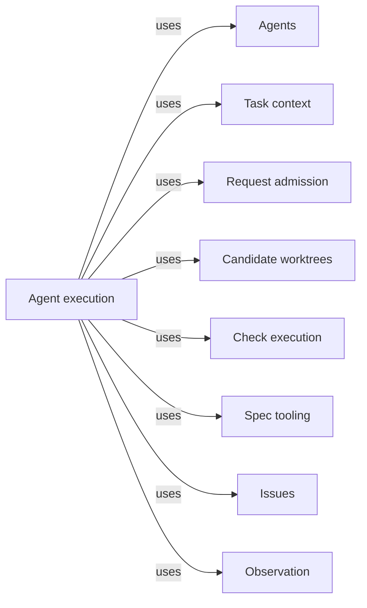

# Agent execution

## Purpose

Agent execution runs Concorde's model work and decides when a model's answer counts as a result.
It runs one Agent call, or one pi workflow of several Agent calls and Host steps, through Pi's
pi-subagents extension. It supplies the generic native driver that prepares, stages and accepts
every call, the Agent hook and workflow hook interfaces through which providers add their own
preparation and acceptance, the Host-step protocol between a workflow script and the Host, the
result gate, launch preflight, the pinned native runtime and each Agent's model selection. It also
supplies Concorde's second control-flow mechanism, LangGraph: the Terminal Agent Operation, the
State adapter and the Graph Spec format with its check. The providers under Operations rely on it
to run their Agents and workflows, and the Pi session relies on it to launch the calls it is
handed. It does not decide which Agent a capability needs, what that Agent may read, whether an
accepted result is right, or which capability runs next. It never imports a provider. It does not
confine what a running Agent reads, writes, executes or sends over the network: those limits are
instructions to the model and are not enforced.

## Terminology

| Term | Definition |
| --- | --- |
| Agent call | One launch of one Agent by pi-subagents, in a fresh context, from an Agent definition file the Host prepared for exactly this call. |
| Workflow | An authored pi-subagents script that orders the Agent calls and Host steps of one capability, such as reviewing every Module of a scope. |
| Graph | A LangGraph `StateGraph` whose State, nodes and edges are declared before it is compiled. |
| Proposal | The one structured result an Agent call submits, which stays untrusted data until the Host accepts it. |
| Host step | One finite, deterministic Host command run for an Agent call or a Workflow, such as staging a proposal; it never starts or waits for a model. |
| Result gate | The Host service of one Agent call that stores its proposal, stages it after the run and accepts it only after independent checks of the run's outcome and the current inputs. |
| Agent hook | The provider code, named by an entry point in an Agent definition, that prepares the stage of one call of that Agent, validates its proposal and applies an accepted one. |
| Workflow hook | The provider code, named by an entry point in a capability declaration, that prepares a Workflow's first Agent calls and answers each of its Host steps. |
| Model selection | The model, thinking level and time limit resolved for one Agent from the project configuration. |
| Terminal Agent Operation | The Graph with one node that validates an Agent's typed input, calls a trusted Agent service supplied by its embedding and validates the typed result. |
| Graph Spec | The section of an implementation document that states one compiled Graph's State, Nodes and Edges and draws it in a flowchart bound to that Graph. |
| [Agent](../../agents/module.md#concept.agents.agent) | |
| [Agent definition](../../agents/module.md#concept.agents.definition) | |
| [Host](../../vocabulary.md#concept.concorde.host) | |
| [Worker](../../vocabulary.md#concept.concorde.worker) | |
| [Capability](../../vocabulary.md#concept.concorde.capability) | |
| [User session](../../vocabulary.md#concept.concorde.user-session) | |
| [Capability declaration](../admission/module.md#concept.admission.capability-declaration) | |
| [Causal feedback](../admission/module.md#concept.admission.causal-feedback) | |
| [Context snapshot](../context/module.md#concept.context.snapshot) | |
| [Capsule](../context/module.md#concept.context.capsule) | |
| [Agent binding](../context/module.md#concept.context.agent-binding) | |
| [Run record](../worktrees/module.md#concept.worktrees.run-record) | |
| [Configured check](../checks/module.md#concept.checks.configured-check) | |
| [Issue report](../../issues/module.md#concept.issues.report) | |

Read Agent call, Proposal and Result gate first: they are the path every model result takes. A
Workflow is several Agent calls with Host steps between them. Agent hook and Workflow hook are what
a provider writes to use that path. Graph, Terminal Agent Operation and Graph Spec concern the
LangGraph mechanism, which no public capability currently uses.

## Usage

This Module has no capability of its own. Its users are the provider Modules that run Agents
(Planning, Implementation, Review and Issue solving), the Pi session, which hands the prepared calls
to Pi, and maintainers who write a new provider or Graph.

### One Agent call, from request to accepted result

<a id="concept.execution.agent-call"></a><a id="concept.execution.proposal"></a><a id="concept.execution.result-gate"></a><a id="concept.execution.host-step"></a>

`concorde-context-solve`, `concorde-tasks` and `concorde-implement` each run one **Agent call**.
Take `concorde-context-solve` for Module `module.checkout` with the task "add retries to the
client". The normal path has seven steps.

1. The user session calls the Pi `concorde` tool with action `run`. The Pi session wraps the input
   in the invocation envelope and runs the launcher's native `prepare` step with it.
2. The native driver re-enters Request admission with a Host that carries the driver's native
   service. Admission checks the request and binds the worktree, Operations dispatches it to the
   Planning provider, and the provider asks the Host's native service to run the context assessor.
   The driver loads that Agent's definition, resolves the Agent hook its entry point names, and
   asks the hook to **prepare** the call. The hook returns a stage plan: here no stage inputs,
   unless a deterministic check already decides the outcome, in which case the plan carries that
   response and no Agent runs.
3. Task context freezes the [context snapshot](../context/module.md#concept.context.snapshot) and
   assembles the [capsule](../context/module.md#concept.context.capsule) from the
   [Agent binding](../context/module.md#concept.context.agent-binding). The driver writes the
   Agent definition file pi-subagents will discover, a small child extension connecting the Agent
   to the Host, and a descriptor that binds the digest of every input. The tool returns a `call`:

   ```json
   {"agent": "concorde-context-assessor", "cwd": "/tmp/concorde-native-context-x/context",
    "agentScope": "project", "context": "fresh", "async": false,
    "outputSchema": {"...": "invocation_id fixed to the issued ticket"},
    "gate": {"command": "... --native-context stage <descriptor> <digest>"}}
   ```

4. The user session passes that `call` unchanged to Pi's `subagent` tool. The native call
   extension intercepts it, refuses any call other than the prepared one, runs the Host step
   `check`, and runs pi-subagents' own launch preflight. The launch is blocked unless preflight
   resolved exactly the prepared Agent file, a fresh context, no inherited context or Skills, no
   nested subagents and no tool outside the Agent definition's list.
5. The Agent reads its capsule and submits its result once with pi-subagents' `structured_output`
   tool. The child extension forwards it to the Host step `submit`. The **result gate** checks its
   shape and identity, asks the hook to **validate** it, and stores it as the **proposal**. Nothing
   is accepted yet.
6. When the run ends, pi-subagents runs the call's gate command, the Host step `stage`. It
   rechecks the stored proposal and the current inputs and prints one small control document whose
   `state` is `staged` and whose `accepted` is `false`.
7. When the `subagent` tool returns, the native call extension runs the Host step `accept`. The
   driver reads pi-subagents' own records of the run, independently of anything the model said,
   and requires a successful exit, a passed gate bound to this proposal and unchanged inputs. Only
   then does it reserve the call's terminal record and ask the hook to **accept** the proposal,
   which records the assessment. The driver archives the run's evidence in the primary worktree's
   [run record](../worktrees/module.md#concept.worktrees.run-record) directory, and the tool result
   reports `accepted: true` with the typed outcome.

A **Host step** is a fixed command that calls back into the Host with the call's descriptor and
its digest. It checks and records; it never starts a model and never waits for one. Between Host
steps no Python process waits for the Agent: everything that crosses the model's run is JSON in
the call's own directory.

While it works, an Agent can file an [Issue report](../../issues/module.md#concept.issues.report)
through the `report_issue` tool; the driver forwards it to Issues bound to this call. An Agent
whose definition lists `run_checks` can ask the Host to run the Module's
[configured checks](../checks/module.md#concept.checks.configured-check). A report is kept even if
the call later fails; neither a report nor a check result counts as the call's result.

In `describe-policy` mode, preparation stops after step 2 and returns the read list, intended
write roots and tools the call would receive, without a capsule or a launch.

### Workflows

<a id="concept.execution.workflow"></a>

A **Workflow** is used when one capability needs several Agent calls in a fixed order.
`concorde-plan`, `concorde-spec-review`, `concorde-code-review` and `concorde-issues` with action
`solve` run as Workflows. Take `concorde-spec-review` of a scope of three Modules:

1. Preparation runs as above until the driver finds that the capability's
   [capability declaration](../admission/module.md#concept.admission.capability-declaration) names
   a workflow hook. The Review provider's hook issues one reviewer call slot per Module, each
   prepared exactly like a single Agent call, and returns its workflow plan: the workflow script,
   its Host-step commands and the JSON the script is built from.
2. The native workflow registrar registers the script under a name bound to the issued ticket,
   reading everything from the descriptor, and the tool returns a workflow `call`. The user session
   passes it to the `subagent` tool, which starts the Workflow asynchronously.
3. The script's first Host step runs `check` and launch preflight for every issued slot, because
   pi-subagents launches a Workflow's children itself. The script then runs the three reviewers.
   Each child is staged by its own gate, and the script records a child-terminal emission for it.
4. The final Host step asks the driver to reconcile pi-subagents' status record of the whole
   Workflow with the slots it issued: exactly one completed, successful, staged child per slot.
   Only then does the driver admit each proposal and the hook aggregate and record the review.
5. The user session calls the `concorde` tool with action `result`, which reports the Workflow's
   acceptance separately from its launch.

The script, its Host-step helper and each step's meaning belong to the provider and are explained
by a step table in the provider's own implementation document. This Module supplies what every
Workflow shares: the [Host-step protocol](interfaces.md#contract.execution.host-step), the
registrar, per-slot preparation, coverage, admission and acceptance, the result and stop steps.

### Writing a provider

<a id="concept.execution.agent-hook"></a><a id="concept.execution.workflow-hook"></a>

A provider adds behaviour through hooks, never by editing the driver. Every Agent definition names
the entry point of its **Agent hook**, such as `concorde.implementation.hooks:programmer`. The hook
answers four questions: what stage plan this call gets (its stage inputs, an optional review input,
an optional instruction override, a stop response that ends preparation, and whether later steps
recheck the snapshot frozen at preparation); what else must still be current before staging and
acceptance; whether a proposal is valid for this call; and what accepting it records. A capability
that runs a Workflow names a **workflow hook** in its capability declaration. That hook prepares
the Workflow's plan, answers each named Host step, and reports what a failed or stopped Workflow
leaves behind. Both hooks call back into the driver for everything shared. The exact interfaces
are in [Hooks](agent-calls.md#hooks).

### Stopping outcomes

- A call that ends without a proposal, with two proposals or with a refused one is an invalid
  completion. A submission that pi-subagents rejects against the output schema is recorded and can
  be corrected within the same run.
- A passing gate does not rescue a failed run: acceptance reads the run's exit status itself.
- A changed input between preparation and acceptance makes the call stale; nothing is accepted.
- Cancellation or failure before acceptance revokes it. It does not undo files a programmer already
  changed; those stay in the candidate for inspection.
- A failed or uncertain acceptance is final for that call; a repeated `accept` never applies the
  hook's acceptance a second time. Another attempt is a new request.
- Nothing is retried automatically.

Every failure keeps its lower-level cause, such as a schema rejection, a Host refusal or a
timeout, in the [causal feedback](../admission/module.md#concept.admission.causal-feedback) record
that Request admission defines.

### Choosing models

<a id="concept.execution.model-selection"></a>

The developer sets the **model selection** in the project configuration, with defaults and
per-Agent overrides:

```json
{"model": "openai-codex/gpt-6-astra", "thinking": "medium", "timeout_seconds": 1800,
 "workers": {"code_reviewer": {"thinking": "high"}}}
```

Each Agent takes its entry's value, else the default; a missing time limit falls back to the
Agent definition's own. Models are Pi `provider/id` names and thinking levels are Pi's (`off` to
`max`). A key that names no Agent, a nonpositive time limit or a model without a provider is
rejected. Request admission owns writing this configuration through `concorde-configure`.

### Choosing a control-flow mechanism

<a id="concept.execution.graph"></a><a id="concept.execution.graph-spec"></a><a id="concept.execution.terminal-agent-operation"></a>

Concorde sanctions two control-flow mechanisms. A **Workflow** is the default for a fixed or
simply looping order of Agent calls: it is a short script that pi-subagents runs, and its steps are
explained by a step table in its owner's implementation document. A **Graph** is used when a flow
needs explicit shared state and branching that a reader must inspect; it is always built with
LangGraph's Graph API (`StateGraph`), never with the Functional API, and it is described by exactly
one **Graph Spec**, whose State, Nodes and Edges parts and bound flowchart the configured Graph Spec
check compares with the compiled Graph. [Control flow](control-flow.md) gives both formats.

The one Graph this Module compiles is the **Terminal Agent Operation**, for a program that wants
to compose Agent calls as graph state. It has one node, and its embedding supplies a trusted
function that performs an admitted Agent call:

```python
operation = OperationNode("context_assessor").graph()
result = await operation.ainvoke(context["data"],
                                 context=OperationRuntimeContext(launcher=native_service))
```

The service travels in LangGraph's Runtime context, never in State, so input data cannot supply
authority; without a service the Graph compiles for inspection only and refuses to run. Its exact
topology is its [Graph Spec](control-flow.md#terminal-agent-operation). A capability's State
adapter works the same way: it runs a capability through admission with the Host found in Runtime
context and returns the result envelope in the `result` channel.

## Design

### What is enforced and what is not

The central decision is that a model's output is a proposal and the Host decides what counts.

| Boundary | Mechanism | Enforced |
| --- | --- | --- |
| Launch shape: prepared Agent file, fresh context, no inherited context or Skills, no nested subagents, no tool outside the definition | pi-subagents preflight, checked by the native call extension or the Workflow's first Host step | Yes, before the model starts |
| What counts as a result | Result gate, independent reading of pi-subagents' records, rechecks of every frozen input, exclusive terminal reservation | Yes, in Host code the model cannot reach |
| Reads confined to the capsule | The capsule is the Agent's working directory | Not enforced: file tools accept any path the user can read |
| Programmer writes and shell confined to the Module's `ImplementationScope` | The Agent's instructions | Not enforced: `bash`, `edit` and `write` reach any path the user can |
| Network and credentials | The Agent's instructions | Not enforced: Agents run as the developer's user with the shared network |
| Agents not calling Concorde | No delegation tool; the Agent's instructions | Not enforced for an Agent with `bash`, which could run the launcher itself |

The input digests detect changes; they do not show what an Agent read. The only operating-system
boundary in the Harness is Check execution's read-only check boundary, which applies to checks, not
to Agents. That Agents never delegate is an obligation on their definitions,
[req.agents.terminal](../../agents/definitions.md#req.agents.terminal); preflight is where it is
checked at launch.

### Why a generic driver with hooks

<a id="realization.execution.native-driver"></a>

Every Agent call follows the same safety path, but each provider decides what goes into a stage and
what an accepted result records. Putting both in one file made that file import every provider,
so a change to any provider touched the Harness. The **native driver** keeps only the shared path:
admission re-entry, capsule assembly through Task context, the result gate's actions, native
evidence, coverage, terminal reservation and archiving. Providers are reached only through hook
entry points named in Agent definitions and capability declarations, so the driver imports no
provider and a new provider needs no change here. The driver reads the pinned native records
itself, which is why acceptance cannot be delegated to a hook.

Staging and acceptance are separate because pi-subagents runs the gate command even after a failed
run, and because a gate's output passes through the Workflow script. Staging therefore never
accepts; only the acceptance step, which reads the run's outcome itself, may call the hook's
acceptance. The terminal record is created exclusively before that call, so a repeated or
concurrent `accept` cannot record a result twice. One finite command runs at a time per call, under
a lock in the call directory that is never held across a model run.

The context-assessment service file currently holds this driver together with provider-specific
preparation; it is split into the native driver, Task context's capsule assembly and the
providers' hooks.

### Why finite Host steps

<a id="realization.execution.native-plumbing"></a>

A model run can take many minutes and may be cancelled from Pi at any moment. If a Python provider
waited for it, the provider's state would live in a process the user session cannot see or resume.
Instead each Host step starts, checks its inputs against the call's descriptor, does one thing and
exits. The **native Pi plumbing** is the Pi side of that design: the Host-step transport and child
extension, proposal capture, launch preflight, the Host-step error adapter, the native call
extension that intercepts a prepared `subagent` call, and the workflow registrar. Preflight derives
its allowed tools from the prepared Agent definition file, never from a list of Agent names, and the
registrar takes the workflow script and Host-step commands from the descriptor, so this plumbing
carries no provider knowledge. The planning workflow registrar file becomes that generic registrar.

### Why the pi-subagents version is pinned

Acceptance depends on the layout of pi-subagents' status and metadata files, which carry no
version field. The Host admits only the reviewed release, `pi-subagents` 0.69.0, whose selected
source files must match the digests recorded in the native runtime contract. Any other release is
refused rather than read under a guessed layout. This is compatibility provenance, not a signature:
a process running as the same user could still rewrite the records.

### The invocation host

<a id="realization.execution.invocation-host"></a>

The **invocation host** is the trusted object that carries one request's project and package
roots, mode, identities, observer and native service through admission, providers and nested
invocations, together with the per-request invocation that providers build on and the model
selection resolver. It exists so that trusted services never travel through data a model or a
caller can write. The invocation file also holds gap bookkeeping that belongs to Planning, and the
host file holds nested-dispatch resolution that belongs to Operations; both move to their owners.

### Why two control-flow mechanisms, and the Graph API only

<a id="realization.execution.operation-graph"></a><a id="realization.execution.graph-spec-check"></a>

Most capability flows are a fixed sequence with Host checks between Agent calls. A pi workflow
states that sequence as a short script that pi-subagents already knows how to run, cancel and
report, so no Concorde process has to schedule models. LangGraph remains for flows that are best
read as state and routing, and Concorde permits only its Graph API: nodes and edges declared before
compilation are what a Graph Spec and its check can compare, while the Functional API hides
control flow inside ordinary Python where neither can. The **operation graph** realization builds
the Terminal Agent Operation and the capability State adapter. The **Graph Spec check** holds every
compiled Graph of the Graph catalog it is given to its Graph Spec and every Python source to the
Graph API; it receives the catalog as an entry point, so it imports no catalog owner.

<a id="realization.execution.tests"></a>

The **execution tests** exercise these parts with scripted pi-subagents runs, fake model providers
and live diagnostics. Their doubles show that the plumbing holds; they do not show that a model
judges well.

### Open questions

- Workflow-level time limits are set by each workflow script; this Module sets only the default
  thirty-second limit of the Host steps an Agent call runs.
- Chaining Workflows across capabilities is not supported; each capability's Workflow is prepared
  and accepted on its own.

## Relationships

```mermaid
flowchart LR
    accTitle: How a model result is produced and accepted
    accDescr: The native driver prepares and accepts Agent calls through Agent hooks; a Workflow orders Agent calls and Host steps; the result gate stages and accepts each proposal.
    driver[Native driver]
    plumbing[Native Pi plumbing]
    workflow[Workflow]
    call[Agent call]
    agent[Agents / Agent]
    definition[Agents / Agent definition]
    proposal[Proposal]
    gate[Result gate]
    step[Host step]
    hook[Agent hook]
    whook[Workflow hook]
    selection[Model selection]
    host[Invocation host]
    driver -->|prepares and accepts| call
    driver -->|calls| hook
    driver -->|calls| whook
    plumbing -->|launches| call
    plumbing -->|registers| workflow
    workflow -->|orders| call
    workflow -->|runs| step
    call -->|runs one| agent
    hook -->|is named by| definition
    call -->|submits| proposal
    step -->|drives| gate
    gate -->|stages and accepts| proposal
    call -->|is launched with| selection
    host -->|resolves| selection
```





The providers under Operations and the Pi session use this Module, not the other way round. A
provider implements the hooks and, for a Workflow, its script and step table, and it declares its
participation in the [Host-step protocol](interfaces.md#contract.execution.host-step). The Pi session
loads the native call extension and forwards `prepare` and `result` requests.

<a id="uses-agents"></a>

**Agents** defines every [Agent](../../agents/module.md#concept.agents.agent) once. The driver
relies on each [Agent definition](../../agents/module.md#concept.agents.definition) for the Agent's
tools, instructions, time limit, result type and the entry point of its Agent hook, and preflight
refuses a launch whose tools exceed that list. This Module never adds tools or edits instructions.
An unknown Agent, or an entry point that does not resolve, stops preparation before any capsule is
written.

<a id="uses-context"></a>

**Task context** composes what one call may read. The driver relies on it to freeze the
[context snapshot](../context/module.md#concept.context.snapshot) for the call's
[phase](../context/module.md#concept.context.phase) with the hook's
[stage inputs](../context/module.md#concept.context.stage-input), to assemble the
[capsule](../context/module.md#concept.context.capsule), and to produce the
[Agent binding](../context/module.md#concept.context.agent-binding) whose tools, effects and
instruction digest become the Agent definition file. The driver rechecks the snapshot before
staging and before acceptance and rejects the call as stale when anything changed.

<a id="uses-admission"></a>

**Request admission** is the one entry of every capability request. Every Host step re-enters it
with the call's stored [invocation](../admission/contracts.md#contract.admission.invocation), so a
changed configuration or runtime selection is refused; each response is a
[result envelope](../admission/contracts.md#contract.admission.result), and every failure here is
reported as its [causal feedback](../admission/contracts.md#contract.admission.feedback) record,
keeping the lower-level cause. When admission [relays](../admission/module.md#concept.admission.relay)
a mutating request into a candidate, preparation runs in the candidate's own launcher. The driver
learns whether a capability runs a Workflow, and which workflow hook, from its
[capability declaration](../admission/contracts.md#contract.admission.capability-declaration); a
declaration without a native entry refuses preparation.

<a id="uses-worktrees"></a>

**Candidate worktrees** keeps the primary worktree's run directory and each worktree's
[change status](../worktrees/module.md#concept.worktrees.change-status). The driver binds the
change status digest into each descriptor and treats any change to it as stale input, and it
archives each accepted call's descriptor, proposal and native records as a
[run record](../worktrees/module.md#concept.worktrees.run-record) in the primary worktree. When that
write fails, the acceptance fails with the write error.

<a id="uses-checks"></a>

**Check execution** runs a Module's [configured checks](../checks/module.md#concept.checks.configured-check)
behind the `run_checks` tool, under its
[read-only check boundary](../checks/module.md#concept.checks.read-only-boundary), and returns one
[check result](../checks/module.md#concept.checks.check-result) per check. The driver offers the
tool only to an Agent whose definition lists it; a boundary that cannot be established fails the
tool call and is never replaced by another way of running the check.

<a id="uses-spec"></a>

**Spec tooling** supplies the [typed values](../../spec/module.md#concept.spec.typed-value) used
for every proposal and descriptor, and the [registry](../../spec/module.md#concept.spec.registry)
and registered [documents](../../spec/module.md#concept.spec.document) the Graph Spec check reads.
A Spec error stops the step that needed it.

<a id="uses-issues"></a>

**Issues** persists what an Agent files through `report_issue`. The driver forwards the Agent's
[report](../../issues/interface.md#contract.issues.report) bound to the call's invocation and
returns the [receipt](../../issues/interface.md#contract.issues.receipt); an accepted
[Issue report](../../issues/module.md#concept.issues.report) survives a failed call, a rejected
report is returned to the Agent as a failed tool call, and a proposal may cite only receipts this
call received.

<a id="uses-observation"></a>

**Observation** records a [diagnostic span](../observation/module.md#concept.observation.diagnostic-span)
for admission, preparation and each Host step through the invocation host's observer. Recording
never changes the outcome of the step it describes.
