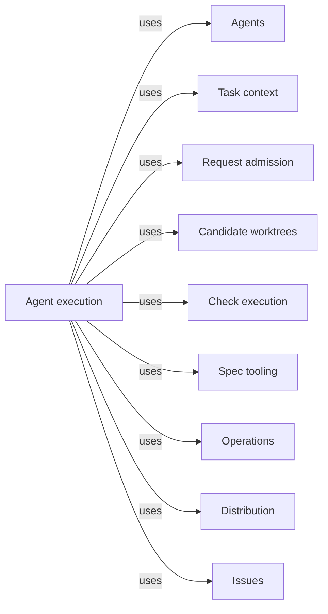

# Agent execution

## Purpose

Agent execution runs Concorde's model work and decides when a model's answer counts as a result.
It supplies the shared machinery every provider uses to call an Agent: a single native Agent call
or a Workflow of several calls through Pi's pi-subagents extension, the Host steps and the result
gate that turn an untrusted proposal into an accepted result, the model selection for each Agent,
and the usage and timing diagnostics of every run. It also owns the optional StateGraph Operation,
the check that keeps every Graph Spec equal to its compiled Graph, and a retained Pi RPC worker used
only by tests and diagnostics. Planning, Implementation,
Review and Issues rely on it to run their Agents; Request admission and Task context rely on it
for the invocation host. It does not choose which Agent a capability needs, what that Agent may
read, or which capability runs next, and it does not confine a native Agent's file, network or
credential access in the operating system: those limits are instructions to the model.

## Terminology

| Term | Definition |
| --- | --- |
| Agent call | One launch of one Agent by pi-subagents, in a fresh context, from an Agent definition the Host prepared for exactly this call. |
| Workflow | An authored pi-subagents script that runs a fixed order of Agent calls and Host steps for one capability, such as reviewing every Module of a scope. |
| Proposal | The one structured result an Agent call submits, which stays untrusted data until the Host accepts it. |
| Host step | A finite, deterministic Host command run inside an Agent call or a Workflow, such as staging a proposal; it never starts a model. |
| Result gate | The Host service of one Agent call that stores its proposal, stages it after the run and accepts it only after independent checks of the run's outcome and the current inputs. |
| Model selection | The model, thinking level and time limit resolved for one Agent from the project configuration. |
| Terminal Agent Operation | The optional LangGraph StateGraph with one node that validates typed input, calls a trusted Agent service supplied by its embedding and validates the typed result. |
| Graph Spec | The section of an implementation document that states one compiled Graph's State, Nodes and Edges and draws it in a flowchart bound to that Graph. |
| Usage record | One line recording what an Agent run consumed: tokens, cost, turns, wall time and the sizes of its prompt and context. |
| Diagnostic span | One bounded timing record of a piece of runtime work, with its duration, status and correlation identities and no content. |
| RPC diagnostic worker | A worker run as a Pi process in RPC mode inside Concorde's own Linux sandbox and tool gate, used only by tests and diagnostics. |
| [Agent](../../agents/module.md#concept.agents.agent) | |
| [Operation](../../operations/module.md#concept.operations.operation) | |
| [Worker](../../vocabulary.md#concept.concorde.worker) | |
| [Host](../../vocabulary.md#concept.concorde.host) | |
| [Capability](../../vocabulary.md#concept.concorde.capability) | |
| [User session](../../vocabulary.md#concept.concorde.user-session) | |
| [Run record](../worktrees/module.md#concept.worktrees.run-record) | |
| [Worker profile](../context/module.md#concept.context.worker-profile) | |
| [Grant](../context/module.md#concept.context.grant) | |
| [Issue](../../issues/module.md#concept.issues.issue) | |

Read Agent call, Proposal and Result gate first: they are the path every model result takes. A
Workflow is several Agent calls with Host steps between them. The remaining terms describe the
configuration, the optional graph and the diagnostics around that path.

## Usage

This Module has no capability of its own. Its users are the provider Modules that run Agents,
the user session that passes their prepared calls to Pi, and maintainers who inspect execution.

### One Agent call, from request to accepted result

<a id="concept.execution.agent-call"></a><a id="concept.execution.proposal"></a><a id="concept.execution.result-gate"></a><a id="concept.execution.host-step"></a>

Take `concorde-code-review` of one Module. The normal path runs in six steps:

1. The user session calls the capability through the Pi `concorde` tool. Request admission checks
   the request, and the Review provider freezes the Module's context.
2. The provider prepares the **Agent call**. In a temporary directory owned by this call it writes
   the frozen context, an Agent definition file (the Agent's instructions, its tools, its model
   selection, a fresh context and no inherited project context or Skills) and a small extension
   that connects the Agent to the Host. A descriptor binds the digest of every input. The `concorde`
   tool returns a `call` object.
3. The user session passes that `call` unchanged to Pi's `subagent` tool. Concorde's session
   extension intercepts the tool call: it refuses any call other than the prepared one, runs the
   Host step `check`, and runs pi-subagents' public preflight. The launch is blocked unless
   preflight resolved exactly the prepared Agent file, a fresh context, no inherited context or
   Skills, no nested subagents and no tool beyond the Agent's allowed list.
4. The Agent works and submits its result once with pi-subagents' `structured_output` tool. The
   Concorde extension forwards that value to the Host step `submit`. The **result gate** validates
   its shape and business identity and stores it as the **proposal**. Nothing is accepted yet.
5. When the run ends, pi-subagents runs the call's plain gate command, the Host step `stage`. It
   rechecks the stored proposal bytes and the current inputs and prints one small control document
   whose `state` is `staged` and whose `accepted` is `false`.
6. When the `subagent` tool returns, the session extension runs the Host step `accept` with the
   tool call's identity and pi-subagents' result fields. The Host reads pi-subagents' own records
   of the run, independently of anything the model said, and requires a successful exit, a passed
   gate bound to this proposal and unchanged inputs. Only then does it call the provider's
   acceptance, which writes the result and its
   [run record](../worktrees/module.md#concept.worktrees.run-record).

A **Host step** is a fixed command that calls back into the Host with the call's descriptor and
its digest. It checks and records; it never starts a model and never waits for one. Between Host
steps, no Python process is kept waiting for the Agent: everything that crosses the model's run is
JSON in the call's own directory.

While it works, an Agent can report an [Issue](../../issues/module.md#concept.issues.issue) through
the `report_issue` tool. A programmer or code reviewer can run the Module's configured checks
through `run_checks`, which Check execution runs in its read-only sandbox. A report is kept even if
the call later fails; it never counts as the call's result.

### Workflows

<a id="concept.execution.workflow"></a>

A **Workflow** is used when one capability needs several Agent calls in a fixed order. The review
Workflow, for example, runs a Host step `bind`, then one reviewer Agent call per Module of the
scope, each checked and staged like the single call above, and ends with one Host step `finalize`.
That final step reads pi-subagents' status record of the whole Workflow and requires exactly one
completed, successful, staged child for every reviewer the Host issued, before it accepts anything.
The Workflow scripts belong to their providers (`plan`, `review` and `issues`); this Module
supplies what they share: the Host step transport, the proposal capture, the result gate and the
reading of pi-subagents' records.

### Stopping outcomes

- A call that ends without a proposal, with two proposals or with an invalid one is an invalid
  completion. A submission that pi-subagents rejects against the output schema can be corrected
  within the same run. A submission the Host refuses invalidates the call; it cannot be replaced.
- A passing gate does not rescue a failed run: acceptance reads the run's exit status itself.
- Cancellation or failure before acceptance revokes it. It does not undo files a
  programmer already changed; those stay in the candidate for inspection.
- A failed or uncertain acceptance is final for that call. Another attempt needs a new request.
- Nothing is retried automatically, and no retry ever receives a wider grant.

Every failure keeps its lower-level cause, such as a schema rejection, a Host refusal or a
timeout, in the causal feedback record that Request admission defines.

### Choosing models

<a id="concept.execution.model-selection"></a>

The developer sets the **model selection** with `concorde-configure`. The project configuration
holds defaults and per-Agent overrides:

```json
{"model": "openai-codex/gpt-6-astra", "thinking": "medium", "timeout_seconds": 1800,
 "workers": {"code_reviewer": {"thinking": "high"}}}
```

Each Agent takes its entry's value, else the default; a missing time limit falls back to the
Agent's own. Models are Pi `provider/id` names and thinking levels are Pi's (`off` to `max`). A key
that names no Agent, a nonpositive time limit or a model without a provider is rejected.

### Diagnostics

<a id="concept.execution.usage-record"></a><a id="concept.execution.diagnostic-span"></a>

Runtime work emits **diagnostic spans**: admission, context freezing, sandbox preparation, Pi
execution, configured checks and result validation. For an admitted run the Host stores them in
`.concorde/runs/<invocation>/timing.json` in the primary worktree. Pi sessions that load passive
observation store their own spans as session entries, and `scripts/development/analyze-timing.py`
summarizes a session's events without printing message bodies.

A **usage record** is written for every RPC diagnostic worker launch, to
`.concorde/runs/<root invocation>/usage.jsonl`, and `concorde usage` summarizes those lines per
step, Agent and run. Native Agent calls write no usage record today; their token counts stay in
pi-subagents' own run records. A figure that was not reported stays unknown, never zero, and a
failure to record a diagnostic never changes the outcome of the work it describes.

### The optional StateGraph Operation

<a id="concept.execution.terminal-agent-operation"></a>

Public capabilities do not run through LangGraph. A program that wants state-centric composition
can embed the **Terminal Agent Operation**, a real StateGraph with one node and the only
[Operation](../../operations/module.md#concept.operations.operation) Concorde has, and supply a
trusted function that performs an admitted Agent call:

```python
operation = OperationNode("context_assessor").graph()
result = await operation.ainvoke(context["data"],
                                 context=OperationRuntimeContext(launcher=native_service))
```

The service travels in LangGraph's Runtime context, never in State, so input data cannot supply
authority; without a service the graph compiles for inspection only and refuses to run. Its exact
State, Nodes and Edges are its [Graph Spec](graphs.md#terminal-agent-operation).

### Graph Specs and their check

<a id="concept.execution.graph-spec"></a>

Every Graph Concorde compiles is described once by a **Graph Spec** in its owner's implementation
documents. The configured check `scripts/development/check-graph-specs.py` compiles every Graph of
the Graph catalog with inert nodes and reports any Graph Spec whose diagram, parts or Nodes table
disagree with the compiled topology, any compiled Graph without one, and any Python source that
uses LangGraph's Functional API. A passing check shows that the Spec and the code have the same
shape, not that the routing is right.

### The RPC diagnostic worker

<a id="concept.execution.rpc-worker"></a>

The **RPC diagnostic worker** is a second way to run a worker, kept for the test suite, which uses
it to exercise domain logic and sandbox behaviour. The Host starts `pi --mode rpc` itself, with ambient
discovery disabled, a Concorde extension that gates every tool call against the compiled grant, and
a Linux bubblewrap sandbox around the process. Each such worker runs as the one node of a Terminal
Agent Operation, with the RPC launch as its Agent service. No capability uses this path, and it is
never a fallback when a native Agent call fails.

## Design

### What is enforced and what is policy

The central decision is that a model's output is a proposal and the Host decides what counts. That
part is enforced: the result gate, the independent reading of pi-subagents' records and the
rechecks of every frozen input are Host code the model cannot influence. The same holds for the
launch shape: native preflight must match the prepared Agent file, a fresh context and the Agent's
tool ceiling, so a reader cannot receive `bash`, `edit` or a delegation tool it was not given.

What an Agent reads and writes with the tools it does have is not enforced. Native Agents run as
the developer's user with the project on disk, the shared network and the developer's credentials.
Their file scope, and every network and credential restriction, is written into their instructions.
In particular a programmer's `bash` can reach any path its user can. The call's temporary directory
and the input digests detect changes; they do not prove what an Agent read. The only
operating-system boundaries in the Harness are the read-only check sandbox of Check execution and
the RPC diagnostic worker's sandbox, and neither applies to native Agents. This is an honest
statement of an early Harness, not a guarantee to rely on.

### Why finite Host steps

<a id="realization.execution.native-acceptance"></a>

A model run can take many minutes and may be cancelled from Pi at any moment. If a Python
provider waited for it, the provider's state would live in a process the user session cannot see
or resume. Instead each Host step starts, checks its inputs from the call's descriptor, does one
thing and exits. The **native acceptance services** are the shared pieces this needs: the
staging control document and its reader, the reader of pi-subagents' records, the admission of the
pi-subagents installation, the Host step transport, preflight and proposal capture in Pi, and the
pinned JavaScript dependency of Concorde's Pi extensions. The per-call actions that use them
(`submit`, `stage`, `accept` and the others) run in the shared native Host step driver, which
currently lives in the context-assessment service file bound by Planning; see the open questions.

Staging and acceptance are separate because pi-subagents runs the gate command even after a failed
run, and because the gate's output passes through the Workflow script. Staging therefore never
accepts; only the acceptance step (`accept` for a single call, the Workflow's final `finalize`),
which reads the run's outcome itself, may call the provider.

### Why the pi-subagents version is pinned

Acceptance depends on the layout of pi-subagents' status and metadata files, which carry no
version field. The Host admits only the reviewed release, `pi-subagents` 0.69.0, whose selected
source files must match digests recorded in `pi/native-runtime-contract.json`. Any other release is
refused rather than read under a guessed layout. This is compatibility provenance, not a signature.

### The invocation host

<a id="realization.execution.invocation-host"></a>

The **invocation host** is the trusted object that carries one request's project and package
roots, mode, identities and observer through admission, providers and nested invocations, together
with the per-request invocation record providers build on and the model selection resolver. It
exists so that trusted services never travel through data a model or a caller can write.

### Why StateGraph only where it is explicit

Concorde requires LangGraph's Graph API for any Graph it compiles, because nodes and edges declared
before compilation are what a Graph Spec and its check can inspect. Public capabilities
instead use authored Workflows, whose order is plain script code run by pi-subagents. The
Terminal Agent Operation remains so that an embedding can compose Agent calls as graph state
without Concorde re-creating a hidden model scheduler.

<a id="realization.execution.operation-graph"></a><a id="realization.execution.graph-spec-check"></a>

The **operation graph** realization builds that one graph. The
**Graph Spec check** holds every compiled Graph to its Graph Spec and every Python source to the
Graph API.

### Diagnostics never become authority

<a id="realization.execution.diagnostics"></a>

The **execution diagnostics** record usage and timing without prompts, source text, tool output,
environment values or command arguments. Clocks of different processes are never subtracted.
Recording is best effort: a failing sink marks the telemetry incomplete and nothing else.

### The RPC diagnostic worker path

<a id="realization.execution.rpc-worker"></a>

The **RPC diagnostic worker path** keeps a fully Host-controlled launch: an environment allowlist,
a Pi configuration directory built for the run, the tool gate extension and a bubblewrap mount
plan in which the host is read-only, only the write grant and the run directory are writable, and
the developer's listed secret files and other worktrees are masked. It refuses to start when that
sandbox is unavailable. Its limits: the network is shared and the provider credentials copied into
the run directory are readable inside it. Production code still imports its error and outcome
types to classify failures.

<a id="realization.execution.tests"></a>

The **execution tests** exercise these parts with fake providers and scripted pi-subagents runs.
Their doubles show that the plumbing holds; they do not show that a model judges well.

### Open questions

- The shared driver of native Host steps (`execute`, the command entry and the `submit`, `stage`
  and `accept` actions of the result gate) lives in `native_context.py`, which the Planning Module
  binds, although every provider's Agent calls use it. This Module therefore promises the result
  gate's behaviour without binding the file that performs most of it.
- Workflow-level time limits are set by each Workflow script; this Module sets only the thirty
  second limit of the Host steps an Agent call runs.

## Relationships

```mermaid
flowchart LR
    accTitle: How a model result is produced and accepted
    accDescr: A Workflow orders Agent calls and Host steps. An Agent call runs one Agent and submits a proposal, which the result gate stages and accepts.
    workflow[Workflow]
    call[Agent call]
    agent[Agents / Agent]
    proposal[Proposal]
    gate[Result gate]
    step[Host step]
    services[Native acceptance services]
    selection[Model selection]
    host[Invocation host]
    workflow -->|orders| call
    workflow -->|runs| step
    call -->|runs one| agent
    call -->|is launched with| selection
    call -->|submits| proposal
    step -->|drives| gate
    gate -->|stages and accepts| proposal
    services -->|supplies the checks of| gate
    host -->|resolves| selection
```

```mermaid
flowchart LR
    accTitle: Graphs, diagnostics and the RPC diagnostic worker
    accDescr: The optional Terminal Agent Operation delegates to a trusted Agent call; the Graph Spec check compares Graph Specs; diagnostics record usage and spans.
    opgraph[Operation graph]
    operation[Terminal Agent Operation]
    call[Agent call]
    check[Graph Spec check]
    spec[Graph Spec]
    diagnostics[Execution diagnostics]
    usage[Usage record]
    span[Diagnostic span]
    rpcpath[RPC diagnostic worker path]
    rpc[RPC diagnostic worker]
    opgraph -->|compiles| operation
    operation -->|calls a trusted service for| call
    check -->|compares| spec
    spec -->|describes| operation
    diagnostics -->|records| usage
    diagnostics -->|records| span
    rpcpath -->|runs| rpc
    rpcpath -->|runs each worker through| operation
```



<a id="uses-agents"></a>

**Agents** defines every callable [Agent](../../agents/module.md#concept.agents.agent): its
instructions, tools and time limit. An Agent call launches exactly that definition, and native
preflight refuses a tool outside it. This Module never adds tools or edits instructions; an unknown
Agent stops preparation.

<a id="uses-context"></a>

[Task context](../context/module.md) freezes what a call may read, validates an Agent's typed input
and output against its [worker profile](../context/module.md#concept.context.worker-profile), and
compiles the [grant](../context/module.md#concept.context.grant) of an RPC diagnostic worker. This
Module rechecks the frozen context before staging and before acceptance, and rejects the result
when anything changed.

<a id="uses-admission"></a>

[Request admission](../admission/module.md) is the one entry of every capability request and
defines the result envelope and the causal feedback record of failures. Host steps re-enter through
its checks, and every failure here is reported as its record, keeping the lower-level cause.

<a id="uses-worktrees"></a>

[Candidate worktrees](../worktrees/module.md) keeps the
[run record](../worktrees/module.md#concept.worktrees.run-record) and the primary worktree's run
directory. Usage records and failed-launch diagnostics are written there, never into a candidate;
when that write fails the execution outcome stands and the diagnostic is reported missing.

<a id="uses-checks"></a>

[Check execution](../checks/module.md) runs the Module's
[configured checks](../checks/module.md#concept.checks.configured-check) behind `run_checks`, under
its [read-only boundary](../checks/requirements.md#req.checks.project-read-only). A check that
cannot be sandboxed fails the tool call; it is never run another way.

<a id="uses-spec"></a>

[Spec](../../spec/module.md) supplies the typed values used for every proposal and control
document, and the [registry](../../spec/module.md#concept.spec.registry) of documents the Graph
Spec check reads. A Spec error stops the step that needed it.

<a id="uses-operations"></a>

[Operations](../../operations/module.md) owns the Graph catalog and the
[Operation](../../operations/module.md#concept.operations.operation) inventory. The Terminal Agent
Operation is the only Graph in that catalog, and the Graph Spec check compiles whatever the
catalog lists.

<a id="uses-distribution"></a>

[Distribution](../../distribution/module.md) renders Agent instructions, installs the Pi extensions
and their dependencies, and supplies the session extension that registers the `concorde` tool. That
extension returns prepared calls and, around each Agent call, runs preflight and the `check` and
`accept` Host steps. A stale build or a missing installed dependency stops a launch before any
model runs.

<a id="uses-issues"></a>

[Issues](../../issues/module.md) persists what an Agent reports through `report_issue`. An accepted
[Issue](../../issues/module.md#concept.issues.issue) report survives a failed call; a rejected report
is returned to the Agent as a failed tool call.
