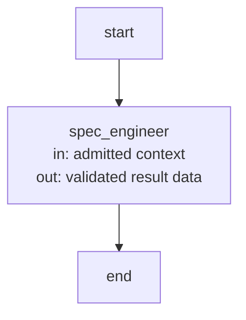
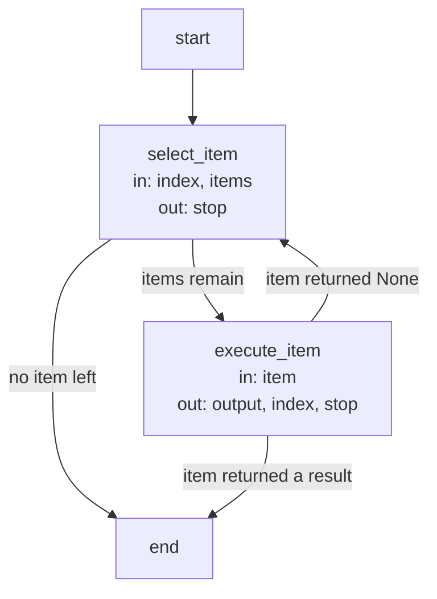
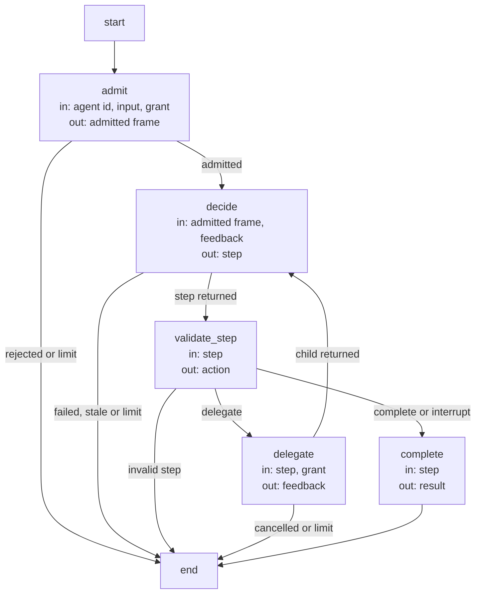

```concorde-document
{
  "id": "document.harness.host",
  "owner": "module.harness",
  "main_visible": true
}
```

# Invocation host

This document defines how the Harness binds and runs one invocation, the recursive delegation
entry it offers to trusted Python hosts, the LangGraph substrate every control flow uses, and the
optional Studio view. Value records are defined in [runtime values](runtime-values.md).

## Invocation binding

The host obtains an invocation's inputs in a fixed order: freeze its context (see
[context](context.md)); resolve the Agent definition with `resolve_agent` into an `AgentBinding`
(see [Agents and Harnesses](agents-and-harnesses.md)); compile the exact role and path policy with
`compile_policy`; render it for the selected integration; build the `LaunchSpecification` carrying
the context identity and canonical binding; then call the executor (see [execution](execution.md)).
Consumers that receive an already built launch do not reconstruct its digest or grant. The
executor's preflight reconstructs and verifies the carried binding, prompt, admitted context and
result types and policy before any process starts; a launch with no binding, or one the executor
cannot verify, is refused. `describe-policy` mode previews the exact grant a stage would receive,
naming the bound Agent, Harness, binding digest, instructions digest and loop timeout, without
launching anything or exposing context bodies.

## Control-flow substrate

Every capability Flow, including the global discovery loop, the development loop, topology
evolution, reflection triage and the deterministic capabilities, is a LangGraph
`StateGraph`. Its nodes are deterministic steps, which make no model call, or Agent invocations,
which do. The recursive delegation tree below is composed from the same Flows. These Flows are
the Studio surface; no capability runs its control flow outside them. Flow structure alone proves
nothing about semantics: transitions, limits and evidence still follow G1–G4.

## Agent invocation node (`agent_node`)

Every model-backed node of every Flow executes its Agent through an `AgentNode`: a one-node Flow
whose input schema is the selected Mode's admitted context type and whose output schema is the
Mode's result type. The catalog compiles the spec-engineer `plan` binding as its representative;
the node name is the Agent's name.

State: the Mode's context fields in (for a stage context: `snapshot`, `change_id`,
`expected_artifacts`) and the Mode's result fields out (`context_id`, `outcome`, `answer`, `gaps`,
`documents`, `plan`, `tasks`, `reflection_findings`).

| Node | Executes | in | out |
| --- | --- | --- | --- |
| `spec_engineer` | One native Agent process under the host launcher, which performs the launch, receipt checks and usage recording outside the graph state. | admitted context | validated result data |



## Sequential work items Flow (`batch_flow`)

Independently admitted work items (consumer reviews, component Specs, component implementations,
participant finalization) run one at a time through this Flow; the item node is named per use
(`review_module`, `author_module`, `develop_module`, `finalize_module`; the catalog compiles it as
`execute_item`).

State: `index` (the next item), `output` (the first non-None item result, which stops the Flow),
`stop`.

| Node | Executes | in | out |
| --- | --- | --- | --- |
| `select_item` | Deterministic: stops when no item remains. | index, items | stop |
| `execute_item` | The item operation; a non-None result stops the Flow. | item | output, index, stop |



## Recursive Agent invocation

The trusted Python host offers `CapabilityHost.invoke_agent(runtime, agent_id, input, grant)`. It
requires an installed `AgentRuntime` graph over canonical Agent definitions, a named node, that definition's typed input and an
explicit `AgentGrant`; task JSON cannot construct these authority-bearing objects. It returns
`AgentRun` and retains its events as host evidence. The runtime owns resolution of complete child
contexts, explicit delegation edges, typed child feedback, fresh native decisions, shared finite
call/decision/depth/time limits and cancellation propagation. This is in-process composition, not
another public Capability or a change to existing global routing. Default worker invocations retain
their existing one-decision contract until an enclosing host explicitly composes an Agent loop.

The execution collaborator supplies an already constructed `AgentRuntime` whose
`invoke(agent_id: str, input: dict, grant: AgentGrant) -> AgentRun` performs admission and execution.
This host entry accepts that runtime instance; it does not accept raw Agent definitions, discover
Python modules or construct arbitrary Harnesses from task fields. Trusted Python code constructs
RuntimeAgent nodes and an explicit complete-context resolver under the execution provider's
admission contract. No built-in question-reading factory is provided. The normal main question
flow indexes resolved Spec contexts and grants their documents to the coordinator.

### Recursive decision Flow (`agent_flow`)

State: `result` (the typed `AgentResult` once the invocation ends), `action` (`delegate` or
`complete` from the validated step); the runtime tree carries the shared call, decision, depth
and time counters and the feedback list of child results.

| Node | Executes | in | out |
| --- | --- | --- | --- |
| `admit` | Deterministic: grant, limits, typed input, current definition and complete read-only context are admitted. | agent id, input, grant | admitted frame |
| `decide` | One native Agent decision over the frame with its feedback. | admitted frame, feedback | step |
| `validate_step` | Deterministic: the step is a typed delegation or a typed completion or interruption. | step | action |
| `delegate` | The child invocation (this same Flow, one level deeper) whose result becomes feedback. | step, grant | feedback |
| `complete` | Deterministic: the completion or interruption becomes the result. | step | result |



`AgentGrant(targets: frozenset[str], agents: frozenset[str])` identifies the permitted project
targets and the tree's Agent allowlist. The root ID must be admitted. Every child must satisfy its
parent's explicit edge and the inherited host allowlist; effective targets intersect at every
invocation. Installing a definition cannot add authority. `AgentLimits(max_calls=16, max_depth=4,
max_decisions=64, timeout_seconds=300)` bounds the entire tree; the first three fields are integers,
positive except depth may be zero, and timeout is a positive finite number. Root depth is zero.
`limits=None` uses these defaults. A malformed grant or invalid graph/limit configuration raises
`ValueError`. A valid but insufficient grant returns `rejected`, not a widened retry. The host
entry itself rejects non-`AgentRuntime` inputs and non-execute mode with `ValueError`, and a stale
package build with `BuildError(code="stale_build")`.

The returned frozen `AgentRun` has `result: AgentResult` and `events: tuple[dict, ...]`.
`AgentResult` has string `invocation_id`, nullable `parent_id`, string `agent_id` and `outcome`,
nullable `value_json` and `error`, and nullable `details_json`. Only a completed result has a typed
value serialized in `value_json`. Outcomes are `completed`, `spec_incomplete`, `waiting`,
`cancelled`, `failed`, `limit_exhausted` and `rejected`. Gaps/waiting carry a serialized version-1
`concorde-agent-interruption` with data `{gaps, decision}`: gaps have nonblank `question`,
`blocked_step`, `needed_contract`, `target_id` and a sha256 `context_id`; waiting has only a nonblank
decision question, while Spec incompleteness has nonempty gaps and a null decision. Other outcomes
forbid details. Error is a stable host code rather than raw logs. `wire()` returns the same record
with `details` decoded from `details_json`; no private child context is returned.

Host events distinguish `admit` (invocation/parent/Agent IDs, depth, binding/context digests,
Harness ID and canonical configuration), `decision` (invocation ID, code-driven/model-driven source,
delegate/complete action and nullable child Agent ID), and `return` (the result's wire record).
`CapabilityHost.invoke_agent` appends these events to `host.evidence` and returns the same run.
They are host diagnostics, never implicit model input or a durable resume record. Unexpected runtime callback
exceptions become `failed/execution_failed`; invalid actions become `rejected/invalid_step`.
Failed/rejected children return typed feedback to the parent; cancellation or exhausted shared
limits terminate ancestors. Synchronous trusted callbacks must return promptly or enforce their
own interruption. Every root call has fresh identities and counters, with no persistent resume or
parallel scheduling in this initial adapter.

The initial read-only native adapter grants only its private context
capsule. It offers typed yield/delegate/continue decisions, not arbitrary native CLI sub-agent tools.
Hosts cannot translate a model-selected child ID into a public global capability or reuse a parent
process with a child's private context. Existing context-service snapshot resolution supplies the
actual task closure; installation of an Agent definition alone is not admission.

## Studio execution view

The Studio adapter starts or observes the same CapabilityHost used by CLI and Skill invocations.
Its generated LangGraph configuration exposes one Flow per Skill. Studio expands the same
admission, dispatch and composed Flow instances used by local calls, including query/discovery,
topology, planning, development and reflection branches. Non-public Capabilities remain callable
through declared composition. Separately bound recursive Agent and batch/coordination Flows
are also inspectable from their executable factories; their runtime instances depend on host admission.
Studio receives an invocation wrapper containing the
existing schema-3 invocation and an optional expected_workspace assertion. Project and package
roots remain host-bound; the assertion does not select another workspace.

The final state exposes the unchanged capability result envelope, admitted policy descriptions and
stage/process events. Pausing or replaying a run does not waive permissions, checks or the worktree
lifecycle, and replay may execute effects again. Ordinary local CLI and Skill calls do not require
a Studio server. The source-checkout setup and debugging guide is scripts/development/STUDIO.md.
This execution view participates in Developer view and feedback through the Development host.
