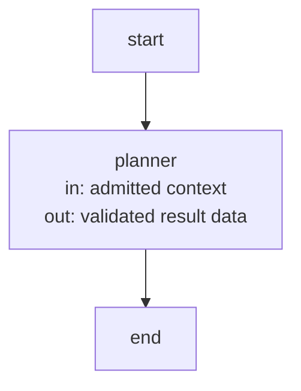
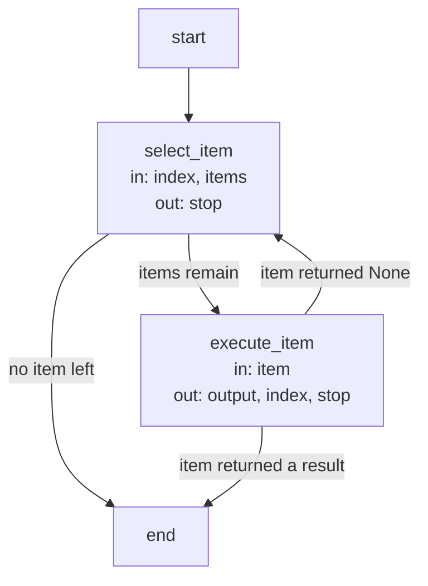

```concorde-document
{
  "id": "document.harness.host",
  "owner": "module.harness",
  "main_visible": true
}
```

# Invocation host

This document defines how the Harness binds and runs one worker invocation, the LangGraph substrate
every control flow uses, and the optional Studio view. Value records are defined in
[runtime values](runtime-values.md).

## Invocation binding

The host obtains an invocation's inputs in a fixed order: select the worker whose contract names the
stage; load its rendered instructions and resolve its `AgentBinding` against the build (see
[Agents and Harnesses](agents-and-harnesses.md)); freeze its context (see [context](context.md)) with
those instructions; compile the exact role and path policy with `compile_policy`; resolve the
worker's and each child's model selection from project configuration; bind all of it with
`build_worker_invocation`; then call the worker executor (see [execution](execution.md)). The
executor independently reverifies the binding, instructions, context and policy before any process
starts. A worker in a project workspace also receives the host's check service, which runs the
selected Module's configured checks read-only and returns each check's status and the tail of its
log.

`describe-policy` mode previews the exact grant a stage would receive without launching anything or
exposing context bodies: the worker, its binding, profile and instructions digests, its workspace
kind, tools and children, the read and write paths and policy digest, and the resolved model,
thinking level and timeout.

## Control-flow substrate

Every capability Flow, including the global discovery loop, the development loop, topology
evolution, reflection triage and the deterministic capabilities, is a LangGraph `StateGraph` built
with the Graph API, never with the Functional API. Its nodes are deterministic steps, which make no
model call, or worker invocations, which do. These Flows are the Studio surface; no capability runs
its control flow outside them. Flow structure alone proves nothing about semantics: transitions,
limits and evidence still follow G1–G4.

## Agent invocation node (`agent_node`)

Every model-backed node of every Flow executes its worker through an `AgentNode`: a one-node Flow
whose input schema is the worker contract's admitted context type and whose output schema is its
result type. The catalog compiles the planner as its representative; the node name is the worker's
name.

State: the contract's context fields in (for a stage context: `snapshot`, `change_id`,
`expected_artifacts`) and the contract's result fields out (`context_id`, `outcome`, `answer`,
`gaps`, `documents`, `plan`, `tasks`, `reflection_findings`).

| Node | Executes | in | out |
| --- | --- | --- | --- |
| `planner` | One Pi worker under the host launcher, which runs the worker executor and records usage outside the graph state. | admitted context | validated result data |



## Sequential work items Flow (`batch_flow`)

Independently admitted work items (consumer reviews, component Specs, component implementations,
participant finalization) run one at a time through this Flow; the item node is named per use
(`review_module`, `author_module`, `develop_module`, `finalize_module`; the catalog compiles it as
`execute_item`).

State: `index` (the next item), `output` (the first non-None item result, which stops the Flow),
`stop`.

| Node | Executes | in | out |
| --- | --- | --- | --- |
| `select_item` | Deterministic: stops when no item remains. | index, items | stop |
| `execute_item` | The item operation; a non-None result stops the Flow. | item | output, index, stop |



## Studio execution view

The Studio adapter starts or observes the same CapabilityHost used by CLI and Skill invocations, with
the same worker executor. Its generated LangGraph configuration exposes one Flow per Skill. Studio
expands the same admission, dispatch and composed Flow instances used by local calls, including
query/discovery, topology, planning, development and reflection branches. Non-public Capabilities
remain callable through declared composition. Batch and coordination Flows are also inspectable from
their executable factories; their runtime instances depend on host admission. Studio receives an
invocation wrapper containing the existing schema-3 invocation and an optional expected_workspace
assertion. Project and package roots remain host-bound; the assertion does not select another
workspace.

The final state exposes the unchanged capability result envelope, admitted policy descriptions and
stage and worker events (`agent_started`, `agent_finished`, `agent_failed` naming the capability,
stage, worker and invocation). Pausing or replaying a run does not waive permissions, checks or the
worktree lifecycle, and replay may execute effects again. Ordinary local CLI and Skill calls do not
require a Studio server. The source-checkout setup and debugging guide is scripts/development/STUDIO.md.
This execution view participates in Developer view and feedback through the Development host.
