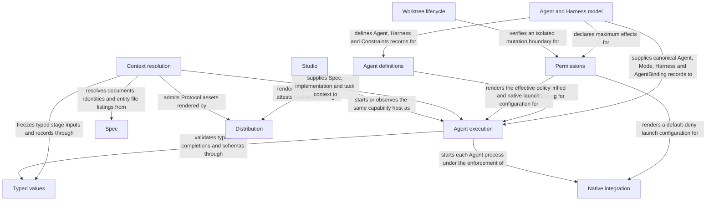

```concorde-document
{
  "id": "document.harness.module",
  "targets": [
    "module.harness"
  ],
  "main_visible": true
}
```

# Harness

`module.harness` follows Spec Protocol 4.0.0. Its sole structural parent is `module.concorde`. The
complete contract is the Markdown collection explicitly registered in `.concorde/specs.json`; links
and entity file listings do not expand it. This reading entry introduces the collection; the
registered companion documents explain [Agents and Harnesses](agents-and-harnesses.md), [Agent
Graphs and Loops](graphs-and-loops.md), [context](context.md), [permissions](permissions.md),
[execution](execution.md), [host](host.md), [runtime values](runtime-values.md) and [typed
values](typed-values.md). Their content remains authoritative regardless of navigation visibility.

## Purpose

The Harness configures and runs every Agent invocation in Concorde: it freezes the four context
kinds an invocation may see, binds the Agent's authored Spec and registered Harness into a
reproducible definition, compiles and enforces effective permissions, executes the bound Harness in
a fresh native process, and coordinates every control flow as a LangGraph graph. Every other
Concorde capability that needs a Spec- or task-bound model invocation relies on it, as does every
Agent author who defines a new named Agent. Its boundary stops at the Spec Module it consults for
project truth and the Distribution Module it consults for rendered instructions and Protocol
assets. It also supplies the host's OS-enforced read-only executor for configured deterministic
checks; it does not itself decide project topology, author Specs or implement business
capabilities.

## Requirements

These are the Module-wide promises the Harness makes regardless of which scenario triggers them,
grouped by the same subsystem as the Scenarios below.

### Context freezing

#### req.harness.context-closure-nonempty — Non-empty frozen context closure

The frozen context closure SHALL never be empty even when one kind is empty for the phase.

#### req.harness.context-focus-no-trim — Scenario focus never trims context

A scenario focus SHALL change only the question resolve_context answers, never the selected
Module's Spec context membership.

#### req.harness.context-file-names-every-phase — File names visible to every phase

Every phase SHALL see the names, owning entity and pending status of the selected Module's
entity-bound files.

#### req.harness.context-contents-code-phases-only — File contents limited to code phases

Only the implementation and code-review phases SHALL also receive the contents of the selected
Module's entity-bound files.

#### req.harness.context-recheck — Recheck rejects reuse after changes

recheck_context and recheck_discovery_context SHALL reject reuse whenever any admitted input has
changed since resolution.

#### req.harness.context-discovery-no-recurse — Discovery never expands via relationships

resolve_discovery_context SHALL NOT follow a dependency or hyperlink to add another Module's
documents to the discovery context.

### Agent and Harness binding

#### req.harness.agent-bind-subset — Constraints never widen the Harness

An Agent's own Constraints SHALL never widen the effects, contexts or results of its registered
Harness.

### Permission compilation

#### req.harness.permission-no-widen — Effective permissions stay within both grants

Effective permissions SHALL be a subset of both the Agent's declared constraints and the host's
invocation grant.

#### req.harness.permission-write-scope — Write authority limited to code-writing invocations

Only a code-writing invocation SHALL receive write authority, and only for the files the selected
Module's own entities list.

#### req.harness.permission-no-spec-write — No write authority over Spec or registry

A code-writing invocation SHALL NOT gain authority to write Spec documents, entity declarations or
the registry.

#### req.harness.permission-no-retry — No retry with a wider grant

No permission failure SHALL be retried with a wider grant.

### Native and recursive execution

#### req.harness.check-project-read-only — Checks cannot mutate project files

The configured-check executor SHALL enforce project filesystem read-only access in the operating
system for the check and every descendant throughout execution.

#### req.harness.check-fail-closed — Unavailable check isolation fails closed

The configured-check executor SHALL refuse execution when its read-only boundary cannot be enforced.

#### req.harness.check-scratch — Checks receive independent external scratch space

Every configured check SHALL receive a fresh host-managed writable temporary directory outside the
project, removed after its process tree has terminated.

#### req.harness.native-boundary — Agent processes run only under native or attested outer enforcement

An Agent process SHALL run only under the selected integration's native enforcement configured
exactly from its compiled policy, or under a host-attested outer sandbox.

#### req.harness.capsule-closed — A capsule grants only its own snapshot

A capsule-workspace invocation SHALL be granted read access to its own snapshot file and to no
other path.

#### req.harness.process-inputs-closed — Agent processes receive only closed inputs

An Agent process SHALL receive only the allowlisted environment variables, its frozen snapshot,
task and instructions on stdin, and its rendered native configuration.

#### req.harness.execute-no-retry — No automatic retry after execution failure

No execution failure SHALL trigger an automatic retry with the same or wider permissions.

#### req.harness.execute-exit-insufficient — Exit code alone is not completion

A successful process exit code alone SHALL NOT establish completion.

#### req.harness.recursive-no-implicit-authority — Catalog membership grants no delegation

Installing an Agent definition or belonging to the installed catalog alone SHALL NOT grant
delegation authority.

#### req.harness.recursive-typed-feedback — Children return only typed results

A child SHALL return only its declared typed result, invocation identity and outcome to its
parent, never raw context, transcripts or native logs.

### Typed value validation

#### req.harness.typed-canonical — Canonical encoding digests identically

canonical(value) SHALL produce sorted-key, compact, ASCII-escaped JSON with no trailing newline,
so identical values always digest identically.

## Scenarios

These scenarios state the success, failure and repeated-invocation promises realized in full by
the registered companion documents.

### Context freezing

Realized by `resolve_context`, `resolve_discovery_context` and their rechecks; see
[context](context.md).

#### scenario.harness.context-freeze — Freeze one Module's context for a bounded phase

- GIVEN a fresh, successfully admitted Spec repository and a registered Module target_id
- AND a phase, a task, and optional focus_id, constraints, instructions, stage_inputs and workspace
- WHEN resolve_context is called
- THEN the host returns an immutable concorde-context-snapshot identified by a content digest
- AND the snapshot always includes the Module's complete Spec context and its task context
- AND the snapshot includes implementation file contents only when the phase is implementation or code-review

See [the non-empty closure bound](#req.harness.context-closure-nonempty) and
[the focus bound](#req.harness.context-focus-no-trim). File visibility follows a fixed per-phase
rule: see [names for every phase](#req.harness.context-file-names-every-phase) and
[contents for code phases only](#req.harness.context-contents-code-phases-only).

#### scenario.harness.context-invalid-input — Reject an unsupported phase or a blank task

- GIVEN an unsupported phase value or a blank task string
- WHEN resolve_context is called
- THEN the call raises SpecError with code invalid_phase or invalid_input
- AND no partial or reusable snapshot is returned

#### scenario.harness.context-stale-recheck — Reject reuse after an admitted input changed

- GIVEN a previously resolved context snapshot
- AND a document, membership, Protocol binding or other admitted byte has since changed
- WHEN recheck_context or recheck_discovery_context is called with that snapshot
- THEN the call raises SpecError with code stale_context
- AND the caller must resolve a fresh snapshot before continuing

See [the changed-input recheck bound](#req.harness.context-recheck).

#### scenario.harness.context-discovery — Assemble several explicit Module contexts for the coordinator

- GIVEN a nonempty, duplicate-free ordered tuple of registered Module IDs, a capability, a phase of route, and an action of route, ask or design-topology
- WHEN resolve_discovery_context is called
- THEN the host returns a DiscoveryContext whose documents pool contains each selected Module's complete registered documents exactly once
- AND a focus hint is admitted only when it names a scenario of the target hint's own Module
- AND the returned topology equals the exact registry only for the design-topology action, and is null for every other action

See [the no-recursive-expansion bound](#req.harness.context-discovery-no-recurse).

#### scenario.harness.context-gap — Report a missing local dependency promise as a Spec gap

- GIVEN a selected Module whose local concorde-dependencies entries do not match its registered uses and parent relationships
- WHEN the host compares them before launching spec-engineer in context-solve mode for that Module
- THEN a missing direct entry yields a Module-owned structured Spec gap, and a malformed, duplicate, unknown or unrelated entry yields a conflicting outcome
- AND planning stops only for the dependent step while independent reasoning continues
- BUT no relationship inventory is injected into the worker snapshot when this comparison stops planning

### Agent and Harness binding

Realized by `agent_definition` and `resolve_agent`; see [Agents and Harnesses](agents-and-harnesses.md)
and [runtime values](runtime-values.md).

#### scenario.harness.agent-bind — Bind a named Agent's Spec, Harness and constraints

- GIVEN a named Agent registered in the Agent inventory and a current, fresh build
- WHEN resolve_agent is called for that name
- THEN the host returns a reproducible AgentBinding covering spec_digest, harness, harness_digest, constraints_digest, build_manifest_digest and effective_loop
- AND agent_definition resolves that same name, its hyphenated spelling or its concorde- external name to one canonical Agent record
- AND resolve_agent verifies the binding against the current build before returning it

See [the Constraints-never-widen bound](#req.harness.agent-bind-subset).

#### scenario.harness.agent-bind-reject — Reject an unknown Agent or a stale or inconsistent build

- GIVEN an unregistered Agent name, a stale package build, or a definition inconsistent with its declared Harness
- WHEN agent_definition or resolve_agent is called
- THEN the call raises BuildError with code unknown_agent, stale_build or invalid_agent_binding
- AND no invocation starts from an unverified binding

### Permission compilation

Realized by `compile_policy`, the native renderers and the worktree boundary check; see
[permissions](permissions.md).

#### scenario.harness.permission-compile — Compile an effective policy within declared and host authority

- GIVEN an Agent's declared EffectDeclaration, a host-supplied narrowing PolicyBinding and concrete role paths
- WHEN compile_policy is called
- THEN the host returns a digest-bound NormalizedPolicy whose reads, writes, network and credentials are each a subset of both the declaration and the binding
- AND render_codex_configuration or render_claude_configuration renders it into native read, write, command and network restrictions, or raises PermissionPolicyError when enforcement is unavailable

See [the declared-and-granted subset bound](#req.harness.permission-no-widen), [write authority
scoped to code-writing invocations](#req.harness.permission-write-scope) and [no write authority
over Spec or the registry](#req.harness.permission-no-spec-write).

#### scenario.harness.permission-reject — Reject unknown roles, unsafe paths or unenforceable grants

- GIVEN an unknown or duplicate role, an unsafe path, a widened read, write, network or credential effect, or unavailable native and outer-sandbox enforcement
- WHEN compile_policy or a native renderer is called
- THEN the call raises PermissionPolicyError before any task process starts
- AND no failure retries with a more permissive configuration

See [the no-wider-retry bound](#req.harness.permission-no-retry).

#### scenario.harness.worktree-boundary — Require an isolated worktree before unsafe mutation

- GIVEN a project root and an explicit allow_primary_worktree flag
- WHEN require_isolated_worktree is called
- THEN it returns the inspected WorktreeBoundary for a committed linked worktree, or for a committed primary worktree only when the trusted host passes allow_primary_worktree=True
- AND a symlink root, missing directory or unavailable Git identity raises WorktreeBoundaryError instead
- BUT allow_primary_worktree is set only by a trusted host decision, never by task input

### Native and recursive execution

Realized by `AgentProcessExecutor`, `AgentRuntime` and `CapabilityHost.invoke_agent`; see
[execution](execution.md) and [host](host.md).

The deterministic check executor's read-only filesystem, scratch, result, unavailable-backend and
process-lifetime scenarios are defined in [execution](execution.md#scenario.harness.check-read-only).

The native enforcement boundary of an Agent process, the capsule and project workspace kinds and
the Codex and Claude confinement scenarios are defined in
[execution](execution.md#scenario.harness.native-boundary-codex). See
[native or attested outer enforcement only](#req.harness.native-boundary),
[a capsule grants only its own snapshot](#req.harness.capsule-closed) and
[closed process inputs](#req.harness.process-inputs-closed).

#### scenario.harness.execute-success — Execute a bound Harness and accept a matching typed completion

- GIVEN a host-built LaunchSpecification carrying a verified AgentBinding and effective policy
- WHEN AgentProcessExecutor is called with it
- THEN the executor's preflight reconstructs and verifies the carried binding, prompt, admitted context and result types and policy before starting any process
- AND it starts the selected native integration in a fresh process and returns a CapabilityExecutionResult only for a validated successful completion

See [the no-automatic-retry bound](#req.harness.execute-no-retry) and [the
exit-code-is-not-completion bound](#req.harness.execute-exit-insufficient).

#### scenario.harness.execute-failure — Distinguish failed, cancelled, limit-exhausted and invalid outcomes

- GIVEN a nonzero exit, an injected KeyboardInterrupt, a subprocess timeout past the bound Agent's effective loop, or a zero-exit process with an invalid or domain-reported-failed completion
- WHEN AgentProcessExecutor is called
- THEN it raises CapabilityExecutionError with outcome failed, cancelled, limit_exhausted or invalid_completion respectively
- AND the caller stops the affected transition rather than retrying automatically

#### scenario.harness.recursive-delegate — Run an explicitly assembled recursive Agent graph

- GIVEN an installed AgentRuntime graph over canonical Agent definitions, a root Agent ID admitted in an explicit AgentGrant, and typed input
- WHEN CapabilityHost.invoke_agent is called
- THEN each child request is checked against its parent's explicit delegation edge and the inherited Agent allowlist before its own complete context and permissions are independently resolved
- AND the whole tree shares finite call, depth, decision and timeout budgets that no child can reset

See [the no-implicit-delegation bound](#req.harness.recursive-no-implicit-authority) and [the
typed-feedback-only bound](#req.harness.recursive-typed-feedback).

#### scenario.harness.recursive-reject — Stop or reject a malformed or exhausted recursive invocation

- GIVEN a malformed grant or graph configuration, an unresolved child name, a changed context or Agent Spec, or exhausted shared limits
- WHEN the runtime constructs the graph or evaluates the next decision
- THEN construction raises ValueError, an admission failure returns outcome rejected, stale_context or stale_definition, and cancellation or limit exhaustion terminates dependent ancestors immediately
- AND no child resets the shared call, depth, decision or timeout budget

### Typed value validation

Realized by `typed`, `validate_typed`, `json_schema`, `decode`, `canonical` and the schema
evaluator; see [typed values](typed-values.md).

#### scenario.harness.typed-validate — Validate a named registered wire type or contract schema

- GIVEN a type_id registered in the wire schema catalog and a candidate value
- WHEN validate_typed or typed is called
- THEN it returns a deep-copied, schema-checked value for a conforming input
- AND json_schema and schema.admit export or admit only the supported offline JSON Schema subset with local $defs references
- AND schema admission and validation resolve no remote reference and grant no fallback authority

See [the canonical-encoding bound](#req.harness.typed-canonical).

#### scenario.harness.typed-reject — Reject unknown types, duplicate keys or unsafe paths

- GIVEN an unknown or unsupported type or version, duplicate JSON object keys, a non-finite numeric constant, or a path outside the safe project-relative form
- WHEN decode, validate_typed, safe_path or checked_path is called
- THEN it raises TypedDataError with a stable code and a JSON-pointer field identifying the problem
- AND the caller stops the affected transition rather than substituting a default

### scenario.harness.mode-boundary — Explicit modes narrow a stable Agent definition

- GIVEN the three catalog Agents, their explicit modes and a selected Module or discovery collection
- WHEN the Host binds a mode and the executor admits its launch and completion
- THEN only common instructions and the selected mode instructions enter the invocation
- AND unknown modes, mismatched phase/action or context/result pairs, unadmitted stage artifacts and outputs, and mode authority exceeding the Agent ceiling are rejected
- AND forged writable programmer reviews or investigations are rejected before a model process starts
- AND an author and reviewer sharing an Agent definition have different invocation and context identities with no inherited conversation, stage artifacts or write grant
- AND the original specification, planning, task, implementation and review workflow still reaches a verified candidate under those restrictions

## Ontology

The Harness realizes its promises through the programs and used Modules below, wired together by
the relationships that turn a bounded invocation's four context kinds into a launched, verified
process.

### Entities

The Module's implementation is realized by the programs below. The two Modules it uses each appear
as one used-Module entity so the diagram in Relationships shows composition and dependency together,
and the native client that enforces every Agent process's boundary appears as an external actor.
The Agent and Harness model entity lists the `src/concorde/harness/` and `tests/concorde/harness/`
package directories; every other entity keeps the exact entries it realizes, and within this Module
the most specific entry owns a file.

```concorde-entities
[
  {
    "id": "entity.harness.context",
    "title": "Context resolution",
    "kind": "program",
    "responsibility": "Realize the four context kinds of the Harness Module as immutable canonical snapshots: single-Module resolution for bounded stages, global discovery assembly for the coordinator, topology-author context and the rechecks that reject drift.",
    "files": [
      "src/concorde/harness/context.py",
      "tests/concorde/harness/test_boundaries.py",
      "tests/concorde/harness/test_scoped_protocol.py"
    ]
  },
  {
    "id": "entity.harness.agent-model",
    "title": "Agent and Harness model",
    "kind": "program",
    "responsibility": "Realize `Agent = common spec.md + Harness + Constraints + Modes` as frozen Python records, the closed Harness catalog, effect declarations, reproducible AgentBinding and shared execution-environment primitives, including OS-enforced read-only configured checks.",
    "files": [
      "src/concorde/harness/",
      "tests/concorde/harness/"
    ]
  },
  {
    "id": "entity.harness.agent-definitions",
    "title": "Agent definitions",
    "kind": "program",
    "responsibility": "Bind each named runtime responsibility asset to a canonical Python Agent record; supply the same definitions to workflow stages.",
    "files": [
      "agents/",
      "tests/concorde/fixtures/build/golden/agents/"
    ]
  },
  {
    "id": "entity.harness.permissions",
    "title": "Permissions",
    "kind": "program",
    "responsibility": "Realize immutable policy records, authority intersection, integration-specific (Codex/Claude) launch configuration and the runtime bootstrap attestation that finalizes a launch without widening its authority.",
    "files": [
      "src/concorde/harness/permissions.py",
      "tests/concorde/harness/test_permissions.py"
    ]
  },
  {
    "id": "entity.harness.agent-execution",
    "title": "Agent execution",
    "kind": "program",
    "responsibility": "Realize single native launches, explicit recursive scheduling and typed completion admission using separate execution and Harness primitives.",
    "files": [
      "src/concorde/harness/agent_executor.py",
      "src/concorde/harness/agent_runtime.py",
      "src/concorde/harness/native_agent.py",
      "tests/concorde/harness/test_agent_executor.py",
      "tests/concorde/harness/test_agent_runtime.py"
    ]
  },
  {
    "id": "entity.harness.typed-values",
    "title": "Typed values",
    "kind": "shared program",
    "responsibility": "Realize versioned value schemas, canonical encoding, artifact references, safe project paths, the offline interface-schema evaluator and the constrained front-matter parser that every boundary of the Framework uses.",
    "files": [
      "src/concorde/spec/contract_shapes.py",
      "src/concorde/spec/contracts.py",
      "src/concorde/spec/frontmatter.py",
      "src/concorde/spec/schema.py",
      "src/concorde/spec/typed_data.py",
      "src/concorde/spec/wire_shapes.py",
      "tests/concorde/spec/test_typed_data.py"
    ]
  },
  {
    "id": "entity.harness.studio",
    "title": "Studio",
    "kind": "program",
    "responsibility": "Realize the LangGraph Studio adapter that exposes Concorde's capabilities as graphs over the same CapabilityHost, typed request validation and permission checks that CLI and Skill invocations use.",
    "files": [
      "scripts/development/STUDIO.md",
      "scripts/development/studio.py",
      "src/concorde/harness/studio.py",
      "src/concorde/harness/studio_client.py",
      "tests/concorde/harness/test_studio.py",
      "tests/concorde/harness/test_studio_client.py",
      "tests/concorde/harness/test_studio_server.py"
    ]
  },
  {
    "id": "entity.harness.worktree-lifecycle",
    "title": "Worktree lifecycle",
    "kind": "shared program",
    "responsibility": "Realize shared worktree identity, candidate state, session handoff and delivery mechanics for its two Module consumers.",
    "files": [
      "src/concorde/harness/change_worktree.py",
      "src/concorde/harness/session_handoff.py",
      "src/concorde/harness/worktree.py",
      "src/concorde/harness/worktree_delivery.py",
      "tests/concorde/harness/test_change_worktree.py",
      "tests/concorde/harness/test_session_handoff.py",
      "tests/concorde/harness/test_worktree_boundary.py",
      "tests/concorde/harness/test_worktree_lifecycle.py"
    ]
  },
  {
    "id": "entity.harness.native-integration",
    "title": "Native integration",
    "kind": "external actor",
    "responsibility": "The Codex or Claude Code client selected by project configuration. Its own permission profile, or its restricted mode and permission engine, enforces the rendered default-deny boundary around every Agent process; the client runs as the developer's user and is not itself sandboxed."
  },
  {
    "id": "entity.harness.spec",
    "title": "Spec",
    "kind": "used module",
    "target_id": "module.spec",
    "responsibility": "Own the project Spec model: the pinned Protocol binding, the explicit registry, structural validation, stable-ID file-set queries and honest initialization."
  },
  {
    "id": "entity.harness.distribution",
    "title": "Distribution",
    "kind": "used module",
    "target_id": "module.distribution",
    "responsibility": "Build authored projections, install and configure owned integrations, provision the managed runtime and keep a source checkout's own projections bound to the worktree that built them."
  }
]
```

### Relationships

Each invocation is the unit of work this Module executes. Its Spec context is the selected
Module's complete registered collection; its implementation context is the Protocol-defined set of
files the Module's own entities bind — every phase sees their names, only programmer implementation,
code-review and investigation modes see authorized contents; its capability context is the admitted Capability and Tool
contracts; its task context is the task, constraints, stage artifacts and lifecycle metadata. The
frozen closure is never empty and its identity covers every admitted byte.

An Agent definition binds common responsibilities, one of three registered Harnesses, an authority
ceiling and explicit modes. Resolution of the selected mode yields an `AgentBinding` that every structured
launch carries and the executor reverifies. Permissions are compiled purely from declared effects
and host authority and rendered into native enforcement or refused, guarded by the isolated-worktree
check before any unsafe mutation. That enforcement belongs to the selected native integration: the
host renders a default-deny configuration, verifies that it equals the compiled policy and starts
the process in a capsule or in the candidate worktree; it does not wrap the process in a sandbox
of its own. Every control flow is a LangGraph graph whose nodes are
deterministic steps or Agent invocations; a leaf may be either. Recursive delegation runs inside the
same graphs under shared budgets, depth limits and cancellation. Failures never retry with broader
permissions, and process exit alone never establishes completion.



## Local collaboration agreements

These entries describe the exact direct providers registered for this Module. They state
relied-upon behavior from this Module's perspective without importing another Module's documents.

```concorde-dependencies
[
  {
    "target_id": "module.spec",
    "responsibility": "Admit the registry and resolve identities, document collections, entity file listings and file ownership.",
    "selection_condition": "When freezing any context kind or checking a target, focus or binding.",
    "relied_upon_promises": [
      "Selection returns the complete registered collection and declared entity listing entries of one identity without following relationships, and a changed source is visible as a changed digest."
    ]
  },
  {
    "target_id": "module.distribution",
    "responsibility": "Render Agent instructions and Protocol assets from authored sources and attest their freshness.",
    "selection_condition": "When resolving an Agent binding or admitting the Protocol rule bundle for a launch.",
    "relied_upon_promises": [
      "A rendered instruction or rule asset is traceable to its authored source through the build manifest, and a stale build is reported rather than served."
    ]
  }
]
```

## Unresolved information

- Capability context is not yet a snapshot field: no registered Agent currently admits a Capability
  reference, so a resolved context's frozen closure carries only Spec, implementation and task
  context. Materializing admitted Capability and Tool contracts in the snapshot record, with their
  identities in the context digest, is pending implementation work that must not widen any existing
  grant.
- Each Studio graph is currently a two-node validate-and-execute wrapper around `run_capability`;
  most capabilities' real control flow still runs inside the host as direct Python calls, and only
  the development loop is itself a LangGraph `StateGraph`. This Module requires every capability's
  control flow to be a LangGraph graph that Studio exposes directly (see [host](host.md)).
  Migrating the discovery loop, topology flow, reflection triage, the deterministic lifecycle
  capabilities and the recursive `AgentRuntime` onto explicit `StateGraph` composition, and pointing
  `generated/langgraph.json` at those graphs, is pending implementation work.
- The Claude boundary has no physical probe. The Codex boundary is exercised by a real
  `codex sandbox` probe, but the Claude scenario checks only the rendered launch; that an Agent
  under restricted mode cannot reach files outside its grant rests on Claude Code's documented
  restricted-mode and permission semantics, which no test in this repository exercises against an
  installed client.
- Claude launches pass no `--strict-mcp-config`, so MCP servers from the developer's user
  configuration may still be started for a worker. Their tools are expected to be denied by
  `dontAsk`, which is unverified; whether the renderer must pass `--strict-mcp-config` is pending.
- Behavior when the host itself already runs inside a sandbox is not documented by either
  integration: nested bubblewrap for configured checks and `enableWeakerNestedSandbox` for Claude
  are set to fail closed, but neither is verified.
- Project configuration admits `enforcement: native` only. The attested outer-sandbox rendering
  path remains in Permissions for a future trusted launcher, but the distributed local and Studio
  launchers supply no attestation, so no admitted configuration can select it.
