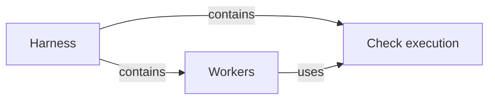

# Harness

## Purpose

The Harness configures and runs workers. For every worker it decides three things from the frozen
grant of the worker's task: what the worker may know, what it may touch, and how the run is
controlled from launch to result. It also runs the project's configured checks outside every
worker, so that a check result is never a worker's claim. Operation hosts rely on it to turn a
grant, a brief and a task worktree into a confined Claude Code process, an audited set of changes
and a run record they can trust. The Harness does not choose the task type or the Modules of a
task, does not compute grants, which is the work of the Spec core, and does not judge whether a
worker's output is right. Its enforcement guards against scope drift and mistakes, not against a
malicious worker, and this version supports only Claude Code workers.

## Terminology

| Term | Definition |
| --- | --- |
| [Worker](../vocabulary.md#concept.concorde.worker) | |
| [Boundary](../vocabulary.md#concept.concorde.boundary) | |
| [Evidence](../vocabulary.md#concept.concorde.evidence) | |
| [Worker settings](workers/module.md#concept.workers.worker-settings) | |
| [Deny rules](workers/module.md#concept.workers.deny-rules) | |
| [Write hook](workers/module.md#concept.workers.write-hook) | |
| [Write audit](workers/module.md#concept.workers.audit) | |
| [Run record](workers/module.md#concept.workers.run-record) | |
| [Configured check](checks/module.md#concept.checks.configured-check) | |
| [Read-only check boundary](checks/module.md#concept.checks.read-only-boundary) | |

A worker's boundary is carried by its worker settings, which hold the deny rules, the write hook and
the Bash sandbox. The write audit and the configured checks happen outside the worker, and the run
record keeps what the host observed.

## Usage

The Harness has no command of its own. An Operation host uses its two children in one sequence.
After it has computed and frozen the grant of a task, it hands the grant, the task worktree and the
task's brief to [Workers](workers/module.md), which pre-creates the pending files the grant makes
writable, generates the worker settings, launches `claude -p` in the run directory, audits the
worktree when the worker ends, runs the configured checks through
[Check execution](checks/module.md), resumes the same worker session with the failures when checks
fail, and returns the run record with the worker's structured result. Operations that need checks
without a worker, such as validation, call Check execution directly.

A worker never sees the Harness. It sees only its brief, which lists the paths it may write, read
and only name, and the denials its tools return when it strays.

## Design

The Harness exists so that a worker's answer stays a proposal until the host has checked it. The
host, not the worker, reads Git, audits the changes, runs the checks and writes the records, and
the worker's permissions never widen during a run. v1 uses only the worker's own Claude Code
configuration; there is no operating-system sandbox around the Claude process itself.

### What is enforced in v1

| Surface | Mechanism | What it stops |
| --- | --- | --- |
| Read, Glob, Grep | Generated `permissions.deny` rules listing the complement of the grant in the task worktree, the primary worktree outside the run's own directory, `.git`, `~/.claude` and the worker's credential | Reading ungranted and `names` files; Grep silently leaves them out of its results |
| Edit, Write | The same deny rules, plus a write-only PreToolUse hook that denies every path outside the grant's `rw` list with a reason naming the path's level | Changing `ro` files and creating undeclared files, which deny rules alone cannot stop because a deny rule always beats an allow rule |
| Bash | Claude Code's sandbox: `denyRead` of the task worktree and of `$HOME`, `allowRead` for granted files and the configured runtime paths, `allowWrite` for `rw` files and the run's writable directories, no network domain, and `allowUnsandboxedCommands: false` | Reading ungranted files, writing `ro` files, network access and escaping the sandbox with `dangerouslyDisableSandbox` |
| Permission mode | `bypassPermissions` with `--allow-dangerously-skip-permissions`; the deny rules, the hook and the sandbox are the boundary | Nothing by itself; `dontAsk` would deny every write outside the working directory even when allowed |
| Working directory | The run's own directory, never the task worktree | Claude Code adding the worktree to the Bash sandbox's readable and writable set |
| Tool set | `--tools` per task type, never WebFetch or WebSearch, and no agent tool | Web access through tools and workers starting other agents |
| MCP | `--strict-mcp-config` with no servers | Any tool beyond the listed ones |
| Claude state and instructions | Its own `CLAUDE_CONFIG_DIR`, a cleared environment, `CLAUDE_CODE_DISABLE_CLAUDE_MDS=1` and `CLAUDE_CODE_DISABLE_AUTO_MEMORY=1` | The user's settings, memory, skills, plugins, transcripts and project instructions reaching the worker |
| Git | No tool can read `.git`; diffs and commits belong to the host | A worker inspecting or rewriting history |
| Changes | The host audits `git diff` and untracked files against the grant after every round, outside the worker | Any remaining write outside `rw` counting as a result |
| Limits | Timeout, `--max-turns`, `--max-budget-usd`, and a kill of the worker's process group when a round ends | Runaway runs and leftover processes |

The exact settings, command line and records are in [Workers](workers/module.md), and the check
boundary is in [Check execution](checks/module.md).

### Known limits of v1

- The Claude process and the write hook are not sandboxed. The file-tool boundary is only as good
  as the generated deny rules are complete and the hook is correct.
- File tools are denied only the paths the deny rules name. Other files the user can read outside
  the task worktree and the primary worktree, such as the rest of the home directory, stay readable
  to Read and Grep.
- A read denial carries Claude Code's generic "denied by your permission settings" message, so the
  brief states the grant explicitly. Write denials come from the hook and explain themselves.
- Bash writes to single files inherit the bind-mount limits of Claude Code's Linux sandbox: such a
  file cannot be deleted or renamed from Bash.
- A file that Bash creates outside the `rw` paths appears to succeed but lands on a throw-away
  file system and never reaches the worktree. The brief warns about this; the audit sees no change.
- Writes to paths Git ignores are not audited.
- The host audit is the last line of defense for a write outside `rw`.

Future work, not part of v1: an outer `srt` sandbox around the whole worker process, credential
injection through a proxy so that the worker never holds the API credential, a leader tier between
the main agent and the workers, and Pi support.

The **Harness package** is the Python package marker of `concorde.harness`, which holds the code of
both children. It carries no behaviour of its own.

## Relationships

The two children split along who acts. Workers acts around a model process; Check execution runs
deterministic commands and never starts a model. Workers relies on Check execution for the checks of
a round, and Check execution knows nothing about workers.

**Workers** turns one frozen grant into worker settings, a brief and a launched Claude Code
process; it audits the worktree after every round, resumes the worker when configured checks fail,
performs the deletions the worker proposed, and writes the run record. The Harness relies on it for
every guarantee in the enforcement table except the check boundary. When Workers cannot establish a
part of the boundary, such as a run directory that a deny rule would cover, it refuses to launch and
reports a host failure instead of running a weaker worker.

**Check execution** runs the configured checks of Modules in a read-only operating-system boundary
with a fresh scratch directory, ends every process a check starts, and returns check results bound
to the digest of what they measured. The Harness relies on it so that checks run outside workers
and cannot change the files they judge. When the boundary cannot be established, no check runs.
