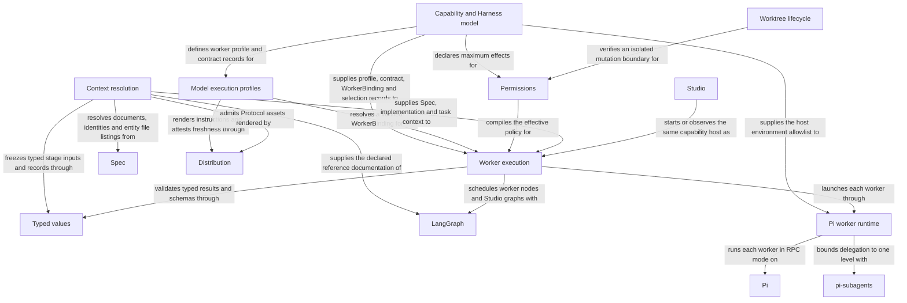

# Harness

## Purpose

The Harness Module prepares and runs a worker with a defined task, information and permissions, then checks the result. It also runs configured checks in a separate read-only environment. Other Modules rely on it to execute work without treating an agent answer as permission for unrelated actions.

## Terminology

| Term | Meaning / definition |
| --- | --- |
| Worker profile | The instructions and maximum tools, workspace and effects available to a kind of worker; a particular job can be narrower. |
| Tool gate | The checks applied inside the agent process before a model-requested tool runs; it is not an OS sandbox. |
| Capsule | A temporary workspace containing the documents admitted for one Spec-only worker invocation. |
| [Worker](../concepts.md#terminology) | Defined in Concepts for reading Concorde. |
| [Harness](../concepts.md#terminology) | Defined in Concepts for reading Concorde. |
| [Context](../concepts.md#terminology) | Defined in Concepts for reading Concorde. |
| [Grant](../concepts.md#terminology) | Defined in Concepts for reading Concorde. |
| [Snapshot](../concepts.md#terminology) | Defined in Concepts for reading Concorde. |
| [Capability](../concepts.md#terminology) | Defined in Concepts for reading Concorde. |
| [Host](../concepts.md#terminology) | Defined in Concepts for reading Concorde. |
| [Flow](../concepts.md#terminology) | Defined in Concepts for reading Concorde. |
| [Candidate](../concepts.md#terminology) | Defined in Concepts for reading Concorde. |
| [Worktree](../concepts.md#terminology) | Defined in Concepts for reading Concorde. |
| [Spec context](context.md#terminology) | Defined in What information a worker receives. |
| [Implementation context](context.md#terminology) | Defined in What information a worker receives. |
| [Capability context](context.md#terminology) | Defined in What information a worker receives. |
| [Task context](context.md#terminology) | Defined in What information a worker receives. |
| [Protocol binding](../spec/values.md#terminology) | Defined in Identities and versions. |

## Usage

A calling workflow gives the Harness Module one worker job or one configured check. Harness fixes the allowed
inputs and permissions, starts the job, and validates its matching result before the caller proceeds.
Spec-only workers receive specification information; code access is a separate phase-specific choice.

For example, a planner can describe a change without reading source. A programmer later receives
accepted tasks and allowed code files; a reviewer receives read-only inputs in a fresh conversation.
The workers share accepted artifacts, not all of each other's knowledge or authority.

Failures, cancellation, time limits and changed inputs stop dependent execution. Authorized code edits
may remain after failure and require inspection. **The worker tool gate is not an OS sandbox and does
not confine an authorized shell command.** Configured checks use a separate OS-enforced read-only
boundary, currently requiring Linux and appropriate system support. Read [execution](execution.md)
for these deployment limits before relying on isolation. Policy preview shows access without running
an agent.

## Design

The Capability and Harness model defines a worker's task contract, effects, workspace, tools and
children. The Model execution profiles service combines the authored role and Python profile into a reproducible
WorkerBinding, using fresh instructions supplied by [Distribution Module](../distribution/module.md). The Typed values layer validates the
contracts and handoffs; knowing a type or worker name does not itself grant access. This keeps
instruction identity separate from the project knowledge a worker may read.

Context resolution freezes the selected Module's complete document units, implementation names,
external references and admitted task artifacts. Both reading and metadata source bytes participate
in identity. The Permissions compiler intersects declared effects with host authority for that phase; metadata
never becomes writable merely because a programmer can change the implementation it names.
A changed binding, source member or reference selection requires a fresh context.

Worker execution independently rechecks the binding and grant before asking the Pi worker runtime
to start a fresh Pi RPC process. Its extension gates worker and child tool calls; pi-subagents
allows only one level of declared child delegation under the same grant. One matching submitted
result is required, not merely a successful exit. Cancellation, time limits and invalid completion
remain distinct. Worker shells do not have the OS confinement supplied for deterministic checks;
that explicit limitation is detailed in [execution](execution-reference.md#execution-design).

LangGraph Graph-API [Host Flows](host.md) compose deterministic steps and worker invocations.
Studio inspects and observes those same executable graphs rather than a separate schematic model.
Worktree lifecycle binds candidate identity, phase and progress and checks the mutation boundary.
Only admitted typed artifacts cross stages; a model decision cannot advance lifecycle state or
broaden another invocation's permission.

## Relationships

Each invocation is the unit of work this Module executes. Its Spec context is the selected
Module's complete one-level owned/reference context; its implementation context is the
Protocol-defined set of files the Module's own entities bind — every phase sees their names, only
the programmer and code reviewer see authorized contents; its capability context is
its worker's tools together with the Module's declared external references, whose readable files
reach the planner, task author, programmer and code reviewer read-only; its task context is the
task, constraints, stage artifacts and lifecycle metadata. The frozen closure is never empty and its
identity covers every admitted byte.

A worker definition binds its role Spec, one task contract, a workspace kind, tools and children.
Resolution yields an `WorkerBinding` that every invocation carries and the executor reverifies.
Permissions are compiled purely from the contract's effects and host authority, guarded by the
isolated-worktree check before any unsafe mutation, and handed to the Pi worker runtime, whose
extension gates every tool call of the worker and its children. Every control flow is a LangGraph
Flow whose nodes are deterministic steps or worker invocations; delegation below a worker is one
level of its declared children inside its own process. Failures never retry with broader
permissions, and a settled process alone never establishes completion.

## Reading by responsibility

The following topics explain how to use each Harness boundary. Their exact requirements and
acceptance cases belong to the Harness Module's [requirements](requirements.md) and
[scenarios](scenarios.md), rather than to the topic pages.

### Context freezing

Realized by `resolve_context`, `resolve_discovery_context` and their rechecks; see
[context](context.md).

### Capability profile and Harness binding

Realized by `worker_profile` and `resolve_worker`; see [Agents and Harnesses](agents-and-harnesses.md)
and [runtime values](runtime-values.md).

### Permission compilation

Realized by `compile_policy` and the worktree boundary check; see [permissions](permissions.md).

### Worker execution

Realized by `WorkerExecutor`, the Pi worker runtime and the capability host's worker launches; see
[execution](execution.md) and [host](host.md).

The deterministic check executor's read-only filesystem, scratch, result, unavailable-backend and
process-lifetime cases are defined in [Harness scenarios](scenarios.md#scenario.harness.check-read-only).
The Pi RPC client, worker launch, tool gate and one-level delegation scenarios are defined in
[Harness scenarios](scenarios.md#scenario.harness.pi-worker-launch). See [every tool call is
gated](requirements.md#req.harness.worker-gate), [a capsule grants only its own snapshot](requirements.md#req.harness.capsule-closed),
[closed process inputs](requirements.md#req.harness.process-inputs-closed), [delegation stops at declared
children](requirements.md#req.harness.delegation-one-level) and [only the submitted result leaves the
worker](requirements.md#req.harness.worker-single-result).

### Typed value validation

Realized by `typed`, `validate_typed`, `json_schema`, `decode`, `canonical` and the schema
evaluator; see [typed values](typed-values.md).

## Local collaboration agreements

These entries describe the exact direct providers registered for this Module. They state
relied-upon behavior from this Module's perspective without importing another Module's documents.

### Spec

The [Spec Module](../spec/module.md) owns the project Spec model: the pinned Protocol binding, the explicit registry, structural validation, stable-ID file-set queries and honest initialization.

Admit the registry and resolve identities, document collections, entity file listings and file ownership.

This collaboration applies when freezing any context kind or checking a target, focus or binding.

- [Resolve the full one-level context and own implementation bindings; rebuild snapshots after changes](../spec/contracts.md#registry-stable-id-spec-context-queries)

### Distribution

Build authored projections, install and configure owned integrations, provision the managed runtime and keep a source checkout's own projections bound to the worktree that built them.

Render Agent instructions and Protocol assets from authored sources and attest their freshness.

This collaboration applies when resolving an Agent binding or admitting the Protocol rule bundle for a launch.

- [Load only fresh, source-traceable instructions and pinned rule assets](../distribution/build.md)

## Unresolved information

- Capability context carries only the Module's declared external references and each worker's
  profile tools today: no worker admits a Capability or Tool reference beyond them, so those
  contracts are not yet snapshot fields. Materializing them in the snapshot record, with their
  identities in the context digest, is pending implementation work that must not widen any grant.
- The tool gate is a policy boundary inside the Pi process. Shell commands of workers and children
  granted `bash` (the programmer and the verifier child) are not confined by it,
  and no operating-system sandbox yet wraps the Pi process; that stronger boundary is pending.
- The gate and the capability ceiling are verified for foreground single delegation. Whether every
  other pi-subagents execution path loads the required child extension is unverified, which is why
  the host disables background runs, missions, schedules and inter-session channels.
- Checks run by `run_checks` use the configured-check executor, but the worker receives only the tail
  of each check's log; whether a longer or structured report is needed is unresolved.

The Harness implements Protocol 5 ownership/reference resolution and version-2 context handoffs. See [context migration status](context.md#implementation-status).
Referenced definitions remain read-only and do not enter local entity/file grants.

## Precise specifications

The Harness Module owns the exact obligations and interface details in [requirements](requirements.md), [scenarios](scenarios.md).
These companions are part of the same complete Module specification, not separate topic owners.
