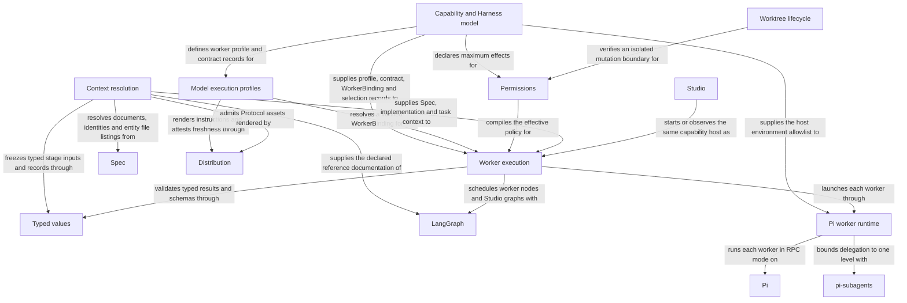

# Harness

## Purpose

The Harness configures and runs every worker invocation in Concorde: it freezes the four context
kinds an invocation may see, binds a worker's authored role Spec and Python profile into a
reproducible definition, compiles the effective permissions its tool gate enforces, runs the worker
as a fresh Pi coding agent process with its configured model, and coordinates every control flow as
a LangGraph Flow. Every other Concorde capability that needs a Spec- or task-bound model invocation
relies on it, as does every author who defines a new worker. Its boundary stops at the Spec Module it
consults for project truth and the Distribution Module it consults for rendered instructions and
Protocol assets. It also supplies the host's OS-enforced read-only executor for configured
deterministic checks; it does not itself decide project topology, author Specs or implement business
capabilities.

## Usage

Use Harness from trusted host code when a capability needs one bounded worker invocation, an
inspectable Flow or a deterministic read-only check. Select the worker and task, resolve current
context and binding, compile a grant no wider than declared effects, and execute the host-built
invocation. The result is a validated typed outcome with invocation identity and usage, not the
worker's conversation. Worker authors use [Agents and Harnesses](agents-and-harnesses.md) and
[runtime values](runtime-values.md) to define compatible profiles and task contracts.

A context snapshot identifies the files a worker may read; it grants complete owned and explicitly
referenced Specs, not just the requested scenario or the human-readable subset. Code access is
separately phase-bound. `describe-policy` previews grants without launching a worker. Treat stale
context, invalid completion, cancellation and time limits as distinct stopping outcomes; no failure
authorizes a wider retry. Checks have OS-enforced read-only project access. The worker tool gate is
not an OS sandbox and does not confine granted shell commands, so callers must not assume that
stronger protection. See [execution and its limits](execution.md) before admitting work.

## Design

The Capability and Harness model defines a worker's task contract, effects, workspace, tools and
children. The Model execution profiles service combines the authored role and Python profile into a reproducible
WorkerBinding, using fresh instructions supplied by Distribution. The Typed values layer validates the
contracts and handoffs; knowing a type or worker name does not itself grant access. This keeps
instruction identity separate from the project knowledge a worker may read.

Context resolution freezes the selected Module's complete document units, implementation names,
external references and admitted task artifacts. Both reading and metadata source bytes participate
in identity. The Permissions compiler intersects declared effects with host authority for that phase; metadata
never becomes writable merely because a programmer can change the implementation it names.
A changed binding, source member or reference selection requires a fresh context.

Worker execution independently rechecks the binding and grant before asking the Pi worker runtime
to start a fresh Pi RPC process. Its extension gates worker and child tool calls; pi-subagents
allows only one level of declared child delegation under the same grant. One matching submitted
result is required, not merely a successful exit. Cancellation, time limits and invalid completion
remain distinct. Worker shells do not have the OS confinement supplied for deterministic checks;
that explicit limitation is detailed in [execution](execution.md#design).

LangGraph Graph-API [Host Flows](host.md) compose deterministic steps and worker invocations.
Studio inspects and observes those same executable graphs rather than a separate schematic model.
Worktree lifecycle binds candidate identity, phase and progress and checks the mutation boundary.
Only admitted typed artifacts cross stages; a model decision cannot advance lifecycle state or
broaden another invocation's permission.

## Relationships

Each invocation is the unit of work this Module executes. Its Spec context is the selected
Module's complete one-level owned/reference context; its implementation context is the
Protocol-defined set of files the Module's own entities bind — every phase sees their names, only
the programmer and code reviewer see authorized contents; its capability context is
its worker's tools together with the Module's declared external references, whose readable files
reach the planner, task author, programmer and code reviewer read-only; its task context is the
task, constraints, stage artifacts and lifecycle metadata. The frozen closure is never empty and its
identity covers every admitted byte.

A worker definition binds its role Spec, one task contract, a workspace kind, tools and children.
Resolution yields an `WorkerBinding` that every invocation carries and the executor reverifies.
Permissions are compiled purely from the contract's effects and host authority, guarded by the
isolated-worktree check before any unsafe mutation, and handed to the Pi worker runtime, whose
extension gates every tool call of the worker and its children. Every control flow is a LangGraph
Flow whose nodes are deterministic steps or worker invocations; delegation below a worker is one
level of its declared children inside its own process. Failures never retry with broader
permissions, and a settled process alone never establishes completion.

## Requirements

These are the Module-wide promises the Harness makes regardless of which scenario triggers them,
grouped by the same subsystem as the Scenarios below.

### Context freezing

#### req.harness.context-closure-nonempty — Non-empty frozen context closure

The frozen context closure SHALL never be empty even when one kind is empty for the phase.

#### req.harness.context-focus-no-trim — Scenario focus never trims context

A scenario focus SHALL change only the question resolve_context answers, never the selected
Module's Spec context membership.

#### req.harness.context-file-names-every-phase — File names visible to every phase

Every phase SHALL see the names, owning entity and pending status of the selected Module's
entity-bound files.

#### req.harness.context-contents-code-phases-only — File contents limited to code phases

Only the implementation and code-review phases SHALL also receive the contents of the selected
Module's entity-bound files.

#### req.harness.context-index-and-grant — Spec context is indexed and granted, never embedded

Every launch SHALL deliver the selected Module's Spec context and the Protocol rule bundle as an
index of the included files plus a read-only grant of exactly those files rather than as document
bodies in the invocation input.

The index is the frozen snapshot; the grant names project-relative paths, Spec documents where they
live and the installed Protocol copy under `.concorde/protocol/`, as byte-identical copies in a
capsule or the verified files in place in a project workspace. An agent opens what its task needs, starting from the reading
entry, and nothing outside the grant is readable. The Protocol fixes only which files are visible;
this index and grant is the Framework's chosen delivery. Task context stays inline: a review's
typed changes carry diffs of the reviewed Module's own files, which add no path to the grant and
replace no granted file. See [Spec context grant](context.md#spec-context-grant).

#### req.harness.context-recheck — Recheck rejects reuse after changes

recheck_context and recheck_discovery_context SHALL reject reuse whenever any admitted input has
changed since resolution.

#### req.harness.context-discovery-no-recurse — Discovery never expands via relationships

resolve_discovery_context SHALL NOT follow a dependency or hyperlink to add another Module's
documents to the discovery context.

### Capability profile and Harness binding

#### req.harness.profile-within-contract — A profile never exceeds its contract

A worker profile SHALL never grant a tool that its contract's effects and workspace kind do not
admit.

### Permission compilation

#### req.harness.permission-no-widen — Effective permissions stay within both grants

Effective permissions SHALL be a subset of both the worker contract's declared effects and the
host's invocation grant.

#### req.harness.permission-write-scope — Write authority limited to code-writing invocations

Only a code-writing invocation SHALL receive write authority, and only for the files the selected
Module's own entities list.

#### req.harness.permission-no-spec-write — No write authority over Spec or registry

A code-writing invocation SHALL NOT gain authority to write Spec documents, entity declarations or
the registry.

#### req.harness.permission-no-retry — No retry with a wider grant

No permission failure SHALL be retried with a wider grant.

### Worker execution

#### req.harness.check-project-read-only — Checks cannot mutate project files

The configured-check executor SHALL enforce project filesystem read-only access in the operating
system for the check and every descendant throughout execution.

#### req.harness.check-fail-closed — Unavailable check isolation fails closed

The configured-check executor SHALL refuse execution when its read-only boundary cannot be enforced.

#### req.harness.check-scratch — Checks receive independent external scratch space

Every configured check SHALL receive a fresh host-managed writable temporary directory outside the
project, removed after its process tree has terminated.

#### req.harness.worker-gate — Every tool call is gated by the compiled grant

Every tool call of a worker and of its children SHALL be checked against the invocation's compiled
grant before it executes.

The gate is a policy boundary inside the Pi process, not an operating-system sandbox; see
[execution](execution.md#tool-gate).

#### req.harness.worker-selection — Each worker runs on its own configured selection

Every worker launch SHALL use the model, thinking level and timeout resolved for that worker, and for
each of its children, from the project capability configuration.

#### req.harness.capsule-closed — A capsule grants only its own snapshot

A capsule worker SHALL be granted read access only to its own snapshot and the copies that snapshot
indexes.

#### req.harness.process-inputs-closed — Worker processes receive only closed inputs

A worker process SHALL receive only the allowlisted environment, its host-built Pi configuration,
its system prompt and its single typed context message.

#### req.harness.execute-no-retry — No automatic retry after execution failure

No execution failure SHALL trigger an automatic retry with the same or wider permissions.

#### req.harness.execute-exit-insufficient — Settling alone is not completion

A worker that settles without exactly one valid submitted result SHALL NOT be treated as completed.

#### req.harness.delegation-one-level — Delegation stops at declared children

A worker SHALL delegate only to the children its own profile declares, never beyond one level.

#### req.harness.worker-single-result — Only the submitted result leaves the worker

Only a worker's single submitted result SHALL leave its process as Concorde data.

### Typed value validation

#### req.harness.typed-canonical — Canonical encoding digests identically

canonical(value) SHALL produce sorted-key, compact, ASCII-escaped JSON with no trailing newline,
so identical values always digest identically.

## Scenarios

These scenarios state the success, failure and repeated-invocation promises realized in full by
the registered companion documents.

### scenario.harness.flow-inspection — Inspect execution without acquiring authority

- GIVEN the executable Flow factories and host-bound public Studio entries
- WHEN a viewer compiles them and requests their LangGraph nodes and edges
- THEN it sees the actual admission, capability branches and composed Flow transitions without invoking an Agent or resolving project Spec contexts
- AND private stages gain no public entry or additional permissions
- AND the public checkpoint contains only JSON input and output while internal host objects and callbacks remain ephemeral
- AND replay of the public capability revalidates the input and expected workspace before any effects

### Context freezing

Realized by `resolve_context`, `resolve_discovery_context` and their rechecks; see
[context](context.md).

#### scenario.harness.context-freeze — Freeze one Module's context for a bounded phase

- GIVEN a fresh, successfully admitted Spec repository and a registered Module target_id
- AND a phase, a task, and optional focus_id, constraints, instructions, stage_inputs and workspace
- WHEN resolve_context is called
- THEN the host returns an immutable concorde-context-snapshot identified by a content digest
- AND the snapshot always indexes the Module's complete Spec context, every document with its identity, owner, digest, inclusion reasons and the reading entry, and carries its task context
- AND a launch under that snapshot grants the indexed documents and the Protocol files read-only at their paths, as byte-identical copies in a capsule, instead of embedding their bodies
- AND the snapshot includes implementation file contents only when the phase is implementation or code-review

See [the non-empty closure bound](#req.harness.context-closure-nonempty),
[the focus bound](#req.harness.context-focus-no-trim) and
[index and grant](#req.harness.context-index-and-grant). File visibility follows a fixed per-phase
rule: see [names for every phase](#req.harness.context-file-names-every-phase) and
[contents for code phases only](#req.harness.context-contents-code-phases-only).

#### scenario.harness.external-references — Grant a Module's external references to the workers that read them

- GIVEN a Module whose registration declares `references` of kind `external`, such as the vendored documentation and source of a library it builds on
- WHEN the host resolves a context for any phase
- THEN the snapshot lists each external reference with one digest over its readable files, and a launch of a worker whose contract declares the `references` effect grants exactly those entries read-only, copied as the same readable files into the capsule when the worker runs in one
- AND a worker without that effect, such as the spec author, spec reviewer or context assessor, sees the entries but receives no grant
- AND a change to an entry's readable bytes makes every admitted snapshot of the Module stale, while a missing entry fails resolution
- AND a host-created candidate worktree receives the primary worktree's reference checkouts without network access
- BUT no phase receives network access or an installed dependency's sources in place of the declared references, and media and archives below an entry are neither digested nor copied

#### scenario.harness.agent-node — Run a worker as a LangGraph node typed by its contract

- GIVEN a canonical worker definition and its task contract
- WHEN the host binds it as an CapabilityNode and executes an invocation through its compiled Flow
- THEN the node's input schema is exactly the top-level fields of the contract's admitted context type and its output schema exactly those of the contract's result type
- AND the node revalidates the admitted context before the launch and the returned data against the result type after it, so the launcher can neither admit an unexpected context nor return an unexpected result
- AND the same factory compiled without a launcher is inspectable inside the Flows that run it and starts no process
- BUT the Pi worker launch, its admission checks and usage recording stay in the host's launcher, outside the graph's public state

#### scenario.harness.context-invalid-input — Reject an unsupported phase or a blank task

- GIVEN an unsupported phase value or a blank task string
- WHEN resolve_context is called
- THEN the call raises SpecError with code invalid_phase or invalid_input
- AND no partial or reusable snapshot is returned

#### scenario.harness.context-stale-recheck — Reject reuse after an admitted input changed

- GIVEN a previously resolved context snapshot
- AND a document, ownership, reference declaration, inclusion reason, Protocol binding or other admitted byte has since changed
- WHEN recheck_context or recheck_discovery_context is called with that snapshot
- THEN the call raises SpecError with code stale_context
- AND the caller must resolve a fresh snapshot before continuing

See [the changed-input recheck bound](#req.harness.context-recheck).

#### scenario.harness.context-discovery — Assemble several explicit Module contexts for a discovery worker

- GIVEN a nonempty, duplicate-free ordered tuple of registered Module IDs, a capability, a phase of route, and an action of route, ask or design-topology
- WHEN resolve_discovery_context is called
- THEN the host returns a DiscoveryContext whose documents pool indexes the one-level union for every selected Module, deduplicated with ownership and inclusion reasons, and the router, answerer or topology designer launch grants those documents and the Protocol files read-only in its capsule
- AND a focus hint is admitted only when it names a scenario of the target hint's own Module
- AND the returned topology equals the exact registry only for the design-topology action, and is null for every other action

See [the no-recursive-expansion bound](#req.harness.context-discovery-no-recurse).

#### scenario.harness.context-gap — Report a missing local dependency promise as a Spec gap

- GIVEN a selected Module whose local dependency metadata entries do not match its registered uses and parent relationships
- WHEN the host compares them before launching the context assessor for that Module
- THEN a missing direct entry yields a Module-owned structured Spec gap, and a malformed, duplicate, unknown or unrelated entry yields a conflicting outcome
- AND planning stops only for the dependent step while independent reasoning continues
- BUT no relationship inventory is injected into the worker snapshot when this comparison stops planning

### Capability profile and Harness binding

Realized by `worker_profile` and `resolve_worker`; see [Agents and Harnesses](agents-and-harnesses.md)
and [runtime values](runtime-values.md).

#### scenario.harness.agent-bind — Bind a named worker's Spec, profile and children

- GIVEN a named worker registered in the Capability inventory and a current, fresh build
- WHEN resolve_worker is called for that name
- THEN the host returns a reproducible WorkerBinding covering spec_digest, instructions_digest, profile_digest, build_manifest_digest and timeout_seconds, where the profile digest covers every child definition's bytes
- AND worker_profile resolves that same name, its hyphenated spelling or its concorde- external name to the Capability's model execution profile
- AND resolve_worker verifies the binding against the current build before returning it

See [the profile-within-contract bound](#req.harness.profile-within-contract).

#### scenario.harness.agent-bind-reject — Reject an unknown worker or a stale or inconsistent build

- GIVEN an unregistered worker name, a stale package build, a profile inconsistent with its contract or workspace, or a child definition that is missing, malformed, names a model or thinking level or lists a tool outside the child tool set
- WHEN worker_profile or resolve_worker is called
- THEN the call raises BuildError with code unknown_agent, stale_build or invalid_agent_binding
- AND no invocation starts from an unverified binding

### Permission compilation

Realized by `compile_policy` and the worktree boundary check; see [permissions](permissions.md).

#### scenario.harness.permission-compile — Compile an effective policy within declared and host authority

- GIVEN a worker contract's EffectDeclaration, a host-supplied narrowing PolicyBinding and concrete role paths
- WHEN compile_policy is called
- THEN the host returns a digest-bound NormalizedPolicy whose reads, writes, network and credentials are each a subset of both the declaration and the binding
- AND the worker executor hands exactly its read and write paths to the worker's tool gate

See [the declared-and-granted subset bound](#req.harness.permission-no-widen), [write authority
scoped to code-writing invocations](#req.harness.permission-write-scope) and [no write authority
over Spec or the registry](#req.harness.permission-no-spec-write).

#### scenario.harness.permission-reject — Reject unknown roles, unsafe paths or widened grants

- GIVEN an unknown or duplicate role, an unsafe path, a widened read, write, network or credential effect, or an invocation granting writes, network or credentials its worker contract does not declare
- WHEN compile_policy is called or the worker executor admits the invocation
- THEN the call raises PermissionPolicyError or CapabilityExecutionError before any worker process starts
- AND no failure retries with a more permissive configuration

See [the no-wider-retry bound](#req.harness.permission-no-retry).

#### scenario.harness.change-owner — Preserve and validate candidate ownership

- GIVEN host-owned candidate state in the current worktree, possibly created before routing
- WHEN the host reads, restores or binds its owner
- THEN an unbound owner remains distinct from an absent or malformed record, and persisted change, path, branch, owner and intent fields are validated before use
- AND a requested existing change cannot silently create replacement state in another worktree
- AND missing binding task or target returns a structured invalid_input error instead of a field lookup exception
- AND binding preserves the recorded task and constraints, while conflicting bound intent is rejected with incompatible_handoff and its field
- AND only a trusted coordinated child may use a distinct component intent without rewriting the root owner
- AND lifecycle metadata supplies recovery identity but never grants implementation access or waives readiness checks

#### scenario.harness.worktree-boundary — Require an isolated worktree before unsafe mutation

- GIVEN a project root and an explicit allow_primary_worktree flag
- WHEN require_isolated_worktree is called
- THEN it returns the inspected WorktreeBoundary for a committed linked worktree, or for a committed primary worktree only when the trusted host passes allow_primary_worktree=True
- AND a symlink root, missing directory or unavailable Git identity raises WorktreeBoundaryError instead
- BUT allow_primary_worktree is set only by a trusted host decision, never by task input

### Worker execution

Realized by `WorkerExecutor`, the Pi worker runtime and the capability host's worker launches; see
[execution](execution.md) and [host](host.md).

The deterministic check executor's read-only filesystem, scratch, result, unavailable-backend and
process-lifetime scenarios are defined in [execution](execution.md#scenario.harness.check-read-only).
The Pi RPC client, worker launch, tool gate and one-level delegation scenarios are defined in
[execution](execution.md#scenario.harness.pi-worker-launch). See [every tool call is
gated](#req.harness.worker-gate), [a capsule grants only its own snapshot](#req.harness.capsule-closed),
[closed process inputs](#req.harness.process-inputs-closed), [delegation stops at declared
children](#req.harness.delegation-one-level) and [only the submitted result leaves the
worker](#req.harness.worker-single-result).

#### scenario.harness.execute-success — Execute a bound worker and accept its typed result

- GIVEN a host-built WorkerInvocation carrying a verified WorkerBinding, frozen context, compiled policy and model selection
- WHEN WorkerExecutor is called with it
- THEN its preflight reverifies the binding against the current build, the instructions against the rendered worker and its indexed Protocol files, and the context and policy against the worker contract before starting any process
- AND it launches one Pi worker with the profile's tools, the policy's grants, the children with their selected models and the contract's result schema as submit_result's parameters
- AND it returns a WorkerOutcome bound to the invocation and binding digests only for a single submitted result that satisfies the result type and the contract

See [the no-automatic-retry bound](#req.harness.execute-no-retry) and [the
settling-is-not-completion bound](#req.harness.execute-exit-insufficient).

#### scenario.harness.execute-failure — Distinguish failed, cancelled, limit-exhausted and invalid outcomes

- GIVEN a refused preflight or a Pi process that fails before settling, a host interrupt, a run past its timeout, or a run whose submitted result is missing, repeated or outside the contract
- WHEN WorkerExecutor is called
- THEN it raises CapabilityExecutionError with outcome failed, cancelled, limit_exhausted or invalid_completion respectively
- AND a contract rejection keeps its code, permission_denied for disallowed authored fields
- AND the caller stops the affected transition rather than retrying automatically

#### scenario.harness.worker-contract — A worker runs only its own task contract

- GIVEN the twelve catalog workers and a selected Module or discovery collection
- WHEN the host binds a worker and the executor admits its launch and its result
- THEN only the common worker rules, that worker's role Spec and the Protocol rule bundle form its system prompt
- AND a mismatched phase or action, context or result type, unadmitted or missing required stage artifacts, implementation contents for a worker without implementation reads and a policy wider than the contract are rejected before a process starts
- AND a result with an outcome or a populated field its contract does not permit is rejected, disallowed authored fields as permission_denied
- AND an author and a reviewer of the same Module have different invocation and context identities with no shared conversation, stage artifacts or write grant

#### scenario.harness.usage-accounting — Record what every worker launch consumed, per step

- GIVEN a Pi worker that settled and reported its session statistics
- WHEN the host accepts the WorkerOutcome of a stage, review, discovery or topology-author launch
- THEN the outcome carries an ExecutionUsage record with the reported input, cached and output tokens, cost and turns, the configured model and thinking level, the host-measured wall time and the prompt and context sizes
- AND the host appends one JSON line labelled with the capability, stage, target, worker, change and launch identity to `.concorde/runs/<root invocation>/usage.jsonl`, where the root invocation is the top-level capability invocation of the whole Flow run
- AND the host observer receives the same record as an `agent_usage` event, and the `usage` Tool and the executable boundary summarize those lines per step, stage, target and worker
- BUT a figure Pi did not report is recorded as unknown rather than zero, and a persistence failure never fails the launch

#### scenario.harness.worker-selection — Launch each worker and child on its configured model

- GIVEN `.concorde/config.json` capability configuration naming a default `model`, `thinking` and `timeout_seconds` and, under `workers`, entries keyed by a worker such as `programmer` or by a worker child such as `programmer/scout`
- WHEN the host binds any worker invocation
- THEN the worker's model and thinking level come from its worker entry, else the default, and each child's from its child entry, else its worker's entry, else the default
- AND the worker's timeout comes from its worker entry, else the default, else its profile
- AND Pi receives the worker's model as `--model` and its thinking level as `--thinking`, and each child definition receives its own as frontmatter
- AND the selection is part of the invocation digest, and a describe-policy run reports it for every worker it describes
- BUT an absent model or thinking level keeps Pi's own default

See [each worker runs on its own configured selection](#req.harness.worker-selection).

#### scenario.harness.worker-selection-reject — Reject a selection no worker can run

- GIVEN a capability configuration whose `workers` map has a key naming no worker or worker child, a child entry with a timeout, a nonpositive timeout, a model that is not a Pi `provider/id` or an unknown thinking level
- WHEN the configuration is proposed, applied or loaded
- THEN it is rejected with a typed field error naming the offending entry
- AND a rejected proposal or application leaves the stored configuration unchanged

### Typed value validation

Realized by `typed`, `validate_typed`, `json_schema`, `decode`, `canonical` and the schema
evaluator; see [typed values](typed-values.md).

#### scenario.harness.typed-validate — Validate a named registered wire type or contract schema

- GIVEN a type_id registered in the wire schema catalog and a candidate value
- WHEN validate_typed or typed is called
- THEN it returns a deep-copied, schema-checked value for a conforming input
- AND json_schema and schema.admit export or admit only the supported offline JSON Schema subset with local $defs references
- AND schema admission and validation resolve no remote reference and grant no fallback authority

See [the canonical-encoding bound](#req.harness.typed-canonical).

#### scenario.harness.typed-reject — Reject unknown types, duplicate keys or unsafe paths

- GIVEN an unknown or unsupported type or version, duplicate JSON object keys, a non-finite numeric constant, or a path outside the safe project-relative form
- WHEN decode, validate_typed, safe_path or checked_path is called
- THEN it raises TypedDataError with a stable code and a JSON-pointer field identifying the problem
- AND the caller stops the affected transition rather than substituting a default

## Local collaboration agreements

These entries describe the exact direct providers registered for this Module. They state
relied-upon behavior from this Module's perspective without importing another Module's documents.

### Spec

Own the project Spec model: the pinned Protocol binding, the explicit registry, structural validation, stable-ID file-set queries and honest initialization.

Admit the registry and resolve identities, document collections, entity file listings and file ownership.

This collaboration applies when freezing any context kind or checking a target, focus or binding.

- [Resolve the full one-level context and own implementation bindings; rebuild snapshots after changes](../spec/registry.md#stable-id-spec-context-queries)

### Distribution

Build authored projections, install and configure owned integrations, provision the managed runtime and keep a source checkout's own projections bound to the worktree that built them.

Render Agent instructions and Protocol assets from authored sources and attest their freshness.

This collaboration applies when resolving an Agent binding or admitting the Protocol rule bundle for a launch.

- [Load only fresh, source-traceable instructions and pinned rule assets](../distribution/build.md)

## Unresolved information

- Capability context carries only the Module's declared external references and each worker's
  profile tools today: no worker admits a Capability or Tool reference beyond them, so those
  contracts are not yet snapshot fields. Materializing them in the snapshot record, with their
  identities in the context digest, is pending implementation work that must not widen any grant.
- The tool gate is a policy boundary inside the Pi process. Shell commands of workers and children
  granted `bash` (the programmer and the verifier child) are not confined by it,
  and no operating-system sandbox yet wraps the Pi process; that stronger boundary is pending.
- The gate and the capability ceiling are verified for foreground single delegation. Whether every
  other pi-subagents execution path loads the required child extension is unverified, which is why
  the host disables background runs, missions, schedules and inter-session channels.
- Checks run by `run_checks` use the configured-check executor, but the worker receives only the tail
  of each check's log; whether a longer or structured report is needed is unresolved.

The Harness implements Protocol 5 ownership/reference resolution and version-2 context handoffs. See [context migration status](context.md#implementation-status).
Referenced definitions remain read-only and do not enter local entity/file grants.
