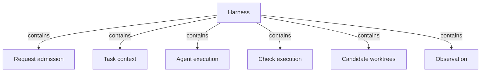

# Harness

## Purpose

The Harness is how Concorde configures and runs an Agent for a task: context, control flow, Agents
and models, and permission per Agent, all managed around the Spec. Every capability request enters
through it; it decides what each Agent call may know, runs every model step as a fresh Agent call
whose answer counts only after the Host has checked it, runs deterministic checks in a read-only
sandbox, keeps every change in a candidate worktree, and times all of this without letting timing
matter. The providers under Operations rely on it so that none of them implements these on its own.
It does not decide what a capability does, define Agents (the Agents Module does) or compute the
Spec's boundary sets (Spec tooling does), and it enforces only part of the boundaries it records.

## Terminology

| Term | Definition |
| --- | --- |
| [Capability](../vocabulary.md#concept.concorde.capability) | |
| [User session](../vocabulary.md#concept.concorde.user-session) | |
| [Host](../vocabulary.md#concept.concorde.host) | |
| [Worker](../vocabulary.md#concept.concorde.worker) | |
| [Context](../vocabulary.md#concept.concorde.context) | |
| [Spec context](../vocabulary.md#concept.concorde.spec-context) | |
| [Implementation context](../vocabulary.md#concept.concorde.implementation-context) | |
| [Capability context](../vocabulary.md#concept.concorde.capability-context) | |
| [Task context](../vocabulary.md#concept.concorde.task-context) | |
| [Boundary](../vocabulary.md#concept.concorde.boundary) | |
| [Capability declaration](admission/module.md#concept.admission.capability-declaration) | |
| [Result envelope](admission/module.md#concept.admission.result-envelope) | |
| [Context snapshot](context/module.md#concept.context.snapshot) | |
| [Capsule](context/module.md#concept.context.capsule) | |
| [Agent binding](context/module.md#concept.context.agent-binding) | |
| [Agent call](execution/module.md#concept.execution.agent-call) | |
| [Workflow](execution/module.md#concept.execution.workflow) | |
| [Result gate](execution/module.md#concept.execution.result-gate) | |
| [Configured check](checks/module.md#concept.checks.configured-check) | |
| [Candidate](worktrees/module.md#concept.worktrees.candidate) | |
| [Diagnostic span](observation/module.md#concept.observation.diagnostic-span) | |

The Harness defines no words of its own; each child defines the words of its own interface. The
four kinds of context are the root's: the Harness is where they are put together for one Agent
call.

## Usage

Nobody calls "the Harness" as such. The user session calls a capability; **Request admission**
checks it and places it in a candidate when it mutates; the provider asks **Agent execution** to run
its Agent, for which **Task context** binds the Agent, freezes the snapshot and assembles the capsule;
the Agent may run checks through **Check execution**; the result gate accepts the proposal only after
Task context's recheck; **Candidate worktrees** keeps the change status and run record in the primary;
and **Observation** times every step. The [design topic](design.md) follows one
`concorde-implement` request through these steps.

## Design

**Specs decide, the Harness records and checks.** What an Agent may know is a snapshot frozen from
the Spec's boundary sets, what it may do is its tool list fixed by its binding, and what counts as
done is a result the Host accepted after rechecking the snapshot. A model step can only propose.
Control flow uses only pi workflows and LangGraph Graphs (Graph API), both run by Agent execution.

**Six parts, below the providers.** Each part changes for its own reason. The parts use only Spec
tooling, Issues, Agents, Observation, each other and Distribution's build manifest contract; what
only a provider knows reaches them through the capability declaration and the Agent and Workflow
hooks. The [design topic](design.md) explains the decomposition.

**What is enforced and what is not.** The Harness freezes the Protocol's sets exactly but enforces
only part of them. This is a plain statement, not a plan:

| Boundary | Enforced by | Not enforced |
| --- | --- | --- |
| Which capability runs, with which configuration, in which worktree | Request admission, for every request that enters through the launcher | Who starts the launcher: an Agent with a shell can call it like any other caller. |
| An Agent's tools and the ban on delegation | the Agent binding and Agent execution's native preflight | — |
| What an Agent reads | nothing at the operating-system level; the capsule holds exactly the delivered copies and is the Agent's working directory | Native Agent reads are not confined to the capsule. |
| What the programmer writes | its instructions name the intended write paths | The programmer's edits and shell are not confined to its `ImplementationScope`. |
| Spec documents (`SpecScope`) | no Agent definition declares a Spec write role and no result may carry Spec documents | `SpecScope` is not enforced: an Agent with `edit`, `write` or `bash` can change a Spec file on disk. |
| An Agent's network and credentials | — | Not restricted: Agents run as the developer's user with the developer's network and credentials. |
| What counts as a result | the result gate, reading pi-subagents' own records, and Task context's recheck | — |
| Configured checks and tester commands | an operating-system read-only view of the project with private scratch | The check sandbox shares the host network, IPC sockets and environment. |
| Delivery | explicit authorization for a primary merge and Delivery's own checks | Delivery runs no sandbox. |
| The primary checkout | a candidate worktree keeps a change's files out of the primary until delivery | A worktree separates files, not permissions. |

An Agent that ignores its instructions can therefore read or write more than its context grants,
but its result is still refused if any input it was given changed, and every change stays in a
candidate until the developer delivers it.

The Harness binds only its Python package markers; all behaviour is bound by its children.

## Relationships

**Request admission** is the single entry of every capability request. The Harness relies on it to
decide everything from the
[capability declaration](admission/module.md#concept.admission.capability-declaration), to refuse
invalid requests before any provider runs, to run mutations in a candidate through a
[relay](admission/module.md#concept.admission.relay), and to answer each
[capability request](admission/module.md#concept.admission.capability-request) with one
[result envelope](admission/module.md#concept.admission.result-envelope). When it refuses, nothing
else runs.

**Task context** composes the four kinds of context of one Agent call, when a call is prepared and
before its result is accepted. The Harness relies on it for the
[Agent binding](context/module.md#concept.context.agent-binding), the
[context snapshot](context/module.md#concept.context.snapshot) of exactly the bound Modules' sets
and the [capsule](context/module.md#concept.context.capsule); a moved input gives
`stale_context`, which stops acceptance.

**Agent execution** runs model work for every model-backed capability. The Harness relies on it to
run each [Agent call](execution/module.md#concept.execution.agent-call) fresh, without delegation,
with exactly its bound tools and [model selection](execution/module.md#concept.execution.model-selection);
to run [Workflows](execution/module.md#concept.execution.workflow) and
[Graphs](execution/module.md#concept.execution.graph) as the only control flow of model work; to
reach providers only through [Agent hooks](execution/module.md#concept.execution.agent-hook) and
[Workflow hooks](execution/module.md#concept.execution.workflow-hook); and to accept a proposal only
through the [result gate](execution/module.md#concept.execution.result-gate). A failed or uncertain
acceptance is final for that call.

**Check execution** runs [configured checks](checks/module.md#concept.checks.configured-check) and a
tester's commands, for Agents, Validation, Delivery and testers. The Harness relies on its
[read-only boundary](checks/module.md#concept.checks.read-only-boundary) with private scratch, the
one operating-system boundary for project code, and on its refusal to run a check when that
boundary cannot be established.

**Candidate worktrees** creates [candidates](worktrees/module.md#concept.worktrees.candidate) and
keeps every [change status](worktrees/module.md#concept.worktrees.change-status) and
[run record](worktrees/module.md#concept.worktrees.run-record) in the primary, for every executed
request and mutation. The Harness relies on it so that a change never touches the primary before
delivery, its records outlive the candidate, and a stale write fails instead of overwriting.

**Observation** records [diagnostic spans](observation/module.md#concept.observation.diagnostic-span)
of the Harness's steps and the developer's Pi sessions. The Harness relies on it being passive: a
span never decides an outcome, is never evidence, holds no content, and a failure to record one
changes nothing.
