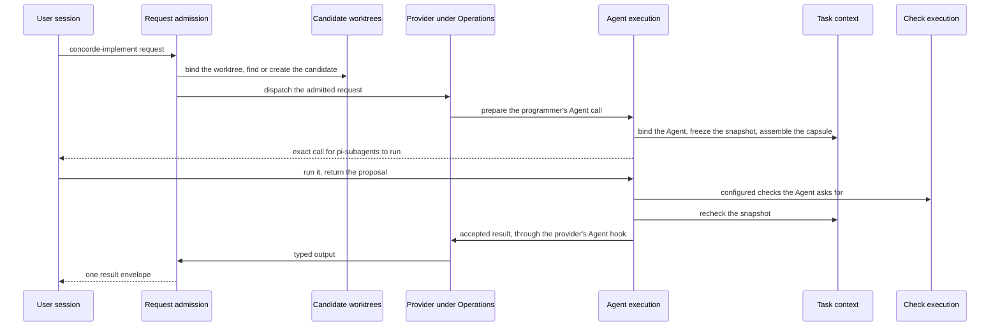
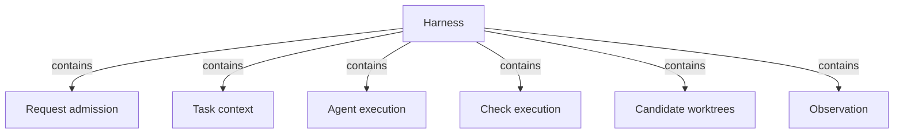

# Harness

## Purpose

The Harness is how Concorde configures and runs an Agent for a task. Every capability request
enters through it; it decides, from the Specs, what each Agent call may know; it runs every model
step as a fresh Agent call whose answer counts only after the Host has checked it; it runs
deterministic checks in a read-only sandbox; it keeps every change in its own candidate worktree;
and it times all of this without letting the timing matter. The providers under Operations rely on
it so that none of them implements request checks, context, execution, checks or isolation on its
own. The Harness does not decide what a capability does (its provider does), does not define the
Agents (the Agents Module does), and does not compute the Spec's boundary sets (Spec tooling does).
It records the Protocol's boundaries exactly but enforces only part of them, and the Design section
lists plainly what is not enforced.

## Terminology

| Term | Definition |
| --- | --- |
| [Capability](../vocabulary.md#concept.concorde.capability) | |
| [User session](../vocabulary.md#concept.concorde.user-session) | |
| [Host](../vocabulary.md#concept.concorde.host) | |
| [Worker](../vocabulary.md#concept.concorde.worker) | |
| [Context](../vocabulary.md#concept.concorde.context) | |
| [Spec context](../vocabulary.md#concept.concorde.spec-context) | |
| [Implementation context](../vocabulary.md#concept.concorde.implementation-context) | |
| [Capability context](../vocabulary.md#concept.concorde.capability-context) | |
| [Task context](../vocabulary.md#concept.concorde.task-context) | |
| [Boundary](../vocabulary.md#concept.concorde.boundary) | |
| [Capability declaration](admission/module.md#concept.admission.capability-declaration) | |
| [Result envelope](admission/module.md#concept.admission.result-envelope) | |
| [Context snapshot](context/module.md#concept.context.snapshot) | |
| [Capsule](context/module.md#concept.context.capsule) | |
| [Agent binding](context/module.md#concept.context.agent-binding) | |
| [Agent call](execution/module.md#concept.execution.agent-call) | |
| [Workflow](execution/module.md#concept.execution.workflow) | |
| [Result gate](execution/module.md#concept.execution.result-gate) | |
| [Configured check](checks/module.md#concept.checks.configured-check) | |
| [Candidate](worktrees/module.md#concept.worktrees.candidate) | |
| [Diagnostic span](observation/module.md#concept.observation.diagnostic-span) | |

The Harness defines no words of its own; each child defines the words of its own interface. The
four kinds of context are the root's: the Harness is where they are put together for one Agent
call.

## Usage

Nobody calls "the Harness" as such. The user session calls a capability, and the Harness's parts
handle it in turn. Following one `concorde-implement` request for Module `module.checkout` shows
how they fit:

1. **Request admission** reads the request and the capability's declaration, checks the
   configuration and the worktree, and, because implementing mutates, runs it in the change's
   candidate, relaying it there from the primary if needed.
2. The **Implementation** provider under Operations asks **Agent execution** to prepare an Agent
   call for its programmer. Agent execution asks **Task context** to bind the programmer's
   definition, freeze a context snapshot of `module.checkout` (its Spec context, the names and
   digests of its implementation files, the accepted task list and the workspace facts) and
   assemble the capsule the programmer starts in.
3. The user session's Pi runs the call through pi-subagents. The programmer's submission is only a
   proposal. While it works it may run the Module's configured checks through **Check execution**,
   which runs them with the project mounted read-only.
4. Agent execution's result gate accepts the proposal only after reading the run's own records and
   after Task context's recheck shows that no input moved; then it hands the result to the
   provider's Agent hook.
5. **Candidate worktrees** holds the change status and the run record in the primary worktree, and
   **Observation** has timed every step.

Other capabilities use a subset: `concorde-validate` needs no Agent, `concorde-plan` and the reviews
run a Workflow of several Agent calls, and the read-only capabilities run where they are started
instead of in a candidate.

## Design

### Context, control flow, Agents and permission

A Harness is four things per Agent, and each has one home:

| Part | What it decides | Where |
| --- | --- | --- |
| Context | what one Agent call may know: its Spec, implementation, capability and task context, frozen into a snapshot and delivered as a capsule | [Task context](context/module.md) |
| Control flow | the order of steps: the fixed admission sequence of every request, and the Workflows and Graphs that sequence Agent calls and Host steps | [Request admission](admission/module.md) and [Agent execution](execution/module.md) |
| Agents and models | who runs a step and on which model: the Agent's definition comes from the Agents Module, its binding from Task context, its model selection from the operation configuration | [Agent execution](execution/module.md), with the Agents Module |
| Permission | what an Agent call may do: its tool list, the candidate its change lives in, the read-only sandbox of its checks and the result gate its answer must pass | all six parts, as the table below states |

Context and permission are both managed around the Spec: the Spec's boundary sets decide what a
call is given and what its task may change, and the Harness records those sets exactly.

Control flow has two sanctioned mechanisms, both run by Agent execution's runtime: pi workflows,
authored scripts that pi-subagents runs and that call back into the Host between Agent calls, used
for the simple fixed sequences of the public capabilities; and LangGraph Graphs, written only with
the Graph API so that nodes and edges exist before compilation and a Graph Spec can be checked
against them. No part of the Harness schedules model work in hand-written loops.

### Specs decide, the Harness records and checks

Concorde's central safety property is that nothing a model says changes what counts as accepted.
The Harness separates three things: what an Agent may know (a snapshot frozen from the Spec's
boundary sets), what it may do (its tool list, fixed by its binding), and what counts as done (a
result the Host accepted after rechecking the snapshot). A model step can only propose.

### Why six parts, and what they may depend on

Each part changes for a different reason: the request protocol and its envelopes (Request
admission), the mapping from Specs to an Agent's inputs (Task context), the way Agents run on Pi and
in Graphs (Agent execution), operating-system sandboxing of checks (Check execution), the Git
lifecycle of changes (Candidate worktrees) and passive timing (Observation). Keeping them apart
lets one change without touching the others, and gives a task on one part a small boundary.

The Harness sits below the providers. Its parts use only Spec tooling, Issues, Agents, Observation,
each other, and Distribution's build manifest contract; they never use Operations, a provider, the
Pi session or Views. Where the Harness needs something only a provider knows, the provider supplies
it through an interface the Harness defines: capabilities declare their facts in admission's
capability declaration, and providers implement Agent execution's Agent hooks and Workflow hooks,
registered by entry-point name.

### What is enforced and what is not

The Spec Protocol defines what a task may read and write. The Harness freezes those sets exactly,
but it is at an early stage and enforces only part of them. The following is a plain statement, not
a plan:

| Boundary | Enforced by | Not enforced |
| --- | --- | --- |
| Which capability runs, with which configuration, in which worktree | Request admission, for every request that enters through the launcher | Who starts the launcher: an Agent with a shell can call it like any other caller. |
| An Agent's tools and the ban on delegation | the Agent binding and Agent execution's native preflight | — |
| What an Agent reads | nothing at the operating-system level; the capsule holds exactly the delivered copies and is the Agent's working directory | Native Agent reads are not confined to the capsule. |
| What the programmer writes | its instructions name the intended write paths | The programmer's edits and shell are not confined to its `ImplementationScope`. |
| Spec documents (`SpecScope`) | no Agent definition declares a Spec write role and no result may carry Spec documents | `SpecScope` is not enforced: an Agent with `edit`, `write` or `bash` can change a Spec file on disk. |
| An Agent's network and credentials | — | Not restricted: Agents run as the developer's user with the developer's network and credentials. |
| What counts as a result | the result gate, reading pi-subagents' own records, and Task context's recheck | — |
| Configured checks and tester commands | an operating-system read-only view of the project with private scratch | The check sandbox shares the host network, IPC sockets and environment. |
| Delivery | explicit authorization for a primary merge and Delivery's own checks | Delivery runs no sandbox. |
| The primary checkout | a candidate worktree keeps a change's files out of the primary until delivery | A worktree separates files, not permissions. |

An Agent that ignores its instructions can therefore read or write more than its context grants,
but its result is still refused if any input it was given changed, and every change stays in a
candidate until the developer delivers it. Each child's own Design repeats the rows it owns.

The Harness binds only its Python package markers; all behaviour is bound by its children.

## Relationships

The Harness uses no Module of its own; it composes the six below and explains how they fulfil its
responsibility together.

**Request admission** is the single entry of every capability request, from the user session or
from a provider starting another capability. It applies to every request. The Harness relies on it to refuse malformed
requests, unknown capabilities, stale builds and configuration mismatches before any provider
runs, to decide everything from the
[capability declaration](admission/module.md#concept.admission.capability-declaration) rather than
from knowledge of providers, to run mutations in a candidate through a
[relay](admission/module.md#concept.admission.relay), and to answer each
[capability request](admission/module.md#concept.admission.capability-request) with one
[result envelope](admission/module.md#concept.admission.result-envelope) that keeps refusals,
business outcomes and execution failures apart. When admission refuses, nothing else in the Harness
runs.

**Task context** composes the four kinds of context of one Agent call. It applies whenever an Agent
call is prepared or its result is about to be accepted. The Harness relies on it to bind the
Agent's definition into an [Agent binding](context/module.md#concept.context.agent-binding), to
freeze a [context snapshot](context/module.md#concept.context.snapshot) of exactly the bound
Modules' boundary sets, to deliver only names of implementation files to Agents that do not read
code, to assemble the [capsule](context/module.md#concept.context.capsule), and to report
`stale_context` when anything a snapshot recorded has moved, which stops acceptance.

**Agent execution** runs model work. It applies to every model-backed capability. The Harness relies
on it to prepare every [Agent call](execution/module.md#concept.execution.agent-call) as a fresh,
non-delegating pi-subagents run with exactly its bound tools and its
[model selection](execution/module.md#concept.execution.model-selection), to run
[Workflows](execution/module.md#concept.execution.workflow) and LangGraph
[Graphs](execution/module.md#concept.execution.graph) as the only control flow of model work, to
call providers only through their [Agent hooks](execution/module.md#concept.execution.agent-hook)
and [Workflow hooks](execution/module.md#concept.execution.workflow-hook), and to accept a proposal
only through the [result gate](execution/module.md#concept.execution.result-gate). A failed or
uncertain acceptance is final for that call.

**Check execution** runs the project's
[configured checks](checks/module.md#concept.checks.configured-check) and a tester's commands. It
applies when an Agent, Validation, Delivery or a tester runs checks. The Harness relies on it for
the one operating-system boundary that applies to project code, the
[read-only boundary](checks/module.md#concept.checks.read-only-boundary) with private scratch, and
on its refusal to run a check at all when that boundary cannot be established.

**Candidate worktrees** creates [candidates](worktrees/module.md#concept.worktrees.candidate),
keeps every [change status](worktrees/module.md#concept.worktrees.change-status) and
[run record](worktrees/module.md#concept.worktrees.run-record) in the primary worktree, and answers
which worktree and change a request is in. It applies to every executed request and every mutation.
The Harness relies on it so that a change never touches the primary checkout before delivery, its
records survive the candidate, and concurrent writers never overwrite newer status; a stale write
fails and must be reread.

**Observation** records [diagnostic spans](observation/module.md#concept.observation.diagnostic-span)
of the Harness's own steps and of the developer's Pi sessions. It applies whenever timing is
wanted. The Harness relies on it being passive: a span never decides an outcome, is never evidence
and never contains content, and a failure to record one changes nothing.
