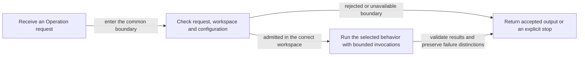
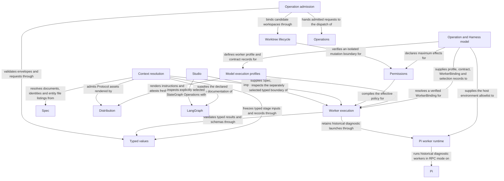

# Harness

## Purpose

The Harness Module admits every operation request at one common boundary, then prepares and runs each worker the request needs with a defined task, information and permissions, and checks the result. It also runs configured checks in a separate read-only environment. Other Modules rely on it to execute work without treating an agent answer as permission for unrelated actions.

## Terminology

| Term                                              | Meaning / definition                                                                                                                                                                                                                                                  |
| ------------------------------------------------- | --------------------------------------------------------------------------------------------------------------------------------------------------------------------------------------------------------------------------------------------------------------------- |
| Worker profile                                    | The instructions and maximum tools, workspace and effects available to a kind of worker; a particular job can be narrower.                                                                                                                                            |
| Tool gate                                         | The checks applied inside the agent process before a model-requested tool runs.                                                                                                                                                                                       |
| Worker sandbox                                    | The historical RPC diagnostic/test operating-system boundary, not native Agent isolation: the host filesystem read-only with the developer's secret locations, agent-client state and other worktrees masked, the grant and run directory writable, a private temporary directory and process namespace. |
| Capsule                                           | A temporary workspace containing the documents admitted for one Spec-only worker invocation.                                                                                                                                                                          |
| [Worker](../module.md#terminology)                | Defined in Concorde Framework.                                                                                                                                                                                                                                        |
| [Harness](../module.md#terminology)               | Defined in Concorde Framework.                                                                                                                                                                                                                                        |
| [Context](../module.md#terminology)               | Defined in Concorde Framework.                                                                                                                                                                                                                                        |
| [Grant](../module.md#terminology)                 | Defined in Concorde Framework.                                                                                                                                                                                                                                        |
| [Snapshot](../module.md#terminology)              | Defined in Concorde Framework.                                                                                                                                                                                                                                        |
| [Operation](../module.md#terminology)             | Defined in Concorde Framework.                                                                                                                                                                                                                                        |
| [Host](../module.md#terminology)                  | Defined in Concorde Framework.                                                                                                                                                                                                                                        |
| [Graph](../module.md#terminology)                 | Defined in Concorde Framework.                                                                                                                                                                                                                                        |
| [Candidate](../module.md#terminology)             | Defined in Concorde Framework.                                                                                                                                                                                                                                        |
| [Worktree](../module.md#terminology)              | Defined in Concorde Framework.                                                                                                                                                                                                                                        |
| [Spec context](context.md#terminology)            | Defined in What information a worker receives.                                                                                                                                                                                                                        |
| [Implementation context](context.md#terminology)  | Defined in What information a worker receives.                                                                                                                                                                                                                        |
| [Resource context](context.md#terminology)        | Defined in What information a worker receives.                                                                                                                                                                                                                        |
| [Task context](context.md#terminology)            | Defined in What information a worker receives.                                                                                                                                                                                                                        |
| [Protocol binding](../spec/values.md#terminology) | Defined in Identities and versions.                                                                                                                                                                                                                                   |

## Usage

Every public operation request first passes [Operation admission](host.md): it checks the request
and configuration, binds the worktree the request was started in, relays a consumer-project mutation
from primary into a host-created candidate, and hands the admitted request to the
[Operations dispatch](../operations/module.md). The request's result envelope always keeps
admission, domain and execution outcomes apart. Source-primary mutations instead stop for a fresh
catalog-free writer in an assigned candidate and a separate sibling tester; relay is not a
self-maintenance exception.

A calling workflow gives the Harness Module one worker job or one configured check. Harness fixes the allowed
inputs and permissions, starts the job, and validates its matching result before the caller proceeds.
Spec-only workers receive specification information; code access is a separate phase-specific choice.

For example, a planner can describe a change without reading source. A programmer later receives
accepted tasks and allowed code files; a reviewer receives read-only inputs in a fresh conversation.
The workers share accepted artifacts, not all of each other's knowledge or authority.

Failures, cancellation, time limits and changed inputs stop dependent execution. Authorized code
edits can remain after failure. Native file/network/credential limits are prompt-level policy,
not OS confinement; native tool/delegation ceilings are separately enforced. In particular, a native
programmer's shell is not confined to its intended file paths by Concorde.

Configured checks and tester commands use an actual OS read-only governing-filesystem boundary,
issued writable scratch and process-tree cleanup. That boundary does not define a finer read,
network or credential policy. Historical low-level RPC diagnostic/test workers have their own Linux
sandbox and tool/path gate with fixed masks and a shared network; they are not native fallback paths.
Read [execution](execution.md) before relying on any of these distinct guarantees.

## Design

Agents owns canonical native Agent definitions and their task contracts, intended effects, workspace,
tools and timeout. Harness owns their execution and binding mechanisms. The Model execution profiles service combines the authored Agent Spec and Python profile into a reproducible
WorkerBinding, using fresh instructions supplied by [Distribution Module](../distribution/module.md). The Typed values layer validates the
contracts and handoffs; knowing a type or worker name does not itself grant access. This keeps
instruction identity separate from the project knowledge a worker may read.

Context resolution freezes the selected Module's complete document units, implementation names,
external references and admitted task artifacts. Both reading and metadata source bytes participate
in identity. The Permissions compiler intersects declared effects with host authority for that phase; metadata
never becomes writable merely because a programmer can change the implementation it names.
A changed binding, source member or reference selection requires a fresh context.

Native execution projects a fresh file-Agent into invocation-owned scratch, binds public native
preflight and returns the exact call. Authored workflows order multiple terminal calls. Finite Host
services stage proposals and accept only independently correlated terminal results with current
inputs. No Python provider stack waits for a model. Native intended file scope is prompt-level;
scratch is not a lifecycle ledger or proof of exclusive reads. Historical `WorkerExecutor` and
Pi-RPC sandbox utilities remain diagnostic/test support, never a public fallback.

Common request, workspace and configuration admission runs directly for all public capabilities.
Its stable identity and domain checks are independent of whether a capability is a native Agent,
Workflow or deterministic Host service.

Only explicitly selected StateGraph Operations use LangGraph. Studio inspects the same genuine
[terminal Agent Operation](execution-reference.md#host-operation-node-operation-node), with no
capability mirrors. Its trusted embedding supplies a native service; default inspection does not
launch a worker. Worktree lifecycle still binds candidate identity and progress; no model response
alone advances it or widens another invocation's authority.

### Flow overview

This conceptual view shows the common boundary around an Operation, not its executable node
catalog. Admission fixes which request may run and where; each worker then receives its own
narrow grant. A successful process exit alone is not an accepted result. The Host preserves the
difference between a business stop, invalid output and execution failure when reporting back.

The [admission contract](admission.md#operation-execution-boundary) defines request and workspace
checks. The [optional Operation Graph Spec](execution-reference.md#host-operation-node-operation-node)
defines the explicitly selected typed State boundary. Native workflows, not a batch Graph, order
reviewers and domain decisions without granting one item another item's context.

## Relationships

Each invocation is the unit of work this Module executes. Its Spec context is the selected
Module's complete one-level owned/reference context; its implementation context is the
Protocol-defined set of files the Module's own entities bind — every phase sees their names, only
the programmer and code reviewer see authorized contents; its resource context is
its worker's tools together with the Module's declared external references, whose readable files
reach the planner, task author, programmer and code reviewer read-only; its task context is the
task, constraints, stage artifacts and lifecycle metadata. The frozen closure is never empty and its
identity covers every admitted byte.

Canonical Agent definitions bind Agent Specs, task contracts, intended scope, tools and limits.
Fresh preparation and native preflight bind the actual call; independent admission checks terminal
results. File policy and terminal tool ceilings remain distinct. Authored native workflows own
public cognitive control flow; optional StateGraph composition is explicit. Historical RPC utilities
retain their diagnostic sandbox contract without confining native Agents.

## Reading by responsibility

The following topics explain how to use each Harness boundary. Their exact requirements and
acceptance cases belong to the Harness Module's [requirements](requirements.md) and
[scenarios](scenarios.md), rather than to the topic pages.

### Context freezing

Realized by `resolve_context` and its recheck; see
[context](context.md).

### Domain Agent profile and Harness binding

Realized by `worker_profile` and `resolve_worker`; see [Agents and Harnesses](agents-and-harnesses.md)
and [runtime values](runtime-values.md).

### Permission compilation

Realized by `compile_policy` and the worktree boundary check; see [permissions](permissions.md).

### Operation admission

Realized by `run_operation`, `operation_graph_nodes`, `bind_worktree` and `json_main`; see
[host](host.md) and the [admission contracts](admission.md).

### Worker execution

Native preparation, proposal staging and independent admission are realized by the native Host
services and authored Pi workflows. `launch_worker`, `WorkerExecutor` and Pi-RPC are historical
diagnostic/test support only; see [execution](execution.md) and [host](host.md).

The deterministic check executor's read-only filesystem, scratch, result, unavailable-backend and
process-lifetime cases are defined in [Harness scenarios](scenarios.md#scenario.harness.check-read-only).
The Pi RPC client, worker launch, tool gate and terminal worker scenarios are defined in
[Harness scenarios](scenarios.md#scenario.harness.pi-worker-launch). See [every tool call is
gated](requirements.md#req.harness.worker-gate), [a capsule grants only its own snapshot](requirements.md#req.harness.capsule-closed),
[closed process inputs](requirements.md#req.harness.process-inputs-closed), [workers cannot delegate](requirements.md#req.harness.delegation-one-level) and [only the submitted result leaves the
worker](requirements.md#req.harness.worker-single-result).

### Typed value validation

Realized by `typed`, `validate_typed`, `json_schema`, `decode`, `canonical` and the schema
evaluator; see [typed values](typed-values.md).

## Local collaboration agreements

These entries describe the exact direct providers registered for this Module. They state
relied-upon behavior from this Module's perspective without importing another Module's documents.

### Spec

The [Spec Module](../spec/module.md) owns the project Spec model: the pinned Protocol binding, the explicit registry, structural validation, stable-ID file-set queries and honest initialization.

Admit the registry and resolve identities, document collections, entity file listings and file ownership.

This collaboration applies when freezing any context kind or checking a target, focus or binding.

- [Resolve the full one-level context and own implementation bindings; rebuild snapshots after changes](../spec/contracts.md#registry-stable-id-spec-context-queries)

### Operations

The [Operations Module](../operations/module.md) owns explicit StateGraph composition and the compatibility capability inventory and dispatch that route an admitted request to its business provider. Canonical Agent definitions remain owned by [Agents](../agents/module.md).

Admit only registered public entries and declared composition, then dispatch finite Host services or prepare the selected native Agent/workflow.

This collaboration applies when admission executes an admitted capability request or checks a collaborator against its caller's declared composition.

- [Capability inventory and composition](../operations/execution-reference.md#operations-operation-registry); refuse unknown and non-public entries with `unknown_operation` and undeclared composition with `undeclared_operation`, never routing by name outside the catalog.
- [Finite dispatch and native preparation](../operations/execution-reference.md#operations-behavioral-ownership-and-composition-limits); adopt the admitted Host service's typed output or independently accepted native result, or a relayed candidate's complete envelope, as the invocation's result. Preparation alone is not completion; no dispatch Graph runs under these public capabilities.

### Distribution

Build authored projections, install and configure owned integrations, provision the managed runtime and keep a source checkout's own projections bound to the worktree that built them.

Render Agent instructions and Protocol assets from authored sources and attest their freshness.

This collaboration applies when resolving an Agent binding, admitting the Protocol rule bundle,
or preparing consumer worktree execution. Harness admits the explicit invoking package, bootstraps
only its newly created consumer candidate, and verifies/reuses local installations on resume and
installed entry admission. It relies on Distribution's ownership-preserving complete-install
[service](../distribution/contracts.md#local-installation-service); failure blocks before a worker,
retains the candidate and requires explicit installation recovery. The host keeps the target
quiescent; receipt verification supplies no task, Protocol acceptance or lifecycle authority.

- [Load only fresh, source-traceable instructions and pinned rule assets](../distribution/build.md)

## Unresolved information

The sandbox, credential-copy and placeholder limitations below refer to retained low-level RPC
diagnostic/test utilities, not to native Agent confinement. Native file/network/credential policy
is cooperative; configured-check/tester isolation is the separate actual OS boundary.

- Resource context carries only the Module's declared external references and each worker's
  profile tools today: no worker admits an Operation or Tool reference beyond them, so those
  contracts are not yet snapshot fields. Materializing them in the snapshot record, with their
  identities in the context digest, is pending implementation work that must not widen any grant.
- The historical RPC diagnostic/test worker sandbox does not restrict the network, because Pi must reach its model provider.
  Anything the process can read, including the workspace, can therefore leave the sandbox over the
  network. Closing this needs a private network namespace in which only the credential proxy
  below is reachable; that is pending.
- The provider credentials the worker itself uses are readable inside the sandbox: the run
  directory holds the copied `auth.json` and `models.json`, and the Pi process environment carries
  the provider key variables, which the gate unsets only for each shell command. A shell command
  can read that copy and, with the shared network, send it out. The pending credential broker
  keeps the real credentials on the host: a loopback proxy that adds the authorization and
  performs the OAuth refresh, with the run's `models.json` pointing Pi at the proxy under a
  placeholder key, so no real credential enters the sandbox.
- The sandbox's secret masks are the fixed list `MASKED_HOME_PATHS`, not a discovery of every
  credential a developer keeps; a secret stored elsewhere under the home directory stays readable.
  Toolchains under the home directory stay readable on purpose, so workers can run tests.
- A pending write entry becomes an empty placeholder file or directory in the candidate before
  the launch and is removed only if the worker left it empty; a placeholder is the price of an
  exact write boundary for a path that does not exist yet.
- The sandbox requires Linux with a trusted system bubblewrap and refuses every such diagnostic worker launch
  elsewhere; there is no unconfined fallback and no backend for another platform yet.
- A relayed consumer candidate executes only its own verified installation and managed interpreter.
  Source candidates require their own fresh private build and local environment instead; no host
  installs an ambient shim into a source checkout. Durable usage, results and logs remain only in
  primary-owned `.concorde/runs/`, with candidate source/runtime provenance. The requesting session
  receives the result and diagnostics; the optional Studio surface does not mirror relay as a public capability graph. A host interrupt
  gives the launcher thirty seconds to cancel its worker before killing it. Missing or stale resumed
  installation requires explicit supported installer recovery, not silent reinstallation or fallback.
- Checks run by `run_checks` use the configured-check executor, but the worker receives only the tail
  of each check's log; whether a longer or structured report is needed is unresolved.

The Harness implements Protocol 10 ownership/reference resolution and independently versioned context handoffs. See [context migration status](context.md#implementation-status).
Referenced definitions remain read-only and do not enter local entity/file grants.

## Precise specifications

The Harness Module owns the exact obligations and interface details in [requirements](requirements.md), [scenarios](scenarios.md).
These companions are part of the same complete Module specification, not separate topic owners.

### Agents

[Agents](../agents/module.md) owns callable Agent definitions and interaction. This Module consumes
those definitions rather than maintaining an Agent catalog or behavioral copy. It preserves the
Agent's family, scope and frozen grant and refuses missing or stale bindings; domain artifact
acceptance and execution mechanisms remain with their existing owners.
