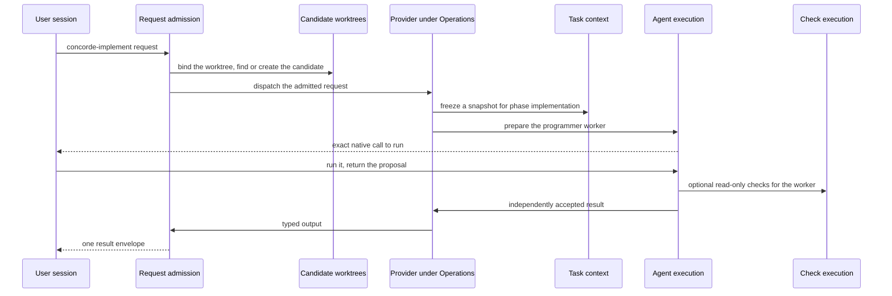
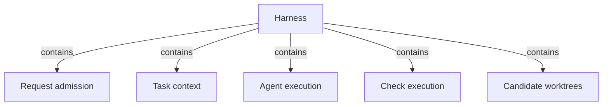

# Harness

## Purpose

The Harness is how Concorde configures and runs a bounded model task. Every capability request
enters through it; it decides, from the Specs, what each worker may know and touch; it runs each
model step as a fresh worker and accepts the result only after the Host has checked it; it runs
deterministic checks in a read-only sandbox; and it keeps every change in its own candidate
worktree. The providers under Operations rely on it for all of this, so that none of them has to
implement request checks, context, execution or isolation on its own. The Harness does not decide
what a capability does, does not define the callable workers (Agents does), and does not compute
the Spec boundary sets (Spec does). It is at an early stage: it records the Protocol's boundaries
exactly, but enforces only part of them, as the Design section states.

## Terminology

| Term | Definition |
| --- | --- |
| [Capability](../vocabulary.md#concept.concorde.capability) | |
| [User session](../vocabulary.md#concept.concorde.user-session) | |
| [Host](../vocabulary.md#concept.concorde.host) | |
| [Worker](../vocabulary.md#concept.concorde.worker) | |
| [Context](../vocabulary.md#concept.concorde.context) | |
| [Boundary](../vocabulary.md#concept.concorde.boundary) | |
| [Evidence](../vocabulary.md#concept.concorde.evidence) | |
| [Context snapshot](context/module.md#concept.context.snapshot) | |
| [Grant](context/module.md#concept.context.grant) | |
| [Workflow](execution/module.md#concept.execution.workflow) | |
| [Candidate](worktrees/module.md#concept.worktrees.candidate) | |

The Harness defines no words of its own; each child defines the words of its own interface.

## Usage

Nobody calls "the Harness" as such. The user session calls a capability, and the Harness's five
parts handle it in turn. Following one `concorde-implement` call for Module `module.checkout`
shows how they fit:

1. **Request admission** reads the request, checks its type, the stored configuration and the
   worktree, and, because implementing is a mutation, runs it in the change's candidate.
2. The **Implementation** provider under Operations asks **Task context** to freeze a context
   snapshot of `module.checkout` for phase `implementation`: its Spec documents, the names and
   digests of its implementation files, its external references, the accepted task list and the
   workspace facts.
3. **Agent execution** prepares a fresh programmer worker: a capsule with the snapshot, the
   worker's instructions and tool list. The user session's Pi runs it; the worker's submission is
   only a proposal until the Host accepts it against current inputs.
4. The worker may run the Module's configured checks through **Check execution**, which runs them
   with the project mounted read-only.
5. **Candidate worktrees** records the change's progress and the run in the primary worktree.

Other capabilities use a subset: `concorde-validate` needs no worker, `concorde-plan` and the
reviews run a workflow of several workers, and the read-only capabilities run where they are
started instead of in a candidate.

## Design

**Specs decide, the Harness records and checks.** Concorde's central safety property is that
nothing a model says changes what counts as accepted. The Harness gets there by separating three
things: what a worker may know (a context snapshot frozen from the Spec's boundary sets), what it
may do (its tool list and grant), and what counts as done (a result the Host accepted after
rechecking the snapshot). A model step can only propose.

**Why five parts.** Each part changes for a different reason: the request protocol and its
envelopes (Request admission), the mapping from Specs to worker inputs (Task context), the way
models run on Pi and optional LangGraph Graphs (Agent execution), operating-system sandboxing
(Check execution), and the Git lifecycle of changes (Candidate worktrees). Keeping them apart lets
one change without touching the others, and lets a task on one part receive a small boundary.

**What is enforced today.** The Spec Protocol defines what a task may read and write. The Harness
freezes those sets exactly, but enforces them only partly:

| Boundary | Enforced today by | Not enforced |
| --- | --- | --- |
| Which capability runs, with which configuration, in which worktree | Request admission, always | — |
| A worker's tools and the ban on delegation | the worker's native definition and its Pi session | — |
| What a worker reads | nothing at the operating-system level; a capsule holds only the granted copies and is the worker's working directory | a worker's file tools can name paths outside its capsule |
| What the programmer writes | its instructions name the intended files | its edits and shell are not confined to them |
| Network and credentials of a worker | — | not restricted |
| What counts as a result | independent Host acceptance with a recheck of the snapshot | — |
| Configured checks and tester commands | an operating-system read-only filesystem with private scratch | reads, network and credentials |

A worker that ignores its instructions can therefore read or write more than its grant, but its
result is still refused if any input it was given changed, and every change stays inside a
candidate until the developer delivers it.

The Harness binds only its Python package markers; all behaviour is bound by its children.

## Relationships

**Request admission** is the single entry of every capability request. The Harness relies on it to
refuse malformed requests, requests from inside a worker, stale builds and configuration
mismatches before any provider runs, to run mutations in a candidate, and to return one envelope
that keeps refusals, business outcomes and execution failures apart.

**Task context** turns the Spec's boundary sets into a context snapshot for one Module and one
step, holds the worker profiles, and compiles grants. The Harness relies on it to give every worker
exactly its Module's context and, outside code phases, only the names of implementation files, and
to reject any result whose snapshot no longer matches the repository.

**Agent execution** prepares and runs the native Pi workers and workflows, selects their models,
and accepts their results independently of what the model claims. It also owns the optional
LangGraph Graph boundary. The Harness relies on it to make
every model step a fresh, terminal worker whose submission is a proposal.

**Check execution** runs the project's configured checks and a tester's commands with the project
mounted read-only and a private scratch directory, and exports their evidence. The Harness relies
on it for the only operating-system isolation that applies to project code today; when that
isolation is unavailable, checks do not run at all.

**Candidate worktrees** creates candidates, keeps each change's status and every run record in the
primary worktree, and answers which worktree a request is in. The Harness relies on it so that a
change never touches the primary checkout before delivery and its evidence survives the candidate.
