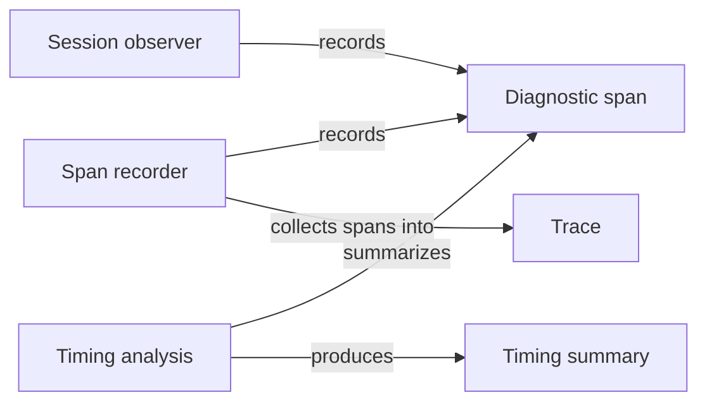

# Observation

## Purpose

Observation measures how long Concorde's work takes, without influencing it. Host code wraps a piece
of work, such as admitting a request or freezing a context, in a diagnostic span; the developer's
Pi sessions load a passive observer that records turns, model requests, tool executions, waits and
compaction; and a maintainer summarizes either kind of record to find where time went. Request
admission relies on it to time every request, the other Harness parts time their own steps with it,
and the Pi session Module loads its observer into the user session and the Task subagents.
Observation records durations, statuses and identities, never content. It is not evidence: nothing
it records decides an outcome, proves that a check or a model ran, or grants anything. It does not
choose where a trace is stored, keeps no usage or cost accounting, and sends nothing over the
network.

## Terminology

| Term | Definition |
| --- | --- |
| Diagnostic span | One bounded timing record of a piece of runtime work, with its duration, status and correlation identities and no content. |
| Trace | The bounded set of diagnostic spans recorded for one top-level run of the Host or one Pi session. |
| Timing summary | The analysis of a set of spans that reports the time covered per process and what is known about context use, without message bodies. |
| [Host](../../vocabulary.md#concept.concorde.host) | |
| [User session](../../vocabulary.md#concept.concorde.user-session) | |
| [Task subagent](../../vocabulary.md#concept.concorde.task-subagent) | |
| [Evidence](../../vocabulary.md#concept.concorde.evidence) | |

A span belongs to a trace; a timing summary reads spans. Evidence is the root's word for recorded
results that decide something, and the Design section explains why a span is never one.

## Usage

<a id="concept.observation.diagnostic-span"></a><a id="concept.observation.trace"></a>

**Timing Host work.** Host code marks a unit of work as a span, by name, for example
`admission.request` or `context.resolve`. While a trace is open, each span records when it
started, how long it took on a process-local monotonic clock, whether it ended `ok`, `error`,
`cancelled` or `incomplete`, which span it is nested in, and the identities that correlate it with a
request, such as the invocation and change identities. A span may also carry a few counts, such as
tokens or bytes, when the work reported them. When no trace is open, marking a span does nothing,
so timing costs almost nothing outside an observed run.

**Keeping a trace.** Whoever runs a top-level unit of work opens a trace and supplies a sink: the
function that receives the finished trace exactly once. Request admission opens one trace per
request, and its sink writes the trace beside the request's
run record in the primary worktree. A standalone process, such as a test runner, may instead name
an existing private directory in the environment variable `CONCORDE_DIAGNOSTIC_TIMING_DIR` to
receive its traces as files. Observation never decides a location on its own.

**Observing a Pi session.** The passive observer is a Pi extension. Loaded into the user session or
a Task subagent, it records the session's lifetime, each turn, each model request, each tool
execution, waits for the developer, compaction, and the start and end of asynchronous child runs,
as session entries of the custom type `concorde.timing.v1`. It also records the context figures Pi
reports, such as input, cache and reserve tokens, keeping any figure Pi did not report unknown. The
user session may add a few closed facts, such as "a handoff happened for a resource reason"; they
are recorded as diagnostic facts, never as permissions. The observer adds no tool, changes no
prompt or setting and starts no session.

<a id="concept.observation.timing-summary"></a>

**Summarizing.** A maintainer runs

```text
python3 scripts/development/analyze-timing.py path/to/session.jsonl
```

on a Pi session file or a pi-subagents event log and receives a timing summary: the seconds covered
per process, the summed span time (explicitly not elapsed time), the latest known context figures,
the number of tool calls still open and whether the telemetry was complete. When the input holds no
observer spans, the summary falls back to the timestamps of Pi's own tool events and says so. No
message body, prompt or tool output appears in the summary.

**When recording fails.** A failing sink, a full trace or an observer that cannot append its entry
marks the telemetry incomplete and prints one `CONCORDE_TIMING_INCOMPLETE` line on standard error.
The work being timed continues exactly as it would have without Observation. A figure that was not
reported stays unknown, never zero.

## Design

<a id="realization.observation.spans"></a>

**Passive by construction.** A timing system that can fail the work it measures invites someone to
make it matter. The span recorder therefore swallows its own failures and has no path to raise into
the caller, retry the work or change a status, and no other Harness part reads a span to decide
anything. This is also why a span is never evidence: evidence must come from what ran and be bound
to its inputs, while a span only reports that some code believed it was running for some time.

**No content, only shape.** Spans keep names, durations, statuses, identities issued by the Host and
a closed set of counts. They never keep prompts, source text, tool output, environment values,
command arguments or exception messages, and labels that are not Host-issued identifiers are
dropped. Diagnostics are often shared to ask for help, and a record that cannot hold content cannot
leak it.

**Clocks are compared only within a process.** Durations come from a monotonic clock that is only
meaningful inside one process. The analysis unions the intervals of each process separately and
never subtracts timestamps of different processes; wall timestamps are kept only to correlate. It
also never presents summed parallel time as elapsed time, and it reports model thinking time and
wall time as unknown, because no record measures them.

**The caller chooses the sink.** Observation uses no other Module, so every part of Concorde can use
it without creating a dependency cycle, and so it cannot write where it has no authority. The
Host's traces reach the run directory only through the sink Request admission supplies;
`src/concorde/harness/timing.py` still locates that directory itself, and that persistence moves
into admission's sink so that the recorder depends on nothing.

<a id="realization.observation.session-observer"></a>

**The session observer is an extension, not a hook into Concorde.** It listens to Pi's own session
events and writes Pi session entries, so the timing of a user session survives in the session file
the developer already has, and the observer works the same in the user session and in a Task
subagent. It identifies child runs and parent sessions only by digests.

<a id="realization.observation.analysis"></a>

**Analysis is offline.** The analysis script reads a file and prints a summary. It runs no session,
reads no project file and needs no configuration.

<a id="realization.observation.tests"></a>

The tests of this Module drive the recorder with nested, concurrent, failing and cancelled work and
check the privacy of the analysis; they do not measure real performance.

**Open questions.** Host spans and session spans are correlated only through the invocation
identities a span carries; there is no merged view of one request across the Pi session and the Host
processes.

## Relationships



The **span recorder** is the Python library the Host's code calls; the **session observer** is the
Pi extension; the **timing analysis** is the offline summary. They share one span shape, so one
analysis can read both.

<a id="consumers"></a>

Observation uses no other Module and has no children. Its consumers rely only on the meaning of a
[diagnostic span](#concept.observation.diagnostic-span): Request admission supplies the sink for
each request's trace and so decides where the Host's spans are kept, the other Harness parts mark
their own steps as spans, and the Pi session Module loads the session observer into the sessions it
configures. None of them may treat a span as evidence or let its absence change an outcome.
