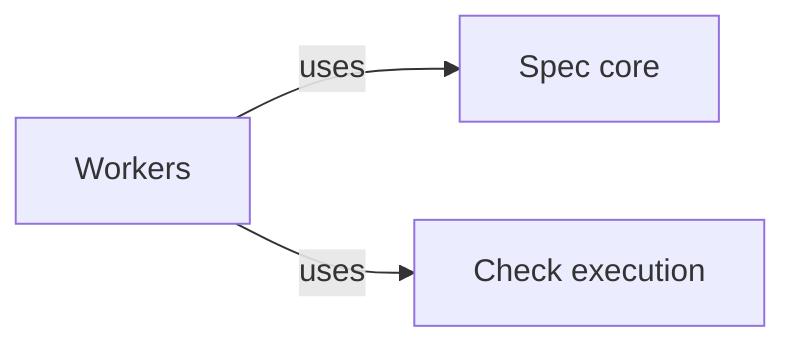
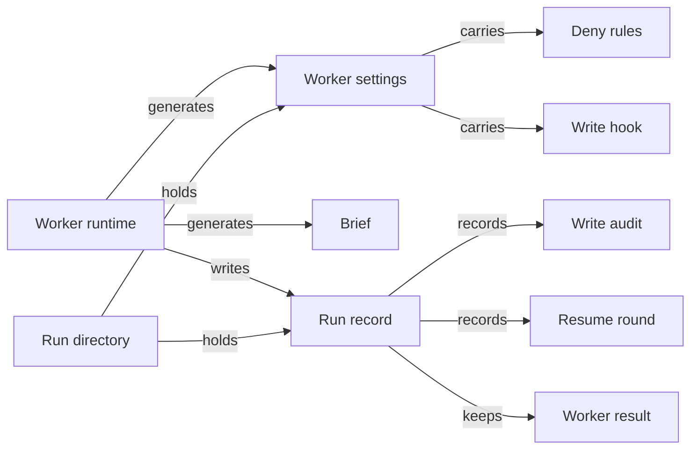
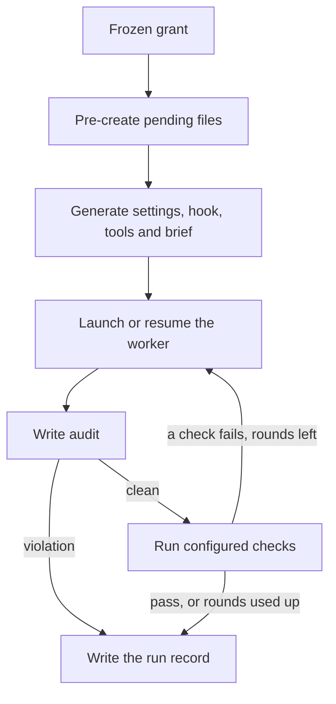

# Workers

## Purpose

Workers runs one headless Claude Code worker for one task under one frozen grant, and turns what
happened into a run record the Operation host can trust. It generates the worker's settings, brief
and tool list from the grant, launches the worker in its own run directory with a clean
environment, audits the task worktree against the grant after every round, runs the configured
checks outside the worker, resumes the same worker session when checks fail, performs the deletions
the worker proposed, and records everything. Operation hosts rely on it for every worker they
start. Workers does not compute the grant, which comes from the Spec core, does not choose the task
type or write the task-specific part of the brief, which belong to the Operation, never commits
and never judges whether the worker's work is correct. Its boundary guards against scope drift and
mistakes, not a malicious worker, and it supports only Claude Code. None of its code exists yet,
so everything here is the design its implementation must follow.

## Terminology

| Term | Definition |
| --- | --- |
| Worker settings | The Claude Code settings file the host generates from a grant, carrying the Bash sandbox, the deny rules and the write hook of one worker run. |
| Deny rules | The `permissions.deny` entries of the worker settings that forbid the file tools every path the grant does not make readable or writable. |
| Write hook | A small PreToolUse hook on Edit and Write that denies every path outside the grant's `rw` list and explains the denial. |
| Brief | The prompt a worker receives: the Operation's task instructions followed by the grant's `rw`, `ro` and `names` lists as absolute paths and the rules of its boundary. |
| Worker result | The structured answer a worker ends with, validated against a fixed schema, reporting its status, what it did or could not do, its evidence and the deletions it proposes. |
| Write audit | The host's comparison, after each round and outside the worker, of the task worktree's changes with the grant's `rw` list. |
| Resume round | One continuation of the same worker session with the failures of the configured checks, started by `claude -p --resume`. |
| Run record | The host's durable record of one worker run: its grant and context identity, settings, transcript path, audits, checks, rounds and result. |
| Run directory | The directory `.concorde/runs/<run-id>/` of the primary worktree that holds one run's record, generated configuration and the worker's private state and working directory. |
| [Worker](../../vocabulary.md#concept.concorde.worker) | |
| [Task type](../../vocabulary.md#concept.concorde.task-type) | |
| [Boundary](../../vocabulary.md#concept.concorde.boundary) | |
| [Evidence](../../vocabulary.md#concept.concorde.evidence) | |
| [Escalation](../../vocabulary.md#concept.concorde.escalation) | |
| [Grant](../../spec-tooling/spec/module.md#concept.spec.grant) | |
| [Context identity](../../spec-tooling/spec/module.md#concept.spec.context-identity) | |
| [Configured check](../checks/module.md#concept.checks.configured-check) | |
| [Check result](../checks/module.md#concept.checks.check-result) | |

Start with the grant and the run directory: the worker settings, the deny rules, the write hook and
the brief are all generated from the grant into the run directory, and the write audit, the resume
rounds and the run record describe what happened there.

## Usage

The caller is an Operation host that has already opened a task worktree, chosen the task type and
the Modules, and asked the Spec core for the grant. It calls Workers with the task worktree, the
frozen grant and its context identity, the task instructions for the brief, the configured checks
to run after the worker, and the run's limits. Workers returns the run record, whose status is
`ok`, `blocked` or `failed`, with the worker result kept verbatim beside the host's own evidence.

### A normal run

Take an `implement` task for one Module whose grant makes `src/shop/cart.py` and a pending
`src/shop/discounts.py` writable (`rw`), the Module's Specs readable (`ro`), and another Module's
`src/shop/pricing.py` visible by name only (`names`).

1. The host creates the **run directory** `.concorde/runs/<run-id>/` in the primary worktree, even
   when the task worktree is elsewhere. It holds the host-only `control/` directory (settings, hook,
   grant, brief), the worker's `config/` (`CLAUDE_CONFIG_DIR`, with a copy of the user's
   credential), `home/` (`HOME`) and `work/`, the worker's working directory. `TMPDIR` is a short
   private directory under `/tmp`, removed when the run ends. The run directory is ignored by Git.
2. It generates the worker settings, the tool list for the task type and the brief.
3. It creates `src/shop/discounts.py` as an empty file, because a worker can write only files that
   exist and a new undeclared file is exactly what the boundary forbids.
4. It launches `claude -p` in `work/` with `bypassPermissions`, the worker result schema, no MCP
   servers and a cleared environment, and waits for the structured result.
5. It audits the task worktree: every change since launch must be in `rw`.
6. It runs the configured checks on the task worktree through Check execution.
7. If a check fails, it resumes the same session with the failures and repeats steps 5 and 6, up to
   three rounds by default.
8. It performs the deletions the worker proposed, writes the run record and returns it.

The **worker settings** are the only configuration the worker receives, because its
`CLAUDE_CONFIG_DIR` is fresh. They hold three layers derived from the same grant. The **deny rules**
list, for the file tools, every task-worktree path the grant leaves out (Read and Edit denied), every
`ro` and `names` path (Edit denied, and Read too for `names`), a single rule for each directory with
no granted file below it, the primary worktree outside this run's directory, `.git`, `~/.claude` and
the run's `control/` and `config/` directories. Deny rules still apply in `bypassPermissions`, and
Grep leaves denied files out of its results. Claude Code also applies the `Read` deny rules to the
Bash sandbox, so a denied path is hidden from Bash as well; this is why the rules never cover system
directories, the runtime paths or the run's own directories. The **write hook** makes the `rw` list the exact write
allowlist: it denies any Edit or Write of another path with a reason that names the path's level,
for example that an undeclared file must first be declared pending by a `specify` task, and it says
nothing about `rw` paths. It never governs reads. The Bash sandbox denies reading the task worktree
and `$HOME` except the `ro` and `rw` files and the runtime paths the Operation configures, allows writing
only the `rw` files and the run's `work/`, `home/` and temporary directory, allows no network domain and ignores
requests to run a command unsandboxed. `names` files are readable by no tool; the worker learns
them only from its brief.

The **brief** is the worker's only instruction; `CLAUDE.md` files, auto memory and user settings are
disabled. The Operation supplies the task instructions. Workers appends the boundary: the `rw`, `ro`
and `names` lists with absolute paths in the task worktree, because the worker's working directory
is not the worktree; the rule that it cannot delete files and must propose deletions in its result;
the warning that a file Bash creates outside the `rw` paths is silently lost; and the statement that
a read denial means the path is outside its grant.

Every worker ends with a **worker result** validated by `--json-schema`: `status` (`ok`, `blocked`
or `failed`), a summary, the problem it could not solve, what it tried, evidence items, options, a
recommendation, whether the problem blocks the task, its impact, and the deletions it proposes. A
`blocked` or `failed` result is the worker's [escalation](../../vocabulary.md#concept.concorde.escalation)
to the host. The exact contract is in [the worker result contract](contracts.md).

The **write audit** runs read-only Git in the task worktree after every round and compares every
tracked change and untracked file since the snapshot taken before launch with the `rw` list. A
change outside `rw`, or a deleted file, is a violation: the run ends `failed` with every violating
path as host evidence, no resume round follows, and the worktree is left as it is for the main agent
to inspect. The host never reverts or commits it.

A **resume round** happens only when the worker ended `ok`, the audit was clean and at least one
configured check failed. The host sends each failing check's identity, exit code and log tail to
`claude -p --resume <session>` and keeps the new session identifier that every resume returns. A
worker that reports a Spec gap or any other `blocked` or `failed` result is never resumed, and
neither is a run with an audit violation: those go to the main agent. When the rounds are used up
and a check still fails, the run ends `failed` with the last check results.

The **run record** is written for every run, including a refused launch. It holds the grant and its
context identity, the digests of the settings and brief, the tool list, the transcript path and
session identifiers, each round's audit and check results with log paths, the worker's stderr
tail, the worker result verbatim, the deletions performed and the host's final status with its
error codes. The host adds deterministic evidence and never restates a worker's claim as a fact.
Delivery later collects run records into a task's evidence.

### Failures and repeat runs

Host failures use the same record with status `failed` and an error code: a grant that is missing
or unreadable, a run directory that a deny rule would cover, a launch error, a timeout (the whole
process group is killed), a missing or invalid worker result, an audit violation, or checks that
cannot run. Every call starts a new run with a new run directory; a failed run is never resumed by
a later call. The exact codes, layout and command lines are in [the run mechanics](launch.md), and
the testable behaviour in [the scenarios](scenarios.md).

## Design

The worker is untrusted in the sense that its claims are proposals: the host alone reads Git,
audits, runs checks and records. That is why the audit, the checks and the deletions run in the
host after the worker has ended, and why the run record separates the worker result from host
evidence.

The boundary has three layers because each layer alone was shown to fail in the spike against
Claude Code 2.1.280. The Bash sandbox governs only Bash and its children; with it alone, Read
returned ungranted files and the worker's own credential, and Edit changed a read-only Spec. Deny
rules alone confine reads and known files, but cannot stop a Write that creates a new undeclared
file, because a deny rule always beats an allow rule and so "only these files are writable" cannot
be expressed. The write hook closes exactly that gap and nothing else, so it stays small; reads are
left to the deny rules, which also make Grep filter results instead of failing.

The worker runs in `bypassPermissions` because in `-p` mode `dontAsk` denies every Edit or Write
outside the working directory even when an allow rule matches, and the working directory must not
be the worktree: Claude Code adds its working directory and every `--add-dir` to the Bash sandbox's
readable and writable set, which would defeat per-file confinement. The brief therefore uses
absolute paths. The run directory must not lie under any path a deny rule names, since a deny rule
on a parent silently disables the whole run; the host refuses to launch in that case.

Pending files are pre-created because the worker must never create a file the grant did not
declare, and the Bash sandbox can only grant writes to files that exist. For the same reason a
worker cannot delete: it proposes deletions and the host performs those inside `rw` after a clean
audit. A pre-created file that the worker left empty is removed again, so an untouched pending file
stays pending.

Resume rounds reuse the worker's context, which the spike confirmed fixes a failing check in place;
each resume returns a new session identifier, and the host must continue from the latest one.
Rounds are only for check failures because a Spec gap or a grant violation is a decision for the
main agent or the developer, not something a worker should retry.

`--safe-mode` and `--bare` are not used: they would also disable hooks, including the write hook.
Credentials are a copy of the user's credentials file placed in the run's `config/`; a token in an
environment variable was not tested, and keeping the credential away from the worker entirely is
future work together with the outer sandbox. The limits of this design are stated by the
[Harness](../module.md).

Open questions: whether the Bash sandbox needs read access to the shell snapshots Claude Code keeps
in `CLAUDE_CONFIG_DIR`, which decides whether `config/` can stay unreadable to Bash, is to be
confirmed when the runtime is built; the per-task-type tool lists are the v1 defaults in
[the run mechanics](launch.md#tool-sets) and may change with the Operations that use them.

The **worker runtime** consists of the settings generator (`settings.py`), which turns a grant into
deny rules, the sandbox and the hook registration; the write hook script (`write_hook.py`); the
launcher (`workers.py`), which writes the brief, runs and resumes `claude -p` with its limits and
decides the rounds; the write audit (`audit.py`); and the run directories and records
(`runs.py`). Its tests use a fake `claude` for the host's behaviour and, on request with
`CONCORDE_LIVE_CLAUDE=1`, a real Claude Code worker for what only Claude Code enforces.

## Relationships

The Operation providers, Spec review and Delivery use this Module; it knows none of them. They rely
on the run record and on the rule that a worker's result is kept apart from host evidence.

The **Spec core** computes the [grant](../../spec-tooling/spec/module.md#concept.spec.grant) of a
task type for the bound Modules from the task worktree's Specs, and its
[context identity](../../spec-tooling/spec/module.md#concept.spec.context-identity). Workers relies on
the grant listing every path with its level (`rw`, `ro` or `names`), with ungranted paths omitted,
and on the context identity naming exactly the sources that selected it. Workers never computes or
widens a grant; it receives it frozen from the caller and records its context identity. A grant that
is missing or unreadable is a host failure before anything is launched.

**Check execution** runs the [configured checks](../checks/module.md#concept.checks.configured-check)
on the task worktree in its read-only boundary and returns a
[check result](../checks/module.md#concept.checks.check-result) per check with its log. Workers
relies on checks never changing the worktree and on each result naming its exit code and log.
Workers runs checks only after a clean audit, feeds the failures into the next resume round, and
records every result. When checks cannot run, the run ends `failed` with the check error as host
evidence and no round follows.
