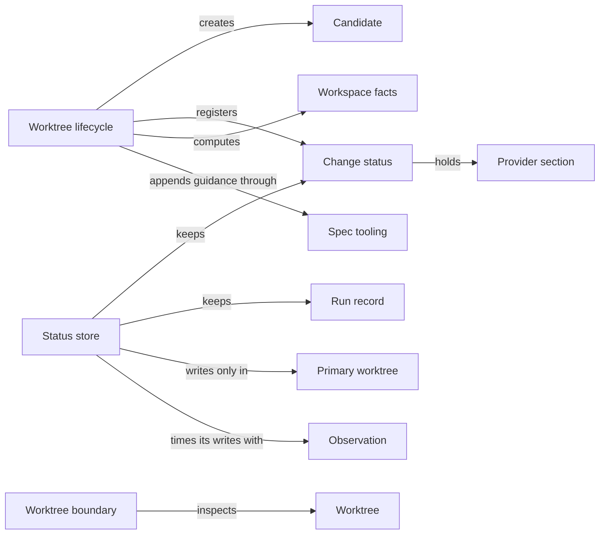

# Candidate worktrees

## Purpose

Candidate worktrees keeps every mutating Concorde task out of the developer's primary checkout. It
creates a candidate worktree for a change from committed history, keeps the change's status and
every run record in the primary worktree where they survive the candidate, and tells the rest of
Concorde which worktree and which change a directory belongs to. Request admission relies on it to
decide where a request runs and to record each run, Task context relies on it for the workspace
facts an Agent call sees, and the providers under Operations keep their own records of a change in
the sections it holds for them. The source user session also uses it to record which Task subagent
currently owns a candidate. It does not decide what a change contains, does not interpret the
providers' records, merges nothing (Delivery does), and is not a sandbox: a worktree separates files,
not permissions.

## Terminology

| Term | Definition |
| --- | --- |
| Worktree | One Git working tree of the project, either the primary checkout or a linked worktree. |
| Primary worktree | The project's original Git working tree, identified through Git's shared repository directory, which holds all durable change status and run records. |
| Candidate | A linked worktree on its own branch, created from a committed base, in which one change is made. |
| Change status | The durable record of one change: its owner and intent, its worktree, its lifecycle position, the Task subagent that owns it, its runs, its cleanup state and the sections its providers keep. |
| Provider section | A named part of a change status that one provider declares with its own typed-value type, which this Module stores and protects but never interprets. |
| Run record | The durable record of one executed capability request: the worktree, commit and input tree it ran on, the runtime and build it used, and its final result envelope. |
| Workspace facts | The observation of where a request runs, namely the current worktree, its change and lifecycle position, and a summary of the other live worktrees, taken only from Git and primary status records. |
| [Developer](../../vocabulary.md#concept.concorde.developer) | |
| [User session](../../vocabulary.md#concept.concorde.user-session) | |
| [Task subagent](../../vocabulary.md#concept.concorde.task-subagent) | |
| [Host](../../vocabulary.md#concept.concorde.host) | |
| [Evidence](../../vocabulary.md#concept.concorde.evidence) | |

A change always has exactly one change status. A candidate is the usual place for its files; a
change may also be registered for the primary worktree when the developer explicitly allows it.
Workspace facts describe a change; run records and provider sections are what survive it.

## Usage

Most callers never use this Module directly. When the user session asks for a mutating capability,
such as `concorde-plan`, from the primary worktree of a consumer project, Request admission asks
this Module for a new candidate and relays the request into it. The user session stays where it is
and receives the candidate's result, including its path and change identity.

**Creating a candidate.** A candidate is created only from the primary worktree, and only when that
worktree is on a branch. The Host makes a new branch `concorde/<uuid>` at the primary's committed
`HEAD`, adds a linked worktree for it in a private temporary directory, copies the primary's
vendored reference checkouts into it without using the network, and registers the change.
Uncommitted edits in the primary are never carried over, so a candidate always starts from a state
someone else can reproduce. In a consumer project the Host also appends a short marked guidance
block to the candidate's `AGENTS.md`, telling a fresh agent session where it is and how delivery
works; the block is removed again from anything that is delivered.

**Change status.** Each change has one status record in the primary worktree only. It records the
change's mode (`operation` for a capability's change, `maintenance` for a change of Concorde's own
source, `direct` for a worktree the developer registered by hand), the task, target Module, focus
and constraints it was created for, the worktree's path, branch and base commit, its lifecycle
position (`phase`, `status`, `outcome`), the Task subagent that currently owns it, the runs that
belong to it, and its cleanup state. A later request for the same change must agree with the
recorded owner: it may omit the task or target and have them restored, but it cannot replace them.
Terminal records stay after the candidate is removed, so the outcome of a change is never lost.

**Provider sections.** Everything else a change needs to remember belongs to the provider that
produced it: Planning's plan, task list and pending gaps, Validation's evidence, Delivery's delivery
and merge records, Issue solving's closing journal. Each provider declares a section by name,
together with the typed-value type its content must satisfy, and reads and writes that section
through the same revision-checked write as the rest of the status. This Module refuses a section
nobody declared or a value of the wrong type, and otherwise treats the content as opaque: it never
decides what a plan or a journal means.

**Run records.** Every executed request has one run record in the primary worktree, even when it
ran in a candidate. Request admission opens it before the provider runs and finishes it with the
final result envelope. The record names the source worktree, branch, commit and exact input tree,
the runtime and build manifest it used, the Pi entry it was selected through when that is known,
and, for a request that was relayed into a candidate, the candidate's own run. Accepted artifacts
and the build manifest are copied into the run directory, so the evidence survives the removal of
the candidate or its scratch files.

**Where a request is.** Given a directory, this Module answers whether it is the root of the
primary worktree, of a linked worktree or of no Git worktree at all, and which change is bound to
it. The workspace facts add a summary of every other live linked worktree: its path, branch, head,
lock state and, when a change is registered for it, that change's identity, target, a task summary
and lifecycle position. All of it comes from Git's worktree list and the primary's status records;
no file inside another worktree is read, so a candidate's draft edits stay invisible from
elsewhere.

**Coordinating Task subagents.** The source user session uses the `status` command of the Concorde
command line to register a worktree as a change, to record which Task subagent (a writer or a
tester) currently owns it, and to release that ownership. These commands record coordination; they
never start a session. Recording a merge the developer made with ordinary Git is Delivery's
business, not this Module's.

**Checking a mutation boundary.** A caller that is about to let an agent change files can require
an isolated linked worktree, refusing the primary unless the developer explicitly allowed it. The
Concorde command line uses this check before it writes a documentation site.

**Errors.** Failures carry stable codes: `workspace_mismatch` when a request does not start at a
worktree root or a change belongs to another worktree, `stale_status` when a status was changed by
someone else since it was read, `missing_change` when a request names no managed change,
`primary_unavailable` when the primary worktree cannot be found, and `invalid_worktree_state` for a
malformed record. None of them is retried automatically; the caller rereads or restores and tries
again. The complete list and the record formats are in [records](records.md).

## Design

**One authority, in the primary.** A candidate can be deleted, renamed or recreated at the same
path, so it cannot hold the only copy of a change's history. Every durable record lives in the
primary worktree, which is located through Git's shared repository directory rather than a
directory name. When the primary cannot be found the operation stops with `primary_unavailable`;
it never creates a replacement record inside a candidate. A candidate holds only scratch files.

**Identity that survives renames but not recreation.** A change has a stable identity. Its worktree
is additionally identified by an incarnation token that the Host writes into Git's private
administrative directory for that worktree when it registers the change. Git deletes the token with
the worktree, so a worktree recreated at the same path, on the same branch and commit, cannot
inherit the old change, while renaming the branch keeps the token and the change.

**Safe concurrent writes.** Several processes write status at once: the relaying process in the
primary, the relayed launcher in the candidate, and the user session's command line. Every write
takes a repository-wide lock and replaces the whole record only if its revision is the one the
writer read; otherwise it fails with `stale_status` and the writer must read again. Nothing is
merged field by field, so a stale writer can never erase a newer provider section or lifecycle
change. Status and run directories are excluded from Git through the repository's local exclude
file, and a write stops if they are ever tracked.

**Why providers keep sections instead of fields.** If this Module understood plans, gaps, delivery
records or Issue journals, it would depend on every provider and every provider change would
change it. A declared, typed, opaque section keeps the one-writer revision check and the primary
authority for everyone, while the meaning stays with the provider. The same reason keeps the
workspace facts to identity and lifecycle: a provider that wants an Agent to see its records
supplies them as its own stage input.

The code still keeps several provider records as fields and interprets them: the change status
code validates Issue blockers and records task gaps, and the status store records manual merges.
Those move to the sections of Planning and Delivery, so that this Module imports neither Issues nor
any provider.

**Inventory without trespassing.** The summary of other worktrees is built from Git's worktree list
and the primary's status records only. Reading another worktree's files would make one change's
draft visible to another and would let a stale or malicious candidate influence a request that
never ran there.

**Nothing local is delivered.** A deliverable snapshot of a candidate is computed in a private Git
index that removes the control paths under `.concorde/` and strips exactly the guidance block the
Host recorded. Guidance markers that were edited or duplicated block the snapshot instead of being
guessed at. The caller's index, the working files and the status record are left untouched. Run
records use the same snapshot as the exact input tree of a run.

**Isolation check.** The worktree boundary check reports the Git identity of a directory (its
repository root, `HEAD`, private and shared Git directories) and whether it is a linked worktree.
It changes nothing and reads no file contents. `src/concorde/harness/worktree.py` holds it today
and is merged into the lifecycle's own worktree identity code, so that one function answers "which
worktree is this".

**Not a sandbox.** A candidate keeps a change's files away from the primary until delivery. It does
not stop a process running in the candidate from reading or writing the primary or any other path
its user can reach; see the Harness entry for what is and is not enforced.

The tests of this Module run against real, disposable Git repositories: candidate creation, status
persistence, the isolation check and whole relay-and-deliver lifecycles. The lifecycle test file
also still exercises Request admission and Delivery behaviour, and is split later.

**Open questions.** Provider sections are declared in code at import time; there is no listing
command that shows which sections a project's changes carry.

## Relationships

The **worktree lifecycle** creates candidates, reads and restores their owner, computes workspace
facts and produces deliverable snapshots. The **status store** is the only code that writes change
status and run records, always in the primary worktree. The **worktree boundary** answers whether a
directory is an isolated linked worktree.

**Spec tooling.** The lifecycle appends the guidance block through Spec tooling's
[file transactions](../../spec/module.md#concept.spec.file-transaction), so that a failed
registration rolls the appended bytes and file mode back and leaves the change unregistered. The
status store checks each provider section against the
[typed value](../../spec/module.md#concept.spec.typed-value) type its provider registered, and uses
the same typed-value rules for safe paths and identifiers such as change identities. A refused
value stops the write before anything is stored; a failed transaction leaves the candidate's files
as they were.

**Observation.** Candidate creation and status writes are marked as
[diagnostic spans](../observation/module.md#concept.observation.diagnostic-span). Nothing here
depends on whether a span was recorded.

**Consumers.** Request admission creates candidates, binds requests to changes and opens and
finishes run records; Task context freezes the workspace facts into every context snapshot; the
providers under Operations declare and write their provider sections; Delivery reads the snapshot
and cleanup state and removes delivered candidates; the Pi session's coordinator records Task
subagent ownership. Each of them relies on the revision check: a writer that receives
`stale_status` rereads the record and decides again instead of overwriting.
