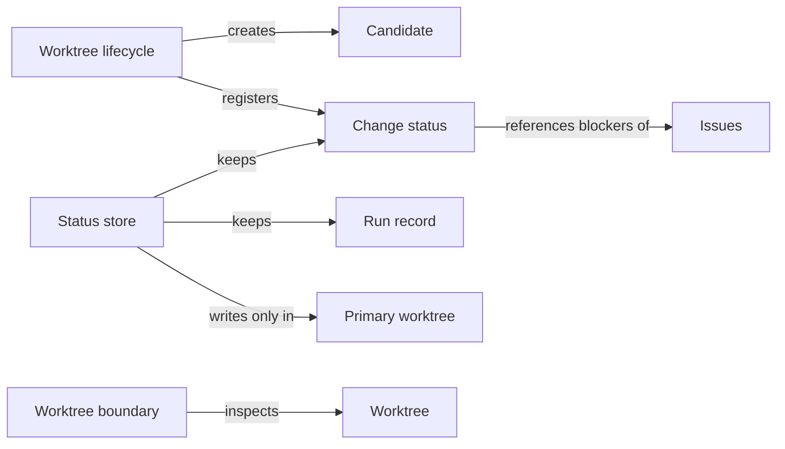

# Candidate worktrees

## Purpose

Candidate worktrees keeps every mutating Concorde task out of the developer's primary checkout. It
creates a candidate worktree for a change from committed history, records the change's status and
run evidence in one place that survives the candidate, and tells other parts of Concorde which
worktree they are in and who owns it. Request admission relies on it to decide where a request
runs, Task context relies on it for the workspace facts a worker sees, and Delivery relies on its
records to publish and clean up a candidate. It does not decide what a change contains, does not
merge anything, and is not a sandbox: a worktree separates files, not permissions.

## Terminology

| Term | Definition |
| --- | --- |
| Worktree | One Git working tree of the project, either the primary checkout or a linked worktree. |
| Primary worktree | The project's original Git working tree, identified by Git's shared repository directory, which holds all durable change status and run records. |
| Candidate | A linked worktree on its own branch, created from a committed base, in which one change is made. |
| Change status | The durable record of one change: its owner and intent, its worktree, its phase and outcome, its blockers and its delivery and cleanup state. |
| Run record | The durable record of one capability invocation: the source worktree and commit it ran on, the runtime and build it used, and its final result. |
| [Host](../../vocabulary.md#concept.concorde.host) | |
| [User session](../../vocabulary.md#concept.concorde.user-session) | |
| [Task subagent](../../vocabulary.md#concept.concorde.task-subagent) | |
| [Evidence](../../vocabulary.md#concept.concorde.evidence) | |
| [Issue](../../issues/module.md#concept.issues.issue) | |
| [Blocker](../../issues/module.md#concept.issues.blocker) | |

A change always has one change status. A candidate is the usual place for its files, but a change
may also be registered for the primary worktree when the developer explicitly allows it.

## Usage

Most callers never use this Module directly. When the user session asks for a mutating capability,
such as `concorde-plan`, from the primary worktree of a consumer project, Request admission asks
this Module for a new candidate and relays the request into it. The user session stays where it
is and receives the candidate's result, including its path and change ID.

**Creating a candidate.** A candidate is created only from the primary worktree, and only when that
worktree is on a branch. The host makes a new branch `concorde/<uuid>` at the primary's committed
`HEAD`, adds a linked worktree for it in a temporary directory, copies the primary's vendored
reference checkouts into it without using the network, and registers the change. Uncommitted edits
in the primary are never carried over, so a candidate always starts from a state someone can
reproduce. In a consumer project the host also appends a short guidance block to the candidate's
`AGENTS.md`, telling a fresh agent session where it is and how delivery works; the block is
removed again from anything that is delivered.

**Change status.** Each change has one status file, `.concorde/status/<change_id>.json`, in the
primary worktree only. It records the change's mode (`operation`, `maintenance` or `direct`), the
task, target and constraints it was created for, the candidate's path, branch and base commit, its
phase, status and outcome, open Issue blockers, per-Module progress, the runs that belong to it,
and its delivery and cleanup state. A later request for the same change must agree with the
recorded owner: it may omit the task or target and have them restored, but it cannot replace them.
Terminal records stay after the candidate is removed, so the outcome of a change is never lost.

**Run records.** Every executed invocation writes `.concorde/runs/<run_id>/run.json` in the primary
worktree, even when it ran in a candidate. The record names the source worktree, branch, commit and
exact input tree, the runtime and build manifest it used, the Pi entry it was selected through when
that is known, and its final result envelope. Accepted artifacts and the build manifest are copied
into the run, so the evidence survives the removal of the candidate or its scratch files.

**Coordinating Task subagents.** The source user session uses the `status` command of the Concorde
CLI to register a worktree as a task, to record which Task subagent currently owns it (a writer or
a tester) and to release that ownership, and to record a merge it performed with ordinary Git.
These commands record coordination; they never start a session or perform a merge.

**Checking a mutation boundary.** A caller that is about to let an agent change files can require
an isolated linked worktree, refusing the primary unless the developer explicitly allowed it. The
Concorde CLI uses this check before it writes a documentation site.

Errors are reported with stable codes, for example `workspace_mismatch` when a request does not
start at a worktree root or a change belongs to another worktree, `stale_status` when a status was
changed by someone else since it was read, `missing_change` when a request names no managed change,
and `primary_unavailable` when the primary worktree cannot be found. The complete list and the
record formats are in [records](records.md).

## Design

**One authority, in the primary.** A candidate can be deleted, renamed or recreated at the same
path, so it cannot hold the only copy of a change's history. The lifecycle keeps every durable
record in the primary worktree and locates the primary through Git's shared repository directory,
not through a directory name. When the primary cannot be found the operation stops with
`primary_unavailable`; it never creates a replacement record inside a candidate. A candidate holds
only scratch files, under `.concorde/work/`.

**Identity that survives renames but not recreation.** A change has a stable `change_id`. Its
worktree is additionally identified by an incarnation token that the host writes into Git's private
administrative directory for that worktree when it registers the change. Git deletes the token with
the worktree, so a worktree recreated at the same path, on the same branch and commit, cannot
inherit the old change. Renaming the branch keeps the token and the change.

**Safe concurrent writes.** Several processes can write status at once: the relaying process in the
primary, the relayed launcher in the candidate, and the user session's CLI. Every write takes a
repository-wide lock and replaces the whole record only if its revision is the one the writer read;
otherwise it fails with `stale_status` and the writer must read again. Nothing is merged field by
field, so a stale writer can never erase newer blockers or progress. Per-Module progress records
carry their own owner and revision for the same reason. Status and run directories are excluded
from Git through the repository's local exclude file, and a write stops if they are ever tracked.

**Nothing local is delivered.** A deliverable snapshot of a candidate is computed in a private Git
index that removes the control paths under `.concorde/` and strips exactly the guidance block the
host recorded. Guidance markers that were edited or duplicated block the snapshot rather than being
guessed at. The caller's index, the working files and the status record are left untouched.

**Isolation check.** The worktree boundary check reports the Git identity of a directory (its
repository root, `HEAD`, private and shared Git directories) and whether it is a linked worktree.
It changes nothing and does not look at file contents.

The tests of this Module run against real, disposable Git repositories: candidate creation, status
persistence, the isolation check, and whole relay-and-deliver lifecycles.

## Relationships

The **worktree lifecycle** creates candidates, reads and restores their owner, computes the
workspace facts a worker is given, and produces deliverable snapshots. The **status store** is the
only code that writes change status and run records, always in the primary worktree. The
**worktree boundary** answers whether a directory is an isolated linked worktree.

**Spec.** The lifecycle uses the [Spec](../../spec/module.md) Module's file transaction service to
append guidance to `AGENTS.md` and roll it back atomically when registration fails, and its path
and identifier rules to reject unsafe paths and malformed change IDs. A failed transaction leaves
the candidate's files as they were and the change unregistered.

**Issues.** Change status records open blockers as references to
[Issues](../../issues/module.md#concept.issues.issue), keyed by change, Module, phase and Issue,
never by task wording. It stores the receipt of each [blocker](../../issues/module.md#concept.issues.blocker),
not a copy of the problem, so the Issue record stays the one description of what is wrong.
