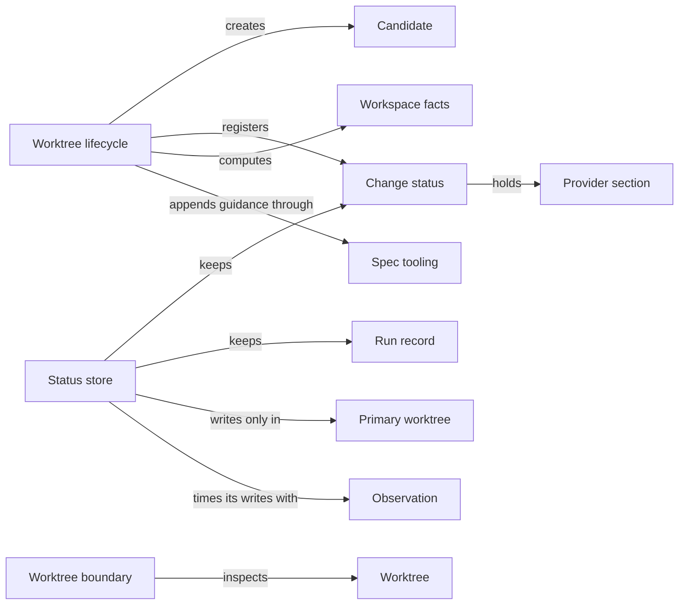

# Candidate worktrees

## Purpose

Candidate worktrees keeps every mutating Concorde task out of the developer's primary checkout. It
creates a candidate worktree for a change from committed history, keeps the change's status and
every run record in the primary worktree where they survive the candidate, and tells the rest of
Concorde which worktree and change a directory belongs to. Request admission relies on it to place
and record requests, Task context for workspace facts, and providers for the sections it keeps for
their records; the source user session records Task subagent ownership with it. It does not decide
what a change contains, interprets no provider record, merges nothing (Delivery does), and is not a
sandbox: a worktree separates files, not permissions.

## Terminology

| Term | Definition |
| --- | --- |
| Worktree | One Git working tree of the project, either the primary checkout or a linked worktree. |
| Primary worktree | The project's original Git working tree, identified through Git's shared repository directory, which holds all durable change status and run records. |
| Candidate | A linked worktree on its own branch, created from a committed base, in which one change is made. |
| Change status | The durable record of one change: its owner and intent, its worktree, its lifecycle position, the Task subagent that owns it, its runs, its cleanup state and the sections its providers keep. |
| Provider section | A named part of a change status that one provider declares with its own typed-value type, which this Module stores and protects but never interprets. |
| Run record | The durable record of one executed capability request: the worktree, commit and input tree it ran on, the runtime and build it used, and its final result envelope. |
| Workspace facts | The observation of where a request runs, namely the current worktree, its change and lifecycle position, and a summary of the other live worktrees, taken only from Git and primary status records. |
| [User session](../../vocabulary.md#concept.concorde.user-session) | |
| [Task subagent](../../vocabulary.md#concept.concorde.task-subagent) | |

## Usage

Most callers never use this Module directly: when the user session asks for a mutating capability
from the primary worktree, Request admission asks it for a candidate and relays the request there.

**Creating a candidate.** Only from the primary on an attached branch: a new branch
`concorde/<uuid>` and linked worktree at the committed `HEAD`, the vendored reference checkouts
copied without network, the change registered, and in a consumer project a marked guidance block
appended to `AGENTS.md`. Uncommitted primary edits are never carried over.

**Change status.** One record per change, in the primary only: mode (`operation`, `maintenance` or
`direct`), recorded owner (task, target, focus, constraints), worktree path, branch and base, the
lifecycle position (`phase`, `status`, `outcome`), the owning Task subagent, its runs and cleanup
state. A later request may omit the owner fields and have them restored, but cannot replace them.
Terminal records outlive the candidate.

**Provider sections.** Planning's plan, tasks and pending gaps, Validation's evidence, Delivery's
delivery and merge records and Issue solving's journal live in provider sections. A provider
declares a section name and its typed-value type and writes it through the same revision-checked
write; an undeclared section or a mistyped value is refused with `invalid_worktree_state`.

**Run records.** Every executed request has one run record in the primary, opened by Request
admission before the provider runs and finished with the result envelope. It names the source
worktree, commit and exact input tree, the runtime and build, the Pi entry when known and, for a
relayed request, the candidate's run; accepted artifacts and the build manifest are copied beside it.

**Where a request is.** For a directory, this Module answers whether it is the primary, a linked
worktree or no Git worktree, and which change is bound to it. Workspace facts add a summary of every
other live linked worktree from Git and primary status records; no file inside another worktree is
read.

**Coordination and the boundary check.** The source user session's `status` command registers a
worktree as a change and records or releases the Task subagent that owns it; it starts nothing. A
caller about to let an agent change files can require an isolated linked worktree, refusing the
primary unless explicitly allowed.

**Errors.** `workspace_mismatch` (not a worktree root, or a change owned elsewhere), `stale_status`
(changed since read), `missing_change`, `primary_unavailable` and `invalid_worktree_state`; nothing is
retried automatically. The full list and formats are in [records](records.md); the reasoning is in
the [design topic](design.md).

## Design

**One authority, in the primary.** The **worktree lifecycle** keeps every durable record in the
primary, located through Git's shared repository directory, because a candidate can disappear. An
incarnation token in Git's administrative directory ties a change to one worktree incarnation, so a
recreated worktree never inherits an old change.

**Whole-record, revision-checked writes.** The **status store** is the only writer of status and run
records; every write takes a repository-wide lock and fails with `stale_status` on an old revision,
so a stale writer never erases newer content.

**Opaque provider sections** keep this Module independent of every provider while all providers
share the revision check and primary authority. Deliverable snapshots drop local control paths and
the recorded guidance block without touching the caller's index.

The **worktree boundary** check reports a directory's Git identity and changes nothing.

The **worktree tests** run against real disposable Git repositories. A candidate is not a sandbox:
see the Harness entry for what is enforced.

## Relationships

**Spec tooling.** The lifecycle appends the guidance block through a
[file transaction](../../spec/module.md#concept.spec.file-transaction), so a failed registration
rolls back its bytes and file mode and leaves the change unregistered. The status store checks each
provider section, and identifiers such as change identities, as
[typed values](../../spec/module.md#concept.spec.typed-value); a refused value stops the write before
anything is stored.

**Observation.** Candidate creation and status writes are marked as
[diagnostic spans](../observation/module.md#concept.observation.diagnostic-span); nothing depends on
them.

**Consumers** (Request admission, Task context, the providers, Delivery and the Pi session's
coordinator) rely on the revision check: a writer that receives `stale_status` rereads and decides
again.
