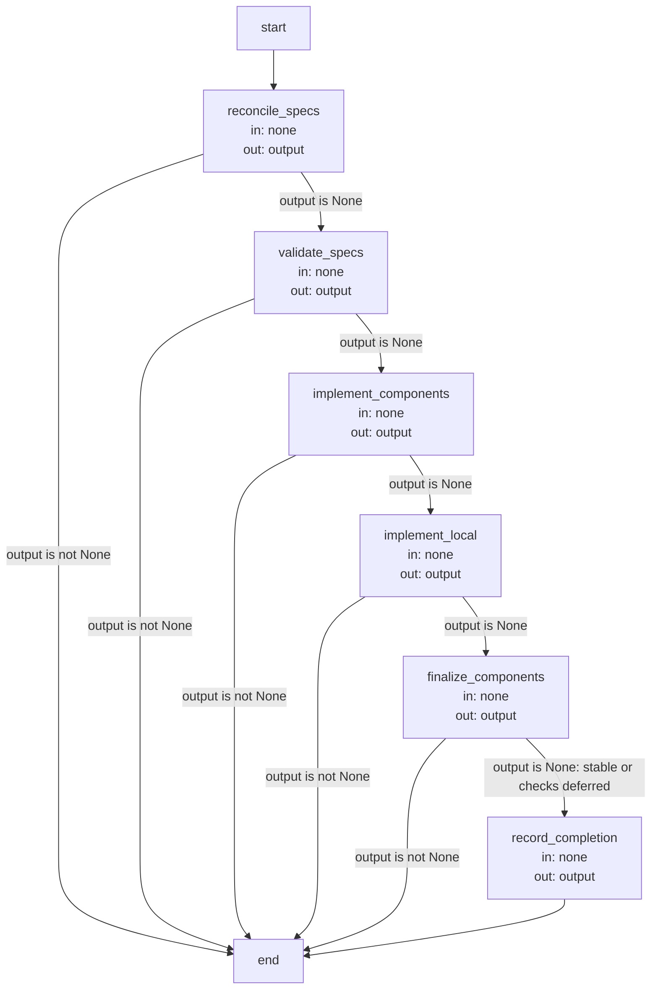
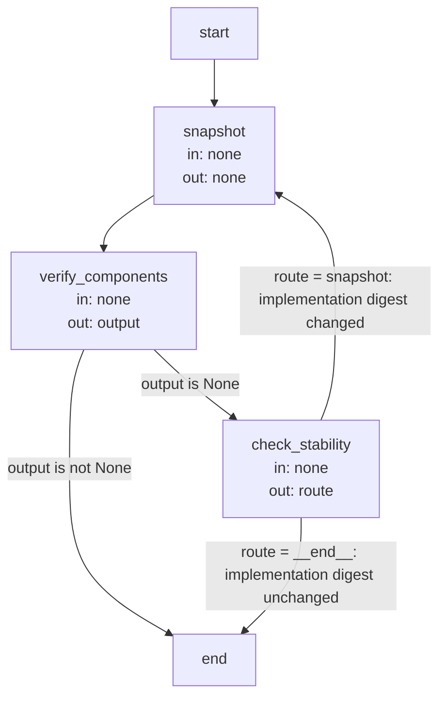

# Implementation execution and record contracts

These are the precise implementation agreements and executable Graph specifications owned by the
[Implementation Module](module.md). Explanatory topics introduce their purposes; exact identities, limits
and transitions are retained here as the single detailed contract.

## Terminology

| Term | Meaning / definition |
| --- | --- |
| [Spec](../module.md#terminology) | Defined in Concorde Framework. |
| [Module](../module.md#terminology) | Defined in Concorde Framework. |
| [Worker](../module.md#terminology) | Defined in Concorde Framework. |
| [Host](../module.md#terminology) | Defined in Concorde Framework. |
| [Grant](../module.md#terminology) | Defined in Concorde Framework. |
| [Candidate](../module.md#terminology) | Defined in Concorde Framework. |
| [Ready](../module.md#terminology) | Defined in Concorde Framework. |
| [Acceptance task](../planning/tasks.md#terminology) | Defined in Making work verifiable. |
| [Spec context](../harness/context.md#terminology) | Defined in What information a worker receives. |
| [Internal operation](../operations/module.md#terminology) | Defined in Operations. |
| [Skill](../module.md#terminology) | Defined in Concorde Framework. |
| [Graph](../module.md#terminology) | Defined in Concorde Framework. |
| [Entity](../module.md#terminology) | Defined in Concorde Framework. |
| [Evidence](../module.md#terminology) | Defined in Concorde Framework. |

## Implementation operation {#implementation-implementation-operation}

[Harness admission](../harness/admission.md) owns the entry. Its [common invocation envelope](../harness/admission.md#operation-execution-boundary),
[typed handoffs](../harness/admission.md#stage-handoffs) and
[gap rules](../issues/execution-reference.md#review-and-gaps-attributed-issue-blockers-and-host-history) apply. Artifact references are host-issued paths
and exact digests; a valid shape alone does not establish currentness or authority.
This is a private, bound operation in the [current adapter inventory](../operations/execution-reference.md#operations-current-host-adapter).
Only a declared in-process composition can call it; direct Skill/CLI invocation is rejected.
A caller supplies the selected Module, task, constraints, focus and current candidate identity
where required. It cannot reselect context or forge saved artifacts. Spec context is complete,
file names are visible and implementation contents remain excluded from non-code phases.

`implement` requires current authored tasks and their accepted plan in a
concorde-implementation-task@1. Missing tasks are missing_tasks; stale artifacts or mismatched
intent stop admission. A fresh programmer receives the complete selected
Spec and contents of the files its own entities bind. Only those implementation paths are writable;
registered Specs, registry, entity declarations and configuration are not. Network and credentials
remain disabled. Optional concorde-review-result@2 is admitted only after the host verifies the
current dev-loop repair round; structural validity does not authorize repair.

The worker returns every exact admitted task with unchanged identity and acceptance, marked complete
only when fulfilled. Missing or incomplete tasks produce incomplete_tasks, never ready. The host
persists accepted progress and returns artifact references in concorde-implement-response@3.
Authorized code edits can remain after failed execution; recovery inspects preserved progress and
re-admits current context rather than claiming rollback or rerunning with wider grants.

A listed test does not grant its transitive imports, fixtures or repository configuration to the
programmer. Tests requiring inputs outside that invocation's grant are repository-level Host
verification. The programmer records the attempted command and concrete missing inputs, continues
independent work, and distinguishes this deferral from a passing test and from an implementation
defect. For acceptance qualified by the granted runtime, deferred repository-level execution does
not prevent completion of otherwise fulfilled implementation and test obligations. An actual
defect or missing implementation obligation remains incomplete; Host checks still gate readiness.

### Design {#implementation-design}

#### Component coordination and current adapter limit {#implementation-component-coordination-and-current-adapter-limit}

A selected Module may contain local code tasks and tasks for its direct children or used Modules.
Local tasks retain their original plan and identity; they do not recursively invoke a new loop for
the same Module. Each participant has a separately selected complete contract and grant. All affected
provider/consumer Spec views must agree before component code changes; incomplete reconciliation
remains inspectable. Component ancestry supplies no extra file access.

The current adapter delegates component lifecycle scheduling and final shared-consumer checks to
its existing enclosing development Graph. That graph's ready, defer_component_checks and bounded
repair policies are not implementation completion conditions. Reusing this provider for a different
coordinated graph requires a declared implementation adapter for its component scheduling and evidence
handoffs; no arbitrary scheduler input or additional callable entry is introduced here. The local
task contract is independently reusable under current host admission. Missing contracts stop the
dependent task; an actual implementation defect remains incomplete; cancellation and limits retain
their separate execution outcomes.

### Coordination Graphs

A composite Module's implementation runs the component coordination Graph, which finishes with
the shared candidate stabilization Graph. Each Graph Spec follows the
[Graph Spec convention](../harness/execution-reference.md#graphs-and-loops-graph-specs): its
State, Nodes and Edges are stated in turn, and its diagram is bound to its compiled Graph by
`%% graph:` and kept equal to it by the configured Graph Spec check.

#### Component coordination Graph (`coordination_graph`) {#graphs-component-coordination-graph-coordination-graph}

A composite Module's implementation runs this Graph when its tasks name submodules or used Modules.

**State.** `output` (a typed blocking response, or None while the Graph advances; the final node
writes the completion response), `route` (shared schema field, unused by coordination). Both use
replacement updates. The candidate's target record carries the coordination table (component
tasks, Spec/implementation status, digests and gaps) and local tasks. The admitted `run`, component
list, local task list and accumulated review artifacts live in the Host/node closures. These are
not Graph channels, even though the implementation calls the durable target record `state`.
`none` below means no Graph-channel read, not an absence of those external inputs/effects.

**Nodes.** The work-item nodes run the [Sequential work items Graph](../harness/execution-reference.md#host-sequential-work-items-graph-batch-graph).

| Node | Executes | in | out |
| --- | --- | --- | --- |
| `reconcile_specs` | Calls the batch Graph over Host-bound component tasks; runs/reuses owner-local authoring and updates durable coordination records. | none | output |
| `validate_specs` | Validates participant contracts and updates the durable phase; returns output=None on success or raises on incompatibility. | none | output |
| `implement_components` | Calls the batch Graph: each component develops from its own grant with specify=false; retains review artifacts outside Graph State. | none | output |
| `implement_local` | Runs/reuses the local programmer invocation and persists exact completed local tasks/digest. | none | output |
| `finalize_components` | Calls stabilization below unless the Host defers component checks; records component revisions/evidence outside State. | none | output |
| `record_completion` | Persists completed tasks, component revisions and implementation digest; returns the completion response with review artifact references. | none | output |

**Edges.** After every nonfinal step, the conditional edge tests `state.get("output") is not None`:
a returned blocking response ends the Graph, while None advances. This is not a truthiness test.
`record_completion` always ends the Graph with its successful response. Invalid contracts and
other raised exceptions unwind to the enclosing admission guard; these helper nodes have no
`result` channel and do not convert exceptions into the displayed output-based branches.
When the Host defers final checks, `finalize_components` writes None without running stabilization;
this continuation records a draft, not final shared-candidate verification.

#### Shared candidate stabilization Graph (`stabilization_graph`) {#graphs-shared-candidate-stabilization-graph-stabilization-graph}

**State.** `output` (a failed participant's typed response or None), `route` (`snapshot` or
`__end__`), both using replacement updates. The enclosing closure holds the participant set,
before-round implementation digest, finalized set and remaining-round counter, initially
`1 + 2 * participant_count`. None of those is a Graph channel. A later participant's repair can
stale an earlier participant's evidence, so the Host compares implementation digests each round.
`snapshot` returns no channel update; the previous output/route values are retained until their
next writer. All nodes obtain business inputs from the enclosing coordination.

**Nodes.**

| Node | Executes | in | out |
| --- | --- | --- | --- |
| `snapshot` | Decrements the closure-held budget, captures the before-round digest and clears the finalized set; raises if no rounds remain. | none | none |
| `verify_components` | Calls the batch Graph over Host-held participants; final development calls run checks/reviews and update durable evidence and closure-held artifacts. | none | output |
| `check_stability` | Compares current participant implementation digest to the closure-held before-round digest; selects repeat or end. | none | route |

**Edges.** `snapshot` always continues to `verify_components`. After verification a conditional
edge reads `output`: a failed participant ends the Graph, otherwise `check_stability` runs.
`check_stability` writes `route`: when verification changed the candidate the round repeats from
`snapshot`, and when it did not the Graph ends. The round budget checked in `snapshot` bounds the
loop. The output predicate is `is not None`; the stability predicate is equality of the before
and after implementation digests. Exhausting the budget raises to the enclosing invocation; it
does not traverse an additional `snapshot` error edge or produce a successful stable result.

### Precise specifications {#implementation-precise-specifications}

The Implementation Module owns the exact obligations and interface details in [scenarios](scenarios.md).
These companions are part of the same complete Module specification, not separate topic owners.

## Realization and reuse limits

This Module and its consumers are siblings under Concorde Framework. Its behavior is realized in
its own package `src/concorde/implementation/`, bound by its adapter entity together with its `operations/` declaration; this Spec boundary
creates no public Skill, Agent grant or configurable arbitrary graph. Host admission, phase
artifacts and permissions remain mandatory. A new graph requires declared composition and an
implementation of its sequencing, artifact admission, recovery and completion policies before it
can execute. [Harness admission](../harness/admission.md) realizes the common entry and invocation
host, and [Operations](../operations/execution-reference.md#graphs-dispatch-graphs) the dispatch
that reaches this provider.
