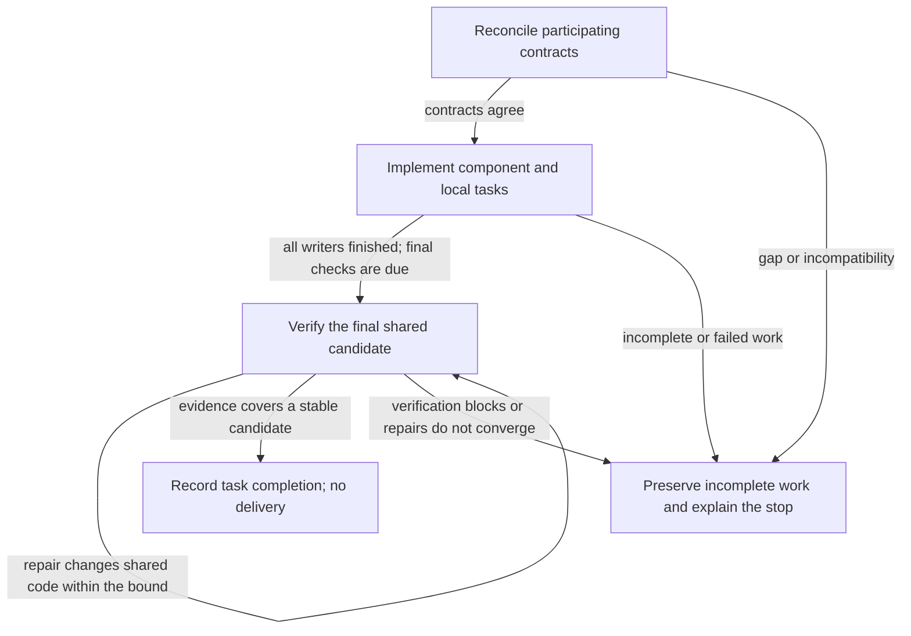
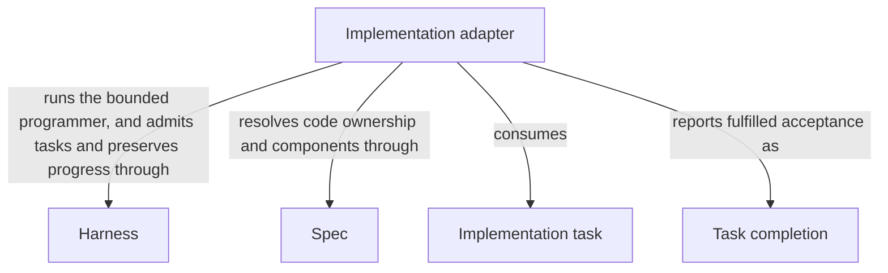

# Implementation

## Purpose

Implementation fulfills accepted tasks by changing the code that its worker is allowed to access. It reports which tasks are complete without weakening their acceptance conditions. Independent checks, review, readiness and delivery remain separate decisions.

## Terminology

| Term | Meaning / definition |
| --- | --- |
| [Spec](../module.md#terminology) | Defined in Concorde Framework. |
| [Module](../module.md#terminology) | Defined in Concorde Framework. |
| [Worker](../module.md#terminology) | Defined in Concorde Framework. |
| [Host](../module.md#terminology) | Defined in Concorde Framework. |
| [Grant](../module.md#terminology) | Defined in Concorde Framework. |
| [Candidate](../module.md#terminology) | Defined in Concorde Framework. |
| [Ready](../module.md#terminology) | Defined in Concorde Framework. |
| [Delivery](../module.md#terminology) | Defined in Concorde Framework. |
| [Acceptance task](../planning/tasks.md#terminology) | Defined in Making work verifiable. |
| [Internal operation](../operations/module.md#terminology) | Defined in Operations. |
| [Skill](../module.md#terminology) | Defined in Concorde Framework. |
| [Graph](../module.md#terminology) | Defined in Concorde Framework. |
| [Entity](../module.md#terminology) | Defined in Concorde Framework. |

## Usage

A declared composing operation calls `implement` with a current accepted plan and nonempty task
list for one selected Module. This is a private bound provider, not a directly invocable Skill.
The programmer receives the complete Module Spec and the implementation paths its own entities
bind, and must return every admitted task with unchanged identity and acceptance. Only fulfilled
tasks are complete; completion is not validation, readiness or delivery.

Missing tasks reject before launch. Incomplete output cannot establish fulfillment. Authorized
edits may remain after a failed or cancelled run, so inspect preserved candidate state and re-admit
current artifacts rather than assuming rollback. A listed test does not grant its transitive inputs:
record unavailable repository-level execution as deferred host verification, not as a pass.
Coordination with other Modules requires their separate contexts and the existing enclosing-graph
adapter; no arbitrary scheduler is accepted.

For example, a test may import a fixture outside the programmer's allowed files. That import does
not grant access. The programmer records why execution must be deferred to a host-level check and
continues independent work. Deferred execution is not a passing test, while an actual defect still
prevents task completion. Final host checks remain required.

## Design

The implementation adapter admits current plan/task artifacts, launches one programmer under the
selected Module's implementation grant, and validates exact returned task identities and acceptance
before storing completion. Code edits are made inside the candidate, so execution failure can
leave authorized partial edits; progress and currentness checks support recovery rather than a
fictional rollback guarantee.

[Component coordination](execution-reference.md#implementation-component-coordination-and-current-adapter-limit)
separates local tasks from participant work and delegates scheduling/final shared-consumer checks
to the existing enclosing Graph. Final checks wait for every writer so partly changed shared files
do not produce misleading consumer evidence. This shared realization does not transfer those Graph
completion conditions to the reusable local task contract.

`implement` therefore runs in one of two shapes. For a Module whose tasks are all its own, it is a
single node: one programmer worker run as an
[Operation node](../harness/execution-reference.md#host-operation-node-operation-node). For a
composite Module whose tasks name submodules or used Modules, it is the
[component coordination Graph](execution-reference.md#graphs-component-coordination-graph-coordination-graph),
which reconciles and implements each component in its own context, runs the programmer for the
composite's own tasks, and finishes with the
[stabilization Graph](execution-reference.md#graphs-shared-candidate-stabilization-graph-stabilization-graph).
A later participant's repair can invalidate evidence an earlier participant already produced, so
that Graph repeats final verification until one consistently checked candidate remains.

### Flow overview

This conceptual view explains why coordinated work reconciles contracts before writing code and
waits for all writers before final shared checks. Boxes group responsibilities, not runtime nodes.
Local-only implementation uses one programmer invocation; the additional reconciliation and
stabilization work applies when accepted tasks involve participating Modules. Nested coordination
may return a draft to its enclosing coordinator rather than claiming final verification.

For exact State channels, node inputs/outputs and stopping predicates, open the full
[Component coordination Graph Spec](execution-reference.md#graphs-component-coordination-graph-coordination-graph)
and [Shared candidate stabilization Graph Spec](execution-reference.md#graphs-shared-candidate-stabilization-graph-stabilization-graph).
Local worker execution uses the [Operation node contract](../harness/execution-reference.md#host-operation-node-operation-node).

## Relationships

This view follows an admitted Implementation task to Task completion. [Spec Module](../spec/module.md) determines the selected
Module's implementation boundary, [Harness Module](../harness/module.md) enforces the programmer's grant, and [Harness admission](../harness/admission.md) admits
the exact task list and retains its progress. The adapter's use of these sibling providers does not
merge their ownership or permissions. Task completion reports fulfilled acceptance only; validation,
review and delivery remain separate decisions of the composing Graph.

### Harness

Bind a fresh programmer to the complete selected contract and enforce writes only to that Module's granted implementation paths.

This collaboration applies when launching the programmer or admitting its matching completion under the current grant.

Admit the current implementation task and permitted repair feedback, persist exact task progress and preserve the candidate on failure.

This collaboration applies before implementation starts and when its returned task completion or execution failure is recorded.

- [Complete context selection](../harness/contracts.md#contract.context.selection); Supply only mode-admitted inputs and require a matching completion; unavailable enforcement stops execution without a wider grant.
- [Host admission](../harness/admission.md#operation-execution-boundary); Recheck admitted intent and returned identities before accepting host state; a rejected result cannot advance the dependent step.

### Spec

Resolve the selected Module's implementation entries, current files, contract and direct component relationships.

This collaboration applies when deriving a local code grant or admitting separately bound component work and rechecking revisions.

- [Owner and context resolution](../spec/contracts.md#registry-stable-id-spec-context-queries); Reconstruct current resolutions after input changes; unresolved ownership, missing required definitions or stale revisions block dependent use.

## Precise specifications

The Implementation Module owns the exact obligations and interface details in [requirements](requirements.md), [scenarios](scenarios.md) and the
[execution and record contracts](execution-reference.md#implementation-implementation-operation).
These companions are part of the same complete Module specification, not separate topic owners.
