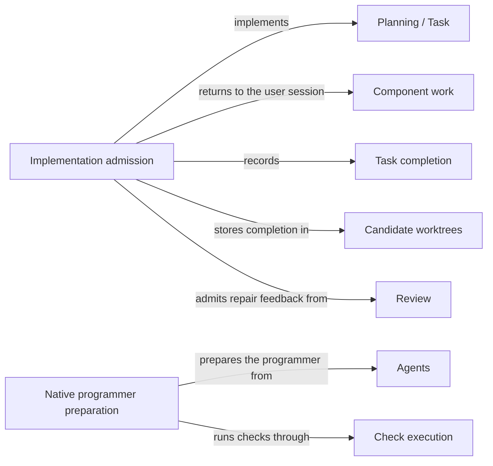

# Implementation

## Purpose

Implementation changes a Module's code to fulfil the tasks that Planning accepted. It owns the
capability `concorde-implement`: one fresh programmer Agent edits, in the candidate worktree, the
files that the Module's realizations bind, and the Host records the tasks as complete only when the
programmer reports every task fulfilled and the result passes the Host's checks. Implementation
does not change Specs, does not run the final checks or reviews, and does not make a candidate
ready or deliver it. Work that belongs to another Module goes back to the user session.

## Terminology

| Term | Definition |
| --- | --- |
| Task completion | The Host's record that every local task of the accepted list is fulfilled, together with the digest of the Module's implementation files at that moment. |
| Component work | The tasks of an accepted list that target another Module of the selected Module's change scope, which must be planned and implemented for that Module separately. |
| [Plan](../planning/module.md#concept.planning.plan) | |
| [Task](../planning/module.md#concept.planning.task) | |
| [Change scope](../planning/module.md#concept.planning.change-scope) | |
| [User session](../vocabulary.md#concept.concorde.user-session) | |
| [Host](../vocabulary.md#concept.concorde.host) | |
| [Module](../vocabulary.md#concept.concorde.module) | |
| [Spec](../vocabulary.md#concept.concorde.spec) | |
| [Agent](../agents/module.md#concept.agents.agent) | |
| [Candidate](../harness/worktrees/module.md#concept.worktrees.candidate) | |
| [Finding](../review/module.md#concept.review.finding) | |

Local tasks are the tasks that target the selected Module itself; the programmer works only on
those. Component work is everything else in the list.

## Usage

### Before calling

`concorde-implement` needs a managed candidate in which [Planning](../planning/module.md) has
accepted a current plan and task list for the target. The request repeats the plan's `target_id`,
`task` and `constraints`. If the candidate records that the Module needs a Spec review, that review
must be current and non-blocking.

### A normal run

The user session calls `concorde-implement` and receives a prepared Agent call. It invokes the call
unchanged. The programmer receives the Module's frozen Spec context, the accepted plan and the
local tasks, and an index that names the candidate worktree and the absolute paths it may write:
the entries of the Module's realizations. It edits those files in place, not copies, and may run the
Module's configured checks through its `run_checks` tool. It returns every task with its identity,
target, description and acceptance unchanged, marked complete only if fulfilled.

When the call returns, the Host accepts the answer only if every local task comes back complete and
unchanged, and every non-pending file that the Module's realizations list exists. It then records
**task completion**: the tasks are marked complete, the digest of the implementation files is
stored, earlier check results are cleared, and the target's phase becomes `implementation`. The
user session then chooses the next steps, typically `concorde-code-review` and `concorde-validate`.

If the code review finds blocking problems, the user session asks Planning for repaired tasks with
the review's [findings](../review/module.md#concept.review.finding), then implements again; the
programmer then also receives that review as feedback.

### Component work

A task list may include **component work**: tasks for another Module of the target's
[change scope](../planning/module.md#concept.planning.change-scope), for example a Module it uses,
a child, or a participant of a contract whose version the change raises. The programmer never
receives another Module's files. Instead, `concorde-implement`
returns `unsupported` with each component's target and the exact task text derived from its tasks,
without starting a programmer. The user session then plans, derives tasks for and implements each
component with that exact text, in the same candidate. When it calls `concorde-implement` for the
parent again, the Host checks that each component's recorded work matches the derived text and
constraints, is complete, and is current for the component's Spec and implementation. Only then
does the programmer run for the local tasks. If there are no local tasks, the Host records
completion without starting a programmer. The whole change stays one candidate: validating the
target afterwards covers every Module the candidate edited, and delivering that candidate lands
all of them together.

### When implementation stops

Before any Agent starts, the request is refused when there is no managed candidate
(`missing_change`), no task list (`missing_tasks`), a required Spec review is missing
(`review_required`), the plan is stale (`stale_context`) or belongs to another task
(`incompatible_handoff`), a recorded gap still blocks the step (`spec_incomplete`), the project's
Specs do not validate (`incompatible_contracts`), or there are local tasks but the Module binds no
implementation files (`unsupported_target`).

After the programmer ran, a missing, changed or incomplete task, or a listed file that does not
exist, is reported as `incomplete_tasks`. Edits the programmer made stay in the candidate: there is
no rollback. A failed, cancelled or rejected run leaves the candidate for inspection, and a retry
admits the current inputs afresh without any wider permission.

The programmer's file limits, and its promise not to use the network or credentials, are
instructions to the Agent, not an operating-system boundary. The `run_checks` tool is different:
it takes no arguments and runs the configured checks through the Host's read-only sandbox.

## Design

Implementation keeps one programmer to one Module. A task list may reach into components, but a
programmer that could edit them would silently gain another Module's code and break promises it
cannot see. Returning component work to the user session keeps each change inside the boundary of
the Module that owns it, even when one change must edit several Modules to stay valid, and the Host's later check of each component's recorded work ensures that
a component label cannot stand in for work that was never done.

Completion is narrow on purpose. Marking tasks complete says only that the programmer's acceptance
conditions are met in the candidate. Independent review, validation and delivery each need their
own current evidence, so a quick completion can never be mistaken for a ready change.

The programmer edits the real candidate files, because copies would have to be merged back and
could drift. The price is that a failed run can leave partial edits. The Host therefore records
nothing until an answer is accepted, and a retry starts from the candidate as it is.

While the programmer works, its own edits must not make its inputs look stale. The Host therefore
checks the answer against the snapshot it prepared, and allows the Module's implementation files to
change, while the Spec, registry, configuration, plan, tasks and review feedback must stay as they
were.

The **implementation capability declaration** is the module in `operations/` that declares
`concorde-implement` for the capability catalog.

The **implementation admission** code checks the prerequisites, separates local tasks from
component work, validates the programmer's answer and records task completion.

The **native programmer preparation** is the shared native preparation service, whose programmer
case writes the index with the candidate worktree and the intended write paths and gives the
programmer its `run_checks` tool.

The **Implementation tests** cover task admission, component work, failed runs and a scripted
native programmer run against a real candidate.

## Relationships

**Planning** supplies the accepted [plan](../planning/module.md#concept.planning.plan) and
[task](../planning/module.md#concept.planning.task) list that implementation works on, and guarantees
that every task targets a Module in the target's
[change scope](../planning/module.md#concept.planning.change-scope), as
[accept only valid new task lists](../planning/workflow.md#req.planning.tasks-admission) states.
Implementation relies on the list being current for the Module's Spec revision and the request's
task, and refuses otherwise. It never edits the plan or the tasks' descriptions and acceptance
conditions; it only marks tasks complete.

**Request admission** checks the [capability request](../harness/admission/module.md#concept.admission.capability-request),
binds the candidate and wraps the result. The programmer's preparation runs inside admission, so a
request arriving through admission's [relay](../harness/admission/module.md#concept.admission.relay) into the candidate gets the
same checks.

**Task context** freezes the Module's [context snapshot](../harness/context/module.md#concept.context.snapshot) for
the programmer, the one phase that may read implementation contents, as
[implementation contents only for code phases](../harness/context/requirements.md#req.context.contents-code-phases)
allows. Implementation relies on that snapshot to name the Module's implementation files, which
become the programmer's intended write paths, and on [recheck rejecting changed inputs](../harness/context/requirements.md#req.context.recheck)
before it accepts an answer.

**Agent execution** runs the programmer as a native Agent and verifies that the run completed and
was not tampered with. Implementation treats the programmer's answer as a
[proposal](../harness/execution/module.md#concept.execution.proposal), because
[a proposal is not a result](../harness/execution/requirements.md#req.execution.proposal-not-completion): a run that
failed, was cancelled or cannot be verified records no completion.

**Check execution** runs the Module's [configured checks](../harness/checks/module.md#concept.checks.configured-check) inside
the [read-only check boundary](../harness/checks/module.md#concept.checks.read-only-boundary) when the programmer calls
`run_checks`, and records their real outcomes. Implementation passes no command or path to it.

**Agents** defines the programmer. Implementation prepares the
[Agent](../agents/module.md#concept.agents.agent) from its
[Agent definition](../agents/module.md#concept.agents.definition) and adds no delegation.

**Candidate worktrees** holds the [change status](../harness/worktrees/module.md#concept.worktrees.change-status) of the
[candidate](../harness/worktrees/module.md#concept.worktrees.candidate), where Implementation reads the tasks and component
records and writes task completion. The programmer's edits are made in that candidate's worktree
and nowhere else.

**Spec** resolves the target, its components and their revisions from the
[registry](../spec/module.md#concept.spec.registry), and computes the Module's
[boundary sets](../spec/module.md#concept.spec.boundary-set), whose realization entries become the
programmer's write paths. It also validates the whole project before a programmer starts, so that
no code is written against Specs that do not agree with each other.

**Review** says whether a [required review](../review/module.md#concept.review.required-review) of
the Module's Spec is current, and supplies the code review whose blocking
[findings](../review/module.md#concept.review.finding) a repair addresses, following
[repair feedback comes only from the current blocking code review](../review/requirements.md#req.review.repair-feedback).
Implementation checks that feedback before the programmer starts and treats it as fixed input
afterwards, so the programmer's own repair does not make it look stale.
