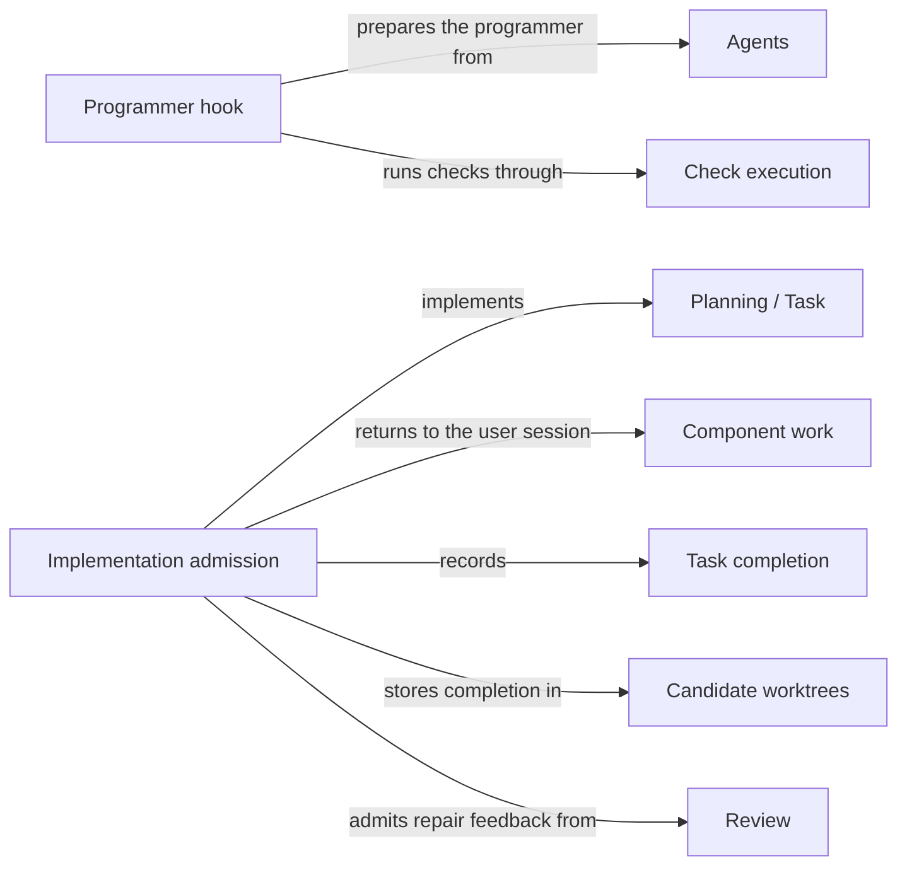

# Implementation

## Purpose

Implementation changes a Module's code to fulfil the tasks that Planning accepted. It provides the
Operation `concorde-implement`: one fresh programmer Agent edits, in the candidate worktree, the
files that the Module's realizations bind, and the Host records the tasks as complete only when the
programmer reports every task fulfilled and the result passes the Host's checks. Implementation
does not change Specs, does not run the final checks or reviews, and does not make a candidate
ready or deliver it. Work that belongs to another Module goes back to the user session as component
work.

## Terminology

| Term | Definition |
| --- | --- |
| Task completion | The Host's record that every local task of the accepted list is fulfilled, together with the digest of the Module's implementation files at that moment. |
| Component work | The tasks of an accepted list that target another Module of the change scope, returned to the caller as that Module's component task instead of being implemented here. |
| [User session](../vocabulary.md#concept.concorde.user-session) | |
| [Host](../vocabulary.md#concept.concorde.host) | |
| [Module](../vocabulary.md#concept.concorde.module) | |
| [Spec](../vocabulary.md#concept.concorde.spec) | |
| [Operation](../operations/module.md#concept.operations.operation) | |
| [Plan](../planning/module.md#concept.planning.plan) | |
| [Task](../planning/module.md#concept.planning.task) | |
| [Change scope](../planning/module.md#concept.planning.change-scope) | |
| [Pending gap](../planning/module.md#concept.planning.pending-gap) | |
| [Agent](../agents/module.md#concept.agents.agent) | |
| [Candidate](../harness/worktrees/module.md#concept.worktrees.candidate) | |
| [Required review](../review/module.md#concept.review.required-review) | |
| [Finding](../review/module.md#concept.review.finding) | |

Local tasks are the tasks that target the selected Module itself; the programmer works only on
those. Component work is everything else in the list.

## Usage

`concorde-implement` needs a managed candidate in which [Planning](../planning/module.md) accepted a
current plan and task list for the target; the request repeats the plan's `target_id`, `task` and
`constraints`. The candidate's [required review](../review/module.md#concept.review.required-review)
of the Module's Spec, if any, must be current, and no [pending gap](../planning/module.md#concept.planning.pending-gap)
may block the step.

The user session invokes the returned Agent call unchanged. The programmer receives the Module's
frozen Spec context, the plan and the local tasks, and an index naming the candidate worktree and
the Module's realization entries as the files it is meant to write. It edits those files in place,
may run the Module's configured checks through `run_checks`, and returns every local task unchanged,
marked complete only if fulfilled. The Host accepts the answer only if every local task comes back
complete and unchanged and every non-pending listed file exists; it then records **task
completion**: tasks marked complete, the implementation digest stored, earlier check results
cleared. The user session then typically calls `concorde-code-review` and `concorde-validate`; after
blocking [findings](../review/module.md#concept.review.finding) it asks Planning for repaired tasks
and implements again with that review as feedback.

Tasks for another Module of the [change scope](../planning/module.md#concept.planning.change-scope)
are **component work**. Without current completed work for them, `concorde-implement` returns the
outcome `unsupported` with a typed `components` field, one `{target_id, task}` entry per component
with its derived component task, and starts no programmer. The user session plans, derives tasks
for and implements each component with that exact task in the same candidate; the next call for the
owner checks that each component's recorded work is complete and current, then runs the programmer
for the local tasks only, or records completion at once when there are none.

A programmer that may write a file several Modules bind is bound to every binding Module: it reads
all their Spec contexts, while its intended files stay the target's own, and the change is a
multi-Module change that Review and Validation cover for each binder.

Before any Agent starts, the request is refused with `review_required`, `spec_incomplete`,
`missing_change`, `stale_context`, `incompatible_handoff`, `missing_tasks`, `permission_denied`
(a task outside the change scope), `incompatible_contracts` (the project's Specs do not validate) or
`unsupported_target` (local tasks but no bound files). After the run, a missing, changed or
incomplete task or a missing listed file gives `incomplete_tasks`. Edits stay in the candidate in
every case; there is no rollback, and a retry admits the current inputs afresh. The exact checks are
in [programmer admission and completion](programmer.md).

## Design

One programmer works on one Module's tasks. Returning component work as a typed field keeps each
Module's tasks inside that Module's own change, and the Host's later check of each component's
recorded work keeps a component label from standing in for work never done. Completion is narrow:
review, validation and delivery each need their own current evidence. The programmer edits the real
candidate files, so the Host records nothing until an answer is accepted and allows only the
implementation files to change while it runs. The reasons are in the [design notes](design.md).

**Not enforced.** The programmer has an unconfined shell and ordinary write and edit tools.
Concorde deliberately does not confine its edits, commands or network use to the Module's files: the
file limits, and the promise not to use the network or credentials, are instructions only, and the
index says so. Nothing stops it from editing another Module's file or starting the launcher through
its shell. What the Host enforces is acceptance: completion is recorded only for the exact tasks,
and review and validation look at the candidate as it is. `run_checks` takes no arguments and runs
inside the read-only check boundary.

The **implementation declaration** is the catalog entry of `concorde-implement`, with its
`components` response field, and its guidance.

The **programmer hook** supplies the programmer's stage inputs and index, validates the answer and
records task completion.

The **implementation admission** code checks prerequisites, separates local tasks from component
work, compares recorded component work with the derived tasks and writes task completion.

The **Implementation tests** cover a scripted native programmer run against a real candidate.

## Relationships

**Planning** supplies the accepted [plan](../planning/module.md#concept.planning.plan) and
[task](../planning/module.md#concept.planning.task) list in the form of the
[implementation task contract](../planning/workflow.md#contract.planning.implementation-task),
guarantees that every task lies in the [change scope](../planning/module.md#concept.planning.change-scope)
([task admission](../planning/workflow.md#req.planning.tasks-admission)), and keeps the
[pending gaps](../planning/module.md#concept.planning.pending-gap) that [block](../planning/workflow.md#req.planning.pending-gap-blocks)
this step. Implementation derives component tasks by the contract's rule, relies on Planning to
admit them only as [component requests](../planning/workflow.md#req.planning.component-request),
and only marks tasks complete; it never edits the plan or the tasks.

**Operations** catalogs `concorde-implement` as an [Operation](../operations/module.md#concept.operations.operation)
in the [Operation catalog](../operations/module.md#concept.operations.catalog), a single Agent call
whose entry point is the programmer hook.

**Request admission** checks the [capability request](../harness/admission/module.md#concept.admission.capability-request),
binds the candidate and wraps the outcome, including the `components` field, in the
[result envelope](../harness/admission/module.md#concept.admission.result-envelope).

**Task context** freezes the programmer's [context snapshot](../harness/context/module.md#concept.context.snapshot)
in the `implementation` [phase](../harness/context/module.md#concept.context.phase), the one phase
that receives implementation contents, bound to every Module the call is bound to. Implementation
passes the plan, tasks and any repair review as [stage inputs](../harness/context/module.md#concept.context.stage-input),
and relies on the recheck, which lets only the implementation files change, before accepting.

**Agent execution** runs the programmer as a native [Agent call](../harness/execution/module.md#concept.execution.agent-call)
through Implementation's [Agent hook](../harness/execution/module.md#concept.execution.agent-hook).
The answer is a [proposal](../harness/execution/module.md#concept.execution.proposal) that must pass
the [result gate](../harness/execution/module.md#concept.execution.result-gate); a failed, cancelled
or unverifiable run records no completion.

**Check execution** runs the Module's [configured checks](../harness/checks/module.md#concept.checks.configured-check)
inside the [read-only check boundary](../harness/checks/module.md#concept.checks.read-only-boundary)
when the programmer calls `run_checks`, and returns each [check result](../harness/checks/module.md#concept.checks.check-result).
Implementation passes no command or path to it and records no check result as readiness.

**Agents** defines the programmer. Implementation prepares the [Agent](../agents/module.md#concept.agents.agent)
from its [Agent definition](../agents/module.md#concept.agents.definition), whose tool list includes
the shell, and adds no delegation.

**Candidate worktrees** holds the [change status](../harness/worktrees/module.md#concept.worktrees.change-status)
of the [candidate](../harness/worktrees/module.md#concept.worktrees.candidate), where Implementation
reads tasks and component records and writes task completion.

**Spec tooling** resolves the target, its components and their revisions from the
[registry](../spec/module.md#concept.spec.registry), computes the Module's
[boundary sets](../spec/module.md#concept.spec.boundary-set), whose realization entries become the
programmer's intended files, and names the binding Modules of each file through its
[impact indexes](../spec/module.md#concept.spec.impact-index). Its
[structural checks](../spec/module.md#concept.spec.structural-check) must pass for the whole project
before a programmer starts.

**Review** decides whether the Module's [required review](../review/module.md#concept.review.required-review)
of its Spec is current ([the Spec gate](../review/requirements.md#req.review.spec-gate)) and supplies
the code review whose blocking [findings](../review/module.md#concept.review.finding) a repair
addresses, admitted only as [repair feedback](../review/requirements.md#req.review.repair-feedback).
Implementation receives that [review result](../review/module.md#concept.review.result) in the
[review result contract](../review/contracts.md#contract.review.result), checks it before the run
and treats it as fixed input afterwards.
