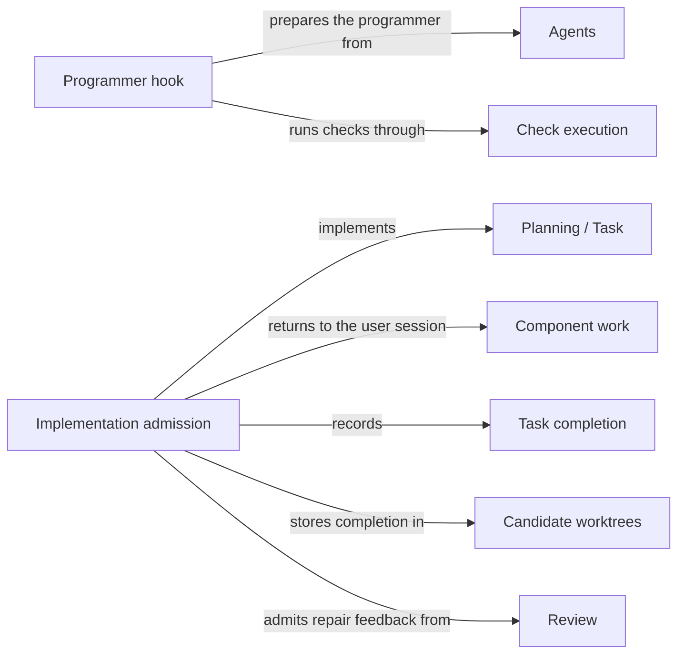

# Implementation

## Purpose

Implementation changes a Module's code to fulfil the tasks that Planning accepted. It provides the
Operation `concorde-implement`: one fresh programmer Agent edits, in the candidate worktree, the
files that the Module's realizations bind, and the Host records the tasks as complete only when the
programmer reports every task fulfilled and the result passes the Host's checks. Implementation
does not change Specs, does not run the final checks or reviews, and does not make a candidate
ready or deliver it. Work that belongs to another Module goes back to the user session as component
work.

## Terminology

| Term | Definition |
| --- | --- |
| Task completion | The Host's record that every local task of the accepted list is fulfilled, together with the digest of the Module's implementation files at that moment. |
| Component work | The tasks of an accepted list that target another Module of the change scope, returned to the caller as that Module's component task instead of being implemented here. |
| [User session](../vocabulary.md#concept.concorde.user-session) | |
| [Host](../vocabulary.md#concept.concorde.host) | |
| [Module](../vocabulary.md#concept.concorde.module) | |
| [Spec](../vocabulary.md#concept.concorde.spec) | |
| [Operation](../operations/module.md#concept.operations.operation) | |
| [Plan](../planning/module.md#concept.planning.plan) | |
| [Task](../planning/module.md#concept.planning.task) | |
| [Change scope](../planning/module.md#concept.planning.change-scope) | |
| [Pending gap](../planning/module.md#concept.planning.pending-gap) | |
| [Agent](../agents/module.md#concept.agents.agent) | |
| [Candidate](../harness/worktrees/module.md#concept.worktrees.candidate) | |
| [Required review](../review/module.md#concept.review.required-review) | |
| [Finding](../review/module.md#concept.review.finding) | |

Local tasks are the tasks that target the selected Module itself; the programmer works only on
those. Component work is everything else in the list.

## Usage

### Before calling

`concorde-implement` needs a managed candidate in which [Planning](../planning/module.md) has
accepted a current plan and task list for the target. The request repeats the plan's `target_id`,
`task` and `constraints`. If the candidate records a
[required review](../review/module.md#concept.review.required-review) of the Module's Spec, that
review must be current, and no [pending gap](../planning/module.md#concept.planning.pending-gap) may
block the step.

### A normal run

<a id="concept.implementation.completion"></a>

The user session calls `concorde-implement` and receives a prepared Agent call. It invokes the call
unchanged. The programmer receives the Module's frozen Spec context, the accepted plan and the
local tasks, and an index that names the candidate worktree and the files it is meant to write: the
entries of the Module's realizations. It edits those files in place, not copies, and may run the
Module's configured checks through its `run_checks` tool. It returns every local task with its
identity, target, description and acceptance unchanged, marked complete only if fulfilled.

When the call returns, the Host accepts the answer only if every local task comes back complete and
unchanged, and every non-pending file that the Module's realizations list exists. It then records
**task completion**: the tasks are marked complete, the digest of the implementation files is
stored, earlier check results are cleared, and the target's phase becomes `implementation`. The user
session then chooses the next steps, typically `concorde-code-review` and `concorde-validate`.

If the code review finds blocking problems, the user session asks Planning for repaired tasks with
the review's [findings](../review/module.md#concept.review.finding), then implements again; the
programmer then also receives that review as feedback.

### Component work

<a id="concept.implementation.component-work"></a>

A task list may include **component work**: tasks for another Module of the target's
[change scope](../planning/module.md#concept.planning.change-scope), for example a Module it uses, a
child, or a participant of a contract whose version the change raises. The programmer never works
on another Module's tasks. Instead, `concorde-implement` returns the outcome `unsupported` with a
typed `components` field, one entry per component with its `target_id` and the exact component task
that Planning derives from its tasks, without starting a programmer:

```json
{"outcome": "unsupported",
 "components": [{"target_id": "module.checkout",
                 "task": "Accept payment contract version 3\nAcceptance: checkout requires version 3"}]}
```

The user session then plans, derives tasks for and implements each component with that exact task,
in the same candidate. When it calls `concorde-implement` for the owner again, the Host checks that
each component's recorded work has that task and the owner's constraints, is complete, and is
current for the component's Spec and implementation. Only then does the programmer run for the
local tasks. If there are no local tasks, the Host records completion without starting a programmer.
The whole change stays one candidate: validating the owner afterwards covers every Module the
candidate edited, and delivering that candidate lands all of them together.

### Shared files

A file may be bound by several Modules. A programmer that may write such a file writes promises of
every Module that binds it, so Implementation binds the programmer call to the target Module and to
every other Module that binds one of the target's files. The call then reads the Spec contexts of
all of them, and the change is a multi-Module change: every binding Module is in the target's change
scope, and Review and Validation cover each of them. The programmer's intended files stay the
target's own realization entries; the other binders' own tasks are still component work.

### When implementation stops

Before any Agent starts, the request is refused when a required Spec review is not current
(`review_required`), a pending gap blocks the step (`spec_incomplete`), there is no managed
candidate (`missing_change`), the plan is stale (`stale_context`) or belongs to another task
(`incompatible_handoff`), there is no task list (`missing_tasks`), a task targets a Module outside
the change scope (`permission_denied`), the project's Specs do not validate
(`incompatible_contracts`), or there are local tasks but the Module binds no implementation files
(`unsupported_target`).

After the programmer ran, a missing, changed or incomplete task, or a listed file that does not
exist, is reported as `incomplete_tasks`. Edits the programmer made stay in the candidate: there is
no rollback. A failed, cancelled or rejected run leaves the candidate for inspection, and a retry
admits the current inputs afresh without any wider permission.

## Design

Implementation keeps one programmer to one Module's tasks. A task list may reach into components,
but a programmer that worked on them would silently take over another Module's change and break
promises it was never asked to keep. Returning component work as a typed field keeps each Module's
tasks inside the change of the Module that owns them, even when one change must edit several Modules
to stay valid, and the Host's later check of each component's recorded work ensures that a component
label cannot stand in for work that was never done. The field is typed rather than a sentence in the
answer, so the user session can act on it without parsing prose.

Completion is narrow on purpose. Marking tasks complete says only that the programmer's acceptance
conditions are met in the candidate. Independent review, validation and delivery each need their
own current evidence, so a quick completion can never be mistaken for a ready change.

The programmer edits the real candidate files, because copies would have to be merged back and
could drift. The price is that a failed run can leave partial edits. The Host therefore records
nothing until an answer is accepted, and a retry starts from the candidate as it is. While the
programmer works, its own edits must not make its inputs look stale: the Host checks the answer
against the snapshot it prepared and allows the Module's implementation files to change, while the
Spec, registry, configuration, plan, tasks and review feedback must stay as they were.

**Not enforced.** The programmer has an unconfined shell and ordinary write and edit tools.
Concorde deliberately does not confine its edits, its commands or its network use to the Module's
files: the file limits, and the promise not to use the network or credentials, are instructions
to the Agent, and the index says so explicitly. Nothing stops the programmer from editing another
Module's file or from starting the launcher through its shell. What the Host does enforce is
acceptance: completion is recorded only for the exact tasks, and review and validation look at the
candidate as it actually is. The `run_checks` tool is different: it takes no arguments and runs the
configured checks inside the read-only check boundary.

<a id="realization.implementation.declaration"></a>

The **implementation declaration** is the catalog entry of `concorde-implement`, including its
response schema with the `components` field, and the guidance the Pi session shows for it.

<a id="realization.implementation.hook"></a>

The **programmer hook** is Implementation's Agent hook: it supplies the programmer's stage inputs
and index, validates the answer and records task completion.

<a id="realization.implementation.admission"></a>

The **implementation admission** code checks the prerequisites, separates local tasks from
component work, compares recorded component work with the derived component tasks, and records task
completion in the candidate.

<a id="realization.implementation.tests"></a>

The **Implementation tests** cover a scripted native programmer run against a real candidate and
the review of its result.

## Relationships



<a id="uses-planning"></a>

**Planning** supplies the accepted [plan](../planning/module.md#concept.planning.plan) and
[task](../planning/module.md#concept.planning.task) list in the form of the
[implementation task contract](../planning/workflow.md#contract.planning.implementation-task),
guarantees that every task targets a Module in the target's
[change scope](../planning/module.md#concept.planning.change-scope), as
[accept only valid new task lists](../planning/workflow.md#req.planning.tasks-admission) states,
and keeps the [pending gaps](../planning/module.md#concept.planning.pending-gap) that
[stop later steps](../planning/workflow.md#req.planning.pending-gap-blocks), including this one.
Implementation derives each component's task by the contract's rule, relies on Planning to admit
the component's own requests only as [component requests](../planning/workflow.md#req.planning.component-request),
and never edits the plan or the tasks' descriptions and acceptance conditions; it only marks tasks
complete.

<a id="uses-operations"></a>

**Operations** catalogs `concorde-implement` as an [Operation](../operations/module.md#concept.operations.operation)
in the [Operation catalog](../operations/module.md#concept.operations.catalog), a single Agent call
whose entry point is the programmer hook.

<a id="uses-admission"></a>

**Request admission** checks the [capability request](../harness/admission/module.md#concept.admission.capability-request),
binds the candidate and wraps the outcome, including the `components` field, in the
[result envelope](../harness/admission/module.md#concept.admission.result-envelope).

<a id="uses-context"></a>

**Task context** freezes the programmer's [context snapshot](../harness/context/module.md#concept.context.snapshot)
in the `implementation` [phase](../harness/context/module.md#concept.context.phase), the one phase
whose Agent receives implementation contents, bound to every Module the call is bound to.
Implementation passes the plan, the local tasks and any repair review as
[stage inputs](../harness/context/module.md#concept.context.stage-input), and relies on the snapshot's
recheck, which lets the implementation files change and nothing else, before it accepts an answer.

<a id="uses-execution"></a>

**Agent execution** runs the programmer as a native [Agent call](../harness/execution/module.md#concept.execution.agent-call)
through Implementation's [Agent hook](../harness/execution/module.md#concept.execution.agent-hook).
Implementation treats the programmer's answer as a [proposal](../harness/execution/module.md#concept.execution.proposal)
that passes the [result gate](../harness/execution/module.md#concept.execution.result-gate) before
the hook records anything: a run that failed, was cancelled or cannot be verified records no
completion.

<a id="uses-checks"></a>

**Check execution** runs the Module's [configured checks](../harness/checks/module.md#concept.checks.configured-check)
inside the [read-only check boundary](../harness/checks/module.md#concept.checks.read-only-boundary)
when the programmer calls `run_checks`, and returns each [check result](../harness/checks/module.md#concept.checks.check-result).
Implementation passes no command or path to it and records no check result as readiness.

<a id="uses-agents"></a>

**Agents** defines the programmer. Implementation prepares the [Agent](../agents/module.md#concept.agents.agent)
from its [Agent definition](../agents/module.md#concept.agents.definition), whose tool list includes
the shell, and adds no delegation.

<a id="uses-worktrees"></a>

**Candidate worktrees** holds the [change status](../harness/worktrees/module.md#concept.worktrees.change-status)
of the [candidate](../harness/worktrees/module.md#concept.worktrees.candidate), where Implementation
reads the tasks and component records and writes task completion. The programmer's edits are meant
for that candidate's worktree.

<a id="uses-spec"></a>

**Spec tooling** resolves the target, its components and their revisions from the
[registry](../spec/module.md#concept.spec.registry), computes the Module's
[boundary sets](../spec/module.md#concept.spec.boundary-set), whose realization entries become the
programmer's intended files, and names the binding Modules of each file through its
[impact indexes](../spec/module.md#concept.spec.impact-index). Its
[structural checks](../spec/module.md#concept.spec.structural-check) must pass for the whole project
before a programmer starts, so no code is written against Specs that disagree with each other.

<a id="uses-review"></a>

**Review** decides whether the Module's [required review](../review/module.md#concept.review.required-review)
of its Spec is current, as [the required Spec review gates planning and implementation](../review/requirements.md#req.review.spec-gate)
states, and supplies the code review whose blocking [findings](../review/module.md#concept.review.finding)
a repair addresses, following [repair feedback comes only from the current blocking code review](../review/requirements.md#req.review.repair-feedback).
Implementation receives that [review result](../review/module.md#concept.review.result) in the
[review result contract](../review/contracts.md#contract.review.result), checks it before the
programmer starts and treats it as fixed input afterwards, so the programmer's own repair does not
make it look stale.
