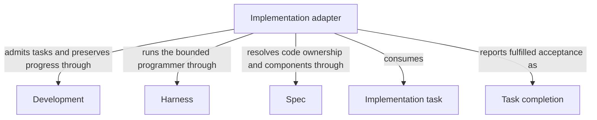

# Implementation

## Purpose

Implementation fulfills accepted tasks by changing the code that its worker is allowed to access. It reports which tasks are complete without weakening their acceptance conditions. Independent checks, review, readiness and delivery remain separate decisions.

## Terminology

| Term | Meaning / definition |
| --- | --- |
| [Spec](../concepts.md#terminology) | Defined in Concepts for reading Concorde. |
| [Worker](../concepts.md#terminology) | Defined in Concepts for reading Concorde. |
| [Grant](../concepts.md#terminology) | Defined in Concepts for reading Concorde. |
| [Candidate](../concepts.md#terminology) | Defined in Concepts for reading Concorde. |

## Usage

A declared composing capability calls `implement` with a current accepted plan and nonempty task
list for one selected Module. This is a private bound provider, not a directly invocable Skill.
The programmer receives the complete Module Spec and the implementation paths its own entities
bind, and must return every admitted task with unchanged identity and acceptance. Only fulfilled
tasks are complete; completion is not validation, readiness or delivery.

Missing tasks reject before launch. Incomplete output cannot establish fulfillment. Authorized
edits may remain after execution failure, so inspect preserved candidate state and re-admit current
artifacts rather than assuming rollback. A listed test does not grant its transitive inputs:
record unavailable repository-level execution as deferred host verification, not as a pass.
Coordination with other Modules requires their separate contexts and the existing enclosing-flow
adapter; no arbitrary scheduler is accepted. See [implementation](implementation.md) for writable
boundaries, deferred checks, component limits and recovery.

## Design

The implementation adapter admits current plan/task artifacts, launches one programmer under the
selected Module's implementation grant, and validates exact returned task identities and acceptance
before storing completion. Code edits are made inside the candidate, so execution failure can
leave authorized partial edits; progress and currentness checks support recovery rather than a
fictional rollback guarantee.

[Component coordination](execution-reference.md#implementation-component-coordination-and-current-adapter-limit)
separates local tasks from participant work and delegates scheduling/final shared-consumer checks
to the existing enclosing Flow. This shared realization does not transfer those Flow completion
conditions to the reusable local task contract.

## Relationships

This view follows an admitted Implementation task to Task completion. Spec determines the selected
Module's implementation boundary, Harness enforces the programmer's grant, and Development admits
the exact task list and retains its progress. The adapter's use of these sibling providers does not
merge their ownership or permissions. Task completion reports fulfilled acceptance only; validation,
review and delivery remain separate decisions of the composing Flow.

### Development

Admit the current implementation task and permitted repair feedback, persist exact task progress and preserve the candidate on failure.

This collaboration applies before implementation starts and when its returned task completion or execution failure is recorded.

- [Host admission](../development/interfaces.md#capability-execution-boundary); Recheck admitted intent and returned identities before accepting host state; a rejected result cannot advance the dependent step.

### Harness

Bind a fresh programmer to the complete selected contract and enforce writes only to that Module's granted implementation paths.

This collaboration applies when launching the programmer or admitting its matching completion under the current grant.

- [Complete context selection](../harness/contracts.md#contract.context.selection); Supply only mode-admitted inputs and require a matching completion; unavailable enforcement stops execution without a wider grant.

### Spec

Resolve the selected Module's implementation entries, current files, contract and direct component relationships.

This collaboration applies when deriving a local code grant or admitting separately bound component work and rechecking revisions.

- [Owner and context resolution](../spec/contracts.md#registry-stable-id-spec-context-queries); Reconstruct current resolutions after input changes; unresolved ownership, missing required definitions or stale revisions block dependent use.

## Precise specifications

The Implementation Module owns the exact obligations and interface details in [requirements](requirements.md), [scenarios](scenarios.md).
These companions are part of the same complete Module specification, not separate topic owners.
