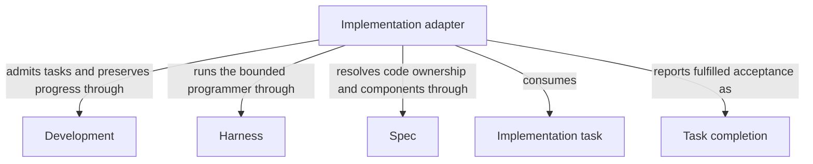

```concorde-document
{
  "id": "document.implementation.module",
  "owner": "module.implementation",
  "main_visible": true
}
```

# Implementation

## Purpose

Implementation fulfills an admitted task list within the selected Module implementation grant and reports exact task completion. It serves composing capabilities that supply current plans and tasks, and distinguishes local code writing from separately admitted component coordination.

## Requirements

### req.implementation.admitted-contract — Preserve task identity and acceptance

Implementation SHALL preserve every admitted task identity and acceptance condition when reporting completion.

## Scenarios

### scenario.implementation.admitted-work — Return complete fulfillment of the admitted tasks

- GIVEN a current accepted plan and nonempty task list bound to a selected Module
- WHEN the worker fulfills every task's acceptance within that Module's implementation grant and returns the complete task list
- THEN the host accepts completion only for those same tasks with their IDs and acceptance preserved and all complete flags true
- AND the host records accepted progress without declaring ready or changing Specs

The detailed contract is [Exact tasks and bounded code effects](implementation.md).

## Ontology

### Entities

```concorde-entities
[
  {
    "id": "entity.implementation.adapter",
    "title": "Implementation adapter",
    "kind": "shared program",
    "responsibility": "Implementation fulfills an admitted task list within the selected Module implementation grant and reports exact task completion. It serves composing capabilities that supply current plans and tasks, and distinguishes local code writing from separately admitted component coordination.",
    "files": [
      "capabilities/implement.py"
    ]
  },
  {
    "id": "entity.implementation.development",
    "title": "Development",
    "kind": "used module",
    "target_id": "module.development",
    "responsibility": "Admit the current implementation task and permitted repair feedback, persist exact task progress and preserve the candidate on failure."
  },
  {
    "id": "entity.implementation.harness",
    "title": "Harness",
    "kind": "used module",
    "target_id": "module.harness",
    "responsibility": "Bind a fresh programmer to the complete selected contract and enforce writes only to that Module's granted implementation paths."
  },
  {
    "id": "entity.implementation.spec",
    "title": "Spec",
    "kind": "used module",
    "target_id": "module.spec",
    "responsibility": "Resolve the selected Module's implementation entries, current files, contract and direct component relationships."
  },
  {
    "id": "entity.implementation.task-input",
    "title": "Implementation task",
    "kind": "record",
    "responsibility": "Admitted plan and exact task list under the selected Module grant."
  },
  {
    "id": "entity.implementation.completion",
    "title": "Task completion",
    "kind": "record",
    "responsibility": "Accepted exact task fulfillment, distinct from readiness and delivery."
  }
]
```

### Relationships



## Dependencies and composition

```concorde-dependencies
[
  {
    "target_id": "module.development",
    "responsibility": "Admit the current implementation task and permitted repair feedback, persist exact task progress and preserve the candidate on failure.",
    "selection_condition": "Before implementation starts and when its returned task completion or execution failure is recorded.",
    "relied_upon_promises": [
      "[Host admission](../development/interfaces.md#capability-execution-boundary); Recheck admitted intent and returned identities before accepting host state; a rejected result cannot advance the dependent step."
    ]
  },
  {
    "target_id": "module.harness",
    "responsibility": "Bind a fresh programmer to the complete selected contract and enforce writes only to that Module's granted implementation paths.",
    "selection_condition": "When launching implementation mode or admitting its matching completion under the current grant.",
    "relied_upon_promises": [
      "[Complete context selection](../harness/context.md#contract.context.selection); Supply only mode-admitted inputs and require a matching completion; unavailable enforcement stops execution without a wider grant."
    ]
  },
  {
    "target_id": "module.spec",
    "responsibility": "Resolve the selected Module's implementation entries, current files, contract and direct component relationships.",
    "selection_condition": "When deriving a local code grant or admitting separately bound component work and rechecking revisions.",
    "relied_upon_promises": [
      "[Owner and context resolution](../spec/registry.md#stable-id-spec-context-queries); Reconstruct current resolutions after input changes; unresolved ownership, missing required definitions or stale revisions block dependent use."
    ]
  }
]
```

## Realization and reuse limits

This Module and its consumers are siblings under Concorde Framework. Declared files explicitly
share the existing adapter realization with Development; no new runtime package, public Skill,
Agent grant or configurable arbitrary flow is created by this Spec boundary. Host admission,
phase artifacts and permissions remain mandatory. A new flow requires declared composition and
an implementation of its sequencing, artifact admission, recovery and completion policies before
it can execute. The existing host package still realizes common dispatch and provider internals.
