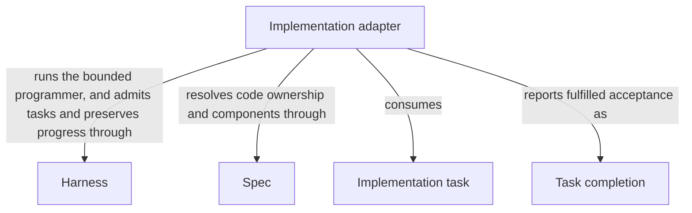

# Implementation

## Purpose

Implementation fulfills accepted tasks by changing the code that its worker is allowed to access. It reports which tasks are complete without weakening their acceptance conditions. Independent checks, review, readiness and delivery remain separate decisions.

## Terminology

| Term                                                      | Meaning / definition               |
| --------------------------------------------------------- | ---------------------------------- |
| [Spec](../module.md#terminology)                          | Defined in Concorde Framework.     |
| [Module](../module.md#terminology)                        | Defined in Concorde Framework.     |
| [Worker](../module.md#terminology)                        | Defined in Concorde Framework.     |
| [Host](../module.md#terminology)                          | Defined in Concorde Framework.     |
| [Grant](../module.md#terminology)                         | Defined in Concorde Framework.     |
| [Candidate](../module.md#terminology)                     | Defined in Concorde Framework.     |
| [Ready](../module.md#terminology)                         | Defined in Concorde Framework.     |
| [Delivery](../module.md#terminology)                      | Defined in Concorde Framework.     |
| [Acceptance task](../planning/tasks.md#terminology)       | Defined in Making work verifiable. |
| [Internal operation](../operations/module.md#terminology) | Defined in Operations.             |
| [Pi integration](../module.md#terminology)                | Defined in Concorde Framework.     |
| [Graph](../module.md#terminology)                         | Defined in Concorde Framework.     |
| [Entity](../module.md#terminology)                        | Defined in Concorde Framework.     |

## Usage

The calling agent invokes `concorde-implement` with a current accepted plan and nonempty task
list for one selected Module. This is a public explicitly target-bound native Agent capability.
The programmer receives the complete Module Spec and the implementation paths its own entities
bind, and must return every admitted task with unchanged identity and acceptance. Only fulfilled
tasks are complete; completion is not validation, readiness or delivery.

Missing tasks reject before launch. Incomplete output cannot establish fulfillment. Authorized
edits may remain after a failed or cancelled run, so inspect preserved candidate state and re-admit
current artifacts rather than assuming rollback. A listed test does not authorize its transitive inputs:
record unavailable repository-level execution as deferred host verification, not as a pass.
Coordination with other Modules returns their separately selectable work to the caller; no arbitrary
scheduler or automatic child development is accepted.

For example, a test may import a fixture outside the programmer's allowed files. That import does
not grant access. The programmer records why execution must be deferred to a host-level check and
continues independent work. Deferred execution is not a passing test, while an actual defect still
prevents task completion. Final host checks remain required.

## Design

The implementation adapter admits current plan/task artifacts, launches one programmer under the
selected Module's implementation grant, and validates exact returned task identities and acceptance
before storing completion. Code edits are made inside the candidate, so execution failure can
leave authorized partial edits; progress and currentness checks support recovery rather than a
fictional rollback guarantee.

[Caller-selected component work](execution-reference.md#implementation-component-coordination-and-current-adapter-limit)
keeps local tasks separate from component obligations. When participating work is missing or stale,
implementation returns its exact target and intended task to the calling agent. The agent selects
component capabilities and performs any contract edits; there is no automatic authoring, development
or stabilization workflow. On retry, the host checks every component's current intent and completed
revision before one bounded local programmer runs. This prevents a component label from granting
another Module's code or turning an old completion into fresh evidence.

### Flow overview

The caller completes separately selected component work, then invokes implementation for local
accepted tasks. The host validates contract structure and component evidence, gives one programmer
only its local code grant, and records exact task completion. The caller then chooses checks and
independent review; changed shared files invalidate earlier consumer evidence.

## Relationships

This view follows an admitted Implementation task to Task completion. [Spec Module](../spec/module.md) determines the selected
Module's implementation boundary, [Harness Module](../harness/module.md) binds the programmer's intended scope and independently admits completion, and [Harness admission](../harness/admission.md) admits
the exact task list and retains its progress. The adapter's use of these sibling providers does not
merge their ownership or permissions. Task completion reports fulfilled acceptance only; validation,
review and delivery remain separate caller/Host decisions.

### Harness

Bind a fresh programmer to the complete selected contract and state intended writes only to that Module's listed implementation paths.

This collaboration applies when launching the programmer or admitting its matching completion under the current grant.

Admit the current implementation task and permitted repair feedback, persist exact task progress and preserve the candidate on failure.

This collaboration applies before implementation starts and when its returned task completion or execution failure is recorded.

- [Complete context selection](../harness/contracts.md#contract.context.selection); Supply only mode-admitted inputs and require a matching completion; native file/network/credential bounds remain explicit model policy; configured-check subprocess enforcement is separate.
- [Host admission](../harness/admission.md#operation-execution-boundary); Recheck admitted intent and returned identities before accepting host state; a rejected result cannot advance the dependent step.

### Spec

Resolve the selected Module's implementation entries, current files, contract and direct component relationships.

This collaboration applies when deriving a local code grant or admitting separately bound component work and rechecking revisions.

- [Owner and context resolution](../spec/contracts.md#registry-stable-id-spec-context-queries); Reconstruct current resolutions after input changes; unresolved ownership, missing required definitions or stale revisions block dependent use.

## Precise specifications

The Implementation Module owns the exact obligations and interface details in [requirements](requirements.md), [scenarios](scenarios.md) and the
[execution and record contracts](execution-reference.md#implementation-implementation-operation).
These companions are part of the same complete Module specification, not separate topic owners.

The public entry prepares a real direct native programmer. Its capsule supplies file-Agent discovery,
frozen Specs/references and the index; the index names the actual assigned candidate and absolute
intended implementation paths. Native write/edit tools change that candidate, not scratch copies.
Broad file and shell tools are not OS-confined by this transport. Network/credential abstention is
model policy, not a claim of enforced denial. No delegation tools are supplied. The fixed Host
check service retains its real enforced subprocess boundary and records actual check outcomes.

### Agents

[Agents](../agents/module.md) owns callable role definitions and interaction. This Module consumes
those definitions rather than maintaining a role catalog or behavioral copy. It preserves the
role's family, scope and frozen grant and refuses missing or stale bindings; domain artifact
acceptance and execution mechanisms remain with their existing owners.
