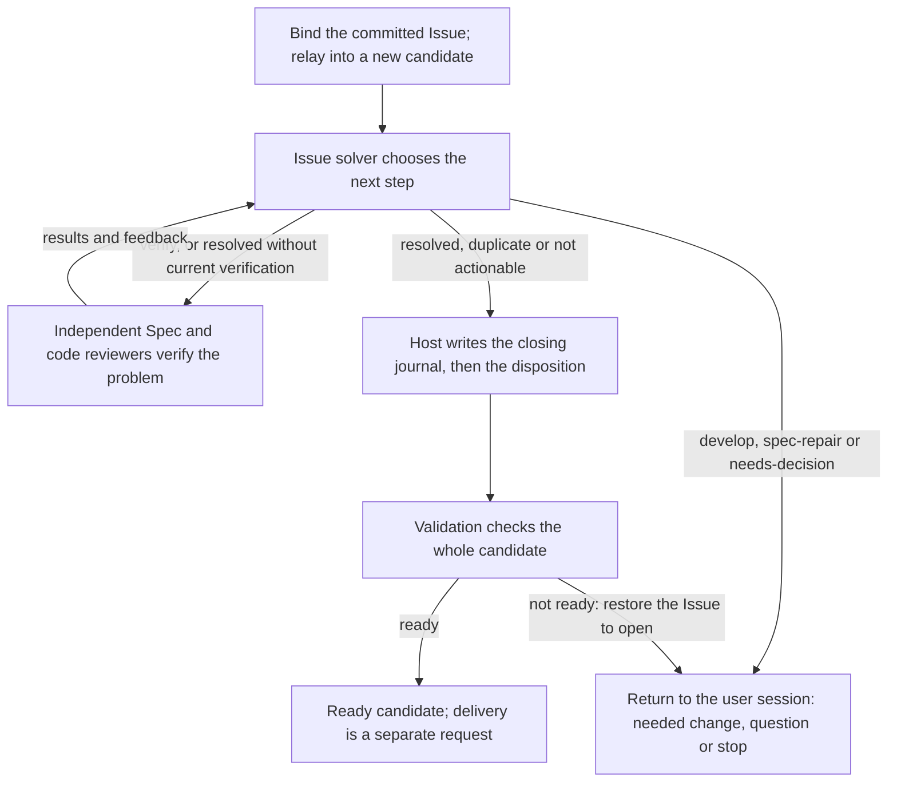

# Solving an Issue

This topic follows one `solve` request of [Issue solving](module.md) through its whole path: the
loop of solver decisions and verifications, closing through the journal, the ways a solve stops,
and recovery after an interruption, with the reasons for each choice. Exact fields, the step table
and the call layout are in [Solve workflow](workflow.md).

## The loop

Each turn begins with a Host step that counts the attempt and gives the solver its task material:
an [Issue selection](../issues/interface.md#contract.issues.selection) with the problem and impact
from the latest report, feedback from the previous turn, a summary of any current verification, the
developer's clarification if one was given, and up to five other open Issues of the same Module with
the same title and type as possible duplicates. After a verification with blocking findings the
solver also receives the [Issue context](../issues/interface.md#contract.issues.context) of the
reports those findings reference. The solver reads the Module's Specs and answers.

## Decisions

| Action | What the Host does |
| --- | --- |
| `develop` | Stops with outcome `unsupported` and returns the intended implementation work to the user session. Nothing is changed. |
| `spec-repair` | Stops with outcome `unsupported` and returns the missing or conflicting promise and the needed Spec change. Nothing is changed. |
| `needs-decision` | Stops with outcome `conflicting` and returns the precise product or design question. |
| `verify` | Runs independent verification, then asks the solver again. |
| `resolved` | Closes the Issue if the current inputs were verified; otherwise verifies first and asks again. |
| `duplicate` | Closes the Issue as a duplicate of one of the offered open Issues, if that Issue is unchanged. |
| `not-actionable` | Closes the Issue with the solver's contract-grounded reason. |

The solver never edits anything. After `develop` or `spec-repair`, the user session makes the change
itself or calls the planning and implementation capabilities in the same candidate, and then calls
`solve` again. The Issue stays open throughout, and every decision is kept in the solve history.

## Verification

Verification asks fresh reviewers to check the current candidate. For a Module
with implementation files there are four groups: an Issue-specific Spec review and code review,
told to confirm that this problem is actually resolved and not just worked around, and the ordinary
Spec review and code review of the Module. A Module without implementation files gets the two Spec
reviews. Each group fans out into one reviewer per member of that review's scope, and every
reviewer is a separate native child of the same workflow. Verification counts only when every
review completed, none reports a blocking finding, and the Module's Specs and implementation files
are byte for byte what they were when verification began. A review that still reports blocking
findings sends the solver round again with that feedback; a reviewer that fails to run stops the
solve as `failed`.

## Closing

Closing is two writes that must not be half done: the Issue gets a disposition, and
the change status records a completed solve. Between them sits final validation, which must see
the disposition so that the ready result covers it. The Host therefore first prepares the exact
closed bytes of the Issue, then saves a closing journal in the change status with the open bytes,
the closed bytes and their digests, and only then writes the disposition. The actor is
`concorde-issue-solver`, and the evidence is the solver's context identity plus any verification
identities. The Host then validates the candidate. If it is ready, the solve completes, the journal
is removed and the user session receives outcome `ready` with the disposition and the checks. If
not, the Host restores the open bytes, removes the journal, marks the change blocked and answers
`failed`; the Issue is open again and any other work in the candidate is untouched.

## Stops, limits and repeats

A solve returns to the user session in exactly these ways: ready; a
handed-back change; a question; the attempt limit (`conflicting`); a failed review, solver call or
validation (`failed`); a solver result that is not a decision, returned with its own outcome and
Blockers; or a refusal because something changed. The solver is asked at most six times for the
same inputs; the count resets when the Module's Specs or implementation files change, or when a new
`note` supplies a clarification, so the natural way to continue after handing work back is to make
the change and call `solve` again. Every Host step re-reads the Issue, the solve state and the
Module's inputs, and stops with a stale error rather than act on old evidence. Calling `solve` on an
Issue that is already closed in this worktree returns the existing disposition without running
anything. A `describe-policy` request describes the solve without preparing or launching anything.

## Recovering an interrupted close

If the process dies between saving the journal and completing,
the next solve of the same Issue in the same candidate finds the journal. It accepts the Issue only
if its bytes equal exactly the journal's open or closed image, withdraws any earlier ready state,
restores the open image (doing nothing if that is already on disk), clears the old verification and
continues with a fresh solve and fresh validation. If the Issue was closed by the solver with no
journal to prove which write it was, or the journal is corrupt, the Host refuses and asks for
explicit reconciliation instead of guessing. Recovery never creates another candidate and never
moves to another worktree.

## Why only committed Issues

The candidate starts from the primary branch's committed
state, so an Issue that is committed there is already in the candidate and needs no copying. An
uncommitted Issue would have to be copied in, delivered with the candidate and then collide with
the still-uncommitted file in the primary worktree, which blocks the primary merge. Refusing it
before a candidate exists keeps the whole flow on committed history.

## Why a journal

Every closed Issue in a candidate either passed final
validation with its disposition included or can be proven to be this solve's own unfinished write
and undone. The journal lives in the change status, in the section Candidate worktrees declares for
provider records, so it survives the process and is written with the same revision checks as the
rest of the status.

## Accepted autonomy

Closing an Issue as `duplicate` or `not-actionable` by one solver decision
is accepted behaviour: the decision is grounded in the admitted contract, recorded with its
evidence, validated with the candidate and reversible by `reopen`. Anything that needs a Spec or
code change is handed back instead, because an automatic loop may not repair a Spec gap.

## Open question

Possible duplicates are offered only when another open Issue of the same Module
has exactly the same title and type. Whether that is the intended matching rule or a placeholder is
not settled.

## Where the code lives

The solve services live in `src/concorde/issues/graph.py`, `src/concorde/issues/solve.py` and
`src/concorde/harness/native_issues.py`; they belong under `src/concorde/issue_solving/`.
