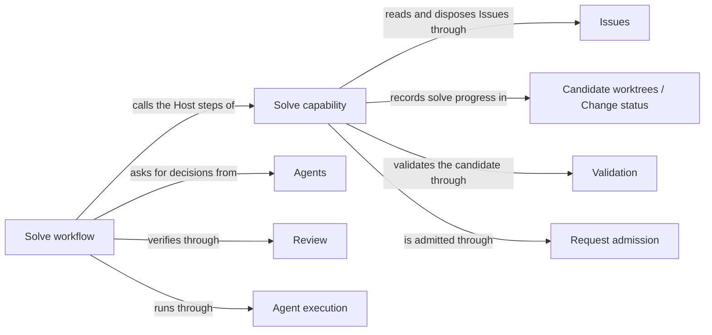

# Issue solving

## Purpose

Issue solving provides the `concorde-issues` capability. Its bookkeeping actions list, show, report
and reopen Issues in the current worktree; its `solve` action drives one selected Issue towards a
verified disposition in a candidate worktree, through a bounded workflow in which the Issue solver
Agent chooses the next step and independent reviewers verify the problem. A solve ends in a ready
candidate whose disposition was validated with it, or it hands the needed work, a question or a
stop reason back to the user session. Issue solving never edits code or Specs, never delivers or
merges, and never answers a product or design question itself. The records it reads and writes, and
the reporting service it uses for the `report` action, belong to Issues.

## Terminology

| Term | Definition |
| --- | --- |
| Solve decision | The Issue solver's choice of the next step for one selected Issue: hand work back, verify, close with a reason, or ask the developer. |
| Closing journal | A write-ahead record in the candidate's change status holding the exact open and closed bytes of an Issue that the solve is about to close. |
| [Developer](../vocabulary.md#concept.concorde.developer) | |
| [User session](../vocabulary.md#concept.concorde.user-session) | |
| [Capability](../vocabulary.md#concept.concorde.capability) | |
| [Host](../vocabulary.md#concept.concorde.host) | |
| [Module](../vocabulary.md#concept.concorde.module) | |
| [Evidence](../vocabulary.md#concept.concorde.evidence) | |
| [Issue](../issues/module.md#concept.issues.issue) | |
| [Issue report](../issues/module.md#concept.issues.report) | |
| [Disposition](../issues/module.md#concept.issues.disposition) | |
| [Candidate](../harness/worktrees/module.md#concept.worktrees.candidate) | |
| [Change status](../harness/worktrees/module.md#concept.worktrees.change-status) | |
| [Workflow](../harness/execution/module.md#concept.execution.workflow) | |
| [Host step](../harness/execution/module.md#concept.execution.host-step) | |
| [Agent](../agents/module.md#concept.agents.agent) | |
| [Finding](../review/module.md#concept.review.finding) | |
| [Ready](../validation/module.md#concept.validation.ready) | |

A solve decision is what the model proposes; the Host alone turns a closing decision into a
disposition, and the closing journal is what makes that write recoverable.

## Usage

The user session calls `concorde-issues` with one `action`. `list` and `show` return records;
`report` saves the developer's report through the reporting service of Issues; `reopen` with a
`note` appends a `reopened` disposition; `solve` with an `issue_id` and an optional `note` runs the
bounded solve workflow. The first four run in the current worktree and never create a candidate.
For `show`, `reopen` and `solve` the Host binds the Issue's revision and its owning Module before
choosing a worktree; a different `target_id` is refused with `permission_denied`, a stale
`expected_revision` with `stale_issue`, and `reopen` or `solve` of an Issue whose owner is no longer
registered with `unknown_target`.

**A normal solve.** For an open bug committed on the primary branch, the user session calls `solve`
from the primary worktree. An Issue that exists only as an uncommitted edit is refused with
`uncommitted_issue`, because a delivered copy would later collide with the uncommitted file and
block the primary merge. Request admission creates a candidate from the primary branch and relays
the request; the Host prepares the workflow `concorde.issue.<ticket>`, and the user session starts
its call with pi-subagents and polls for the result. Each turn a Host step gives the Issue solver an
[Issue selection](../issues/interface.md#contract.issues.selection) with the problem, feedback,
any verification summary and up to five possible duplicates; after a verification with blocking
findings it also gives the [Issue context](../issues/interface.md#contract.issues.context) of
their reports.

**Solve decisions.** The solver answers with an action, an intent and a rationale. `develop` and
`spec-repair` stop with outcome `unsupported` and hand the needed work back; `needs-decision` stops
with `conflicting` and the question; `verify` runs the Issue-specific and ordinary Spec and code
reviews and asks again; `resolved` closes only when the current inputs were verified, otherwise it
verifies first; `duplicate` and `not-actionable` close the Issue on the solver's own evidence
without a human approving it. The solver never edits anything; after a hand-back the user session
makes the change and calls `solve` again.

**Closing.** The Host saves a closing journal with the Issue's exact open and closed bytes in the
change status, then writes the disposition, then validates the candidate. A ready candidate
completes the solve with outcome `ready`; otherwise the Host restores the open bytes, marks the
change blocked and answers `failed`. After an interruption, the next solve in the same candidate
uses the journal to restore the open bytes and start fresh, and refuses when the bytes match
neither image. The solver is asked at most six times for the same inputs, every Host step re-reads
the Issue and the Module's inputs and stops on a change, and nothing is ever delivered. The full
path is explained in [Solving an Issue](design.md) and specified in [Solve workflow](workflow.md).

## Design

The solve capability declares `concorde-issues`: `solve` of an open Issue needs a candidate, every
other action runs in place, and its binding step runs before admission chooses a worktree. Binding
the owner from the record keeps a selection from widening any task's boundary. The same code holds
the solve state, the attempt counting, the closing journal and the solver's Agent hook.

The solve workflow is an authored pi workflow of at most six iterations of three Host steps and the
calls between them, because the loop is short and fixed. The script only sequences; every decision
about state, evidence and closure is Host code, so model output never closes an Issue by itself.
Only committed Issues are solved, so the flow stays on committed history; the journal makes every
close either validated or provably undoable. Closing as `duplicate` or `not-actionable` by one
decision is accepted because it is grounded, recorded, validated and reversible by `reopen`, while
anything needing a Spec or code change is handed back. Not enforced: as for every Agent call, reads
are not confined to the capsule. Open question: duplicates are offered only on an exact title and
type match.

The tests drive the bookkeeping actions and the solve services on fixture projects, and run the
workflow script against a native probe with fixture children.

## Relationships

**Issues** owns the [Issues](../issues/module.md#concept.issues.issue), their
[reports](../issues/module.md#concept.issues.report) and [dispositions](../issues/module.md#concept.issues.disposition),
and the reporting service the `report` action uses with the [report](../issues/interface.md#contract.issues.report)
shape. Issue solving relies on [revision-checked writes](../issues/requirements.md#req.issues.revision-checked)
to detect a changed Issue, on [restoring exact open bytes](../issues/scenarios.md#scenario.issues.store-restore)
to undo its own close, and on [listing Issues of unknown owners](../issues/scenarios.md#scenario.issues.unknown-owner-listed).
It builds the solver's [selection](../issues/interface.md#contract.issues.selection) and
[context](../issues/interface.md#contract.issues.context) in the shapes Issues defines, and decides
who may dispose: the workflow for closing reasons, the developer for reopening.

**Candidate worktrees** creates the [candidate](../harness/worktrees/module.md#concept.worktrees.candidate)
from the [primary worktree](../harness/worktrees/module.md#concept.worktrees.primary-worktree)'s
committed state and keeps the [change status](../harness/worktrees/module.md#concept.worktrees.change-status),
whose section for provider records holds the solve state and the journal. A status that cannot be
read, or that another writer changed, stops the solve.

**Request admission** receives every request. Issue solving's
[capability declaration](../harness/admission/module.md#concept.admission.capability-declaration)
says which actions need a candidate and names the binding step; for `solve` from the primary
admission creates the candidate, [relays](../harness/admission/module.md#concept.admission.relay)
the [request](../harness/admission/module.md#concept.admission.capability-request) and wraps the
answer in the [result envelope](../harness/admission/module.md#concept.admission.result-envelope).
Invalid selections are refused before admission continues.

**Agent execution** runs the [workflow](../harness/execution/module.md#concept.execution.workflow)
and each [Agent call](../harness/execution/module.md#concept.execution.agent-call). Each Host step
speaks the [Host-step protocol](../harness/execution/interfaces.md#contract.execution.host-step);
Issue solving implements the [workflow hook](../harness/execution/module.md#concept.execution.workflow-hook)
and the solver's [Agent hook](../harness/execution/module.md#concept.execution.agent-hook). A
decision or review counts only after the [result gate](../harness/execution/module.md#concept.execution.result-gate)
correlated its [proposal](../harness/execution/module.md#concept.execution.proposal) with a finished
native child; otherwise the solve stops without closing anything.

**Agents** defines the Issue solver [Agent](../agents/module.md#concept.agents.agent) and its
[definition](../agents/module.md#concept.agents.definition) with read-only tools and the solve
decision it returns. Issue solving supplies its task material and never gives it write access.

**Review** supplies the [Spec reviews](../review/module.md#concept.review.spec-review) and
[code reviews](../review/module.md#concept.review.code-review), each over its
[review scope](../review/module.md#concept.review.scope), and their [results](../review/contracts.md#contract.review.result)
with [findings](../review/module.md#concept.review.finding). A verification counts only when every
result is complete and none has a blocking finding.

**Validation** checks the whole candidate after the disposition is written, so a
[ready](../validation/module.md#concept.validation.ready) answer covers it; any other answer makes
Issue solving restore the Issue and answer `failed`.

**Spec tooling** resolves the Module's [boundary sets](../spec/module.md#concept.spec.boundary-set),
from which the solve's input revision is computed; a changed revision resets the attempt count or
stops a step as stale.
