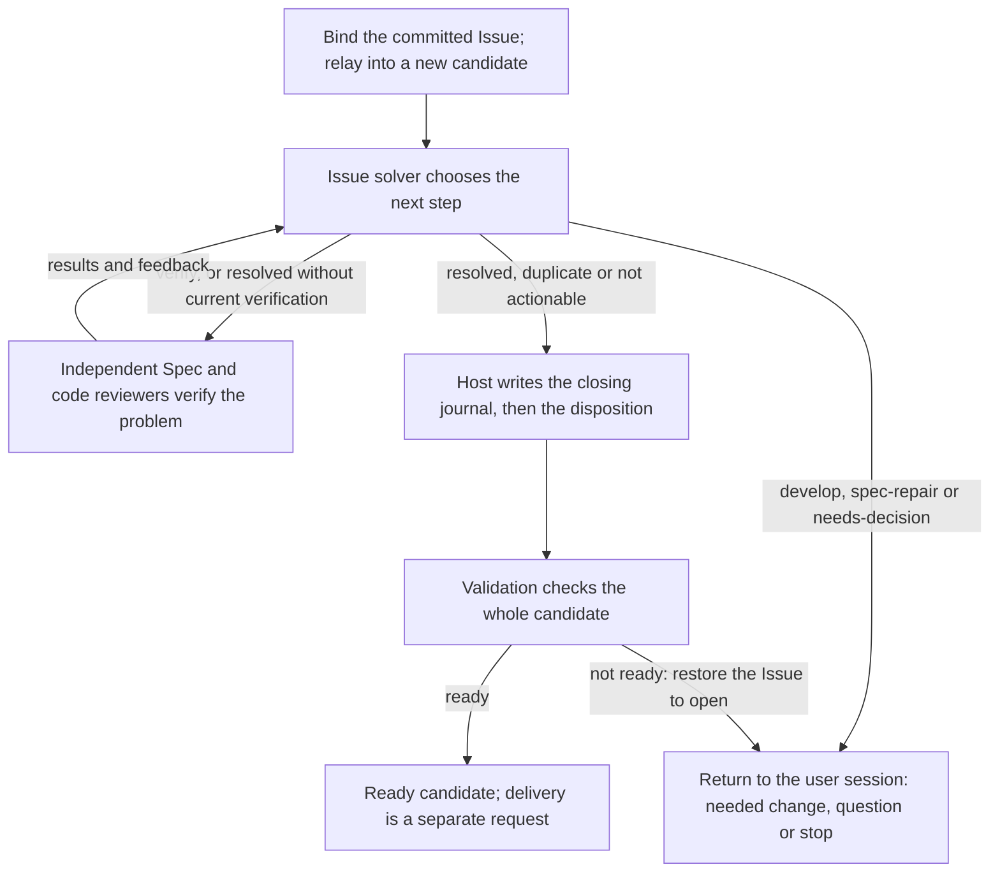
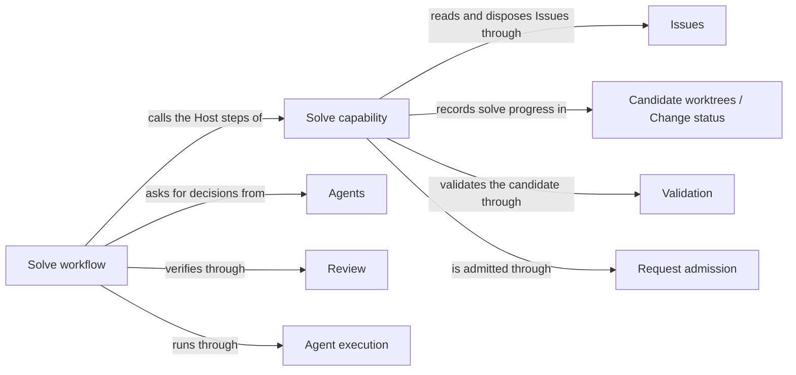

# Issue solving

## Purpose

Issue solving provides the `concorde-issues` capability. Its bookkeeping actions list, show, report
and reopen Issues in the current worktree; its `solve` action drives one selected Issue towards a
verified disposition in a candidate worktree, through a bounded workflow in which the Issue solver
Agent chooses the next step and independent reviewers verify the problem. A solve ends in a ready
candidate whose disposition was validated with it, or it hands the needed work, a question or a
stop reason back to the user session. Issue solving never edits code or Specs, never delivers or
merges, and never answers a product or design question itself. The records it reads and writes, and
the reporting service it uses for the `report` action, belong to Issues.

## Terminology

| Term | Definition |
| --- | --- |
| Solve decision | The Issue solver's choice of the next step for one selected Issue: hand work back, verify, close with a reason, or ask the developer. |
| Closing journal | A write-ahead record in the candidate's change status holding the exact open and closed bytes of an Issue that the solve is about to close. |
| [Developer](../vocabulary.md#concept.concorde.developer) | |
| [User session](../vocabulary.md#concept.concorde.user-session) | |
| [Capability](../vocabulary.md#concept.concorde.capability) | |
| [Host](../vocabulary.md#concept.concorde.host) | |
| [Module](../vocabulary.md#concept.concorde.module) | |
| [Evidence](../vocabulary.md#concept.concorde.evidence) | |
| [Issue](../issues/module.md#concept.issues.issue) | |
| [Issue report](../issues/module.md#concept.issues.report) | |
| [Disposition](../issues/module.md#concept.issues.disposition) | |
| [Candidate](../harness/worktrees/module.md#concept.worktrees.candidate) | |
| [Change status](../harness/worktrees/module.md#concept.worktrees.change-status) | |
| [Workflow](../harness/execution/module.md#concept.execution.workflow) | |
| [Host step](../harness/execution/module.md#concept.execution.host-step) | |
| [Agent](../agents/module.md#concept.agents.agent) | |
| [Finding](../review/module.md#concept.review.finding) | |
| [Ready](../validation/module.md#concept.validation.ready) | |

A solve decision is what the model proposes; the Host alone turns a closing decision into a
disposition, and the closing journal is what makes that write recoverable.

## Usage

**The actions.** The user session calls `concorde-issues` with one `action`:

| Action | Needs | What happens |
| --- | --- | --- |
| `list` | nothing; optional `target_id` filter | Returns the Issues in the current worktree. No model runs, nothing changes. |
| `show` | `issue_id` | Returns one Issue. No model runs, nothing changes. |
| `report` | `target_id` and a `report` | Saves the developer's report through the reporting service of Issues, with the developer as reporter and the Module's Spec context as its limits. |
| `reopen` | `issue_id` and a `note` | Appends a `reopened` disposition, with the developer as actor, to a closed Issue. |
| `solve` | `issue_id`, optional `note` | Runs the bounded solve workflow in a candidate worktree. |

The first four run in the current worktree, the primary worktree included, and never create a
candidate. A report or reopen made in the primary worktree is an ordinary uncommitted edit of the
Issue file, which the developer commits like any other. For inspection outside a Pi session the
Issues Module offers `scripts/issues.py`.

**Binding the selected Issue.** For `show`, `reopen` and `solve` the Host reads the Issue before
any worktree is chosen and binds its revision and its owning Module: the owner named in the latest
report, or the reporting Module when no owner is named. A supplied `target_id` that differs is
refused with `permission_denied`, so selecting an Issue can never redirect work to another Module,
and a supplied `expected_revision` that no longer matches is refused with `stale_issue`. `list` and
`show` work even when the owner is no longer a registered Module; `reopen` and `solve` refuse such
an Issue with `unknown_target`.

**A normal solve.** Take an open bug report saying that a transfer leaves the balance unchanged,
committed on the primary branch. The user session calls `solve` from the primary worktree. The Host
checks that the Issue's file is committed there exactly as it is on disk; an Issue that exists only
as an uncommitted edit is refused with `uncommitted_issue`, because a copy delivered from a
candidate would later collide with the uncommitted file and block the primary merge. Request
admission then creates a candidate from the primary branch, where the Issue is already present,
and relays the request into it. The Host prepares a native workflow named `concorde.issue.<ticket>`
and returns its call; the user session starts that call with pi-subagents and polls the capability
for the result. The workflow alternates between the Issue solver and independent reviewers:

Each turn begins with a Host step that counts the attempt and gives the solver its task material:
an [Issue selection](../issues/interface.md#contract.issues.selection) with the problem and impact
from the latest report, feedback from the previous turn, a summary of any current verification, the
developer's clarification if one was given, and up to five other open Issues of the same Module with
the same title and type as possible duplicates. After a verification with blocking findings the
solver also receives the [Issue context](../issues/interface.md#contract.issues.context) of the
reports those findings reference. The solver reads the Module's Specs and answers.

**What the solver can decide.** A solve decision has an `action`, an `intent`, a `rationale` and,
for duplicates, the other Issue's identity. The Host routes each action differently:

| Action | What the Host does |
| --- | --- |
| `develop` | Stops with outcome `unsupported` and returns the intended implementation work to the user session. Nothing is changed. |
| `spec-repair` | Stops with outcome `unsupported` and returns the missing or conflicting promise and the needed Spec change. Nothing is changed. |
| `needs-decision` | Stops with outcome `conflicting` and returns the precise product or design question. |
| `verify` | Runs independent verification, then asks the solver again. |
| `resolved` | Closes the Issue if the current inputs were verified; otherwise verifies first and asks again. |
| `duplicate` | Closes the Issue as a duplicate of one of the offered open Issues, if that Issue is unchanged. |
| `not-actionable` | Closes the Issue with the solver's contract-grounded reason. |

The solver never edits anything. After `develop` or `spec-repair`, the user session makes the change
itself or calls the planning and implementation capabilities in the same candidate, and then calls
`solve` again. The Issue stays open throughout, and every decision is kept in the solve history.
A solver may close an Issue as `duplicate` or `not-actionable` on its own evidence, without a human
approving that decision; the final validation still has to pass.

**Verification.** Verification asks fresh reviewers to check the current candidate. For a Module
with implementation files there are four groups: an Issue-specific Spec review and code review,
told to confirm that this problem is actually resolved and not just worked around, and the ordinary
Spec review and code review of the Module. A Module without implementation files gets the two Spec
reviews. Each group fans out into one reviewer per member of that review's scope, and every
reviewer is a separate native child of the same workflow. Verification counts only when every
review completed, none reports a blocking finding, and the Module's Specs and implementation files
are byte for byte what they were when verification began. A review that still reports blocking
findings sends the solver round again with that feedback; a reviewer that fails to run stops the
solve as `failed`.

**Closing.** Closing is two writes that must not be half done: the Issue gets a disposition, and
the change status records a completed solve. Between them sits final validation, which must see
the disposition so that the ready result covers it. The Host therefore first prepares the exact
closed bytes of the Issue, then saves a closing journal in the change status with the open bytes,
the closed bytes and their digests, and only then writes the disposition. The actor is
`concorde-issue-solver`, and the evidence is the solver's context identity plus any verification
identities. The Host then validates the candidate. If it is ready, the solve completes, the journal
is removed and the user session receives outcome `ready` with the disposition and the checks. If
not, the Host restores the open bytes, removes the journal, marks the change blocked and answers
`failed`; the Issue is open again and any other work in the candidate is untouched.

**Stops, limits and repeats.** A solve returns to the user session in exactly these ways: ready; a
handed-back change; a question; the attempt limit (`conflicting`); a failed review, solver call or
validation (`failed`); a solver result that is not a decision, returned with its own outcome and
Blockers; or a refusal because something changed. The solver is asked at most six times for the
same inputs; the count resets when the Module's Specs or implementation files change, or when a new
`note` supplies a clarification, so the natural way to continue after handing work back is to make
the change and call `solve` again. Every Host step re-reads the Issue, the solve state and the
Module's inputs, and stops with a stale error rather than act on old evidence. Calling `solve` on an
Issue that is already closed in this worktree returns the existing disposition without running
anything. A `describe-policy` request describes the solve without preparing or launching anything.

**Recovering an interrupted close.** If the process dies between saving the journal and completing,
the next solve of the same Issue in the same candidate finds the journal. It accepts the Issue only
if its bytes equal exactly the journal's open or closed image, withdraws any earlier ready state,
restores the open image (doing nothing if that is already on disk), clears the old verification and
continues with a fresh solve and fresh validation. If the Issue was closed by the solver with no
journal to prove which write it was, or the journal is corrupt, the Host refuses and asks for
explicit reconciliation instead of guessing. Recovery never creates another candidate and never
moves to another worktree.

The exact request, state, step table and call layout are in [Solve workflow](workflow.md).

## Design

**The capability** declares `concorde-issues` and holds its Host steps. Its declaration tells
admission that `solve` of an open Issue needs a candidate and every other action runs in place,
and names its request binding as the target-selection step admission calls before choosing a
worktree. Binding the owner from the record, not from the request, keeps a selection from widening
any task's boundary. The same code holds the solve state kept in the change status, the attempt
counting, the closing journal and its recovery, and the solver's Agent hook: it prepares the
solver's selection, checks the returned decision and accepts it.

**A pi workflow, not a Graph.** The loop is short and fixed, so it is an authored workflow script
run by pi-subagents: at most six iterations of three Host steps and the model calls between them.
The script only sequences calls and checks a small control message from each Host step; every
decision about state, evidence and closure is made by Host code that re-reads the Issue, the solve
state and the current inputs at each step. This keeps model output from ever closing an Issue by
itself.

**Only committed Issues are solved.** The candidate starts from the primary branch's committed
state, so an Issue that is committed there is already in the candidate and needs no copying. An
uncommitted Issue would have to be copied in, delivered with the candidate and then collide with
the still-uncommitted file in the primary worktree, which blocks the primary merge. Refusing it
before a candidate exists keeps the whole flow on committed history.

**The journal makes closing recoverable.** Every closed Issue in a candidate either passed final
validation with its disposition included or can be proven to be this solve's own unfinished write
and undone. The journal lives in the change status, in the section Candidate worktrees declares for
provider records, so it survives the process and is written with the same revision checks as the
rest of the status.

**Accepted autonomy.** Closing an Issue as `duplicate` or `not-actionable` by one solver decision
is accepted behaviour: the decision is grounded in the admitted contract, recorded with its
evidence, validated with the candidate and reversible by `reopen`. Anything that needs a Spec or
code change is handed back instead, because an automatic loop may not repair a Spec gap.

**Not enforced.** As for every Agent call, the solver's and reviewers' reads are not confined to
their capsule; the solver's tool list is read-only, which is what keeps it from editing.

**Open question.** Possible duplicates are offered only when another open Issue of the same Module
has exactly the same title and type. Whether that is the intended matching rule or a placeholder is
not settled.

The solve services live in `src/concorde/issues/graph.py`, `src/concorde/issues/solve.py` and
`src/concorde/harness/native_issues.py`; they belong under `src/concorde/issue_solving/`.

The tests drive the bookkeeping actions and the solve services on fixture projects, and run the
workflow script against a native probe with fixture children.

## Relationships

The capability is the only writer of solver dispositions and of the solve state, and it writes
only in the worktree the request was admitted to.

**Issues** owns the [Issue](../issues/module.md#concept.issues.issue) records, their
[reports](../issues/module.md#concept.issues.report) and [dispositions](../issues/module.md#concept.issues.disposition),
and the reporting service the `report` action uses with the [report](../issues/interface.md#contract.issues.report)
shape. Issue solving relies on the store's [revision-checked writes](../issues/requirements.md#req.issues.revision-checked)
to detect a changed Issue, on [restoring exact open bytes](../issues/scenarios.md#scenario.issues.store-restore)
to undo its own unfinished close, and on [listing Issues of unknown owners](../issues/scenarios.md#scenario.issues.unknown-owner-listed).
It builds the solver's [selection](../issues/interface.md#contract.issues.selection) and
[context](../issues/interface.md#contract.issues.context) in the shapes Issues defines. Issue
solving decides who may dispose: the solve workflow for closing reasons, the developer's `reopen`
for reopening.

**Candidate worktrees** creates the [candidate](../harness/worktrees/module.md#concept.worktrees.candidate)
a solve runs in, starting from the [primary worktree](../harness/worktrees/module.md#concept.worktrees.primary-worktree)'s
committed state, and keeps the [change status](../harness/worktrees/module.md#concept.worktrees.change-status).
Issue solving keeps its per-Issue solve state and closing journal in the change status section
declared for provider records, marks progress and withdraws earlier readiness through it. A change
status that cannot be read, or that another writer changed, stops the solve.

**Request admission** receives every `concorde-issues` request. Issue solving's
[capability declaration](../harness/admission/module.md#concept.admission.capability-declaration)
tells it which actions need a candidate and names the binding step it calls first. For `solve`
from the primary worktree, admission creates the candidate and [relays](../harness/admission/module.md#concept.admission.relay)
the [request](../harness/admission/module.md#concept.admission.capability-request) into it, and
wraps every answer in the [result envelope](../harness/admission/module.md#concept.admission.result-envelope).
Issue solving refuses its own invalid selections before admission continues.

**Agent execution** runs the [workflow](../harness/execution/module.md#concept.execution.workflow)
and each [Agent call](../harness/execution/module.md#concept.execution.agent-call) in it. Every
Host step is a command speaking the [Host-step protocol](../harness/execution/interfaces.md#contract.execution.host-step),
and Issue solving implements the [workflow hook](../harness/execution/module.md#concept.execution.workflow-hook)
for those steps and the [Agent hook](../harness/execution/module.md#concept.execution.agent-hook)
for the solver. A decision or review counts only after the [result gate](../harness/execution/module.md#concept.execution.result-gate)
has correlated its [proposal](../harness/execution/module.md#concept.execution.proposal) with an
actual finished native child; a missing, foreign or cancelled child stops the solve without closing
anything.

**Agents** defines the Issue solver [Agent](../agents/module.md#concept.agents.agent): its
[definition](../agents/module.md#concept.agents.definition) with read-only tools, its instructions
and the solve decision it must return. Issue solving supplies the selection, context and feedback
as task material and never gives the solver write access.

**Review** supplies the [Spec reviews](../review/module.md#concept.review.spec-review) and
[code reviews](../review/module.md#concept.review.code-review) that verify a solve, each over its
[review scope](../review/module.md#concept.review.scope), and their [results](../review/contracts.md#contract.review.result)
with [findings](../review/module.md#concept.review.finding) that reference Issue reports. Issue
solving admits the results of one verification together and counts it only when every result is
complete and none has a blocking finding.

**Validation** checks the whole candidate after the disposition is written, so a
[ready](../validation/module.md#concept.validation.ready) answer includes the disposition's bytes.
When validation does not answer ready, Issue solving restores the Issue to open and answers
`failed`.

**Spec tooling** resolves the Module's [boundary sets](../spec/module.md#concept.spec.boundary-set),
from which the solve's input revision is computed: the identity of the Module's Spec context and a
digest of its implementation files. A changed revision resets the attempt count or stops a step as
stale.
